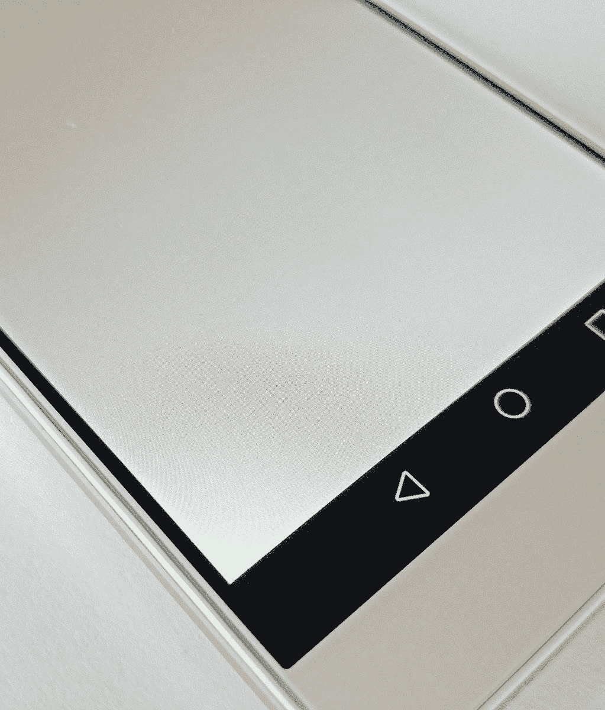
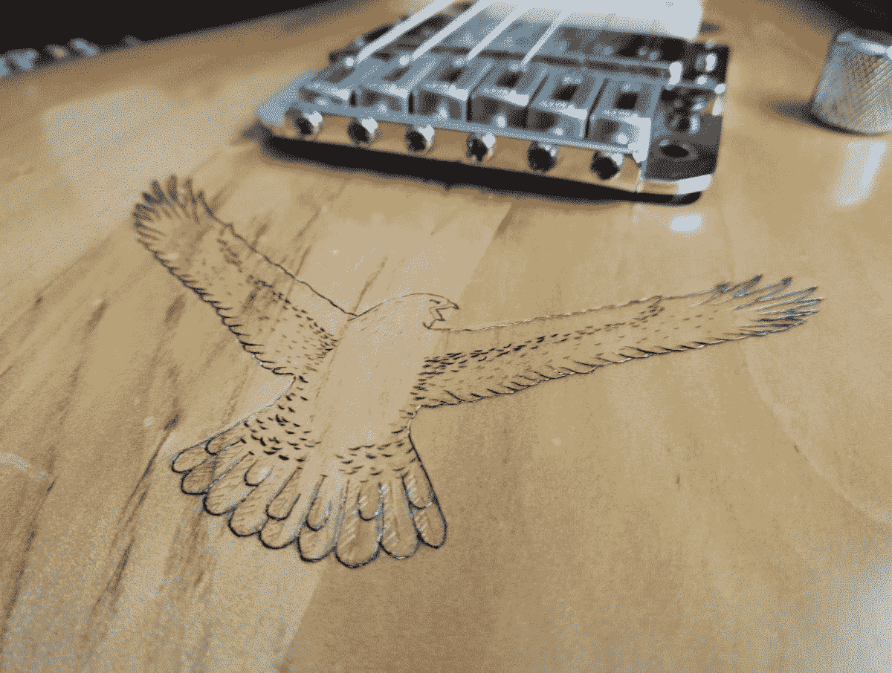

# 荣誉 7 XDA 评论:抛光的硬件，未完成的软件

> 原文：<https://www.xda-developers.com/honor-7-xda-review/>

对于那些不熟悉这个品牌的人来说，Honor 实际上是中国巨头华为在欧洲的代言人，尽管它已经开始在欧洲以外的地区销售手机。

它被设计成一家独立于其较大的兄弟公司运营的子公司，其任务是试图以有吸引力的价格用制造精良的手机征服西方市场。

我们已经设法拿到了它的最新旗舰产品 Honor 7，这款产品的合同外售价合理，为 370 美元。我们今天要评测的设备是 PLK-L01，这是一款解锁的欧洲版本，运行的是其专有软件 EmotionUI v3.1 的最新版本

### 规格:

| 

Android 版本:

 | 

5.0 棒棒糖

 | 

型号名称:

 | 

Honor 7 (PLK-L01)

 |
| --- | --- | --- | --- |
| **尺寸:** | 143.2 x 71.9 x 8.5 毫米(5.64 x 2.83 x 0.33 英寸) | **屏幕尺寸&屏幕比例:** | 5.2 英寸(屏幕与机身的比例约为 72.4%) |
| **主摄像头:** | 21MP，(IMX230)，f/2.0 | **辅助摄像头:** | 800 万像素 f/2.4 |
| **屏幕类型&分辨率:** | IPS-NEO 液晶显示器，1080 x 1920，424 ppi | **芯片组:** | 希西林 935 |
| **内部存储:** | 16 GB/64GB | **CPU:** | 四核 2.2 GHz Cortex-A53 和四核 1.5 GHz Cortex-A53 |
| **卡槽:** | 是的，最高 128GB | **GPU:** | 马里-T628 MP4 |
| **内存:** | 3GB | **电池:** | Li-Po 3100 mah |
| **NFC:** | 不 | **特性:** | Daul-SIM 卡、指纹传感器、红外发射器 |

### 设计:

当涉及到其手机的物理设计时，华为通常受到好评，因此 Honor 也有理由在这个部门效仿，尽管其目标是更低的价格点。令人欣慰的是，它没有令人失望，其主要采用金属外壳的底盘很容易让人想起最近的 Mate S 等设备，但尺寸缩小了。这是一个与以前的全塑料 Honor 6 截然不同的世界，它给人的感觉是廉价和衍生的，显示了这个年轻品牌的真正进步和关注。

这款手机的背面采用了铝制机身，除了指纹传感器和摄像头凸起之外，表面几乎没有瑕疵，右边是电源和音量按钮，左边是“智能键”(稍后会详细介绍)。电源按钮有一些轻微的纹理，以帮助您通过触摸找到它，所有提到的键都有很大的行程，以及令人满意的点击。这一切都有助于使手机在手中感觉放心坚实，尤其是它的价格，同时由于没有尖角和几乎察觉不到的弯曲后部，保持舒适。唯一的缺点是手机顶端和底端使用的塑料，它们尽最大努力看起来像有纹理的金属，但当被握持时会立即失效。这些存在是有意义的，因为它们可能是天线所在的位置，但它们明显违背了所呈现的其他高级感觉。在手机底部，你会发现扬声器格栅和标准的微型 USB 充电端口，但通常只有一个格栅装有扬声器，这意味着单声道，向下发射音频。

 手机的正面大多是不伦不类的，虽然以一种讨人喜欢的方式；没有什么消极的东西突出出来，一切看起来有序而简单。在顶部，你会发现常见的前置摄像头和接近传感器，以及前置闪光灯和耳机内巧妙隐藏的 LED 通知灯。当屏幕关闭时，挡板非常小，但显示屏周围的第二个黑色挡板会影响整体印象。

这在智能手机设计中越来越受欢迎，即将推出的设备的照片和渲染显示几乎是边对边的屏幕，最终在现实中经不起推敲。就我个人而言，我反对风扇渲染场景中的无边框设计，因为它会导致显示器两侧频繁的意外触摸，但这种方式的内置屏幕绝对不是解决方案。

考虑到 3100 毫安时的电池，Honor 7 在手中的重量轻得惊人，这在长时间使用时确实有所不同。旅行时消费媒体是一个很快浮现在脑海中的例子，使用更大更重的设备观看视频会很快变得很累。屏幕大小也有助于这一点，尤其是对于更习惯于大屏幕设计的人来说。当然，这里的权衡是，你得到的显示区域比一些竞争对手的要小，但这是一个非常主观的领域，考虑到许多公司都在不断扩展他们的智能手机，Honor 更适合通过坚持接近 5 英寸的棒球场来销售给普通消费者。

总的来说，这是一款握持和使用都很舒适的手机，其尺寸、深度和重量使其易于单手使用，其坚固的结构与两倍于其价格的手机相比更具优势。在这个系列中，你不会发现很多手机接近这里介绍的对细节的关注程度，Honor 应该对他们的手机在处理时的突出表现感到满意。

## 表演

华为以其内部处理器而闻名，考虑到高通今年因过热担忧而受到的抨击，选择不同的 SOC 很可能会吸引更多见多识广的消费者。荣誉 7 运行在麒麟 935 上，它使用两个四核 ARM A53 集群，以不同的速度运行，试图平衡速度和功耗之间的较量。

这是一个很好的芯片，不得不说。一般来说，手机对输入的反应很快，应用程序加载很快，大多数操作的执行完全符合你对现代安卓手机的预期。然而，整体体验并不是最流畅的。在一般使用中，在奇怪的地方会有明显的口吃，尽管它们开始时很快就结束了，但它们有损于原本完美的体验。一个特别恼人的问题是，当从 home 键向上滑动打开谷歌应用程序时会出现延迟；在加载应用程序和下载卡信息之前有几秒钟的半完成动画，每当最近没有使用应用程序时都会发生这种情况。

从基准测试来看，很明显麒麟的性能在理论上没有达到最好的水平，但在某些地方确实有一些令人印象深刻的结果。作为一款八核芯片，多任务测试成绩普遍不错，但单核测试略令人失望。该设备的平均得分为 870 分，在单核咕噜咕噜方面介于 Galaxy Note 3 和 s4 之间，仅比其前身 Honor 6 高出 20-30 分。鉴于这两款手机之间已经过去了一年，以及时钟速度和设计上的差异，我们期待更多一点，尽管基准测试在日常使用中并不重要。在 Geekbench 3 中，多核分数有点不一致，但肯定更令人鼓舞，超越了大多数竞争对手，除非是运行今年 14 纳米 Exynos 系列的手机。

这些不可预测的结果有一个很好的原因:GPU。

安图图的基准荣誉大约为 47，000，而 PC 马克的工作分数大约为 4，550。同样，这些都很好，平均来说击败了一些优秀的手机，如 Xperia Z4，但重要的是输给了一些更便宜的竞争对手，如华硕 Zenphone 2。然而，这些不可预测的结果有一个很好的原因，gfx bench:GPU 的分数很好地突出了这一点。不幸的是，华为认为适合纳入 Honor 旗舰产品的 Mali T628 无法胜任这项任务，令人惊讶的是，它与 Honor 6 使用的封装完全相同！它在高科技的曼哈顿演示中苦苦挣扎，设法在屏幕上实现了微不足道的 3FPS 和 4.2FPS。也就是说，玩像沥青 8 这样的真实游戏表明，手机完全有能力保持可接受的帧速率，尽管这正是它的终点——除非你坚持玩纸牌游戏，否则你不会在 Honor 7 上看到 60FPS。

下面你可以看到一些更知名的设备的快速比较，这些设备要么在排行榜上名列前茅，要么与我们的测试手机得分相似。

注意到智能手机在压力下的表现很有趣。值得庆幸的是，这里没有热管理问题，这可能是 Honor 7 如何超越一些运行高通臭名昭著的 Snapdragon 810 的高端手机，如 HTC One M9 或前面提到的 Z4。重复测试表明，没有证据表明 CPU/GPU 压力导致了节流，事实上有时会推高结果分数。手机在大量使用时确实会升温，比如 3D 游戏或相当多的多任务处理，但不会超过体温，这意味着它在手中不会变得哪怕一点点不舒服。

这个芯片组由一个相当大的 3GB RAM 支持，这通常可以让事情很好地进行，尽管我确实经历了一些启动器重新绘制的情况，以及必须从内存中重新加载应用程序的情况。这与 Recents 屏幕上显示的空闲 RAM 数量形成了对比，后者从未低于几百兆字节，即使应用程序被迫重新启动。这绝不是经常发生的事情，可能是由于操作系统过于激进的 RAM 管理造成的，但是这使得 RAM 计数器之类的东西看起来几乎毫无用处。总而言之，整个故事是一个不一致的故事，我只能将其归因于华为相当重的 EmotionUI 皮肤，因为以上所有内容似乎都显示了我在正常使用手机期间经历的完全相同的不规则性，即看似随机的变慢破坏了原本流畅和愉快的体验。

## 软件

Honor 7 及其在华为家族中的兄弟姐妹使用了一个名为 EmotionUI 的定制软件层，该软件层运行在 Android Lollipop 5.0 之上。然而，在你拿出你的干草叉之前，请记住，这个操作系统是如此之大的修改，以至于很有可能从操作系统的更高版本的变化已经被合并，并且“5.0”标签只是以简单的名义存在。例如，虽然我在几周前收到手机后没有收到任何更新，但当前版本的 EMUI(3.1 版)只容易受到 Stagefright 漏洞的多种攻击中的一种。它并不完美，但也不是简单的 Android 5.0。然而，这是一个广泛的重新工作的 AOSP，使这成为我们审查的“肉”,是什么使这款智能手机的个性。

### 美学

似乎有一个压倒一切的主题将 EMUI 的美学联系在一起:iOS。华为选择直接在安卓系统设计的基础上，尽可能多地模仿苹果广受欢迎的移动操作系统的外观(在某些情况下，还有功能)，同时保持大量的物质元素。这种组合确实创造了一些好看的结果，但也经常是混乱的，显然是衍生的。[/paragraph_left]

似乎有一个主题将 EMUI 联系在一起:iOS

本质上，这是一个大杂烩。每个应用程序在单独考虑时都会给人一种深思熟虑的印象，这里使用的简单设计中有一种优雅。内置的基本应用程序，如 Gallery、Videos、Calendar 和 Notes，可以很好地配合使用，简单明了地突出显示操作栏，符合当前使用的内置主题。然而，它们并不以正常的 Android 应用程序通常的方式运行，事实上，谷歌鼓励开发者做的许多元素并不存在。

例如，不，不需要从左边滑动，这个手势只是在可用的视图之间切换，由标题指定，显示在动作栏通常所在的位置。尽管这违背了 Android 世界的一些趋势，但乍一看这可能不是一件坏事，特别是考虑到有多少人不同意汉堡菜单作为一个设计作品，然而，这个想法几乎完全被其实现的不一致性所破坏。在许多应用程序中，你会在底部找到一个汉堡式的按钮以及其他一些动作，这很聪明，因为它让用户可以轻松地接触到这些选项，但在音乐应用程序等应用程序中，你会相反地在顶部找到相同的按钮，但使用了一个齿轮图标。再比如；我想知道为什么视频应用程序的设计者决定将唯一可用的按钮(刷新按钮，出于某种神秘的原因)放在屏幕的左上角。它与 UI 的其余部分不一致，甚至与你在 Play Store 中找到的东西也不匹配。感觉这些应用程序似乎不是来自同一家公司，更不用说来自同一个设计团队，而且视觉效果和功能与其他 Android 应用程序的冲突意味着用户将不断在风格之间切换。再次，这有点不一致，我会被每个不和谐的过渡绊倒，犹豫新的按钮位置，尽管强调简单和大图标。

iOS 的相似之处非常明显地延续到通知面板、启动器和最令人畏缩的相机应用程序中。半透明的模糊效果在这里很明显，这也是一个很好的效果，但是当结合单色界面和极简主义图标使用时，这一切都变得非常熟悉。启动器取消了传统的应用程序抽屉，而是依赖于多页应用程序和文件夹，但相机应用程序真的需要看到才会相信。当与 iPhone 放在一起时，这种相似性有可能将华为带入特别容易引起诉讼的领域。快门按钮在这里是最明显的，使用了与 iOS 上完全相同的白环圈，但当你进一步观察时，其余的按钮都位于相应的位置，看起来完全是受库比蒂诺设计师的启发。客观上这是相当无耻的，Honor 和华为真的应该重新开始，找到自己的视觉语言，做得更好。

### 用户化

不过，就定制和控制而言，这里有很多值得喜欢的地方。Themes 应用程序允许您混合搭配壁纸、图标包和锁屏设计等元素，打造真正的个人风格，或者从在线商店下载其他主题。启动器允许您更改网格大小和主屏幕转换动画，同时快速设置面板允许您快速重新定位快捷方式，导航栏可以重新排列和编辑。当然，如果许多用户希望对他们的日常工作流程获得更多的控制，他们会转向第三方启动器，但这些改进是值得赞赏的，对于那些不知道启动器和键盘可以改变的更基本的用户来说非常好。在这一点上，包括在内的“华为 Swype”键盘实际上是由 Nuance 和华为共同开发的，因此与其同名产品有着更多的相似之处。总的来说，这是一个比你通常会发现的预装键盘更好的键盘，包括一些漂亮的手势功能，从专用的“Swype Key”到特定字母的轨迹线允许特殊功能(复制、粘贴等)的快捷方式，符号/数字布局，甚至是谷歌地图等应用程序的快捷方式。

不过，设置应用是事情开始变得有趣的地方，它提供了比 AOSP 更多的定制功能。首先是对允许哪些应用程序访问互联网的精细控制，分为系统应用程序和用户安装的应用程序列表。这使您可以阻止应用程序通过移动网络或 Wi-Fi 使用数据，甚至同时通过两者使用数据，尽管系统应用程序(包括谷歌应用程序)必须始终可以访问 Wi-Fi。这至少可以让你更好地利用每月数据流量、电池甚至隐私，这样你就可以在家时保存同步作业，或者完全屏蔽你认为不需要网络访问的应用程序。

这种控制也扩展到通知，你可以选择每个应用程序如何被允许与你互动。您可以允许通知显示在锁定屏幕、状态栏或通过正常的棒棒糖横幅，或其任意组合，*或*您可以简单地选择完全阻止通知，对于那些真正讨厌的屡犯者。最后，在应用程序控制方面，您可以选择希望能够在后台运行的程序，以节省电量并延长电池寿命。你会不时看到提示，暗示应用程序正在安静地消耗电力，其频率可能有点烦人，但当系统指出你没有意识到的事情时，这同样有用。

### 其他功能

EMUI 还有其他一些巧妙的功能，隐藏在设置中。首先，永远在线的语音命令，允许你选择一个短语来唤醒你的手机，并执行类似于 Moto Voice 的功能。目前的功能仅限于打电话给你的手机，以便在手机放错地方时找到它，或者给你地址簿中的人打电话，所以不幸的是，它目前不像一些替代品那样通用。

> 当不需要声音指令时，它们会一直激活，从我的口袋里大声回应

我不得不再次非常诚实地说:这真的没用，或者说，对我来说没用。默认短语是*‘亲爱的荣誉’*，我觉得这个短语有点麻烦(尤其是当你打电话给一个丢失的手机的时候！)，虽然这显然是可编辑的，但它不会接受我的任何替代建议。我在几乎安静的环境中一遍又一遍地尝试了许多不同的短语，但荣誉 7 号拒绝让我这么做，抱怨我不够连贯。然后，手机似乎没有收到我的命令，除非我离得很近，这意味着打电话给可能在房间另一边的手机几乎是不可能的，这就产生了*“你在哪里？”*命令基本上没用。最重要的是，我发现语音命令在不需要*的时候一直在激活，在我进行对话的中途，导致智能手机打断我，从我的口袋里大喊响应。这是一个很好的想法，但它还没有完成，不用说，我很快就关掉了它。*

你还可以选择上面截图中的动作控制和手势，双击唤醒(但不是睡眠)，以及一些关闭屏幕的手势，以立即唤醒手机并启动你选择的应用程序。当然，这些都不是什么新东西，但它们的加入绝对值得赞赏，尽管必须说手势识别的反应相当慢。华为的指关节识别也存在，尽管它仅限于能够捕捉你在屏幕上画圈的部分。这是另一个好计划，但是执行起来有点笨拙，并且倾向于同时捕获整个屏幕的截图。

这里有更多的选项，比如能够创建一个容纳额外导航栏元素的永久浮动操作按钮，增加与智能外壳的兼容性，或者在连接耳机时启动应用程序，但为了简洁起见，我将只提到最重要的剩余功能。位于手机左侧的物理按钮被称为*“智能键”*，可以执行多达三种功能，对应于按下一次、两次或短暂按住。你有四个选择:Torch、Ultra Snapshot(打开相机，拍照)、语音录制和截图，或者你可以简单地选择启动任何 app。这是一个很好的想法，虽然不是独一无二的，但它应该被更广泛地采用。

在摆弄了一段时间后，我禁用了单次按键以最小化口袋激活，将手电筒连接到双击，长按播放音乐，并开始真正依赖它。考虑到双击音量降低键已经被指定为打开相机，你真的可以覆盖所有的基础，我绝对会错过其他手机上的这个设置。

正如你所看到的，这是一个沉重的 ROM。它有很多选项和功能，可以根据用户的个人喜好进行很大程度的调整。不幸的是，它还附带了大量不必要的臃肿软件，如下图所示。这些大多是赞助游戏的网页链接或演示，但幸运的是，大多数都可以卸载——链接的“商店”看起来特别破旧，我个人会不惜一切代价避免它们。有很多“工具”，比如“手机管理器”应用，它们要么链接到设置中已经可用的内容，要么充当美化的任务杀手或缓存清理器。不能卸载的通常可以被禁用，这意味着如果你想精简 ROM，你可以，但它只能到此为止，有几个你需要根来摆脱。还应该注意的是，通常的谷歌应用程序也是作为系统应用程序预装的，所以对于那些不使用播放电影和电视之类的东西的人来说，禁用是你唯一的选择。

所有这些都会让你的体验有点混乱，所以你不可避免地要好好利用文件夹。令人欣慰的是，系统仍然相对较快，但如上所述，偶尔一切都会停止一段时间，然后再继续。虽然这种情况不常发生，但它令人沮丧，当加入其他奇怪的事情时，它就开始令人烦恼。无论我告诉 EMUI 多少次不要在我播放音乐的时候提醒我 Google Play 音乐在后台耗电，它都拒绝接受这个提示。当耳机接入时，你会收到一个通知，告诉你它们已经接入(如果你启用了智能耳机控制，还会有一个通知)，清除后会向你发出警告，警告你这样做可能会破坏依赖通知的应用程序。没有什么会中断，但是如果你想要一个清晰的通知区域，每次都要做好准备。再一次，这是不一致的，这一切只是感觉有点不成熟。

## 电池

电池是大多数智能手机的痛处，最近我们自己的标准似乎已经降低到这样一个程度，即任何能坚持一天的东西都被认为是足够好的，但它仍然是许多 XDA 读者最重要的话题。值得庆幸的是，在这方面，荣誉 7 确实提供了。它的 3,100mAh 不可拆卸电池大小合适，能够为普通大小的全高清显示器和中高端内部设备提供充足的电力。这是一部在中度到重度使用情况下可以持续一天的手机，如果你认真的话，可以持续到第二天。这让我耳目一新，因为我倾向于在旅行时通过 LTE 观看大量 YouTube，这意味着我的屏幕打开时间通常比一般消费者更苛刻。此外，我有几个电子邮件账户在后台推送同步，同时允许脸书、Messenger 和 Whatsapp 等社交媒体和即时通讯应用运行 riot，然后是正常的网页浏览、听音乐和打几个电话。这种用法可以在下午早些时候杀死一台 S6，但 Honor 7 通常从 6:30 到大约 20:00 才能最终屈服，正如你从下面的图片中看到的那样，屏幕打开时间总是超过 4 个小时，对于那些尝试的人来说，5 个小时很容易达到。

如果您愿意利用 EMUI 强大的电源管理工具，这种电池续航时间是很容易实现的。在找出是什么耗尽了你的能量，然后给你解决问题的方法时，它们比其他 ui 提供了更多的洞察力。你可以通过查看他们在正常 Android 模式下占用的电量百分比，或者通过查看他们负责的估计 mAh 来查看耗电者，除此之外，你甚至可以比较你的硬件和软件的使用情况。一旦您将这些诊断添加到报告您的应用程序每天或每周使用多少数据的工具中，最严重的违规者就会很快变得明显，您可以轻松准确地减少允许在后台运行或发送数据的应用程序。还有一个应用整体电源配置文件的选项，将手机调整到高性能、平衡或“超级”模式，后者将在电池电量达到用户可定义的低电量时尝试启动。这种模式基本上像其他原始设备制造商一样降低了手机的音量，除了你的短信和电话之外，关闭了所有的无线连接。然而，它更进一步，将每个应用程序踢出内存，并用一个精简的单色用户界面取代标准启动器，类似于针对基本用户的“简化家庭”启动器。这是一个强大的系统，但也很容易使用，这总是一个成功的组合。我怀疑不会有很多人使用它，也不会经常使用它，但它是为了紧急情况而存在的。

## 五金器具

Honor 7 上的 5.2 英寸 1080p 显示屏是一项巨大的努力，创造了每英寸 424 像素的清晰画面以及令人愉悦的准确色彩。它的 IPS-Neo 绰号是一个不寻常的名字，是你常规 LCD 事件的一个变体，由于其更均匀的液晶层，表面上提供了更好的对比度和视角。实际上，视角确实非常好，但是对比度和黑色水平没有达到 AMOLED 的标准。外面的亮度和能见度与大多数面板相当，但再次低于今天可用的一些最好的例子-考虑到最明亮的荒谬亮度，这并不是一种损害。总的来说，显示器是一件有吸引力的事情，非常适合观看高分辨率的图像和视频。色温实际上是可以在设置中使用“冷”到“暖”滑块来调整的，但是它的中心位置对这个评论者来说似乎足够精确了。一些用户可能渴望更多像素来适应谷歌 Cardboard 应用程序等活动，但在这个价格上，塞进更多像素可能会以牺牲亮度和性能为代价。

附带的指纹识别器也来自良好的库存，因为华为已经使用它们一年多了，并在 Mate 系列和 Nexus 6P 上展示了它们有多棒。Honor 7 的后置解决方案也不例外，创建最小的忙乱，并允许您快速注册多达 5 个手指。总的来说，我发现这款阅读器非常稳定，能非常迅速地检测出我选择的手指，并同样可靠地拒绝未知指纹。你可以将手机从屏幕关闭状态解锁，当结合食指通常所在的自然位置时，这是一个非常令人满意的从口袋中取出并立即使用的手势——这是一个很难打破的习惯。当手机检测到您登记的外来指纹(或 PIN)时，您还可以通过将手机设置为“访客”模式来保护您的隐私，因此，如果合作伙伴的亲密朋友习惯于借用您的手机，您仍然可以允许他们访问操作系统的某些部分，同时维护您自己的安全。

指纹传感器还有一个用途，它不需要登记指纹，那就是手势支持。通过在传感器上滑动或点击任何手指，你可以指示手机执行一些特定的功能，例如，向下滑动可以拉下通知阴影，而不需要你伸出拇指或使用另一只手。还有其他几个选项，比如按住它拍照或接听电话，但我不得不禁用了几个选项，以确保我不会意外触发它们——你可以将一次点击指定为第二个后退键，这真的很令人恼火。不过，总的来说，一旦你习惯了，它们就会成为你的第二天性，并很快成为你工作流程的一部分。

底部安装的扬声器通常适用于现代智能手机。它不像最近的一些旗舰级别的单扬声器那样响亮，当然也不会与 HTC 和摩托罗拉这样的制造商的前置竞争相竞争。一旦你开始接近最大音量，质量也会下降，当按下时扬声器开始破裂，声音变得失真。当然，这一点也不稀奇；由于体积小，大多数手机的声音都很差，但对于那些经常依赖扬声器通话或使用手机放大音乐的人来说，这是值得一提的。麦克风和耳机似乎也足够了，当谈到电话通话清晰度时，两端都没有抱怨。

对连接的主要抱怨是缺乏 NFC

[paragraph _ right]我在沃达丰英国网络上使用了这款手机，没有遇到信号或 4G 覆盖的问题，尽管 Cat.6 规范意味着你不会享受到令人愉快的快速载波聚合。世界上大多数国家应该同样很少有人抱怨，美国的 GSM 用户应该能够享受 3G，但很可能无法从 LTE 连接中受益，尽管最好根据你可以获得的 Honor 7 的具体型号来检查可用的选项。[/paragraph_right]

这款设备的 Daul-SIM 卡方面对一些消费者来说很重要，尽管他们应该知道第二个 SIM 卡插槽是唯一可以插入 Micro SD 的地方，在这种情况下，他们会在状态栏中看到一个持续的“no SIM”图标(如我们的截图所示)。Wi-Fi 有 802.11 a/b/g/n/ac、双频和直接版本，还有蓝牙 4.1，我对这两种都没有问题。无线充电不可用，但 5V/2A 快速充电可用。然而，对连接的主要抱怨是缺乏 NFC。这是 OnePlus 2 发布时的主要讨论点，OnePlus 2 在某种程度上是这款设备的竞争对手，但一如既往，这是用户决定他或她是否依赖的功能。

## 扎根和 Android 开发

考虑到这个网站的受众，以及这是其他评论网站不会涉及的事实，我决定我必须尝试扎根荣誉 7，所以联系荣誉，问他们是否介意我在我的评论单元尝试它。令人惊讶的是，他们很高兴我继续下去，条件是我在归还之前将其归还给库存。华为/Honor 显然试图与开发者进行更多的接触，现在通过他们的网站 [here](https://hwid5.vmall.com/oauth2/portal/cloud_login.jsp?validated=true&errorMessage=user_pwd_error%7Cuser_pwd_continue_error&service=http%3A%2F%2Femui.huawei.com%2Fen%2Fplugin.php%3Fid%3Dhwlogin%3Avalidate%26ru%3Dhttp%253A%252F%252Femui.huawei.com%252Fen%252Fplugin.php%253Fid%253Dhwdownload%2526mod%253Dlist&loginChannel=22000000&reqClientType=2023&userAccount=jadjennings%40gamil.com&adUrl=http%3A%2F%2Femui.huawei.com%2Fen%2Fsource%2Fplugin%2Fhwlogin%2Flogin.php&lang=en-us&viewType=0) 提供引导加载程序解锁服务(尽管我不得不使用我手机的浏览器注册，因为页面有点问题)。一旦你输入了一些特定于设备的信息，你会得到一个 16 位的代码，然后你可以用它来以正常的方式从一个 ADB 会话中解锁引导加载程序——更多细节见[这个线程](http://forum.xda-developers.com/honor-7/general/how-to-root-honor-7-t3170735)。这种制造商支持的解锁过程在 OEM 厂商之间越来越普遍，华为加入开发友好型公司的行列应该受到欢迎。

不幸的是，从现在开始情况变得有点不妙。一旦 bootloader-unlocked，它很容易推动从亚行恢复，但我不得不闪存两次之前，它会引导到 TWRP，这原来是一个中国版本，所以不太理想。然后我发现没有办法引导回系统；我陷入了某种引导循环，只有新的恢复会加载。在最终找到一个股票复苏后，我设法闪存，而不是 TWRP，并引导回系统。事实证明，目前，要刷新 SuperSU 或 Xposed 之类的东西，你必须从亚洲开发银行推出 TWRP，从 TWRP 刷新你的文件，然后重启并刷新股票恢复，然后重启进入系统。

在这一点上，我决定在我领先的时候退出，因为害怕走错方向，然后花几个小时试图将手机恢复到可启动状态-我相信我们的许多读者都认同这一点。显然，现在定制 rom 还为时过早，尽管有许多不同版本的手机可用，但论坛上仍有一些人成功地管理了这一过程。一旦这是坚实的，并开始为每个人工作，你可以期待去臃肿的 EMUI 和 MIUI ROMs 被创建，随着非官方的 CyanogenMod 构建和 LiquidSmooth 这样的定制，如果 [Honor 6](http://forum.xda-developers.com/honor-6/orig-development) 论坛是任何事情。

### 照相机

在 Honor 7 后部的凸起部分，你会发现一个 21MP 的索尼 Exmor RS 传感器，特别是 IMX230，与摩托罗拉 2015 年旗舰上的模块相同。它也有同样的障碍，比如缺乏 OIS 和相当小的 1.12μm 像素，所以你会认为任何差异都是不同软件方法的结果。但在这个问题上，华为选择了一条相当独特的道路，像所有竞争对手一样放弃使用专用图像处理芯片，并将工作负载分流到 Mali GPU。通过使用 OpenCL API(旨在管理异构系统上的工作负载)，这家中国制造商巧妙地为自己提供了一种在手机生命周期后期升级图像处理的方法，而其他原始设备制造商将永远被不可修改的硬件解决方案所困扰。因此，根据以下内容，记住未来的软件更新可能会显著影响该单元的性能是很重要的。

 <picture></picture> 

dav

由于高百万像素，用 Honor 7 拍摄的照片通常保留了很多细节，这意味着在光线良好且靠近目标的情况下拍摄的照片看起来非常好。这是由于看起来非常强调提高对比度，这有时会给人一种看起来非常准确的印象，但在其他时候真的会破坏图像的动态范围，将黑人和白人推向极端。考虑到显然有大量图像处理正在进行，当您考虑褪色的颜色即使在良好的光线下看起来如何时，这变得更加有趣。也就是说，虽然降噪是显而易见的，但这并不过分，因此你不会倾向于获得一些相机所犯的“笔触”外观。白平衡在大多数时候都很重要，但冷色调确实对此有影响，f/2.0 光圈的景深看起来非常漂亮。

这是一款特别受益于稳定手感的相机，或者说是三脚架。大概是由于缺乏 OIS(或者更长的曝光时间来抵消传感器收集光线的不足)，我拍摄的一些户外照片自然模糊了多次，即使条件是晴天(英国)。低光拍摄实际上并不坏，尽管噪声较高，但在保持白平衡和色彩准确性方面做得不错。当然，相机可能是主观的，所以看看下面的照片，记住一些阴暗或光线不足的场景。你还会看到一些与 LG G4 的比较，LG G4 通常拍摄更令人愉悦和饱和的照片，但请记住，我们正在比较一款新上市的 370 美元手机和一款现在降至约 420 美元的手机。

相机 app 本身布局很好，很好用(感谢苹果)，有多种拍摄模式。你最初的选项是照片、视频、光绘、美景和美食(*我知道，我知道*)，你可以在这些选项之间快速滑动，闪光灯、滤镜和画廊的按钮也在易视图中。对于其余的选项，包括 HDR 模式，全景，延时和其他一些，你需要通过一个溢出按钮选择不同的模式。没有像最近的华为 Mate S 那样的专业模式，当然也没有原始拍摄，所以这些内置模式必须完全依赖。

最终，这是一个非常强大的系列，适合几乎所有的情况，并且允许你非常有创造力，同时对于那些想要瞄准和射击的人来说非常简单。这显然是这部相机的目的。任何和所有高级选项都隐藏在两到三个菜单深处，包括像白平衡和曝光这样的基本选项，这意味着每次你做出改变时都必须离开菜单才能真正看到它的效果。亮点包括超级夜间模式，它需要 15 秒的曝光时间，同时试图从生成的照片中移除任何移动的障碍物，以及全聚焦，它可以连拍并允许您稍后选择焦点，如果设备保持静止，这两种模式都可以产生非常有效的效果。视频质量尚可，展示了照片中同样缺乏光泽的颜色，但曝光和焦距调整很快，数字稳定和物体跟踪真的可以帮助你抓住目标，确保时刻不会丢失。

前置摄像头是 800 万像素的 f/2.4，在光线充足的情况下自拍效果很好。然而，一旦太阳落山，图像可能会很快陷入嘈杂的混乱，但这对于一个正面的人来说是意料之中的。此外，华为认为包括一个闪光灯是合适的，它具有可变的输出，并且颜色不要太白，这是一个很好的触摸。对于那些热衷于此的人来说，有一整套美容和“完美自拍”选项，让你光滑脸颊，瘦脸和变白脸，睁大眼睛。

总的来说，这是一个不错的努力，价格也很合理，能够在合适的环境下拍出一些非常好的照片。然而，这显然是一个“捕捉瞬间”的相机，所以爱好者可能会想在其他地方花更多的钱来获得一些额外的控制和准确性，至少现在是这样。

# 裁决

很难计算出荣誉 7 在阶级上的确切位置。一方面，你有一个坚实的构建，使用起来感觉很棒，由漂亮的屏幕，体面的摄像头和良好的整体性能支持。另一方面，你有一个笨拙的用户界面，感觉就像刚出测试版，在性能上有一些口吃，而且手机没有什么让你感到惊讶。当你将其与价格进行比较时，它开始变得更有意义——这是一款好手机，毫无疑问，但它不是为那些认真对待智能手机的人设计的。

这是一款 Android 手机，旨在吸引希望在下次升级时省钱的 iPhone 用户。它几乎每件事都做得很好，或者说还过得去，但它从来没有表现出色过。然而，它的用户界面非常简单，与 iOS 非常相似，平台转换者不会像很多人看到的那样感到困惑，因为他们得到了 LG 或三星这样的产品。更重要的是，这里展示了一些创新的想法，一些你在其他地方找不到的，真正有用的想法，当我继续前进时，我会想念这些想法。所以实际上，这可能只是一个时机问题:现在是购买 Honor 7 的正确时机吗？

这位评论者不这么认为。鉴于一些软件更新可以提高软件体验的一致性和流畅性，*和*改善了相机，华为也承诺为这款手机提供棉花糖更新，好东西很容易就会降临到那些等待的人身上。当你看价格的时候，同样的事情并行发生，这是重要的一点；如果 Honor 能让这款手机在美国更容易买到(并兼容)，并能在未来几个月内稍微降低价格，这款手机将开始变得更有吸引力。它在构造和相机质量等方面击败了 Moto G 等廉价手机，但却削弱了顶级大牌的地位，同时对想要轻松生活的消费者这一利润丰厚的中间市场保持着吸引力。荣誉已经找到了他们的目标，并瞄准了靶心，他们只是还没有完全弄清楚如何开火。

**你认为荣誉 7 怎么样？请在评论中告诉我们！**

[**查看 XDA 的荣誉 7 论坛> >**](http://forum.xda-developers.com/honor-7/)