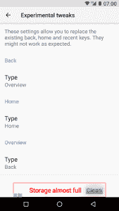

# 如何改变你的导航栏图标或重新安排按钮没有根

> 原文：<https://www.xda-developers.com/how-to-change-your-nav-bar-icons-or-re-arrange-the-buttons-without-root/>

那些运行第一个 [Android O 开发者预览版](https://www.xda-developers.com/google-announces-android-o-developer-preview-1-available-for-supported-devices/)的人可能已经摆弄过它隐藏的[导航栏定制器](https://www.xda-developers.com/android-o-preview-brings-nav-bar-customization-under-system-ui-tuner/)了，它位于 SystemUI 调谐器中。这个导航条定制器实际上已经在 AOSP 出现了几个月，但人们认为在 Android Nougat 上访问它的唯一方式是通过对系统 UI APK 的[修改，当然，这需要 root 访问权限。直到这个星期，我们才发现 Android Nougat 的隐藏导航条定制器实际上不需要 root 访问、自定义 ROM 或系统 UI 模块就可以访问。有了这个功能，我们可以改变导航条图标，交换按键，或者添加额外的按钮。](https://forum.xda-developers.com/nexus-6p/themes-apps/mod-enable-navbar-tuner-nougat-t3447478)

没错——你可以用一个锁定的引导程序在一个完全库存的、非根化的 ROM 上修改你的导航栏。人们认为仅限于 Android O 的功能实际上可以在 Nexus、Pixel、一加和一些索尼、HTC 和摩托罗拉手机上运行 Android Nougat。如果你的设备运行的软件接近谷歌的软件(对不起，三星和华为/Honor 用户)，那么你的设备可能有我们可以使用的隐藏的 AOSP 导航条定制程序。在本教程中，我将向你展示如何使用导航条定制器来把按钮图标改变成你想要的样子，或者按照你想要的顺序重新排列它们。

*谷歌 Nexus 6 上的 Pixel 导航条*

 <picture></picture> 

Reversed Nav Bar on Nexus 6

* * *

## 修改导航栏-设置

**需求**:你需要一个与 AOSP 导航条定制器兼容的设备。参见本线程中的[的“兼容性”部分。(注意:您的设备 OEM 或类型可能未在该主题中列出。确定你的设备是否兼容的唯一方法是试用，我们将在下面告诉你怎么做。](https://forum.xda-developers.com/android/apps-games/app-custom-navigation-bar-customize-t3590967)

有两种方法可以修改我们的导航条。一种是通过应用程序，另一种是通过 ADB shell 命令(这是应用程序的工作方式)。为了完整起见，我们将向您展示这两个图标，但请注意，到目前为止，您不能通过应用程序修改股票导航条图标，直到开发人员更新其应用程序以包含该功能。

我们需要做的第一件事是确保你可以修改你设备上的导航条。如果你的设备是在[自定义导航栏线程](https://forum.xda-developers.com/android/apps-games/app-custom-navigation-bar-customize-t3590967/)中列出的兼容设备之一，那么它很有可能是兼容的。我们可以通过运行这个应用程序附带的简短教程来验证。

从谷歌 Play 商店安装应用[(同时](https://play.google.com/store/apps/details?id=xyz.paphonb.systemuituner)[注册 beta 测试](https://play.google.com/apps/testing/xyz.paphonb.systemuituner)，这样我们就可以使用它的实验功能在以后重新安排导航条)。接下来，打开应用程序，继续浏览介绍性屏幕。自定义导航栏将要求您授予它一个名为 WRITE_SECURE_SETTINGS 的特定权限，以便继续使用该应用程序。有两种方法可以做到这一点，如申请中所述。

1.  如果你有一个根设备，在你的手机上打开[终端模拟器](https://play.google.com/store/apps/details?id=jackpal.androidterm)，通过键入`su`授予它根访问权限。然后，输入这个命令:`pm grant xyz.paphonb.systemuituner android.permission.WRITE_SECURE_SETTINGS`
2.  如果您的设备不是根设备，那么您需要通过 ADB 授予许可。在机器上打开命令提示符/终端，然后输入以下命令:`adb shell pm grant xyz.paphonb.systemuituner android.permission.WRITE_SECURE_SETTINGS`

一旦你通过上述两种方法中的任何一种授予应用程序此权限，那么应用程序将继续进行兼容性测试。如果你的导航条没有变化，那么你很不幸的不走运。如果你的导航条变成显示一个右箭头按钮，那么恭喜你的设备是受支持的！我们现在可以继续修改我们的导航栏。

* * *

## 重新排列导航栏按钮

### App 方法

现在你已经设置了应用程序，重新排列导航条按钮非常非常容易。你必须在自定义导航栏应用程序的测试版上才能做到这一点，所以在继续之前，请返回并确保你在测试频道上。

如果你是测试版，你会在主设置部分看到一个叫做**实验调整**的部分。点击它，你会看到允许你替换现有的 back、home 和 recent 键的选项。通过将后退按钮更改为概览(最近)按钮，并将概览(最近)按钮更改为后退按钮，您可以在这里轻松地重新排列您的键。或者以你想要的任何方式改变它们，这里没有真正的限制。交换按键后，您还可以在导航栏设置菜单中使用布局选项。

### 亚行方法

如果你愿意的话，下面是如何使用 ADB 命令来做同样的事情。我们将要修改的命令是名为 sysui_nav_bar 的安全设置首选项。这个首选项是一个包含导航条布局的字符串。首选项的默认结构如下

```
 space,back;home;recent,space 
```

其中 space 表示将导航条键彼此分开的空白区域，back、home 和 recent 表示导航条中的 3 个默认按钮。例如，如果我们想交换 back 和 recent 键，我们需要如下修改字符串

```
 space,recent;home;back,space 
```

注:如果您试图从根 shell 环境(如电话上的终端仿真器)输入以下任何命令，则您需要在发送命令之前省略“adb shell”。

现在，为了实际修改这个字符串，我们需要使用 ADB shell 命令，语法如下

```
 adb shell settings put secure sysui_nav_bar "STRING" 
```

因此，我们发送的交换最近键和后退键的命令如下所示

```
 adb shell settings put secure sysui_nav_bar "space,recent;home;back,space" 
```

正如您可能猜到的，这是相当灵活的。我们可以通过修改首选项的字符串值来随意移动这些键。例如，我们可以通过改变两个空格的位置来使翻转的导航条键左对齐或右对齐:

左对齐:

```
 adb shell settings put secure sysui_nav_bar "recent;home;back,space,space" 
```

右对齐:

```
 adb shell settings put secure sysui_nav_bar "space,space,recent;home;back" 
```

但是我们也可以改变导航条按钮，使之与标准的后退、主页或最近键完全不同，比如发送众多[按键事件](https://developer.android.com/reference/android/view/KeyEvent.html)中的一个。我们将在下一节利用这一点，向您展示如何更改导航栏按钮上的图标。

* * *

## 自定义导航栏图标

现在，以下部分可能看起来没什么大不了的，因为在 Play Store 上有[众多](https://play.google.com/store/apps/details?id=pl.damianpiwowarski.navbarapps) [应用](https://play.google.com/store/apps/details?id=com.axndx.prithvee.pixelnavbar) [承诺改变你没有根的导航栏。它们确实有效——然而，许多用户报告说，在 Chrome 等特定应用中，当播放全屏视频或一些游戏时，这些应用存在问题。此外，这些应用程序中有许多要求你启用辅助功能服务来监控应用程序，以知道何时重新着色导航条，这](https://play.google.com/store/apps/details?id=com.dunrite.pixbar)[可能会降低性能](https://www.xda-developers.com/working-as-intended-an-exploration-into-androids-accessibility-lag/)。最后，如果你依赖这些应用太久，那么当 Android O 推出时，你可能会突然惊讶地看到它们停止工作，因为下一个 Android 版本是[杀死这些应用](https://www.xda-developers.com/android-o-is-breaking-apps-that-overlay-on-top-of-the-status-bar/)在系统 UI 元素上绘图的能力。

我们正在使用的方法是基于谷歌的导航栏调谐器的实现，所以它没有这些问题。然而，目前有一个问题我们想提前说明:如果你选择按照这种方法来修改你的 home 键，那么**长按 home 键动作将不再工作**意味着你不能再从 home 键快速访问谷歌助手。如果你不介意的话，下面是如何改变导航条上的图标。

你需要做的第一件事是下载你想要替换默认导航条按键图标的图标。我会为你提供下载链接来抓取谷歌 Pixel 导航条图标，但是如果你想要其他的图标，你可以自己去找。你将需要 PNG 格式的图标，至于大小，你可以通过在 Material.io 上查找你的[设备的显示密度指标并将其与](https://material.io/devices/)[图标大小参考图表](http://iconhandbook.co.uk/reference/chart/android/)相关联来确定你需要的图标大小。

提取这些谷歌像素导航条图标的功劳归于 XDA 资深会员 [dariomrk](https://forum.xda-developers.com/member.php?u=7692227) 。如果你有 1920x1080p 的显示器，请下载[这个档案；如果你有 2560x1440p 的显示器，请下载](https://www.androidfilehost.com/?fid=457095661767155130)[这个档案。将任一 zip 文件的内容提取到存储根目录下名为“NavIcons”的文件夹中。](https://www.androidfilehost.com/?fid=457095661767155131)

将图标放在适当的位置后，输入以下 ADB shell 命令(警告，它很长):

```
 adb shell settings put secure sysui_nav_bar "space,key(4:file:///storage/emulated/0/NavIcons/back.png);key(3:file:///storage/emulated/0/NavIcons/home.png);key(187:file:///storage/emulated/0/NavIcons/recents.png),space" 
```

该命令的作用是用具有相同功能的 KeyEvents 替换 back、home 和 recent 键。具体来说，back 换成 [KEYCODE_BACK](https://developer.android.com/reference/android/view/KeyEvent.html#KEYCODE_BACK) ，home 换成 [KEYCODE_HOME](https://developer.android.com/reference/android/view/KeyEvent.html#KEYCODE_HOME) ，recent 换成 [KEYCODE_APP_SWITCH](https://developer.android.com/reference/android/view/KeyEvent.html#KEYCODE_APP_SWITCH) 。这些按键代码执行完全相同的功能，但是因为我们使用了 KeyEvents，所以我们可以指定我们想要为它们使用什么图标。在本例中，我们指向在/NavIcons 中保存的 back.png、home.png 和 recents.png。

然而，通过用 KeyEvents 替换 stock 键，我们失去了长按 home 键的能力，因为目前没有办法识别模拟键输入的长按事件。

我意识到，现在，这种方法可能看起来不理想或不容易实现，但在撰写本文时，自定义导航栏应用程序尚未更新，以支持添加您自己的图标。目前，我的方法(这正是该应用程序的工作方式，当该应用程序更新时，它将面临同样的限制)是如何在你的导航栏上获得任何你想要的自定义图标。

* * *

本教程到此为止。在未来的教程中，我将展示改变你的导航条的潜在的实际用途，特别是在使用自动化应用程序如 Tasker 的情况下。关注 XDA 上的[教程类别，了解我们发布的所有最新提示和技巧。](https://www.xda-developers.com/category/tutorials/)