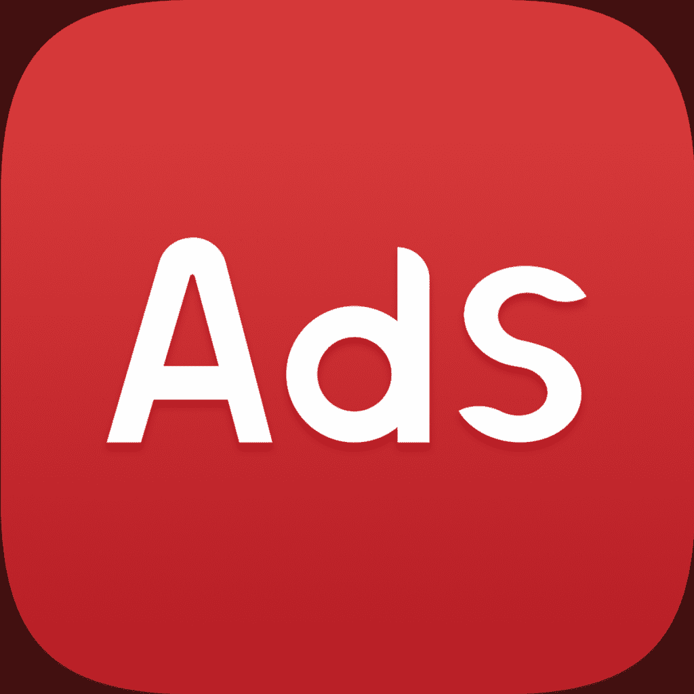

# Android 上的 HMS Core 是华为对 Google Play 服务的替代

> 原文：<https://www.xda-developers.com/huawei-hms-core-android-alternative-google-play-services-gms/>

华为 Mate 30 Pro 客观上是今年最好的硬件发布之一，具有迄今为止手机世界中几乎所有有意义的创新，并推出了不少自己的产品。然而，尽管它提供了 Android 智能手机上最好的功能之一，但它不能被推荐给大量用户。这种排斥的责任完全在于华为和美国之间的[政治局势](https://www.xda-developers.com/google-revoke-huawei-android-ban-blacklist/)，这迫使该公司发布了一款在其他方面都很优秀的硬件[，却没有最关键的功能性 Android](https://www.xda-developers.com/huawei-mate-30-without-google-play-apps-services/) : Google Play 服务。世界只能眼睁睁地看着一个安卓巨头试图在一个没有谷歌的世界里找到出路。华为需要为自己和用户提供功能强大、可靠的替代产品，它昨天就需要这些产品。

值得庆幸的是，华为早在任何贸易政治展开之前就有远见，开发了自己的一些解决方案。华为 AppGallery 为终端用户和应用开发者提供了谷歌 Play 商店之外的另一种选择，作为分发和维护 Android 应用的媒介。但是分发应用程序只是解决了一部分问题。另一个需要解决的主要因素是，许多 Android 应用程序，包括谷歌应用程序，都依赖于一套封闭的 API 来运行——这些 API 将 AOSP 的 Android 与谷歌的 Android 分开，以谷歌移动服务和谷歌 Play 服务的形式出现。虽然由于 AOSP 的开源性质，华为仍可以继续使用安卓系统，但它不能在华为 Mate 30 Pro 上使用专有的[谷歌移动服务(GMS)](https://www.android.com/intl/en_in/gms/) ，以及推而广之的[谷歌播放服务](https://developer.android.com/distribute/play-services)。这意味着在应用程序中完全依赖 GMS 功能的开发人员失去了在未来华为设备上实现这些功能的工具。对于受影响的用户来说，这意味着他们的几个应用程序将保持不可用，直到交易情况得到解决，或者应用程序开发人员探索替代方案，或者用户探索替代应用程序。这三种情况中的两种不利于应用程序开发人员，探索一种替代方法来减少对 GMS 的过度依赖可能对开发人员更有商业利益。

在本文中，我们将探索华为替代解决方案的第二个分支。来认识一下华为的 HMS Core ，它是 Android 上 Google Play 服务的替代品。

* * *

## Google 移动服务、GMS 核心和 Google Play 服务

在我们试图回答华为的替代方案做了什么之前，我们需要后退一步，看看谷歌的解决方案对 Android 做了什么。

虽然由于 AOSP (Android 开源项目)的存在，Android 可以被归类为“开源”操作系统，但世界上大多数用户从未真正体验过最纯粹意义上的 AOSP。除了中国等特定地区，世界上销售的大多数智能手机都装有谷歌的安卓系统，即 AOSP 和 T2 的谷歌移动服务。

谷歌移动服务包括常规的面向用户的应用程序，如谷歌应用程序(T0)、Play Store、Chrome、地图、YouTube、Gmail、照片等等；以及核心后台服务的 apk 如 *GoogleOneTimeInitializer* 、 *SetupWizard* 、 *GooglePackageInstaller* ，当然还有 *GMSCore* 等等。GMS 核心就是我们通常所说的 Google Play 服务。

Google Play 服务的发展是为了解决谷歌在 Android 早期面临的一些严重的碎片化问题。虽然谷歌准时提供了 Android 更新，其中包含应用程序开发人员可以在自己的应用程序中利用的新功能，但由于缺乏原始设备制造商的更新，相同的功能在几年内不会在整个 Android 世界中可用。谷歌的回应是[将关键的 API 解决方案](https://www.xda-developers.com/google-play-services-4-1-brings-turn-based-multiplayer-new-google-drive-api-improved-ads-and-better-google-integration/)转移到 Play 服务平台，谷歌对 Play 服务平台有更大的控制权，并且可以独立于 Android 操作系统进行更新。

这使得应用程序开发人员能够构建在不同 Android 版本上以相同方式运行的体验。迁移确实有助于解决 Android 的碎片化问题，但它也导致了一个垄断的世界，在这个世界中，排除 Google Play 服务可能会妨碍 Android 智能手机的整体体验。

> GMS 只能通过谷歌的许可获得，并提供一整套流行的应用程序和基于云的服务。

GMS 和包含的 Google Play 服务只能通过谷歌的许可提供给智能手机原始设备制造商，这些原始设备制造商需要在每个设备上通过 [Android 兼容性测试套件(CTS)](https://source.android.com/compatibility/overview.html) 和谷歌测试套件(GTS)后申请。由于 GMS 和 GMS Core 的加入是在许可证的背后，而且几乎所有的主要应用程序都依赖 Play 服务及其 API 来实现许多核心功能，尽管 Android 是开源的操作系统，但谷歌仍保留了对 Android 生态系统的完全控制。作为一名 Android 用户，如果没有谷歌，你很可能无法使用 Android，因为你会失去以下 API:

*   谷歌登录:讨厌为你感兴趣的每个新服务创建一个新账户？如果该服务支持谷歌登录，那么你可以使用你的谷歌账户快速注册。
*   [融合的位置提供者](https://developers.google.com/location-context/fused-location-provider/):Google Play 服务可以以一种相对省电的方式提供位置数据，而不是让一堆不同的应用程序在不同的时间在后台运行来查询位置。
*   地图:谷歌地图是目前最受用户欢迎的地图和导航应用。有了地图 SDK，开发者可以在自己的应用中使用谷歌地图数据。它不是免费使用的，这就是为什么许多较小的独立应用程序不会使用这个 SDK，但你会在许多较大企业的应用程序中看到它。
*   [Google Play Games](https://developers.google.com/games/services) :很多游戏，尤其是独立游戏开发商的游戏，都依赖于 Google Play Games 服务。例如，有可能([但不会太久](https://www.xda-developers.com/google-ending-support-real-time-turn-based-multiplayer-api-play-games-services/))使用 Play Games 服务建立一个完全免费的实时或回合制多人游戏。
*   [Firebase 云消息](https://firebase.google.com/docs/cloud-messaging):你喜欢从你的应用程序中获得即时通知吗？如果一堆不同的应用程序都有自己的推送通知服务器，它们都独立地向你发送通知，不断唤醒你的手机并耗尽它的电池，这难道不令人讨厌吗？这就是 Firebase Cloud Messaging⁠—just 让 Google Play 服务处理推送通知的原因！实施替代方案没有任何好处，因为最新的 Android 版本确保它们不会在后台继续存在。
*   [Google Play 应用内计费](https://developer.android.com/google/play/billing/billing_overview):谷歌[要求](https://play.google.com/intl/en/about/monetization-ads/)所有通过谷歌 Play 商店发布的应用内购买(IAP)的应用和游戏都使用这个 API，并且只能使用这个 API 来处理 IAP，要求所有交易给谷歌 30%的分成。
*   AdMob:很多免费应用在用户浏览或与之互动时会使用广告来获得一些收入。谁比谷歌更适合做广告呢？当然还有替代广告——政府鼓励 platforms⁠—and 开发商将广告多样化——很少有人觉得必须使用它们。
*   [Google Cast](https://developers.google.com/cast) :拥有一台 Google Chromecast、Google Home 智能音箱、Google Nest Hub，或者任何其他支持 Google Assistant 生态系统的智能设备？为了向支持的设备播放视频或音频，应用程序使用 Google Play 服务提供的 Google Cast SDK。
*   安全网(safety net):安全网最出名的是它的认证 API，银行应用和在线游戏用它来检测设备是否被篡改。

这种全面的控制在很大程度上被我们大多数人忽视了。大多数原始设备制造商很好地配合了谷歌通过 GMS 核心做出的决定，尽管我们不知道这种合作是出于他们的自由意志还是因为他们没有真正的选择。当华为政治局势的消息浮出水面时，焦点再次转移到 Google Play 服务对 Android 体验的重要性，以及华为如何弥补赤字。

* * *

## 华为移动服务和 HMS 核心

华为移动服务(HMS)是华为对 GMS 的替代，由面向用户的应用和核心后台服务组成。HMS 背后的想法与 GMS 相同——提供跨设备一致的体验，并且独立于平台更新。就像 GMS 由应用程序元素和核心元素组成一样，HMS 生态系统由 HMS 应用程序、HMS 核心和核心通过其可用 API 实现的 HMS 功能组成。

HMS 生态系统的月平均用户数从 2018 年 7 月的 4.2 亿增加到 2019 年 7 月的 5.3 亿，而同期在该平台上注册的开发者从 45 万增加到 91 万，HMS 核心应用集成从 2 万个应用增加到 4.3 万个应用。谷歌没有公布其 GMS 整合的数字，因此在这方面取得规模对于排名第一的玩家来说是困难的，但从绝对值来看，这些数字仍然令人印象深刻。根据华为透露的其他数据，HMS Core 在全球 170 多个国家(包括中国)拥有 5.3 亿用户，同时仍然提供诸如成本效益、一站式集成的统一门户以及通过多种推广渠道进行精确用户定位等功能。华为还声称遵守国际安全和隐私标准，包括 GAPP、GDPR 和其管辖范围内的当地法规。

如果 HMS Core 没有整合 GMS Core 提供的 API，所有这些都只是营销点。为了取代 GMS Core，HMS Core 需要向开发人员提供类似的(如果不是更好的话)功能，如果它希望说服他们考虑自己是一个有效的选择，并从使用 GMS Core 迁移过来。HMS 生态系统目前仅限于华为设备，但即使就其本身而言，这也是 Android 设备的一个大规模子集。今年迄今为止，仅华为一家就已经出货超过 2 亿部智能手机，这是一个让应用开发者注意到的相当大的数字。作为应用程序开发人员，适应这些设备以及未来可能不附带 GMS 的其他华为设备变得至关重要。即使 GMS 回归华为，HMS 仍然是华为更大生态系统战略的一部分，智能手机成为控制联网物联网设备的中心焦点。因此，调整您的应用程序以适应 HMS 生态系统确实是一个令人信服的商业论点。你不会想重蹈 Snapchat 多年来忽视其 Android 用户群、直到最近才醒悟过来关注他们的覆辙。

为了提供关于 HMS Core 提供给开发者的 API 的更多细节，下面是一个简单的概述:

### 账户套件

HMS Core 的[账户套件](https://developer.huawei.com/consumer/en/service/hms/accountservice.html)是 Play Service 的谷歌登录的答案，允许开发者使用现有的华为账户作为登录其应用的有效选项。这减轻了用户的疲劳，因为不需要他们专门为该应用程序创建一个新帐户，并跳过了电子邮件地址验证、手机号码验证和输入其他凭据等步骤；总体上帮助开发者完成用户入职流程，并降低注册和登录期间的用户流失率。

帐户套件具有以下特点:

*   安全登录
*   一键授权
*   与不同用例集成:智能手机、平板电脑、大显示屏、车载信息娱乐
*   支持双因素身份验证
*   全程数据加密
*   符合 GDPR 用户隐私规范
*   HMS 生态系统覆盖全球，支持 79 种语言

### 定位套件

HMS Core 的[位置套件](https://developer.huawei.com/consumer/en/service/hms/locationservice.html)是 Play Service 的融合位置提供商的答案，本质上是为开发人员提供在应用程序中使用的准确位置数据。与融合定位提供商非常相似，定位套件采用混合定位模式，使用来自 GPS+WiFi+蓝牙+网络基站的数据。这使得它能够为应用开发者提供一个易于使用的精确定位界面，让他们快速准确地获得用户位置信息。

定位套件具有以下特点:

*   定位成功率高:华为号称线下+线上定位成功率达到 99%
*   快速定位
*   高定位精度:混合定位模式允许高精度
*   低功耗

定位套件还具有更多即将推出的功能:

*   低功耗地理围栏
*   位置语义学
*   集成 IP 定位
*   高精度室内定位
*   位置感知

### 地图工具包

HMS Core 的[地图套件](https://developer.huawei.com/consumer/en/service/hms/mapservice.html)旨在相当于谷歌的地图 SDK，为开发者提供方便而强大的地图功能，帮助改善应用程序内的地图体验。

Map Kit 为开发人员提供了个性化地图显示，其中包含丰富的地图元素和多种交互模式。Map Kit 还带有自己的地理位置数据，据称有 1 亿多条兴趣点信息，1.5 亿多条地址信息，以及网站和自己的地理编码 API 的输入提示。地图工具包覆盖 150 多个国家和 40 多种语言，并提供对总共 25 个 API 的访问。

### 驱动套件

HMS Core 的 Drive Kit 旨在实现谷歌可以通过 Android 应用程序中的 [Google Drive REST API](https://developers.google.com/drive/api/v3/about-sdk) 实现的功能。

通过 Drive Kit，开发人员可以创建能够读取、写入和同步华为云文件的应用程序。

它的一些主要功能包括:

*   易于使用和保存文件
*   加密
*   实时文件更新
*   多设备支持

Drive Kit 还计划在未来引入更多功能，如文件共享、团队协作和智能搜索。

据我们所知，Drive Kit 不同于 Android 的 [Auto Backup for Apps API](https://developer.android.com/guide/topics/data/autobackup) ，因为它还不支持将应用程序的设置备份到云。华为提到该功能将于 2019 年 12 月推出，这将大大提高该 API 的实用性。

### 游戏服务

HMS Core 的[游戏服务](https://developer.huawei.com/consumer/en/service/hms/gameservice.html)旨在成为 Google Play 游戏的等价物。游戏服务为玩家提供了一个简单的方法来登录和跟踪成就和相关排名。除此之外，游戏开发者还可以利用与礼包相关的 API，在完成成就后用游戏内奖励来奖励用户。

为游戏服务计划的其他 API 包括跟踪玩家数据和统计数据，如游戏持续时间、登录时间、频率、活动排名、支付限额排名和购买数量；和游戏事件报告。

### 推送套件

HMS Core 的 [Push Kit](https://developer.huawei.com/consumer/en/service/hms/pushservice.html) 相当于谷歌的 Firebase Cloud Messaging，本质上允许应用开发者从云端向你的用户发送消息。Push Kit 是一个可靠的实时推送消息平台，覆盖全球 200 多个国家。应用程序开发人员可以利用它提供的精确定位功能，向用户推广应用程序的可用性，并通过增加应用程序的页面浏览量和独立访问者来促进与应用程序的互动和交易。

### 分析套件

HMS Core 的分析套件相当于谷歌的 [Firebase Analytics](https://firebase.google.com/docs/analytics/get-started?platform=android) 。分析套件的基本目标是为应用程序开发人员提供一种简单的方法来衡量应用程序中的不同指标，并在这些指标的基础上提供分析。华为声称，通过分析套件，开发人员将能够收集多达 500 种行为数据，为深入了解用户、他们在应用程序中的互动和习惯提供了非常广泛的潜力。因此，应用程序开发人员可以根据需要制定优化策略，以提高应用程序的参与度和用户保留率。

分析套件声称提供:

*   简单高效的访问，带有预定义事件、定制事件和在线调试
*   具有匿名用户身份、加密传输和多租户隔离的安全数据服务
*   具有丰富分析功能的可定制控制面板，例如:
    *   漏斗转化和留存分析:识别事件流失特征，制定有针对性的用户运营策略
    *   事件分析
    *   受众分析
    *   实时分析:实时分析当前热点事件，调整运营策略
*   在线调试，秒级快速响应

### 应用内购买

HMS Core 的[应用内购买](https://developer.huawei.com/consumer/en/service/hms/payservice.html)相当于 Google Play 的应用内计费，对于应用开发者来说，可能是所有 API 中最重要的。如果没有一个强大的货币化媒介，开发者将没有动力真正投入到 HMS 生态系统中。通过应用内购买，开发者应该能够在全球范围内实现货币化。HMS 的应用内购买涵盖两大类五大 API:产品管理服务、订阅服务、订单服务、沙盒测试服务和商家管理服务。

顾名思义，订阅服务是将忠实于该服务的用户货币化，可以被视为一种更稳定的收入形式。这部分应用内购买具有以下特点:

*   支持定制免费试用和优惠促销
*   支持全球自动定价
*   支持在每个国家的基础上调整订阅价格
*   全面的通知管理
*   订阅报告

订单服务是针对单笔非经常性的采购形式，具有以下特点:

*   简化支付访问流程
*   为开发人员管理支付订单
*   简单的访问和交互逻辑

### 广告套件

HMS Core 的 [Ads Kit](https://developer.huawei.com/consumer/en/service/hms/adsservice.html) 相当于 Google AdMob，构成了华为移动服务生态系统货币化的第二条腿。Ads Kit 提供独特的设备级广告标识和广告转化跟踪功能，以构建广告生态系统。

作为 Android 10 中引入的变化的一部分，应用程序必须拥有特权权限才能请求手机的 IMEI，这基本上限制了这种不可重置的标识符用于营销和广告目的。因此，华为的 Ads 套件依赖于 OAID(开放广告 ID)解决方案作为非永久广告标识符，允许开发者在提供个性化广告和准确跟踪广告效果的同时平衡用户隐私。

每个 HMS 设备都有一个唯一的 OAID，在设备首次启动后立即生成。用户还保留重置 OAID 以及退出个性化广告的选项。因此，OAID 通过去除设备标识符和用户信息之间的联系，将数字身份与隐私融合在一起。

* * *

## 结束语

华为的 HMS Core 是华为的一次勇敢尝试，显示了他们在智能手机硬件和软件生态系统中保持竞争优势的毅力。如果没有谷歌的支持，大多数其他 Android OEMs 厂商都将崩溃，因为没有一家(也许除了三星)能够提供如此强大的替代 API 集，可以为开发者和用户提供类似的功能集。

HMS Core 原来是华为的秘密武器，一个隐藏在众目睽睽之下，在公司真正需要适应的时候被带到前台的武器。由于该公司的政治局势长期得不到解决，HMS Core 仍然是开发人员如果想要留住华为受众需要求助的解决方案。在贸易禁令后，华为并没有退出智能手机市场，事实上远非如此，尽管有贸易禁令，该公司在中国市场的年增长率为 63%，在全球市场的年增长率为 29%。该公司仍打算继续前进，消费者将很难抗拒华为 Mate 30 Pro 这样的优秀硬件。

凭借华为目前的势头，由于供求规律，替代软件解决方案一定会出现。因此，作为一名应用开发者，你唯一的问题仍然是:你也有适应的远见吗？

* * *

*根据米沙·拉赫曼的意见撰写*