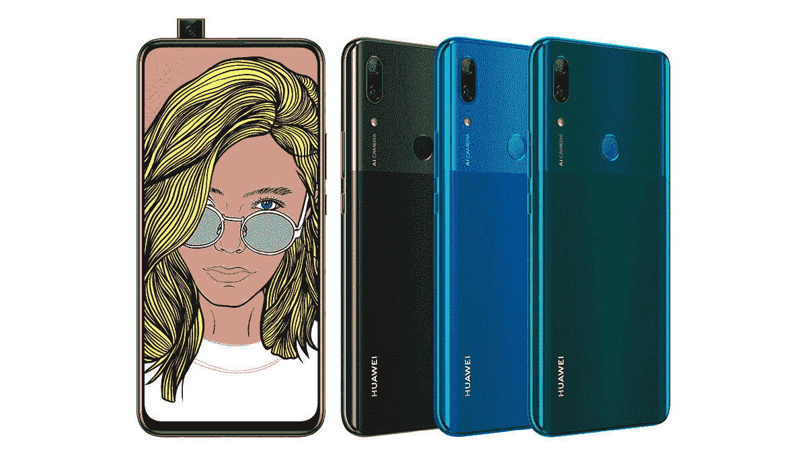

# 华为 P Smart Z 可能有一个弹出式摄像头，“超全景”显示器

> 原文：<https://www.xda-developers.com/huawei-p-smart-z-ultra-fullview-display-pop-up-camera/>

**更新 2(美国东部时间 5/8/19 @上午 9:45):**华为 P Smart Z 已经在西班牙和意大利的华为官网发布。

**更新 1(美国东部时间 2019 年 5 月 3 日上午 10:05):**华为 P Smart Z 的更多渲染图和新的传闻价格已经发布。

华为及其子品牌 Honor 是最快摆弄新外形的智能手机制造商之一，如[打孔显示屏](https://www.xda-developers.com/honor-view20-review/)、[滑块](https://www.xda-developers.com/honor-magic-2-review-video/)，甚至[可折叠设备](https://www.xda-developers.com/huawei-mate-x-foldable-india/)。这是因为华为在研发上花费巨大，以至于支出甚至超过了微软和苹果。现在，跟随中国竞争对手 Vivo 和 OPPO 的脚步，华为似乎正在试验一种新的设计，其中包括一个弹出式自拍相机和一个大型无凹槽显示屏。

据报道，华为正在开发一款新的智能手机，很可能被称为“华为 P Smart Z”，很可能与 [P Smart 2019](https://www.xda-developers.com/huawei-p-smart-2019-europe-kirin-710-price/) 属于同一系列。弹出机制会赠送一个 16MP 的相机自拍。弹出式自拍相机允许华为使用分辨率为 2340 x 1080 的 6.59 英寸“超全视图”显示器。根据泄露的信息，显示屏的纵横比将为 19.5:9，像素密度为 391ppi。在软件方面，智能手机将开箱运行 Android Pie。

从华为 P Smart Z 泄露的渲染图中，我们了解到它的背板可能被分成两部分，可能有不同的纹理，类似于谷歌 Pixel 智能手机。但是对于华为在智能手机上使用的结构材料，我们没有足够的信息。此外，物理指纹扫描仪排除了显示器内传感器的可能性。

 <picture></picture> 

Image courtesy of Twitter/ [Evan Blass](https://twitter.com/evleaks/status/1121640976949202944)

这款奇怪命名的华为智能手机预计将配备海思麒麟 710 芯片组和 4GB 内存。它可能具有 64GB 的内置存储空间，使用 microSD 卡可扩展至 512MB。此外，还有一个 4000 毫安时的电池，没有提到任何快速充电。

对于摄影，华为在背面使用了 16MP+2MP 双摄像头设置，这表明智能手机将作为中端设备放置。这些相机的光圈值将分别为 f/1.8 和 f/2.4。

华为 P Smart Z 的定价约为 210 欧元(约 235 美元)，可能有三种颜色可供选择——午夜黑、翠绿色和宝石蓝。

[来源:购买手机(Dutch)](https://www.mobielkopen.net/p-smart-z-pop-up-camera-huawei)

* * *

## 更新:更多渲染

华为 P Smart Z 的五张新渲染图已经发布在 *[Slashleaks](http://www.slashleaks.com/l/huawei-p-smart-z-full-specs-and-price-revealed-early-by-amazon)* 上。这些渲染显示了我们之前看到的相同的三种颜色，以及弹出式自拍相机。帖子还提到了 280 欧元(~$312)的价格，比上面原文中的价格略高。对此不能全信。

* * *

## 更新:西班牙和意大利官方

华为 P Smart Z 现已在[华为西班牙](https://consumer.huawei.com/es/phones/p-smart-z-2019/)和[华为意大利](https://consumer.huawei.com/it/phones/p-smart-z-2019/)官网上市。我们可以从之前的泄露中看到一切。不幸的是，网站没有说任何关于发布时间表或定价的事情。

* * *

**注意:华为/Honor 已经停止为其设备提供官方 bootloader 解锁代码。因此，他们设备的引导加载程序无法解锁，这意味着用户无法 root 或安装自定义 rom。**