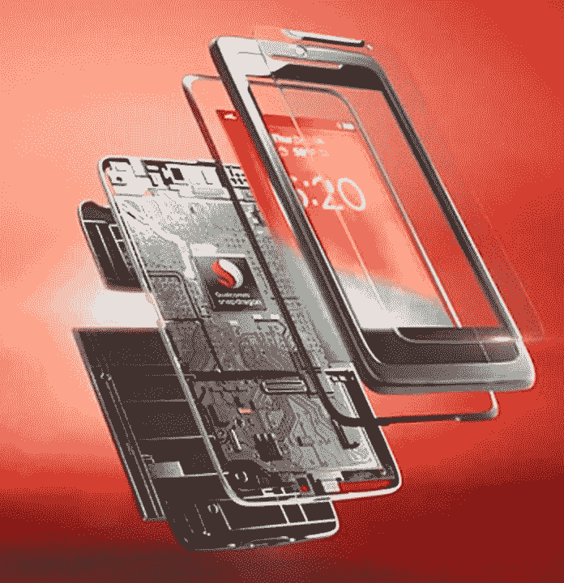

# 深入投降为什么 SD801 设备被排除在牛轧糖

> 原文：<https://www.xda-developers.com/in-depth-capitulation-of-why-msm8974-devices-are-excluded-from-nougat/>

*更新以反映 Android 7.0 的非此即彼 Vulkan 或 OpenGL ES 3.1 要求*

最近，有很多关于版本更新、厂商和芯片组制造商之间的互动以及这对设备发展意味着什么的文章。为什么这种情况会在本周出现？

本周有消息称，备受尊敬的 Nexus 5 将不会获得 Android 7.0(牛轧糖)的更新，高通宣布将不会在 7.0 上提供对 MSM8974(通常称为骁龙 801)的支持。本文是与 XDA 公认的开发者 [bumble-bee 合作撰写的。](http://forum.xda-developers.com/member.php?u=1588190)

这个话题吸引了许多新闻网站的关注，但是许多人忽略了幕后真正发生的事情的细微差别。本文将利用我们在 OEM 官方固件更新方面的经验，进一步解释软件更新的工作原理。我们将带您了解幕后发生的事情(以及原因)，以及为什么您可能无法在手机上安装最新的软件。

# 上游更新

Android 固件更新的第一步是上游更新。这是谷歌内部的工作。与“开放的工作流程”不同，Android 是使用封闭的工作流程开发的，每年左右，当一个新的版本发布时，源代码就会被扔到墙上。最初，谷歌表示这是为了防止在早期事物快速发展时运行前沿版本的人产生碎片，但他们似乎一直保持着这一政策。

在某个时间点，通常是在公开发布更新之前(尽管最近推出了公开测试版，但这些时间范围正在发生变化)，**OEM 将会知道即将到来的更新**。然后，他们将在最后更新的第二个时间点收到源代码(在过去，有时会比发布早一点，尽管我们也知道没有提前发布的情况)。

上游 AOSP 储存库仅包含对有限数量的设备的设备支持。这些通常是你的 Nexus 设备。然而，很快就会清楚的原因是，值得注意的是，谷歌并没有完全控制这些设备的硬件；这些设备由 OEM 制造，OEM 将从芯片组制造商那里购买片上系统(SoC)。

# 芯片组制造商

一旦源代码发布，OEM 的固件团队将(象征性地)坐下来休息。主要的 Android 源代码树没有对出货设备中使用的无数芯片组的硬件支持。例如，AOSP 很可能不支持你的高通芯片组。你的 Exynos one 肯定不是。联发科还是海思？算了吧！

BSP 包含运行 Android 所需的驱动程序和硬件抽象层(HALs)

现在需要的是一个**板支持包(BSP)** 。这是一个由芯片组制造商交付给 OEM 的绝密专有组件包。BSP 包含必要的源代码，让原始设备制造商为他们的设备构建 Android 和必要的驱动程序。

这里值得注意的是，像高通这样的原始设备制造商不一定完全信任他们的原始设备制造商合作伙伴 BSP 是在“需要知道”的基础上提供的。OEM 厂商通常不会获得设备某些超级机密部分的源代码(比如运行在基带上的软件)。关闭这一部分当然也有潜在的问题，正如近期[大量](http://seclists.org/fulldisclosure/2015/Mar/160)和[反复出现](https://github.com/programa-stic/security-advisories/blob/master/ObjSys/CVE-2016-5080/README.md) ASN.1 [解析漏洞](https://www.rapid7.com/db/search?utf8=%E2%9C%93&q=ASN.1&t=a)所示。

BSP 包含在您的设备上运行 Android 所需的驱动程序和硬件抽象层(HALs)。AOSP 包含一组 Hal，作为操作系统期望你的驱动实现的定义。为了使用一个可笑的过度简化的(为了演示的目的而编造的)例子，让我们想象一下你手机上的手电筒。

## 一个例子 HAL -你的手电筒

让我们想象你的设备背面有一个手电筒(如果你有一个 Nexus 7 2013，你需要比其他人多做一点想象——抱歉！).这是由司机控制的。对于我们这个非常简单的例子，假设 v1 HAL 说你应该有一个名为“setLED”的函数，它只接受一个参数，即光的状态。这是一个布尔值-真或假。在 C 语言中，这看起来像这样:

 `void setLED(bool ledState) {

//下面是根据 ledState 打开或关闭 LED 的实际代码

}

该函数在 BSP 源代码中定义。然后，原始设备制造商在构建只读存储器时编译 BSP，这就成为一种专有技术”。所以“设备的供应商分区或区域上的库”。这使得原始设备制造商可以对其设备的某些工作原理保密。现在，让我们假设他们不想让每个人看到他们是如何开关 LED 的。

现在想象一下，谷歌在未来版本的 Android 中发布了他们的 HALs 的更新版本。他们现在决定让你更新 LED 的亮度，而不仅仅是打开或关闭它。也许这是为了自适应闪存，或者也许只是为了强制 HAL 更新，让芯片组制造商继续营业？我们会让你，读者，在那个问题上得出你自己的看法。一些 HAL 更新确实有明显的好处(如新相机 HAL 曝光 raw 拍摄等)，而其他一些则在目的上不太明确。

有了这个新的(虚构的)HAL 来表示亮度，让我们假设 Google 说您需要再次公开一个名为 setLED 的函数，但是这一次要为亮度传递一个整数。现在，0 表示关闭，255 表示开启。

如果你是原始设备制造商，你可以用你的超级密码打开那个 LED，并把它放入这个新功能中。你甚至可以根据数字使用脉宽调制来调节 LED 的亮度。您现在将函数更改为如下所示:

 `void set led(uint 8 _ t led brightness){

//一些超机密和超机密的专有方式来设置 LED 亮度

}

那又怎样？好吧，现在这个新版本的 Android 与现有的“blobs”不兼容。您的 OEM 需要使用这些新的 blobs，因为 Android 操作系统希望看到新的函数定义，而不会在寻找设置 LED 的方法时“找到”旧的函数定义。

# 定制 rom 是怎么做的？

此时，让我们稍作休息，看看自定义 rom(从源代码构建)在这里是如何管理的。这就是你们当中精明的人现在会对着屏幕喊的话——毕竟，我们是 XDA，是世界上寿命最长的手机 HTC HD2 的故乡...(声明一下，那边的疯狂天才们这几天在 HD2 上运行[Android 6.0](http://forum.xda-developers.com/hd2-android/nand-dev/17-2016-kernel-3-0-101-t3380832)！对于 2009 年最初搭载 Windows Mobile 6.5 的手机来说，这已经不错了)

 这里有各种各样的方法——有时开发者在 ROM 中乱搞，告诉操作系统使用旧的函数定义。这有点乱，需要做很多修改来维护。另一种方法是“填补”OEM 二进制文件。

“填补”方法是自己编写并构建一个小的新库，其中包含预期的函数定义——对于我们的例子，我们支持亮度的整数。然后，在 shim 中，这被翻译成满足旧 HAL 的要求。因此，对于我们的例子，我们可能会说，任何高于 128 的亮度要求都会打开 LED，任何低于 128 的亮度要求都会关闭 LED。或者你可以说任何非零值都会开启它。这取决于开发商。他们编译 shim，并让 Android 使用它而不是原生的。然后，填充程序调用 OEM blob。

一个快速的“adb push”和重启应该可以让 shim 运行，让你控制你的虚拟 LED，即使你只有旧的 HAL。

问题是，这显然是一个不完美的过程。你现在会得到一个怪癖——这个设备将有一个相当糟糕的闪光灯，要么完全打开，要么完全关闭。这并不理想——操作系统认为它在发出非常柔和的光，但实际的 LED 被告知它在参加人造太阳比赛，并试图蒙蔽你。但是，嘿，生活并不完美，你现在有一个旧手机上的工作 LED！

(是的，这就是为什么 XDA 用户和开发人员在管理他们疯狂的移植技能时会有怪癖和错误的原因之一。我的意思是见鬼， [Galaxy S II](http://forum.xda-developers.com/galaxy-s2) 搭载了看似可用的 [Android 6.0 ROM now](http://forum.xda-developers.com/galaxy-s2/development-derivatives/rom-t3356498) 。去年发布的很多手机还是没有 6.0！)

# 回到原始设备制造商

让我们跳回原始设备制造商的角度。可悲的是，大多数原始设备制造商已经比我们现在领先至少一部手机。他们的重点是他们即将出售的下一部手机——你不能真的责怪他们，因为他们只在他们出售的设备上赚钱。他们没有从一两年前销售的设备中赚到任何钱，所以他们必须不断发布新设备才能生存。这是 HTC 和黑莓陷入困境的一个原因——不管有多少高管死抓着他们的旧黑莓曲线不放，因为他们不会在那里获得新的设备销售。

如果原始设备制造商没有 BSP，他们不会走 XDA 的道路，拼凑一个版本。为什么？嗯，**他们需要为他们的客户支持这个固件**。如果他们发布了一个半工作的固件，用户会讨厌他们，咆哮和咆哮，并让他们的支持热线响了好几天。

原始设备制造商还必须与运营商竞争，至少在非欧洲市场是如此。运营商不希望客户在软件更新方面遇到问题。事实上，运营商通常不愿意发布软件更新。

为了理解这一点，想象一下你的姨婆爱丽丝。她就是那个在一天中不方便的时候打电话给你，请求你帮忙解决“那个电脑问题”的人。然后你描述如何点击“开始菜单”，并且必须识别出它是“左下角的大旗子”，并且遇到了困惑。大约 45 分钟后(非常沮丧), Alice 阿姨把她的开始菜单拖到了屏幕右边，只需要把它拖回来。是的，用鼠标左键！

现在想象你有一千个爱丽丝阿姨。他们都在给你的客户支持打电话，无法在他们的手机上找到糖果粉碎，担心黑客从他们的手机上删除了它。哦，图标现在看起来有点不同了——也许黑客还在他们的手机里？

是的，这是一个轻松的幽默，但是在你体验到人们打电话给运营商寻求支持的原因之前，你不会相信他们遇到的问题。改变手机工作方式或位置的软件更新将导致巨大的支持开销。至少，它需要对支持人员进行再培训(遗憾的是，因为他们中的大多数人并不是你狂热的 XDA 读者)。

# OEM 获得 BSP

一旦原始设备制造商得到 BSP，他们将把他们的 ROM 移植过来，并把他们所有的改变应用到 ROM 上。他们会堆上他们的臃肿的器皿，并添加一个可怕的卡通式皮肤，在青少年的动漫中会看起来更自在。然后他们会测试它。

> **很多。**

你的手机必须符合各种各样的要求。移动网络被设计成信任用户设备(我们称之为电话)正确运行。这意味着该设备需要大量的测试才能获得批准。软件更新有改变行为的风险，所以需要再次测试。这就是为什么您通常会从外部测试服务中看到有关即将到来的索尼软件更新的信息，这些信息确认固件符合测试要求。

现在...更新一两次(或者在某些情况下，没有更新)后会发生什么？**SoC 制造商不会给 OEM 更新的 BSP** 。毕竟，SoC 制造商不会从中获得太多好处。自从你的手机售出后，原始设备制造商就再也没有从你的手机上赚到钱了。在这一点上，你的手机没有得到任何更多的主要版本更新。

削减 OEM 想要交付的 bsp 数量是一个节省资金的好方法——如果你只需要当前版本，并且不打算交付任何主要版本的增加，这将节省初始 SoC 购买和许可的资金，但代价是 XDA 的一些愤怒的书呆子，不知道为什么他们没有获得更新。

# 那么这对于我手机上的更新意味着什么呢？

更新是复杂的。这个链条中涉及到许多不同的人。所有这些都不能为原始设备制造商目前在安卓系统上缓慢而可悲的更新状态开脱。尽管如此，这里还是有一些真正的挑战。

许多原始设备制造商因承诺过多而受到指责，而[不可避免的交付不足，我们现在把它与](http://www.androidpolice.com/2016/08/25/htcs-broken-15-day-update-promise-for-the-one-a9-is-a-small-symptom-of-a-larger-malady/)联系起来。可悲的现实是，对于大多数原始设备制造商来说，软件更新只是一件他们可以不需要的烦心事。

移动领域大多停留在功能手机的思维模式上。也就是说，设备永远得不到任何更新。测试一次，出货，永不回头。随着现代智能手机的安全问题，以及运行一个完整的通用操作系统的复杂性，以及数百个外部库，这不再是一个选项。或者至少它*不应该*是。谷歌已经采取了一些措施来解决这个问题，至少为现有版本的 Android 发布了安全公告和补丁(记住，直到最近，获得安全更新的唯一途径是通过一个新的主要 Android 操作系统版本！)

然而，遗憾的是，这还不够。即使谷歌不断发布更新，你的设备的安全性仍然取决于 SoC 制造商——由于 SoC 制造商非常害怕有人发现他们如何打开几个 led 或通过扬声器发出声音，他们在他们的设备上发布了大量的二进制 blobs。这些 blobs 包含一些非常不安全的代码(如果你认为这是夸大其词，就看看过去的 Google 安全公告吧！)，需要更新。这意味着需要更新的 bsp。

# 但是为什么我的笔记本电脑不是这样的？

台式电脑(以及延伸开来的笔记本电脑)在架构上与移动设备完全不同。你的手机或平板电脑实际上是一块严重专有的硅片，由一些好心人匆忙设计，但根本没有足够的时间做出好东西。市场变化如此之快，以至于他们几乎跟不上市场营销要求推出新产品的步伐。

这意味着走捷径——你不会发现你的手机受主流 Linux 内核支持，你会发现每部手机都有不同的启动方式。然而，在你的笔记本电脑或台式机上，供应商决定采用一些标准的引导方式——以前是带 BIOS 的 MBR(主引导记录),现在是 UEFI。这种标准化使得在每个设备上运行相同的软件成为可能。

虽然最近在这方面取得了一些进展，特别是索尼的外联计划和他们的[统一内核](https://github.com/sonyxperiadev/kernel)，但在大多数手机上运行主线内核是不现实的，因为每款设备都引入了大量新的特定于供应商的黑客。

耳机插孔接线错误？直接黑进驱动程序里！生产设计的时候没时间修。

制造团队在生产批次 1 中倒置安装了摄像头模块？扔一个黑客进去检查内部版本代码，如果是版本 1 就把视频翻过来！

像这样的黑客解决了眼前的问题，但是仅仅触及了正在发生的奇怪的和特定于产品的变化的表面。见鬼，由于商业决策，同一款手机的不同版本有时甚至会有完全不同的芯片。这些导致了司机的黑客行为和当时才有意义的怪异决定，让手机正常工作，以便下周发货。

虽然有工作正在进行中，以主线支持 64 位 ARM 芯片使用 UEFI 启动，但到目前为止还没有一个更标准化的方式来启动 ARM 设备。这很可悲，因为这意味着手机在工作寿命结束之前将继续被扔掉，因为维持软件的技术债务和负担实在太昂贵了。

但另一方面，如果原始设备制造商只从销售设备中赚钱，他们难道不需要确保人们继续购买新手机吗？如果没有 30 年的发展势头和使用开放 PC 平台和标准的遗留软件，PC 市场会转向这种模式吗？

# 好了，回到正题！我的 MSM8974 呢？我会得到 7.0 分吗？

这是一个没有高通内部消息的棘手问题，遗憾的是我们目前没有。但是，我们可以从 7.0 Android 驱动 API 和 CTS 要求中得出一些信息。CTS 要求规定了谷歌对运行给定固件的设备的期望。用来执行这些要求的“大锤”是谷歌使用其专有 Google Play 服务捆绑包的许可- **如果你不遵守，你就不能在设备上发布谷歌应用**。虽然对于一些人来说，这种[可能会被视为一种优势](http://www.xda-developers.com/tag/say-sayonara/)，但这显然不是用户想要和期望的设备。

Android 7.0 对 HAL 或驱动程序(如上所述)没有太多的改动，所以任何不兼容都不太可能来自那里。然而，更有可能引起争议的是，为了通过 CTS，Vulkan graphics API 或 GLES 3.1、引入了一个**新要求。**

目前，许多片上系统(SOC)在其图形处理器上没有 Vulkan 支持，包括 MSM8974。这也是最有可能出现与 Android 7.0 兼容性问题的地方。尽管如此，没有高通的内部消息，以及他们的未来计划，我们很难给出一个明确的声明而不加以限定。然而，目前我们认为这很可能是高通停止支持(在他们看来)老化的 MSM8974 芯片组，并且不在该平台上提供 7.0 的 BSP(板支持包)的“简单”情况。如果是这样的话，这将意味着 OEM 厂商几乎肯定不会在设备上发布 7.0-他们必须以某种方式找到 Vulkan 或 GLEs 3.1 对他们的 GPU 的支持，GPU 源代码是移动堆栈中保护得非常严格的部分之一(没有真正的原因，我们会添加-见 AMD，开源他们自己的 Linux 桌面 AMDGPU 驱动程序)。然而，可悲的是，Vulkan 和加速(GLES)图形一般比简单的 LED 更复杂一些，所以这不是我们将要看到的引入兼容性的垫片。

由于 7.0 发布时间不长，其他芯片组(除了 AOSP 本土的少数芯片组)很可能会落后于 6.0，这是由于硬件和驱动程序问题(即没有更新的 BSP)或缺乏 SoC 供应商对 Vulkan 或 GLES 3.1 API 的支持。目前，Snapdragon 800 和 801 都不支持其中之一。

最好的办法是关注这个空间-XDA 的开发者已经在非官方移植到 7.0 上取得了良好的进展，许多设备没有得到谷歌官方的 7.0 支持。然而，这些没有 Vulkan 或 GLES 3.1 支持——如果足够多的用户开始运行没有 Vulkan 或 GLES 3.1 支持的定制 rom，也许 Android 上的游戏开发者将开始经历碎片化的挫折？

苹果倾向于在最新的 iOS 版本上支持他们的 iPhone 系列大约 5 年 iPhone 4s 于 2011 年 10 月推出，并一直更新到 iOS 9。然而，它不会收到即将到来的 iOS 10 更新，假设 iOS 10 在 10 月份左右推出，这将使手机的有效寿命达到 5 年。值得注意的是，苹果并不总是支持图形 API——iPhone 4s 和 iPhone 5 没有苹果的金属图形 API，这与 Android 在 Vulkan 中看到的情况有些类似。唯一的区别是，苹果继续支持没有新图形 API 的旧设备。

***你怎么看？你会在手机上闪存一个自定义 ROM 来延长它的使用寿命吗？你在下面的评论中说。***``