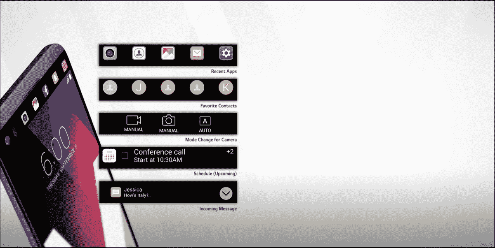
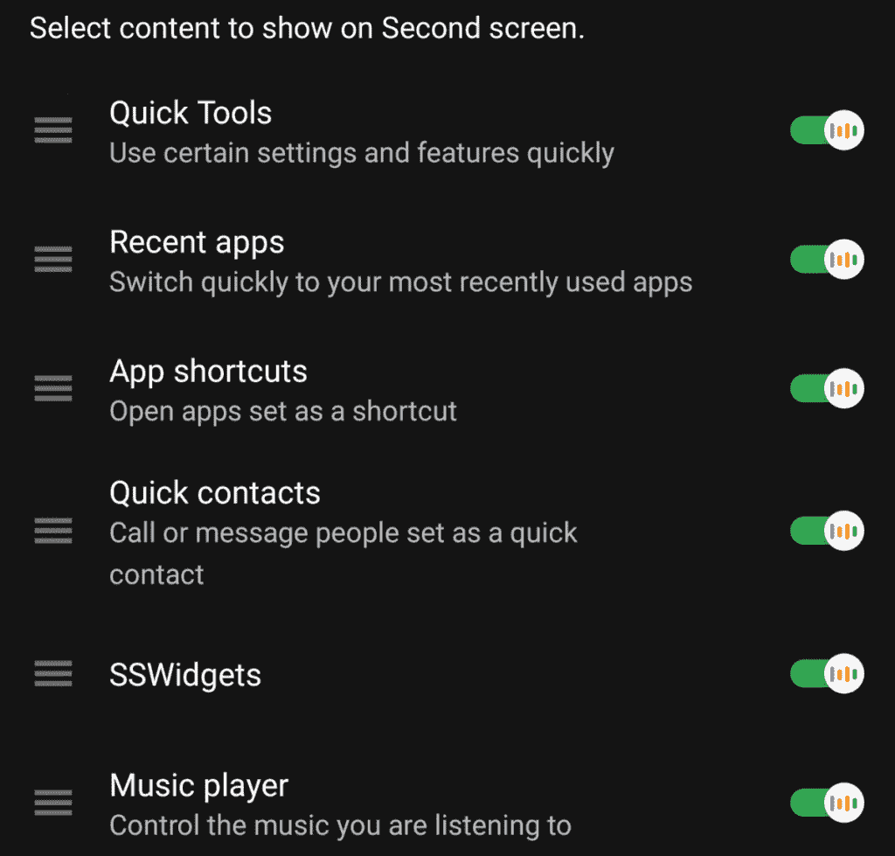

# LG V20 第二个屏幕接收自定义小部件支持

> 原文：<https://www.xda-developers.com/lg-v20-second-screen-custom-widgets/>

韩国科技巨头 LG 电子因其旗舰 LG G 系列智能手机而为安卓爱好者所熟知，但该公司也提供以其标志性的第二屏幕而闻名的 V 系列智能手机。尽管许多用户热切期待今年[即将推出的 V30 车型](https://www.xda-developers.com/lg-v30-6-inch-fullvision-oled-panel/)，但由于最近的一些发展，去年车型的[粉丝不应感到被冷落。LG V20 论坛上的开发者一直在努力让第二块屏幕与 AOSP 定制的 rom 兼容，他们终于做到了。经过几个月的努力，LG V20 第二屏幕现在可以显示**定制的第二屏幕，在有根和无根、基于股票或基于 AOSP 的设备上的第三方小部件**。](https://www.xda-developers.com/opinion-the-v20-offers-one-of-the-best-year-on-year-improvements-of-2016/)

* * *

## LG V20 第二块屏幕概述

 <picture></picture> 

LG V20's Second Screen. Image Source: [LG](http://www.lg.com/us/cell-phones/lg-US996-Silver-v20-unlocked)

LG V20 的用户熟悉 LG 软件中现有的第二屏幕功能。当主显示屏打开时，第二个屏幕可以显示通知，它还对浏览器或视频应用等一些股票应用进行了一些增强。此外，您可以在第二个屏幕设置中选择一些小部件:

**选项显示:**

*   最近的应用
*   音乐播放器
*   快速联系人
*   快速工具
*   应用快捷方式
*   签名
*   即将到来的计划

**显示关闭选项:**

*   信息(日期和时间或签名)
*   快速工具

虽然现有功能肯定有其用途，但令人失望的是，定制 LG V20 第二屏幕的可用选项如此有限。用户一直呼吁 LG 发布一个官方 API，开发者可以用它来创建自己的小工具，但到目前为止，没有迹象表明该公司对此类事情持开放态度。没有第二个屏幕 API 的 LG V20 定制相当有限。

虽然这意味着大多数最新 LG V 旗舰产品的所有者只能接受他们可以获得的股票期权，但对于那些喜欢使用基于 Android 开源项目(AOSP)的定制 ROM 的用户来说，缺乏 API 是一个更大的问题。

* * *

## AOSP rom 上的第二个无屏幕 LG V20

LG V20 有很多令人喜爱的地方。毕竟，这是为数不多的带有可拆卸电池的旗舰智能手机之一。但一些用户并不热衷于 LG UX T1，这使得 LG V20 的定制还有很多不足之处。与任何其他设备一样，这些用户可以选择解锁引导加载程序(对于某些型号，可以是[官方](https://developer.lge.com/resource/mobile/RetrieveBootloader.dev?categoryTypeCode=ANRS)或[非官方](https://www.xda-developers.com/dirtysanta-exploit-unlocks-the-bootloader-of-the-lg-v20-h990/)，然后刷新 ROM，如[linegeos](https://forum.xda-developers.com/v20/development/dev-cm14-t3509953)。但这样一来，他们就失去了手机的标志性功能——第二块屏幕。

从物理上来说，第二块屏幕实际上并不是辅助显示器。作为第二个屏幕上市的实际上是**相同的物理显示面板**(分辨率为 1040x160，并没有跨越设备的整个宽度，因为它被前置摄像头和其他传感器切断了)。LG 的工程团队能够通过框架和内核修改来创建其伪辅助显示功能。如前所述，我们不知道他们到底是如何做到的，因为这都是封闭源代码。

基于 AOSP 的早期 rom 版本有很多问题，主显示图像延伸到了第二个屏幕区域。这显然是不可取的行为，因此 V20 的 LineageOS 维护人员可以理解地[通过偏移显示器绘制像素的区域以及活动触摸面板区域来完全禁用第二块屏幕](https://github.com/LineageOS/android_kernel_lge_msm8996/commit/a2ed7a25e81eeeb8ebe42d281ace647b8439204b)。

因此，任何想要像 LineageOS 一样闪存定制 ROM 的 V20 用户都将不得不面对失去手机最明显的功能。由于让第二块屏幕工作的官方代码没有公开，所以还没有一种简单的方法让它在这些 rom 上工作。甚至像从普通 rom 中翻出二进制文件这样的事情也是不够的，因为逆向工程二进制文件和读取汇编代码需要大量的工作，这是大多数业余开发人员根本负担不起的。开放官方第二屏幕实现的运动似乎是一项不可能完成的任务。

* * *

## 开源第二屏 API

虽然许多最初购买 LG V20 的开发者最终转向了其他设备，但并不是每个人都放弃了这一努力。我们的论坛在二月份发起了一个主题,致力于将 LG 的第二屏幕功能引入 AOSP rom。最重要的是，开发人员优先考虑开发一个既开源又可由第三方扩展的 API。这意味着他们将创建的 API 不会侵犯 LG 的专有技术，并且还允许任何开发者为第二个屏幕制作他们自己的定制小部件。

进展缓慢，但由于包括 XDA 资深成员[zachare 1、](https://forum.xda-developers.com/member.php?u=7055541) [USA-RedDragon](https://forum.xda-developers.com/member.php?u=5184450) 和 [me2151](https://forum.xda-developers.com/member.php?u=4591212) 以及 LineageOS 设备维护人员 Rashed 和 XDA 公认的开发人员 [bigrushdog](https://forum.xda-developers.com/member.php?u=470268) 在内的几名开发人员数月来的艰苦工作，进展正在取得。两周前，zachare 1[分享了](https://forum.xda-developers.com/showpost.php?p=73292510&postcount=112)以下图片，证明 LG 的第二个屏幕部件的定制实现是可能的:

虽然这些图像只显示了在 LG V20 UX 股票上找到的股票窗口小部件的一些小定制，但它仍然是一个重大的发展。仅仅几天后，美国红龙公司在如何让第二块屏幕在 AOSP 上工作而没有过去的溢出显示问题上取得了突破。引用开发商的话:

> #### 当我试图让第二个屏幕像字面上的第二个显示器一样工作，而不是一个带有偏移的扩展，并设法让它偏移除了我一直在做的第二个屏幕服务之外的所有应用程序时，我偶然发现了一些代码。第二个突破是当我意识到在 AOSP 不可能取消一些显示，所以它必须在内核中。在 Rashed(LG G5、G6 和 TMO V20 的 LineageOS 维护人员)的帮助下，我设法识别了内核中的现有代码，以保持第二个屏幕打开，而主面板是空白的。一旦这两个突破按预期工作，我知道它已经接近完成，并决定开始戏弄社区。

在 XDA 成员 me2151、Zacharee1、Rashed 和 bigrushdog 的大力帮助下，该项目一直向前推进，直到最终处于可用状态。现在，这些开发人员所做的工作能够被打包到任何基于 AOSP 源代码的 ROM 中，他们所做的开源 API 意味着任何第三方开发人员现在都可以制作第二屏幕小部件上传到 Play Store。这为 LG V20 定制开辟了一条全新的途径。

大约在本周末(暂定发布日期为 8 月 18 日)，开发人员将为定制 ROM 开发人员发布一个补丁，开源 API 以及第三方开发人员使用的模板，以及一些复制原始功能的示例应用程序。USA-RedDragon 表示，基于 LG 股票集的部件将免费下载，同时他还将发布一些售价为 0.99 美元的高级部件。

我问 USA-RedDragon 这个新 API 会有什么样的特性，他说我们正在开发:

*   类似股票的应用程序，如音乐播放器、通知和快速设置。快速设置将被纳入 Android 的股票快速设置磁贴实现，这意味着任何磁贴可以添加到第二个屏幕。签名和时钟功能都将内置于 ROM 中。
*   其他非库存功能将被添加，如类似 LED 的彩色显示屏(因此，如果你在手机显示屏关闭时收到通知，LED 通常会亮起蓝色并闪烁，第二个屏幕将模仿这一点)。播放音乐或观看视频时，脉冲均衡器也可以显示在第二个屏幕区域。
*   一些优质的第二屏幕应用程序，如显示器关闭时的充电统计，RSS ticker feed，用户特定操作的可定制按钮(如启动 Tasker 任务)。现在的可能性是无限的！

应该注意的是，这些工作都是业余爱好者在业余时间完成的。与 LG 工资单上的工程师所做的专业工作相比，这个 API 可以被认为是一个肮脏的黑客。这些开发者所做的工作并不“优于”LG 的实现，但却开放得多。由于这一点，用户最终可以通过他们想要的任何定制第二屏幕小部件来释放 V20 第二屏幕的真正潜力——广泛增强 LG V20 的定制。

* * *

好像上面的发展还不够令人兴奋，人们还发现使用这个 API **制作的应用程序也可以在 LG 的股票软件上工作。**这意味着开发人员制作的任何第二个屏幕小部件都可以由未根化的、完全库存的 LG V20 以及自定义 ROM 上的未根化/根化设备的用户使用。

 <picture></picture> 

Custom Second Screen "SSWidgets" Option in Settings

这一突破是 zachare 1 在基于新的开源 API 制作小工具的过程中取得的。他通过反编译 LG QuickTools 找到了 LG 使用的 [AppWidget 自定义类别](https://developer.android.com/guide/topics/appwidgets/index.html)，通过使用它，他能够让自己的自定义第二屏幕小工具显示在设置中。

他开发了一款名为 LG V20 Custom SignBoard Widgets 的开源应用,目前正在 beta 测试中。该应用的[论坛主题](https://forum.xda-developers.com/v20/themes/app-custom-screen-widgets-stock-soon-t3656497)上的几个用户已经注意到，在通过 ADB 授予该应用 WRITE_SECURE_SETTINGS 和 BATTERY_STATS 权限后，它可以在他们的非 root LG v 20 设备上工作。目前，这款应用程序主要只允许你使用股票信息显示和音乐控制器的彩色版本，但由于它很快被作为概念验证发布，以测试非 proof 设备上的功能，它肯定完成了它的工作。

* * *

## 全面定制 LG V20 第二屏，即将推出

月复一月的努力终于有了回报。定制第二屏幕功能现在终于可以在 LG V20 上实现。对于普通用户来说，要想利用定制的小部件，你还得再等几天，开发者才能接触到开源 API。但是漫长的等待终于结束了，所以如果你一直渴望定制 LG V20，那么请密切关注我们的 XDA V20 论坛，了解有关这一发展的所有最新信息。