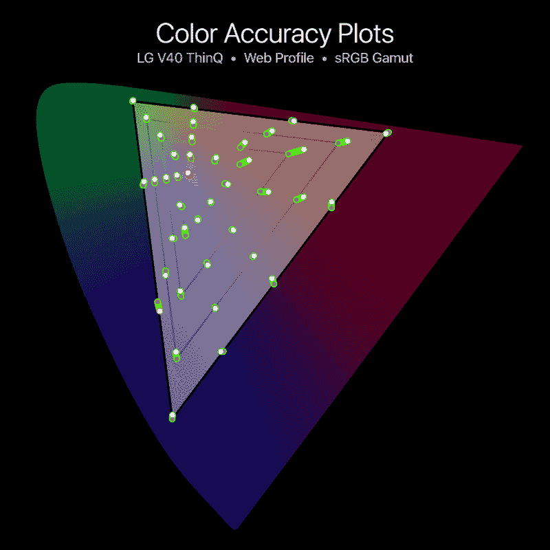
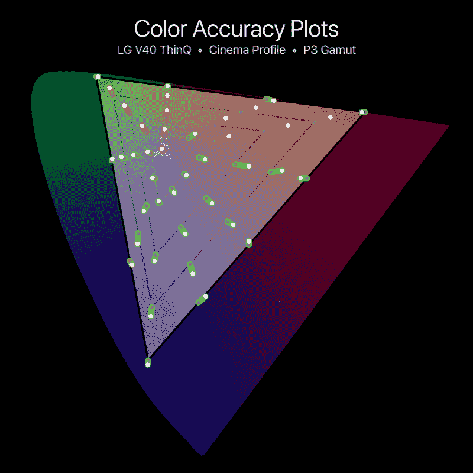
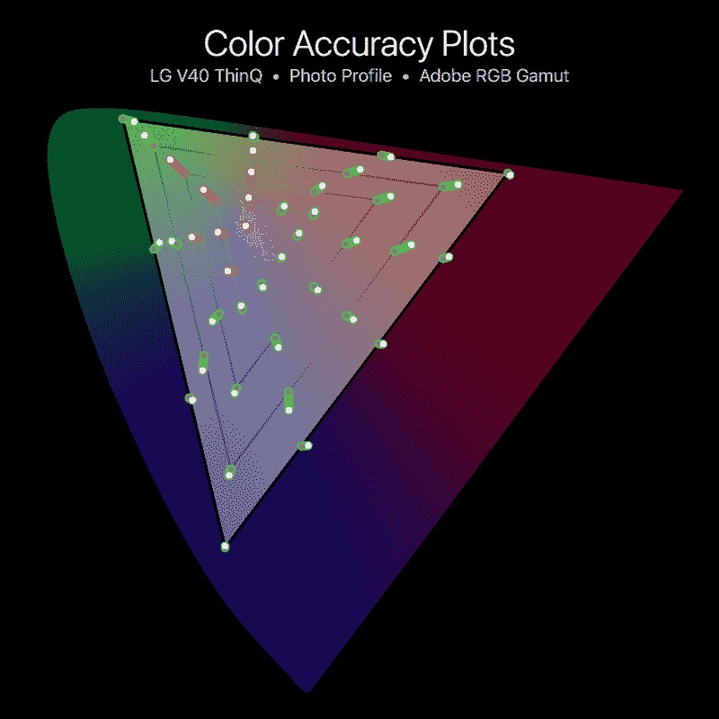

# LG V40 ThinQ 显示器评测:失败者终于赶上来了

> 原文：<https://www.xda-developers.com/lg-v40-thinq-display-review/>

在过去的几年里，所有的目光都集中在 LG 显示器(LGD)上，希望他们能生产出一个有竞争力的有机发光二极管供应链，从而遏制三星显示对有机发光二极管手机市场的垄断。我们第一次听到这种潜在增长的风声是在 2017 年初，当时谷歌提出向 LG Display 投资[近 10 亿美元](https://www.xda-developers.com/report-google-wants-to-invest-over-880-million-in-lg-for-oled-panels/)，希望为 Pixel 2 XL 确保稳定的柔性有机发光二极管供应。几个月后，当[苹果跳上](https://www.businessinsider.com/apple-is-reportedly-investing-27-billion-in-lg-display-to-build-oled-panels-for-future-iphones-2017-7)并据报道向韩国显示器制造商投资 27 亿美元以换取为苹果建立一条新的有机发光二极管生产线时，整个磨难似乎变得更加严重。秋天来了，我们看到了 LG Display 的第一款移动有机发光二极管在 LG V30 和 Pixel 2 XL 上的早期预览。专家组的早期反应非常负面(我之前已经在[中深入报道过](https://www.xda-developers.com/pixel-2-xl-xda-display-analysis/))，让许多人相信 LGD 不是我们所希望的有机发光二极管救世主，甚至激怒了许多消费者，他们甚至会抨击原始设备制造商，因为他们甚至考虑从 LGD 采购显示器。

半年后，LG Display [签约](https://www.bloomberg.com/news/articles/2018-06-28/apple-is-said-to-get-second-supplier-for-oled-iphone-screens)成为苹果的第二家有机发光二极管供应商，不久之后，[通过了](https://www.reuters.com/article/us-apple-qualcomm-court/german-court-throws-out-qualcomms-latest-patent-case-against-apple-idUSKCN1P911C)一系列苹果严格的质量测试。因此，LG Display 重新引起了我们的注意，我们期待 LG V40 ThinQ 和谷歌 Pixel 3 的发布，因为有传言称这两款产品都将使用 LGD 的下一代移动有机发光二极管。Pixel 3 的显示屏被确认为来自 LGD 的，并且[我们认为](https://www.xda-developers.com/google-pixel-3-display-analysis-a-real-tangible-improvement-yet-still-behind-the-curve/)比 Pixel 2(三星显示屏)和[都有显著的进步，尤其是去年的 Pixel 2 XL](https://www.xda-developers.com/pixel-2-xl-xda-display-analysis/) 。然而，Pixel 3 的 LGD 面板仍然存在我们在 Pixel 2 XL 中提到的一些问题，但程度较轻。虽然 Pixel 3 仍然是一个不错的面板和明显的改进，但它的显示屏仍然不是我们所希望的三星捕手。

然而，对于这一代人来说，这还不是人生的终点。我们还是要好好看看 LG 的最新旗舰 LG V40 ThinQ。

[**LG V40 ThinQ 论坛**](https://forum.xda-developers.com/lg-v40)

## **绩效总结**

LG V40 ThinQ 正面有一个灵活的有机发光二极管，使挡板向两侧变圆。圆形正好从可见屏幕的边缘开始，这使得它很难成为合适的屏幕保护器的候选对象。3D 前玻璃也是手机前部中空感的罪魁祸首，这也在 Pixel 2 XL 的 3D 玻璃上观察到。

屏幕的原生分辨率最高支持 3120×1440 像素，但默认显示设置为 2340×1080。在此分辨率下，其清晰度明显低于原始分辨率，尤其是在查看文本时。在其原始分辨率下，屏幕的像素超过 9.1 英寸时就无法分辨，对于视力为 20/20 的典型智能手机观看距离(约 12 英寸)来说，这应该显得足够清晰，只有轻微的空间来容纳视力更高的人。

在显示亮度方面，LG V40 ThinQ 的显示器在高环境光下的自动模式下可以与苹果和三星的显示器相媲美，在 100% APL 下测量的最大白色水平为 556 尼特，在 50% APL 下为 781 尼特，在 1% APL 下发射屏幕的微小白色区域时达到 914 尼特的峰值。

开箱即用的 LG V40 ThinQ 的目标是一个冷静和有力的色彩配置文件，比我们的标准 RGB 色彩空间饱和约 25%。在自动和专家配置文件中，可以修改显示器的整体色温(尽管以有缺陷的方式)以及修改相对的红色、绿色和/或蓝色。该手机提供了 6 个其他颜色配置文件，并提供了适应 P3，Adobe RGB 和 sRGB 色彩空间的配置文件。然而，所有三个参考色彩配置文件都有一个绿白色点，只有 Web 配置文件(针对 sRGB 色彩空间)与其目标完全匹配(尽管在我们的 [Pixel 3 显示分析](https://www.xda-developers.com/google-pixel-3-display-analysis-a-real-tangible-improvement-yet-still-behind-the-curve/)中可以看到，LGD 的面板完全能够通过更熟练的校准获得近乎完美的色彩准确度)。此外，没有一个颜色配置文件支持 Android 8.0 Oreo 中引入的 Android 颜色管理，即使它支持，也没有多大意义，因为几乎没有 Android 应用[支持它](https://www.xda-developers.com/android-oreo-specify-screen-calibration/)。

平均而言，色调足够暗。阴影可能比标准略亮，中间色调可能略暗，校准颜色配置文件的平均灰度系数为 2.25，宽非标准配置文件(包括自动)的灰度系数约为 2.3。

在显示功率方面，我们测量了 LG V40 ThinQ 显示器在 100% APL 下的每瓦发光强度，比 LG 显示器在 Pixel 3 上的每瓦发光强度高出 25%，在 50% APL 下高出 8%。LG V40 显示器的功效数据高于大多数其他有机发光二极管显示器，但它不太可能对手机电池寿命产生显著影响。

| 

### 好好好

*   出色的显示亮度
*   非常低且均匀的角度偏移——这是我们测量到的最好结果
*   支持鲜艳的色彩和非常宽的原生色域
*   在 sRGB 校准的 Web 色彩配置文件中，色彩准确度良好
*   杜比视界和 HDR10

 | 

### 坏

*   标准校准颜色配置文件中的绿白色点
*   中空感顶部玻璃
*   亮度和色调响应因 APL 而异
*   电影和照片档案可以更好地校准
*   没有自动色彩管理

 |
|  |

## **方法论 ▼**

为了从显示器中获得定量的颜色数据，我们将特定设备的输入测试模式放入手机，并使用 i1Pro 2 分光光度计测量显示器产生的发射。我们使用的测试模式和设备设置针对各种显示特性和可能改变我们所需测量的潜在软件实现进行了修正。许多其他站点的显示分析没有正确考虑它们，因此它们的数据可能不准确。我们首先测量显示器的全灰度，并报告白色的感知色彩误差及其相关色温。从读数中，我们还通过对每一步的理论伽马值进行最小二乘法拟合，得出显示伽马值。这个 gamma 值比那些从 CalMan 等显示校准软件报告 gamma 读数的值更有意义，也更真实，CalMan 等显示校准软件是对每一步的理论 gamma 进行平均。我们测试图案的目标颜色灵感来自于

[DisplayMate’s absolute color accuracy plots](http://www.displaymate.com/Colors_43s.html)

。在整个 CIE 1976 色度标度中，颜色目标的间隔大致均匀，这使得它们成为评估显示器的完整颜色再现能力的极好目标。灰度和色彩准确度读数以显示器读数的 20%为增量

*perceptual*

(非线性)亮度范围并进行平均以获得精确到显示器整体外观的单个读数。另一个单独的读数取自我们的参考 200

*cd/m²*

这对于典型的办公室条件和室内照明来说是很好的白色水平。我们主要使用色差测量

*CIEDE2000*

(简称为

*ΔE*

)作为色度准确度的度量。

*ΔE*

是由提出的行业标准色差度量

[International Commission on Illumination (CIE)](http://www.cie.co.at/)

最好地描述了颜色之间的均匀差异。也存在其他色差度量，例如色差

*Δu′v′*

在 CIE 1976 色度标度上，但是已经发现当评估视觉显著性时，这种度量在感知均匀性方面较差，因为在色差度量之间，测量的颜色和目标颜色之间的视觉显著性的阈值可能变化很大。例如，颜色差异

*Δu′v′*

0.010 的色差对于蓝色来说在视觉上是不明显的，但是对于黄色来说，相同的测量色差一眼就可以看出。注意到

*ΔE*

本身并不完美，但它已经成为目前存在的最具经验准确性的色差度量标准。

*ΔE*

通常在其计算中考虑亮度误差，因为亮度是完整描述颜色的必要组成部分。然而，由于人类视觉系统分别解释色度和亮度，我们将测试模式保持在恒定亮度，并补偿我们的亮度误差

*ΔE*

价值观。此外，在评估显示器的性能时，将这两种错误分开是有帮助的，因为就像我们的视觉系统一样，它与显示器的不同问题有关。这样我们可以更彻底地分析和理解显示器的性能。当测得的色差

*ΔE*

都在 3.0 以上，色差一眼就能从视觉上看出来。当测得的色差

*ΔE*

介于 1.0 和 2.3 之间时，色差只能在诊断条件下被注意到(例如，当测量的颜色和目标颜色在被测量的显示器上紧挨着彼此出现时)，否则，色差在视觉上是不可察觉的，并且看起来是准确的。测得的色差

*ΔE*

1.0 或更小的颜色被认为是完全感觉不到的，并且即使在与目标颜色相邻时，所测量的颜色看起来也无法与目标颜色区分开来。显示器功耗通过手机电池消耗和显示器亮度之间的线性回归的斜率来测量。以 20%的亮度步长观察并平均三分钟的电池消耗，并在尽量减少外部电池消耗源的同时进行多次试验。

## **亮度**

我们的显示器亮度比较图表将 LG V40 ThinQ 的最大显示器亮度与我们测量的其他显示器进行了比较。图表底部水平轴上的标签代表相对于 LG V40 ThinQ 显示器的感知亮度差异的乘数，其固定为“1×”。显示器亮度的大小以每平方米坎德拉或尼特为单位，根据史蒂文幂定律使用点光源感知亮度的模态指数进行对数缩放，与 LG V40 ThinQ 显示器的亮度成比例缩放。这是因为人眼对感知亮度有对数反应。在线性标度上呈现亮度值的其他图表不能恰当地表示显示器的感知亮度的差异。

在测量 OLED 面板的显示性能时，了解其技术与传统液晶面板有何不同非常重要。液晶显示器需要一个背光来让光通过滤色器，滤色器会阻挡光的波长，从而产生我们看到的颜色。OLED 面板能够使它的每个单独的子像素发出它们自己的光。这意味着 OLED 面板必须从其最大分配中为每个点亮的像素分配一定量的功率。因此，需要点亮的子像素越多，需要在点亮的子像素上分配的面板功率就越多，每个子像素接收的功率就越少。

图像的 APL(平均像素级别)是整个图像中每个像素的单个 RGB 分量的平均比例。例如，一个完全红色、绿色或蓝色的图像具有 33%的 APL，因为每个图像只包括完全照亮三个子像素中的一个。完整的颜色混合青色(绿色和蓝色)、品红色(红色和蓝色)或黄色(红色和绿色)具有 67%的 APL，而完全照亮所有三个子像素的全白图像具有 100%的 APL。此外，一半黑一半白的图像具有 50%的 APL。最后，对于有机发光二极管面板，总的屏幕内容 APL 越高，每个点亮像素的相对亮度越低。LCD 面板没有这种特性(除了局部变暗)，因此，在较高的 APL 下，它们比有机发光二极管面板更亮。

LG v 40 ThinQ 显示器与三星的显示器一样，在高环境照明下，与手动相比，自动亮度支持更高的峰值亮度。LG V40 ThinQ 显示器上最大亮度的全屏白色图像的亮度为 556 尼特，比三星和苹果各自旗舰显示器上的 640 尼特仅暗 7%左右。

然而，在 50% APL(这是大多数内容的更好表现)下，LG V40 ThinQ 显示器的表现非常好，测量的白色水平为 781 尼特。这比苹果的最新手机还要高，与三星在这一 APL 的峰值发射没有区别。在 1%的 APL 下，LG V40 显示屏的峰值为 914 尼特。

LG V40 ThinQ 的最暗亮度可以低至 2.3 尼特，这使其与大多数 Androids OLEDs 的最小亮度大致相同。然而，苹果最新的有机发光二极管显示器测量值低至 1.8 尼特，明显显得有点暗(约 12%)。

对于有机发光二极管对屏幕 APL 的动态亮度响应，看起来 LG 已经努力控制不同 APL(高亮度模式之外)的白色水平，在 100%和 10% APL 之间的最高白色水平和最低白色水平之间测量到 8%的最大亮度增量，这是非常好的。这需要在不同的亮度和 APL 下具有一致的显示伽玛和色彩准确度。然而，我们发现 LG 在不同的 APL 下仍然有不同的伽玛，即使有熟练的动态亮度控制，这是一个遗憾。

黑色剪裁，非正式地称为“黑色挤压”，是指较暗的色调与显示器呈现的纯黑色(显示器的“黑电平”)相同。我们测量了 LG V40 显示屏的黑色限幅阈值，驱动电平为 2.7%或更低，与我们为 Galaxy Note 8 和 Galaxy Note 9 测量的值相当。Pixel 3 上的 LG 显示器的黑色阈值为 6.0%，Pixel 3 XL 上的“更高质量” [三星面板](https://www.xda-developers.com/google-pixel-3-xl-oled-display/) 的黑色阈值为 4.7%，这进一步证明了他们面板上的黑色剪裁，即使是 Pixel 2 XL 上的黑色剪裁，也是由于他们的面板校准(在其他支持数据的基础上)，而不是由于一些人批评的 LG 显示器。LG 在这里做得非常好。

## **颜色配置文件**

LG V40 ThinQ 提供了压倒性的 *七种* 不同颜色配置文件可供选择，默认为自动。

默认的 **自动** 色彩配置文件是最接近 P3 色彩空间的宽色域色彩拉伸配置文件。它在 7282K 有一个故意更冷的白点，比 P3 的初选有更深的蓝色和略深的绿色。LG 在一份新闻稿中， [告诉我们](https://www.xda-developers.com/lg-g7-thin-q-display-brightness/)Auto 可以“自动分析当前内容，如视频、游戏、照片或网页，并优化显示设置，同时降低功耗”，但即使在嵌入 ICC 配置文件的图像上，我也无法做到这一点。在此配置文件中，可以使用线性 RGB 调整以及滑块来修改色温。

 <picture></picture> 

LG V40 ThinQ Color Temperature RGB Balance

不幸的是，对 LG 来说，无论是谁负责色温滑块，都失败得很惨，因为“较冷”的值实际上降低了白点的相关色温，“较暖”的值反而增加了它，这与直觉相反。LG 所做的是在滑块接近“更热”时降低绿色驱动水平并增加红色驱动水平，而几乎不接触蓝色驱动水平。所有的调整都是为了非常相似的相关色温，这是一个很好的例子，说明了相似的相关色温可能看起来非常不同。这就是为什么相关色温接近 6504K 的白点并不总是被认为是准确的，您很快就会看到 LG V40 ThinQ 显示器就是这种情况。

**电影院** 简档针对 P3 色彩空间，这是电影行业通常针对的色彩空间。由于该配置文件试图将显示器灰度系数定为 2.2，因此它将目标定为现在俗称的 *显示器 P3* ，与将显示器灰度系数定为 2.6 的*DCI-P3*形成对比。它的白点为 6477K，非常接近其 D65 目标 6504K。

**运动** 配置文件看起来类似于自动色彩配置文件，除了在 8297K 具有稍微不太饱和的蓝色和冷得多的白点。我不知道这和运动有什么关系。

**游戏** 配置文件与运动配置文件几乎相同，除了在 7877k 的自动和运动配置文件之间有一个白点。这个侧写也没有任何意义。

**照片** 配置文件似乎试图以 Adobe RGB 色彩空间为目标，通常以名为“照片”的色彩配置文件为目标(就像在三星的设备上)。它与 sRGB 共有的红色和蓝色原色相配，但似乎没有达到绿色原色。它的白点为 6478K，非常接近其 D65 目标 6504K。

**Web**配置文件以 sRGB 色彩空间为目标，这是万维网和大多数内容的标准“默认”色彩空间。这将是几乎所有情况下的颜色精确配置文件，除了当内容在其他颜色空间中描述时，这在 Android 生态系统中仍然很少和罕见，除了 YouTube 和网飞等特定平台上的 HDR 媒体。它的白点为 6489K，非常接近其 D65 目标 6504K。

**专家** 配置文件默认与自动配置文件相同，具有线性 RGB 调整和色温滑块。还有额外的滑块可以修改屏幕的饱和度、色调和人工锐度。

## **对比度和伽玛**

显示器的伽玛决定了屏幕上的整体图像对比度和色彩亮度。大多数显示器上使用的行业标准伽马遵循 2.20 的幂函数。更高的显示器伽马功率将导致更高的图像对比度和更暗的颜色混合，这是电影业正在朝着的方向发展，但智能手机在许多不同的照明条件下观看，更高的伽马功率是不合适的。下面我们的 *伽玛曲线* 是 LG V40 ThinQ 显示器上看到的颜色亮度与其相关输入驱动电平的对数对数表示:高于标准 2.20 线的测量点意味着色调显得更亮，低于标准 2.20 线的测量点意味着色调显得更暗。由于人眼对感知的亮度有对数反应，所以轴是对数标度的。

**现在，大多数现代旗舰智能手机显示屏都配有经过校准的色彩配置文件，色彩精确** 。然而，由于有机发光二极管随着内容 APL 的增加而降低屏幕上颜色的平均亮度的特性，现代旗舰有机发光二极管显示器的总色彩准确度的主要差异现在在于显示器的最终伽马。显示器的伽马值构成了非彩色(灰度分量)图像，或者说是图像的结构，人类对其感知更为敏感。因此，显示器的伽玛与内容的伽玛相匹配非常重要，这通常遵循行业标准 2.20 幂函数。

LG 使用的传递函数开始缓慢(γ < 2.2)达到大约 30%的驱动水平，然后加速(γ > 2.2)，然后几乎超过 90%的驱动水平，在这种情况下，它向 95%弯曲，然后最终填充到 100%。这并不理想，并且明显暗示了校准中的困难，但总比整体伽玛过高或过低要好。LG 所做的是通过在阴影中使用较低、较亮的伽玛来保持阴影清晰，但它会在中间色调中持续存在，传递函数必须通过加速来补偿。然而，传递函数的步调似乎没有 100%一致，所以他们在较高的驱动电平上做了“修正”。因此，LG V40 ThinQ 上的阴影看起来比标准亮度略高，中间色调较暗，高光可能会被剪切——一些较高的驱动级别实际上比其下方的驱动级别 *略暗* 。

## **色温**

白光源的色温描述了光的“暖”或“冷”程度。颜色通常需要至少两个点来描述，而相关色温是一维描述符，为了简单起见，省略了基本的色度信息。

sRGB 色彩空间以 D65 (6504K)色温的白点为目标。以 D65 色温的白点为目标对于色彩准确度至关重要，因为白点会影响混色的外观。但是，请注意，相关色温接近 6504K 的白点可能不一定准确！有许多颜色混合可以具有相同的相关色温(称为 iso-CCT 线)，有些甚至看起来不是白色。因此，色温不应作为白点色彩准确度的衡量标准。相反，我们使用它作为一种工具来传达显示器白点的粗略外观，以及它如何随着亮度和灰度变化。不管显示器的目标色温是多少，理想情况下，白色的相关色温在所有驱动电平下都应该保持一致，这在我们的下图中显示为一条直线。通过观察最低亮度下的色温图表，我们可以了解 LG V40 ThinQ 的面板如何在可能剪裁黑色之前处理低驱动电平。

在 LG V40 的宽色彩拉伸配置文件中，白点一致性似乎非常出色。然而，在 10%及以下的驾驶水平下，较冷的温度似乎有一个急剧的变化，这可能使暗背景在较低亮度下出现不同的温度，其严重性增加。校准后的色彩配置文件也是如此，随着逐渐向低于 50%驱动水平的较冷温度转变，整个曲线看起来更加参差不齐。

## **色彩准确度**

我们的 *色彩准确度图* 为读者提供了显示器色彩性能和校准趋势的粗略评估。下面显示的是颜色准确度目标的基础，绘制在 CIE 1976 色度标度上，圆圈代表目标颜色。

 <picture></picture> 

Base Color Accuracy Plots chart

在下面的 LG V40 ThinQ 颜色准确度图中，白点代表 CIE 图表中显示的测量颜色。相关的拖尾颜色代表颜色误差的严重程度:绿色拖尾表示测得的色差非常小，颜色在显示器上显示准确，而黄色拖尾表示色差一眼就能注意到，橙色和红色拖尾的严重程度更高。

从以最重要的色彩空间为目标的配置文件开始，Web 配置文件在再现 sRGB 色彩空间方面做得不错。然而，如上面的颜色准确度图所示，白点有明显的向绿色偏移的颜色误差，这在黄色、青色和青色-蓝色混合的曲线图上也可以观察到。纯红色也有轻微的过饱和，但不太明显。总体而言，在 100%青色-蓝色和 25%黄色的情况下，该配置文件的平均颜色误差*δE*为 1.7，最大颜色误差*δE*为 3.1，这对于照片和视频中的业余爱好者级别的 sRGB 颜色工作来说大多是准确和可接受的。

 <picture></picture> 

LG V40 ThinQ sRGB Accuracy Plots: Web Profile

然而，Cinema profile 并不准确，并且包含更多具有更高色差的颜色。除了色域原色(100%红/蓝/绿)之外，几乎所有颜色都是过饱和的，红色、红-黄色、黄色和绿色都有明显的误差。与 Web 个人资料共享的白点也太绿了。该简档具有被认为是可察觉的平均色差(*【δE】*= 2.3)，在红-黄-绿区域周围最大误差*δE*为 4.2。我想重申，这个配置文件是针对 P3 色彩空间的内容，每天使用它会导致内容颜色出现过饱和。

 <picture></picture> 

LG V40 ThinQ P3 Accuracy Plots: Cinema Profile

照片配置文件也不太好，首先是显示器的绿色发射器无法达到 Adobe RGB 绿色原色的全部色度；然而，100%的绿色差异并不明显。然而，在 100%绿色饱和度以下，存在明显的颜色误差，在 25%绿色时，具有 5.0 的高颜色误差*【δE】*。黄色也显示出许多明显的错误，其他一些刚刚明显的色差分散在整个色域中。该配置文件的总体平均颜色误差*δE*为 2.1(这在技术上是最准确的)，但是该配置文件包含的高颜色误差使其不适合 Adobe RGB 颜色空间中的颜色关键工作。

 <picture></picture> 

LG V40 ThinQ Adobe RGB Color Accuracy Plots: Photo Profile

照片配置文件也不太好，首先是显示器的绿色发射器无法达到 Adobe RGB 绿色原色的全部色度；然而，100%的绿色差异并不明显。然而，在 100%绿色饱和度以下，存在明显的颜色误差，在 25%绿色时，颜色误差高*δE*为 5.0。黄色也显示出许多明显的错误，其他一些刚刚明显的色差分散在整个色域中。该配置文件的总体平均颜色误差*δE*为 2.1(这在技术上是最准确的)，但该配置文件包含的高颜色误差使其不适合 Adobe RGB 颜色空间中的颜色关键工作。

**显示概述**

## 规格

| LG V40 ThinQ | 注释 | 类型 |
| --- | --- | --- |
| AMOLED，PenTile 钻石像素 | AMOLED，PenTile 钻石像素 | 制造商 |
| LG 显示器 | LG 显示器 | 大小 |
| 5.8 英寸乘 2.7 英寸6.4 英寸对角线 15.6 平方英寸 | 5.8 英寸乘 2.7 英寸对角线 6.4 英寸 15.6 平方英寸 | 解决 |
| 3120×1440 像素 | 由于圆角和显示屏剪切，实际像素数量会略少 | 长宽比 |
| 19.5:9 | 对，那也是 2:1。不，不应该这么写 | 像素密度 |
| 每英寸 537 像素 | 由于五边形菱形像素，子像素密度较低 | 子像素密度 |
| 每英寸 379 个红色子像素 每英寸 537 个绿色子像素 每英寸 379 个蓝色子像素 | 与绿色子像素相比，五边形菱形像素显示器具有较少的红色和蓝色子像素 | 像素灵敏度的距离 |
| < 9.1 英寸为全彩色图像 < 6.4 英寸为非彩色图像 | 视力为 20/20 的可分辨像素的距离。典型的智能手机观看距离约为 12 英寸 | **峰值亮度** |
| 411 尼特(手动)/ 556 尼特(自动)@ 100%杀伤人员地雷 405 尼特(手动)/ 781 尼特(自动)@ 50%杀伤人员地雷 454 尼特(手动)/ 914 尼特(自动)@ 1%杀伤人员地雷 | 411 尼特(手动)/ 556 尼特(自动)@ 100% APL 405 尼特(手动)/ 781 尼特(自动)@ 50% APL 454 尼特(手动)/ 914 尼特(自动)@ 1% APL | **最大显示功率** |
| 100%杀伤人员地雷时 411 尼特 1.49 瓦 | 100% APL 峰值手动亮度发射显示功率 | **显示电源功效** |
| 在 15.6 平方英寸的表面上 | 2.67 candelas per watt @ 100% APL4.99 candelas per watt @ 50% APL归一化亮度和屏幕面积 Nit =每平方米烛光 烛光=发光强度的国际单位*Good* | **角度偏移** |
| -27%为亮度偏移*δE*= 6.3 为色彩偏移*δE*= 9.4 总偏移 | 在倾斜 30 度时测量 | **黑色阈值** |
| 2.7%好的 | 要剪裁黑色的最小色彩强度，在 10 *cd/m* 处测量 | 规格 |

| 网页 | 电影院 | 照片 | 注意事项 | 微克 |
| --- | --- | --- | --- | --- |
| 2.25 *不直* *显得细* | 2.27 *不直* *显得细* | 2.26 *不直* *显得细* | 理想情况下在 2.20-2.30 之间 | **平均色差** |
| *δE*= 1.7对于 sRGB *显得准确* | *δE*= 2.3对于 P3 | *δE*= 2.1对于 Adobe RGB | *δE*数值低于 2.3 显得准确*δE*数值低于 1.0 显得完美 | **白点色差** |
| 6492k*δE*= 4.4*呈淡绿色* | 6497k*δE*= 4.1*呈现绿色* | 6480k*δE*= 4.5*呈现绿色* | 标准是 6504K | **最大色差** |
| *δE*= 3.125%黄色 为 sRGB *好的* | *δE*= 4.250%红黄 为 P3 | *δE*= 5.025%绿色 为土坯 RGB *差* | 最大误差*δE*低于 5.0 就是好的 | 最大误差*δE*低于 5.0 就是好的 |

**关于 LG V40 ThinQ 显示屏的最终想法**

## 从像素 2 XL 蓝移的有机发光二极管的“最差视角”来看，[LG v 40 ThinQ 显示器拥有我在移动显示器上见过的最佳视角](https://photos.app.goo.gl/JN3tkTzuPikGVwvRA) ，完全没有即使是最好的三星显示器在许多角度上看到的不和谐的红/绿条纹微小偏移。这是我已经注意到的 Pixel 2 XL 和 LG V30 显示屏上没有的东西，我强烈预测，由于 LGD 处理角度偏移的方式，他们将很快在这一领域超过三星，而且他们已经做到了。已经有一些幸运的用户(包括我自己)拥有 Pixel 2 XL 设备，几乎没有“蓝移”，与下一代 LG V40 相当。在显示亮度方面，LG V40 ThinQ 可以与有机发光二极管最好的产品相媲美，简单明了。在色彩准确度方面，LG 移动最有可能对校准负责，因为 Pixel 3 上 LGD 面板的色彩准确度是惊人的。

三星对其有机发光二极管 DDICs 进行的最新改进之一是其动态亮度控制，允许校准的显示器配置文件更准确地瞄准特定的显示器伽玛，从而实现忠实的色调和更高的色度准确度。这是通过在 100% APL TFT 电压负载下将显示 TFT 的电压限制到其容量，而不考虑 APL/电压负载，或者在较高 APL 下增加施加的电压来实现的。由于三星的显示器在 100% APL 下的峰值亮度没有增加，所以似乎他们应用了前者。这是我没有想到 LG Display 会这么快实现的一个方面，但很明显，LG V40 在不同 APL 下的峰值亮度读数显示了这一点。三星直到 Galaxy S9 才实现这一点，并且三星面板和 Pixel 3 XL 中的 DDIC 使用了相同的技术。然而，这在 Pixel 3 的 LGD 制造的有机发光二极管中并不明显，所以现在还不知道这是 LGD 专有的 DDIC 技术还是他们将与他们的面板包一起发货。

尽管 LG V40 ThinQ 的显示屏被列为“坏”的数量似乎很高，但它仍然获得了 A 级，因为这些坏是非常挑剔的，并且不会对 LG V40 显示屏的整体享受造成巨大损害。相反，要真正获得 A+甚至 S 级，就需要改善一些最后难以完美的特性，将好的与最好的分开——目前，这些特性只保留给 iPhone X 系列显示器。

在过去的几年里，LG 招致了很多敌意，尤其是在他们的手机上。他们的移动显示部门在 LG V30 和 Pixel 2 XL 上的首次显著有机发光二极管亮相给 LG 带来了更糟糕的声誉。一个月又一个月，尽管谷歌和苹果进行了大量投资，但公众仍然无视和贬低他们在移动有机发光二极管方面的努力，嘲笑诸如“LG 的显示器至少落后 5 代”，以及“他们将 *永远无法* 赶上三星。”

嗯，看起来他们已经有了。

如果你对 LG V40 ThinQ 感兴趣，我们建议你订阅该设备的 XDA 论坛。在那里，你会发现该设备的其他拥有者分享了提示，技巧，指南，模块，等等。

* * *

如果你对 LG V40 ThinQ 感兴趣，我们建议你订阅该设备的 XDA 论坛。在那里，你会发现该设备的其他拥有者分享了提示，技巧，指南，模块，等等。

[**LG V40 ThinQ 论坛**](https://forum.xda-developers.com/lg-v40)

如果你想了解 LG V40 的其他方面，你应该看看我们的[书面评论](https://www.xda-developers.com/lg-v40-thinq-mini-review/)和我们的[视频评论](https://www.xda-developers.com/lg-v40-thinq-review-video/)。该设备在美国出售，最近在印度和 T21 出售。

如果你想了解更多关于 LG V40 的其他方面，你应该看看我们的[书面评论](https://www.xda-developers.com/lg-v40-thinq-mini-review/)和我们的[视频评论](https://www.xda-developers.com/lg-v40-thinq-review-video/)。这款设备在美国的[和最近的](https://www.xda-developers.com/lg-v40-thinq-lg-watch-w7-announced/)[印度](https://www.xda-developers.com/lg-v40-thinq-launch-amazon-india/)有售。

[**(印度)在亚马逊上购买**](https://www.amazon.in/LG-ThinQ-LM-V405EBW-128GB-Storage/dp/B07MK2BS1W/) [**(美国)从百思买购买，B & H**](https://www.lg.com/us/cell-phones/lg-V405QA7-unlocked-v40)

[**(印度)在亚马逊上购买**](https://www.amazon.in/LG-ThinQ-LM-V405EBW-128GB-Storage/dp/B07MK2BS1W/) [**(美国)从百思买购买，B & H**](https://www.lg.com/us/cell-phones/lg-V405QA7-unlocked-v40)