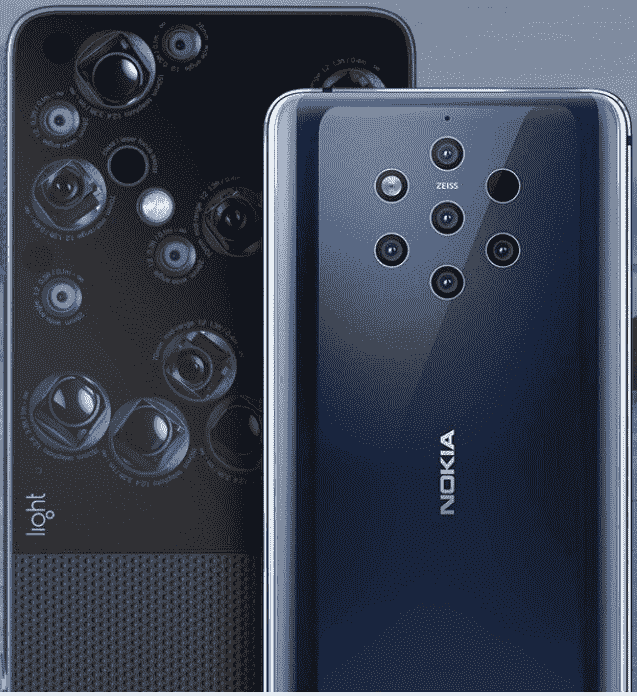

# 诺基亚 9 相机背后的公司退出智能手机市场

> 原文：<https://www.xda-developers.com/light-the-company-behind-the-nokia-9s-crazy-penta-camera-system-quits-the-smartphone-industry/>

# 诺基亚 9 的疯狂五摄像头系统背后的公司 Light 退出了智能手机行业

创造了诺基亚 9 PureView 疯狂相机技术的 Light 公司，在经历了一段不太成功的运营后，现在正退出智能手机业务。

多摄像头布局的诺基亚 9 Pureview。

如今，拥有 4 个甚至 5 个镜头的多摄像头阵列的智能手机已经变得相当普遍，但这实际上只是最近的趋势。Light 是一家相机公司，是多摄像头智能手机的创新者之一，他们的技术可以在 HMD Global 的[诺基亚 9 PureView](https://www.xda-developers.com/light-sony-agreement-multi-sensor-camera-smartphones/) 中找到。与其他五摄像头手机不同，如[小米 Note 10](https://www.xda-developers.com/xiaomi-mi-note-10-first-impressions-108mp-of-greatness/) ，每个镜头都有不同的用途，诺基亚 9 PureView 有五个 1200 万像素的镜头(三个单色镜头和两个彩色镜头)，它们协同工作，产生更好的照片。在他们进入智能手机领域之前，Light 以 Light L16 相机而闻名，该相机配备了疯狂的 16 个镜头，并被宣传为对 DSLRs 的威胁。但是现在，Light 已经向 *Android 权威人士*证实，它将退出智能手机行业。

 <picture></picture> 

Light L16 camera and Nokia 9 PureView. Credits: Light.co

我们在智能手机领域还没有看到太多 [Light 的技术](https://www.light.co/technology)。据我们所知，唯一一款采用他们技术的上市手机是诺基亚 9 PureView。虽然这款手机的五摄像头阵列在纸面上看起来不可思议，但它并没有完全实现。这款手机在 9 月份的评测中获得了 DxOMark 的[85 分，远低于目前的领先者 128 分、](https://www.dxomark.com/nokia-9-pureview-camera-review/)[华为 P40 Pro](https://forum.xda-developers.com/huawei-p40-pro) 以及其他几十款设备。诺基亚 9 PureView 的主要卖点是它的摄像头(因此手机名称中有“PureView”)，所以这就是我们开始遇到问题的地方。

Light 向 Android 权威机构的确认意味着我们很可能不会在未来的任何智能手机中看到他们的相机技术。Light 表示，他们“不再从事智能手机行业”，但我们不知道他们决定退出的确切时间。有趣的是，该公司网站的首页宣传其技术在智能手机[中的使用，直到 2019 年 7 月 31 日](https://web.archive.org/web/20190731125046/https://light.co/)，之后首页更新为宣传汽车应用。

除了 HMD Global，Light 还在 2019 年初宣布与[小米](https://www.xda-developers.com/xiaomi-partnership-light-cameras/)和[索尼](https://www.xda-developers.com/light-sony-agreement-multi-sensor-camera-smartphones/)合作。与小米的合作意味着我们将在未来看到小米智能手机采用 Light 的相机技术，而索尼的合作则意味着两家公司将努力将 Light 的技术与索尼传感器相结合。但是，我们还没有看到这些伙伴关系产生任何实际结果，今天的消息意味着我们可能永远也不会看到。

* * *

**来源:[安卓权威](https://www.androidauthority.com/light-cameras-smartphones-1128014/)**