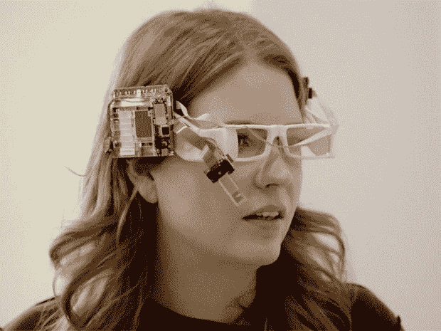

# 见见 Gcam，Pixel 相机性能的软件秘密

> 原文：<https://www.xda-developers.com/meet-gcam-the-software-secret-to-pixels-camera-performance/>

谷歌 Pixel 和谷歌 Pixel XL 作为谷歌 2016 年的旗舰产品而闻名。通过这些设备，谷歌对硬件施加了更大的控制，并创造了一种在评论家和用户中得到广泛接受的体验。我们对谷歌 Pixel XL 的评论也赞扬了谷歌的努力，并认可了谷歌确定的相机性能。

像素上的摄像头是该设备的一个较好的方面。1230 万像素后置摄像头可在各种光照条件下拍摄高水平的细节，包括弱光和室内光照条件。

俗话说，罗马不是一天建成的。相机在像素上的表现也是如此。正如 Alphabet 的 X facility 的 [*毕业生*](https://blog.x.company/meet-gcam-the-x-graduate-that-gave-us-a-whole-new-point-of-view-3ee86657d6c9) 系列中所详述的，像素的相机性能可以追溯到谷歌眼镜的开发周期。来认识一下 Gcam，这款软件已经在几款谷歌产品上为相机性能提供了动力，并取得了巨大的成功。

Gcam 始于 2011 年，是一种在谷歌眼镜中安装体面相机体验的解决方案。由于谷歌眼镜需要轻便和耐磨，因此它无法从硬件方面解决问题。因此，Gcam 的团队着眼于在软件端应用计算摄影技术来补偿，甚至增加硬件限制。

 <picture></picture> 

Early Google Glass Prototype

Gcam 的解决方案以图像融合的形式出现，这是一种快速拍摄序列并将它们融合在一起以创建单个更高质量图像的方法。图像融合于 2013 年在 Glass 中首次亮相，该方法的成功促使 Gcam 在 Nexus 5 上以 [HDR+](https://research.googleblog.com/2014/10/hdr-low-light-and-high-dynamic-range.html) 的形式将图像融合的下一次迭代带到智能手机上。

Gcam 的 HDR+模式现已成为谷歌 Pixel 和 Pixel XL 上拍摄照片的默认模式。

在未来，Gcam 的团队正在探索他们下一步可以做什么的可能性。几种可能性之一是将谷歌的机器学习资源与摄影相结合，让我们更好地利用智能手机上的硬件。

在 X 公司博客上阅读全文。

你对 Gcam 和 HDR+有什么看法？摄影的未来在哪里？请在下面的评论中告诉我们你的想法！