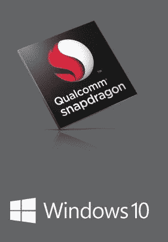

# 微软、高通和英特尔:Windows 10 ARM 大战

> 原文：<https://www.xda-developers.com/microsoft-qualcomm-and-intel-the-windows-10-arm-dustup/>

2016 年 12 月[高通和微软发布消息称，他们将做一些移动领域许多人没有预料到的事情](https://blogs.microsoft.com/firehose/2016/12/07/microsoft-announces-new-innovation-opportunities-in-mixed-reality-gaming-and-cellular-pcs/):再次尝试让 Windows 在 ARM 处理器上运行。但是这一新尝试与之前被 Windows RT 版本破坏的尝试之间的相似之处很快被搁置。

在同一份声明中，Windows 在 YouTube 上发布了一个技术演示，展示了拥有“常规”窗口的可能性。这些不是使用 ARM 指令集重新编译的程序，而是 32 位应用程序(如 Photoshop ),可以在桌面进程上运行和表现，但这一次是在骁龙上。

让我们踏上这一旅程的是英特尔上周发布的一篇[最新博客文章，吹捧其 40 年来的英特尔架构。引起大多数新闻关注的是博客条目末尾的内容(重点是我们的):](https://newsroom.intel.com/editorials/x86-approaching-40-still-going-strong/)

*“然而，有报道称，一些公司可能试图在未经英特尔授权的情况下模仿英特尔专有的 x86 ISA。仿真并不是一项新技术，Transmeta 是最后一家声称使用仿真(“代码变形”)技术生产出兼容 x86 处理器的公司。英特尔针对 Transmeta 的 x86 实现实施了与 SIMD 指令集增强相关的专利，尽管它使用了仿真。无论如何，Transmeta 在商业上并不成功，它在 10 年前退出了微处理器行业。*

只有时间才能证明模仿英特尔 x86 ISA 的新尝试是否会遭遇不同的命运。英特尔欢迎合法竞争，我们相信，近四十年来专为实施英特尔 x86 ISA 而优化的英特尔微处理器将为企业提供出色的体验、跨应用的一致性、全面的消费产品、全面的可管理性和 IT 集成。**但是，我们不欢迎非法侵犯我们的专利，我们完全希望其他公司继续尊重英特尔的知识产权。强大的知识产权保护使英特尔有可能继续投入大量资源来推进英特尔的动态 x86 ISA，英特尔将保持警惕来保护其创新和投资。**

这篇博客的时间很快[将其与几周后在台湾举行的 Computex 2017](https://news.microsoft.com/2017/05/31/microsoft-highlights-ecosystem-growth-and-innovation-at-computex-2017-with-windows-10-devices/) 期间的进一步公告联系起来。起初看起来很奇怪，英特尔等了这么久才开枪，现在大多数人认为这是对高通和微软的警告。这篇博客文章特别含糊地指出，它不能直接与高通和微软的合作关系联系起来。经过搜索，最近没有其他关于 x86 仿真的讨论证明这一回答是正确的。这进一步放大了英特尔法律团队的目标——高通和微软。这给我们留下了许多疑问。在这篇文章的研究过程中，一些问题得到了解答——我们将回顾这些问题。但是，从最初的调查到现在三方提供的信息，仍有一些问题没有得到解答。英特尔、高通和微软这三家公司都愿意回应我们的请求，我们对此表示感谢。

* * *

## Windows 10 ARM 确认

自然需要回答的第一个问题是了解这个 Windows 版本是什么，不是什么。谢天谢地，微软为我们提供了一个在 Build 2017 期间发布的视频链接，该视频为我们详细介绍了这些信息:

https://channel9.msdn.com/Events/Build/2017/P4171/player

由于在发布时只有少数几个网站报道了这一点，它似乎被许多人忽略了。这为我们提供了几个非常重要的点，其中最重要的是**这肯定是一个完整的 Windows 10 ARM** 。很明显，微软非常重视 Windows RT 面临的问题——特别是无法在该平台上运行 x86 应用程序。这种新方法提供了一种解决方案，在视频和早期的新闻稿中都被描述为通过 Windows on Windows 层的 **x86 仿真，这是引起英特尔关注的部分。但这真的是 x86 仿真吗？**让我们看看视频中为我们详细介绍这一点的幻灯片。

* * *

既然英特尔在他们的博客条目中没有提到 Transmeta，那么让我们回顾一下 2000 年的一篇关于 CPU 的文章。在回顾了这两者之后，值得注意的是，它们之间有非常真实的相似之处和不同之处。在 Transmeta 及其 Crusoe 处理器的情况下，这些处理器的工作主要是在处理器内运行一个软件层，称为[代码变形](https://courses.cs.washington.edu/courses/cse548/08wi/papers/transmeta.pdf)。这个远在应用程序甚至内核层之下的软件层将 x86 指令集翻译成 Crusoe 可以执行的硬件命令。

同样值得注意的是，Transmeta 在 x86 市场的终结可以说是*而不是*[2007 年英特尔对 Transmeta 提起的反诉讼](http://www.dailytech.com/Intel+Countersues+Transmeta+Over+Processor+Designs/article5682.htm)。Transmeta 可以说是试图起诉英特尔侵犯知识产权而挑起了反诉讼；在那之前，英特尔没有干涉他们。 **Transmeta 的退出是其董事会做出的[决定](https://arstechnica.com/uncategorized/2007/02/8779/)该公司已不再可行，而是专注于其知识产权以维持业务。**

在高通和微软的例子中，这似乎不是在机器指令层完成的。相反，这里出现的情况很像在 64 位操作系统上利用 32 位应用程序。对于 64 位操作系统上的 32 位应用程序，微软投入了时间和资源来创建一个边界，允许 32 位应用程序在 64 位操作系统中无缝运行——这被称为 [Windows on Windows 或 WOW](https://msdn.microsoft.com/en-us/library/aa384249(VS.85).aspx) 。在 ARM 的情况下，已经创建了相同的边界；主要区别在于，它使用了 ARM64 指令集和层，而不是运行适当的 x64 指令。当这些转换发生时，Windows 将在存储器和/或 RAM 上缓存其副本以备将来使用，从而减少以后类似调用的开销。

* * *

## CHPE 动态链接库的“特殊酱”

对每个可能的指令都这样做将会花费大量的开销——事实上，这是 Crusoe 在性能基准测试中遇到的问题之一。我们也在通过诸如 QEMU 这样的项目来模拟 x86 操作系统的尝试中看到了这一点。微软用他们所谓的编译混合可移植可执行(CHPE)dll 进一步解决了这个问题。要理解这些需要大量的阅读，可以从 [PE 文件格式规范白皮书](https://www.microsoft.com/en-us/download/details.aspx?id=19509)开始。当前版本包括专门针对 ARM64 的信息，将为程序员和那些希望更深入了解这些内部工作的人提供一个良好的起点。简而言之，许多帮助 Windows 操作的关键 API 调用已经针对 ARM64 进行了预编译，因此它们可以以几乎完全的本机性能运行，而不必翻译它们。

看到微软在这方面所做的工作，与高通和他们的 Snapdragon 835 合作——很明显，微软决心纠正许多人对 Windows RT 的错误看法，并表明他们最终可以以一种适合大多数消费者的方式带来 Windows 10 ARM。从一个角度来看，这是完全有道理的——绝对需要以最少的电池使用获得最大的性能。虽然英特尔在这一领域取得了长足的进步，但 ARM(尤其是高通)在平衡移动性能和移动需求方面树立了标杆。高通可以提供一个完整的板封装，允许无线电，显示器，处理器，图形和仍然设法做到这一点，同时提供令人印象深刻的电池寿命。

高通没有的一件事是通过 Thunderbolt 添加处理支持。具有讽刺意味的是，英特尔自己帮助发展和传播技术的尝试很可能最终被用来与它竞争。基于 ARM 的移动设备，如平板电脑，能够通过坞站完全连接和利用额外资源，这无疑不仅会增加这一特定细分市场的竞争，还会增加个人计算市场的其他部分的竞争。

* * *

## 高通、微软和英特尔做出回应

微软和高通在这一成功中有既得利益——并且确信个人电脑是一个竞争已经成熟的市场的一部分。当我们联系高通请其置评时，高通发言人回应如下:

*“鉴于我们最近与华硕、惠普和联想发布的公告，我们发现我们的一个竞争对手在 6 月 8 日发布的博客非常有趣。我们期待着今年晚些时候推出由高通骁龙 835 移动 PC 平台支持的始终连接的 Windows 10 PC。正如与微软联合在 Computex 2017 上展示的那样，Snapdragon 835 移动 PC 平台带来了真正的始终连接的 PC 体验，支持高达千兆位的 LTE 连接和全天电池续航时间，支持时尚、轻薄和无风扇设计。这将改变个人计算的未来。”*

以类似的方式，除了上面的视频链接，微软发言人还发表了一份声明:

*“有些用户需要一直连接到云，利用最新的网络技术，如千兆位 LTE 和 eSIM。微软正与其生态系统就一个共同的愿景进行合作，该愿景始于与英特尔和高通以及移动运营商合作伙伴在芯片层的紧密合作，以提供无缝的 eSim 连接。包括华硕、惠普、华为、联想、VAIO 和小米在内的微软设备合作伙伴致力于使用 eSim 技术的这一新类别的始终连接电脑。*

*此外，华硕、惠普和联想将推出基于高通骁龙 835 芯片组的始终连接设备。这些新设备将采用 Windows 10，具有始终在线的 LTE 连接和出色的电池续航时间。"*

英特尔的回应与其博客条目一样谨慎。来自英特尔发言人:

"*英特尔尊重知识产权，我们希望其他公司也能这样做。x86 技术是我们的专有技术，也是我们业务的核心，我们随时担心其他人可能会不恰当地抄袭它。我们将彻底评估任何声称模仿 x86 技术的产品，如果我们认为这些产品侵犯了我们的知识产权，我们将坚决执行。”*

## 分析和结论

这是一个非常好的舞蹈，这三个人似乎在表演。与此同时，考虑到早在去年 11 月就有传言传出——在 WinHEC 上宣布的几周前——英特尔在 Computex 之前没有意识到这一点似乎很奇怪，不管他们是否会公开承认。与此同时，历史(如 Transmeta Crusoe 和 WoW64)表明，从法律角度来看，没有多少挑战它的机会。但是一旦任何人放弃“x86 仿真”这个词，比如微软和高通在 Computex 之前一直在做的事情，足够多的担忧声音和股东要求英特尔对此做出回应只是时间问题。

它会改变微软和高通正在进行的项目吗？我联系了 Moor Insights & Strategy 的助理分析师 Anshel Sag，征求他对此的看法。(*撰稿人注:作为一名行业分析师，Sag 先生在联系英特尔、微软和高通的相关人员以获得及时回应方面也发挥了重要作用。)*他的回应:

从我看到的高通的反应来看，他们似乎一点也不担心英特尔的评论。自然，微软没有说什么，因为他们与英特尔的密切关系，我认为这有点紧张。我相信竞争对市场总是有好处的，我相信微软也相信这一点。”

Windows 10 ARM 的成功推出给英特尔带来了风险，因为它在其他业务领域面临着越来越激烈的竞争。正如我们在 Computex 上报道的那样，AMD 即将推出基于 Zen 架构的 Epyc 服务器处理器。它的消费者阵容，锐龙，也将通过扩展到高端发烧友台式机和移动市场来继续竞争。ARM64 的竞争，如高通，肯定会挑战其嵌入式，凌动和核心 M 部分。

在他们强调“始终连接”设备的同时，我们看到微软强调了其进一步混合现实和增强现实设备的努力，如他们自己的 HoloLens。我不相信微软或 ARM 半导体制造商(如微软)会就此止步。例如，英伟达现在在无人驾驶汽车计划和任天堂为 Switch 提供动力的交易之间的 Tegra 投资组合中表现相当不错。尽管对英伟达的调查没有表明任何迹象，但我也不会对英伟达考虑重返感到惊讶。它可以轻松地提供基于 Tegra X1 或 X2 的设备——它当然可以提供图形能力来驱动头戴式显示器。

问萨格先生这个话题表明我们并不孤单:

“我绝对相信，这将超越 Computex 上发布的“始终连接”电脑。我们已经看到微软装有 Windows 10 的智能手机采用了 ARM，我认为这是个人电脑发展的基础。我还相信，随着应用和生态系统的增长，我们可以看到采用 ARM 处理器的 AR/MR/VR 耳机运行 Windows，我相信这是微软主导 AR/MR/VR 市场的长期战略的一部分。我不认为 Hololens 将成为 Windows 混合现实的唯一独立耳机，我相信我们会看到内置 ARM 的耳机。”

虽然我已经说过一次又一次了，但 2017 年很快成为个人电脑市场竞争加剧的一年。考虑到在这些细分市场中几乎没有 it，不幸的是，由于英特尔过去的成功，它将首当其冲。**但是，英特尔的损失很可能是其他人的收益，最重要的是消费者的收益。这总是一件好事。**

* * *

**你对 ARM 处理器上的 Windows 有什么看法？这将如何改变台式机、笔记本电脑和移动生态系统？下面报数！**

美国东部时间 2017 年 6 月 16 日下午 10:51 更新:一些语法编辑和一家公司的名字被修改(在评论中被叫出来。)谢谢提醒！