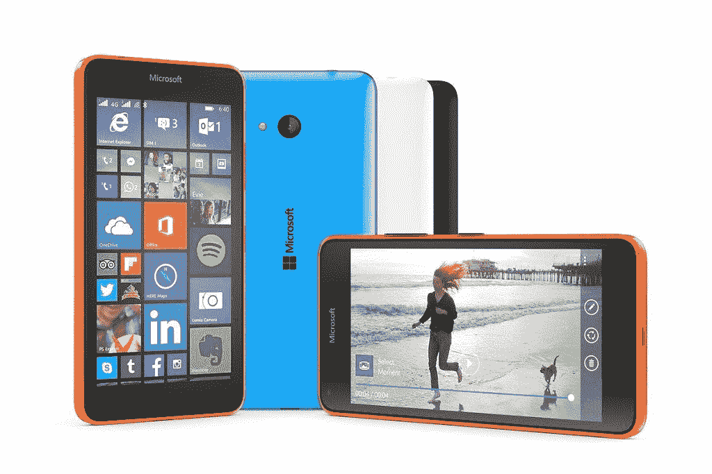

# 微软发布 Lumia 640 和 Lumia 640 XL

> 原文：<https://www.xda-developers.com/microsoft-unveils-the-lumia-640-and-lumia-640-xl/>

在所有因发布 HTC One M9 T1、T2 三星 Galaxy S6 T3 和 T4 索尼 Xperia Z4 平板 T5 而引起的安卓狂潮中，微软发布了 Lumia 640 和 640 XL 这两款中端产品，尽管不是旗舰产品，但也增加了自己的产品。

这两款设备以“Windows 10 就绪”为卖点，都是开箱即用的 Windows Phone 8.1。在引擎盖下，他们摇滚高通的骁龙 400 芯片组与 1.2 GHz 四核 CPU 和 Adreno 305 处理 GPU 部门。这两款设备还配备了 1 GB RAM、8 GB 板载存储以及高达 128 GB 的 micro sd 扩展。

这两款设备的不同之处在于屏幕、摄像头和电池规格。两者中较小的一个，Lumia 640 配备了 5 英寸 IPS LCD 显示屏，像素密度为 294 ppi，而 Lumia 640 XL 配备了 5.7 英寸 259 ppi IPS LCD 显示屏，从而将其归入平板电脑类别。640 配有 2500 毫安时的电池，而 640 XL 配有容量更高的 3000 毫安时电池

640 有一个带 LED 闪光灯的 8 MP 后置摄像头和一个 1 MP 广角前置摄像头，而 640 XL 的后置摄像头和前置摄像头分别达到了 13 MP 和 5 MP。

除了硬件，微软还提供一系列优质软件产品，包括 1TB one drive 存储、每月 60 分钟的免费 Skype 无限制全球通话，以及一年的 Office 365 手机、一台 PC 和一台平板电脑订阅服务。微软还为这两款设备添加了“Lumia Glance”功能，允许用户在显示屏超时的情况下查看时间和通知，这听起来类似于摩托罗拉对主动显示的实现。

Lumia 640 的 3G 版价格为€140 英镑，LTE 版价格为€160 英镑，将于 4 月推出单卡和双卡版本。640 XL 平板手机将适用于 3G 版本的€190 和 LTE 版本的€220。这两款设备在发布时都将有不同的颜色选择。

你对微软的最新技术有什么看法？你觉得它能在竞争激烈的中端市场留下印记，在与安卓对手的竞争中站稳脚跟吗？请在下面的评论中告诉我们！