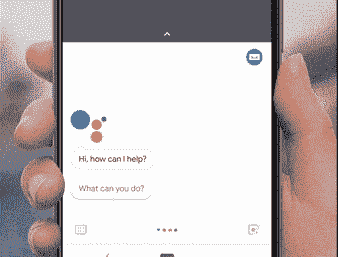

# 最新的 MIUI 相机应用程序提示谷歌镜头建议和全景自拍

> 原文：<https://www.xda-developers.com/miui-camera-google-lens-suggestions-panoramic-selfies/>

小米最近推出了小米 9，这是他们最新的旗舰智能手机，也是首款搭载高通骁龙 855 的智能手机。在[我们的评论](https://www.xda-developers.com/xiaomi-mi-9-review/)中，我们注意到小米如何通过 Mi 9 为 MIUI 添加了多种功能，如全系统[黑暗模式](https://www.xda-developers.com/xiaomi-miui-10-global-beta-dark-theme/)和游戏涡轮，而 MIUI 相机应用程序获得了团体自拍和倾斜移动等功能。现在，似乎小米正准备在 MIUI 相机应用程序中添加新功能:谷歌镜头建议和全景自拍。我们预计这些功能将首先在小米 9 上推出，尽管我们没有任何关于哪些设备将获得这些功能的确认。

APK 拆卸通常可以预测应用程序未来更新中可能出现的功能，但我们在这里提到的任何功能都可能不会出现在未来的版本中。这是因为这些功能目前在 live build 中没有实现，可能会在未来的 build 中随时被小米拉出来。

## 谷歌镜头对部分小米设备的建议

Google Lens 使用智能手机的摄像头来检测物体，并提供关于你所看到的东西的有用信息，本质上是将你所看到的东西转化为谷歌搜索的查询。我发现谷歌眼镜对翻译文本和扫描条形码最有用。这是谷歌的一个视频，展示了谷歌镜头的一些功能:

在大多数智能手机上，通过点击启动器、谷歌助手、谷歌照片或相机应用程序中的快捷方式来访问谷歌镜头。在[谷歌 Pixel 3](https://www.xda-developers.com/google-pixel-3-google-pixel-3-xl-specs-features-pricing-availability/) 和 [LG G8 ThinQ](https://www.xda-developers.com/google-assistant-digital-wellbeing-google-lens-mwc/) 上，谷歌镜头通过相机取景器实时工作。这意味着你可以将手机指向一张名片，谷歌镜头将自动检测电子邮件地址，即使你没有启动镜头。

## 

*展示谷歌镜头建议的视频。来源:谷歌 Pixel 3 上的谷歌 Pixel Tips 应用。*

现在，似乎一个或多个小米设备将获得对谷歌镜头建议的支持。最新的 MIUI 相机应用程序为一个名为“镜头建议”的新设置添加了字符串，描述称镜头将能够“自动识别二维码、电子邮件、数字等”。

```
 <string name="pref_google_lens_title">Lens Suggestions</string>
<string name="pref_google_lens_summary">Auto identify QR codes,Emails,numbers and more</string>
<string name="pref_google_lens_default">true</string>
<string name="pref_camera_long_press_viewfinder_title">Viewfinder Settings</string>
<string name="pref_camera_long_pressing_viewfinder_entry_google_lens">Google Lens</string>
<string name="pref_camera_long_press_viewfinder_google_lens">Google Lens</string>
<string name="pref_camera_long_press_viewfinder_default">@string/pref_camera_long_press_viewfinder_google_lens</string> 
```

我们确认了这个功能目前在亚当的小米米 9 上是没有的。目前，在 MIUI 相机应用程序中访问 Lens 的唯一方法是通过专用快捷方式访问[。由于骁龙 855 设备 LG G8 ThinQ 是第一款支持谷歌镜头建议的非像素智能手机，我们认为只有小米的骁龙 855 设备小米 Mi 9 和](https://www.xda-developers.com/google-lens-poco-f1-redmi-y2/) [5G 小米 Mi Mix 3](https://www.xda-developers.com/xiaomi-mi-mix-3-5g-qualcomm-snapdragon-855/) 将支持该功能。如果小米将该功能添加到他们的任何其他智能手机上，我们会感到惊讶。

## 全景自拍

全景自拍，简称 panoselfie，是通过前置摄像头拍摄的全景照片。这是一个古老的概念，但对小米设备来说是新的功能。我们只是不知道哪些人会得到它。以下是 MIUI 相机应用程序的新字符串，显示小米正在以“宽自拍”的名义添加该功能，但从功能描述中可以清楚地看出，这是一种全景自拍。

```
 <string name="wideselfie_press_shoot_key_to_start">Tap the shutter button</string>
<string name="wideselfie_result_image_lossless">"Couldn't save panorama"</string>
<string name="wideselfie_rotate_slowly">Rotate the phone sideways slowly</string>
<string name="wideselfie_rotate_to_back">Tilt the phone backward</string>
<string name="wideselfie_rotate_to_front">Tilt the phone forward</string>
<string name="wideselfie_rotate_to_left_slowly">Rotate the phone to the left slowly</string>
<string name="wideselfie_rotate_to_right_slowly">Rotate the phone to the right slowly</string> 
```

与谷歌镜头建议不同，我们预计，一旦该功能上线，全景自拍将广泛用于小米设备。该功能没有在运行最新 MIUI 全球稳定版的 Adam 小米 9 上直播，也没有在运行最新 MIUI 中国开发者 ROM 的小米 8 SE 或小米 6 上提供。

* * *

这就是我们在最新的 MIUI 相机应用程序中发现的所有内容。如果我们了解到任何其他新功能，我们会让你们都知道。

*感谢 PNF 软件为我们提供了使用许可 [JEB Decompiler](https://www.pnfsoftware.com/?aid=xdadev) ，这是一款针对 Android 应用的专业级逆向工程工具。*