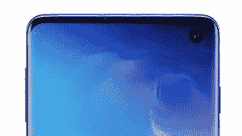
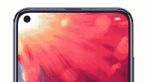
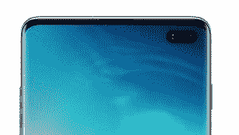
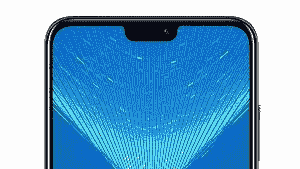
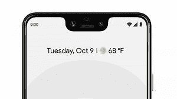
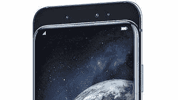
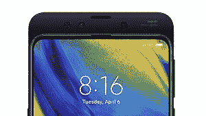
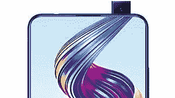

# 切口 vs .打孔 vs .滑块 Android 的未来是什么？

> 原文：<https://www.xda-developers.com/notch-vs-hole-punch-vs-slider-whats-the-future-for-android/>

这款最新一代 Android 智能手机推动了智能手机档次的发展。许多手机已经转向水滴凹槽，其他手机则实现了打孔凹槽，还有一些手机推出了机械滑盖或某种弹出式摄像头。让我们来看看现在可用的所有不同风格的槽口，并讨论最佳的前进方向。

## 打孔缺口

如果你回忆起你在学校的日子，你会记得你必须准备许多文件来放进你的活页夹。要做到这一点，需要使用打孔机，在纸的侧面打三个孔。纸的顶角上的洞非常类似于在打孔样式的凹槽中放置自拍相机的洞。这就是“打孔切口”这个名字的由来。

将自拍相机移动到显示屏上一个切口的孔中的目的是在将屏幕推到手机的绝对边缘的同时，保持显示屏在四个角上。这是 2019 年新旗舰手机中出现的最常见的刻痕形式之一。

 <picture></picture> 

Samsung Galaxy S10 Hole Punch Notch

 <picture></picture> 

Honor View20 Hole Punch Notch

 <picture></picture> 

Samsung Galaxy S10+ Hole Punch Notch

打孔凹口可以小到足以将它放在状态栏中，而不会有任何真正的侵入。虽然在屏幕上切一个洞会导致显示器不耐用，但 Honor View20 通过使用 18 层设计保持了显示器的结构和强度。你可以在这里阅读更多关于 Honor View20 打孔相机的技术。

## 经典刻痕

经典的 notch 最早出现在 Essential 手机上，很快被其他厂商采用。这种类型的凹槽通常会放置自拍相机、顶部扬声器、传感器，可能还会有一个额外的相机。起初，这种风格的缺口被严重嘲笑为一个荒谬的想法。Pixel 3 XL 受到了最多的抨击，因为它是我们见过的最丑陋、最令人讨厌的手机之一。虽然这是 notch 的最早设计，但它仍然出现在今天推出的许多手机中，如 LG V50 ThinQ。

槽口的下一种样式已经有了一点发展，因为它经常以水滴的形式出现。这是一个类似的概念，但更小，更少侵扰。一些最受欢迎的水滴手机是一加 6T，Realme 2 Pro，小米 Mi 9，以及一些三星 Galaxy A 和 M 系列设备。

 <picture></picture> 

OnePlus 6T Water Drop Notch

 <picture></picture> 

Honor 8X Classic Notch

 <picture></picture> 

Google Pixel 3 XL Classic Notch

经典/水滴凹槽是一种简单的方法，可以为您提供更多的屏幕空间，同时保持显示器的结构完整性。这是有代价的，凹口是侵入性的，并且经常导致难看的设计。这种过时的设计是你在当前 Android 手机中最常见的 notch 风格。

## 滑块“槽口”

滑块“凹口”可以是机械的或电动的功能。这意味着一些手机会让你滑出相机，而一些手机会使用电机为你滑出隐藏的“凹口”。

根据这种凹口的设计方式，它可以是一个小的弹出式摄像头，或者你可以看到手机的整个背面向上滑动，露出传感器。

 <picture></picture> 

Honor Magic 2 Slider Notch

 <picture></picture> 

Xiaomi Mi Mix 3 Slider Notch

 <picture></picture> 

Vivo V15 Pro Popup Notch

滑块凹口的好处是完全隐藏摄像头，并提供显示器的完整视图。没有我们在其他凹口样式中看到的切口或障碍物。滑块和弹出设计确实会给你的手机带来额外移动部件的问题，但这不一定会有任何明显的负面影响。这种类型的设计是有道理的，但这是 notch 制造商未来应该采用的类型吗？

有了这三种不同的槽口选择，你认为哪种款式最适合未来的安卓手机？请在评论中告诉我们你对这个问题的看法。