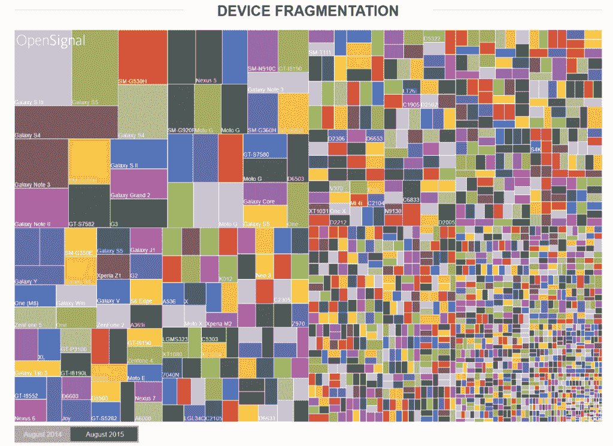

# 有近 16，000 台 Google Play 认证的 Android 设备

> 原文：<https://www.xda-developers.com/number-of-google-play-certified-android-devices/>

Android 操作系统经常被比作微软的 Windows，因为它无处不在。虽然 Windows 继续在桌面上占据主导地位，但 Android 多年来一直在智能手机上占据主导地位。在 2017 年谷歌 I/O 大会上，谷歌[宣布](https://www.xda-developers.com/google-io-summary-101-announcements/)超过 20 亿*的*设备安装了安卓系统。这是一个令人震惊的数字，也证明了谷歌的 Android 商业模式是多么成功。我们大多数人都熟悉三星、华为、小米、LG、索尼、Oppo、一加、摩托罗拉等大品牌的 Android 设备，但实际上还有很多你从未听说过的制造商的设备。有多少？Google Play 认证的设备有 16000 多一点，即使这个数字也可能远远低于 Android 设备的真实数量！

顺便说一下，这个数字是截至 2018 年 4 月 17 日的当前值。我怎么知道？我在 Google Play 开发者控制台的设备目录页面上查找了 XDA 的单手模式应用程序。该网页允许开发人员选择他们不想安装应用程序的 Android 设备，主要是出于兼容性原因。

如果你想知道这个列表中有哪些设备，谷歌提供了一个[Google Play 认证设备的公开列表。它将所有经过 Google Play 认证的设备(也称为经过 Google 移动服务(GMS)认证或经过认证的 Android)进行了分类，因此您可以轻松查看您的设备是否符合 Google Android 兼容性测试套件(CTS)的要求。这个列表很庞大，是判断你购买的设备是否会提供与其他设备多少一致的 Android 体验的好方法(尽管](https://www.xda-developers.com/check-phone-tablet-certified-android-before-buying/)[并不总是保证](https://www.xda-developers.com/the-sorry-state-of-android-fragmentation/))。

由于这份 Google Play 认证设备的列表只包含那些由 OEM 厂商制造的已注册 GMS 并向谷歌支付费用的设备，因此它显然没有列出现有的每一台 Android 设备。事实上，它很可能严重低估了现有的 Android 设备数量！根据 *Open Signal* 的一份报告显示，2015 年有**24000 台 Android 设备。**

 <picture></picture> 

Android Device Fragmentation as of August 2015\. Source: [OpenSignal](https://opensignal.com/reports/2015/08/android-fragmentation/).

虽然我们没有任何关于独立 Android 设备数量的最新数据，但这个数字很可能比 2015 年大得多。请记住，在 OpenSignal 发布这个数字的时候，三星 Galaxy Note 5 刚刚发布。此后，三星发布了[三星 Galaxy S7](https://forum.xda-developers.com/galaxy-s7) 、[三星 Galaxy S7 edge](https://forum.xda-developers.com/s7-edge) 、[三星 Galaxy Note 7](https://forum.xda-developers.com/note-7) 被[三星 Galaxy Note FE](https://forum.xda-developers.com/note-fe) 、[三星 Galaxy S8](https://forum.xda-developers.com/galaxy-s8) 、[三星 Galaxy S8+](https://forum.xda-developers.com/galaxy-s8+) 、[三星 Galaxy Note 8](https://forum.xda-developers.com/galaxy-note-8) 、[三星 Galaxy S9](https://forum.xda-developers.com/galaxy-s9) 和[三星 Galaxy S9+](https://forum.xda-developers.com/galaxy-s9-plus) 而这还只是列出了他们的旗舰阵容！

老实说，如果 Android 设备的数量自 2015 年以来翻了一番，我不会感到惊讶，特别是考虑到中国制造商每月都在推出多少新设备。随着 Android 在印度等市场的持续增长，原始设备制造商有足够的动力继续生产大量廉价的 Android 设备，进一步扩大设备总数。竞争越多，越开心！