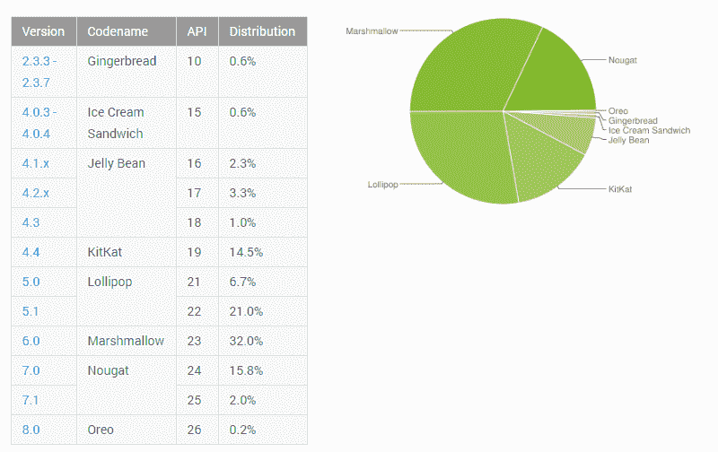

# Android 牛轧糖的官方 Xposed 框架在这里-现在下载你喜欢的模块！

> 原文：<https://www.xda-developers.com/official-xposed-framework-android-nougat/>

随着 Android 生态系统多年来的成熟，越来越少的用户找到了他们应该让自己的设备扎根的理由。越来越多的用户选择继续使用现有的固件，要么是因为他们觉得体验令人满意，要么是不想与谷歌的 SafetyNet API 玩[猫捉老鼠的游戏。但是如果你在 2016 年初问一个用户为什么给他们的手机安装 rooted，可能给出的第一个原因是他们可以](https://www.xda-developers.com/magisk-developer-assures-next-magisk-beta-will-pass-safetynet-again/)[安装 Xposed 框架](https://www.xda-developers.com/this-is-why-we-still-root/)。距离 Android 7.0 牛轧糖首次发布已经[一年多了，但漫长的等待终于结束:**Android 牛轧糖官方 Xposed 框架终于面世。**](https://www.xda-developers.com/android-7-0-nougat-finally-released-coming-your-way/)

在过去的一年里，Xposed 框架的主要开发者 XDA 资深公认开发者 [rovo89](https://forum.xda-developers.com/member.php?u=4419114) 已经向[提供了几次](https://www.xda-developers.com/rovo89-updates-on-current-status-of-xposed-for-android-nougat/) [关于 Android 牛轧糖 Xposed 框架进展的更新](https://www.xda-developers.com/xposed-android-nougat-support/)。对于一些人来说，[等待是可以忍受的](https://www.xda-developers.com/home-is-where-xposed-is-the-modules-that-keep-my-oneplus-3-on-marshmallow/)，主要是因为 Xposed 框架在 [Android Marshmallow](https://www.xda-developers.com/xposed-for-marshmallow-is-here/) 中提供了大量的附加功能。但是其他许多人已经过上了不用手机的生活。

当开发者 abforce 为 AOSP 7.1.2 发布了一个[艺术子模块时，我们看到了项目中重新出现的兴奋，但是正如我们自己的 GermainZ 指出的](https://www.xda-developers.com/art-submodule-for-aosp-7-1-2-adds-xposed-functionality-to-custom-roms/)[你最好等待官方的 Xposed 框架](https://www.xda-developers.com/xposed-nougat-abforce-explained/)发布，因为 abforce 的实现需要框架被集成到定制的 rom 中。此外，这种非官方的实现是不完整的，导致某些暴露的模块出现不一致或错误的行为。

虽然 abforce 在让他的非官方 Xposed 在 Android 7.1 牛轧糖上工作方面做得很好，但他的实现违背了 rovo89 对 Xposed 的愿景——它应该是一个稳定的解决方案，为用户和开发者提供可靠且易于使用的合同。我们这样说的意思是，不仅模块应该对用户来说没有问题，而且模块的设置方式应该在用户之间保持一致，这样开发人员就可以知道暴露的模块是否应该对应用程序崩溃负责。

我们不再需要担心这样的问题，因为 rovo89(在 XDA 公认的开发者 [wanam](https://forum.xda-developers.com/member.php?u=3562083) 的帮助下)现在已经准备好发布 Xposed 框架和安装程序的官方更新——带来**与 Android 7.0/7.1 牛轧糖**的兼容性。这意味着你不必安装定制的 ROM 或不得不摆弄闪烁的不稳定版本来享受 Xposed——只需启动你的手机并安装最新的 Xposed 安装程序应用程序(链接如下), **Xposed 安装程序将为你安装 x posed 的魔法**。

*暴露的安装程序浏览模块库*

在一些人看来，这可能有点晚，特别是因为这个版本是在 Android 8.0 Oreo 发布一个多月后[发布的。请记住，在未来几个月内，很少有设备能够获得 Android Oreo 的稳定版本。根据谷歌的最新统计，安卓奥利奥只在](https://www.xda-developers.com/android-8-0-oreo-google-released/) [*上*占所有安卓设备的 0.2%**](https://www.xda-developers.com/android-oreo-october-version-distribution/)(相比之下，在牛轧糖上约占 18%)，但我们的许多用户都是那种喜欢安装定制 rom 以保持领先地位的人。

 <picture></picture> 

Android Version Distribution as of October 2017\. Source: [Google](https://developer.android.com/about/dashboards/index.html)

虽然即使你在我们论坛上的无数设备上安装了一个 Android 8.0 的非官方端口，但这些端口中的许多都不是日常驱动程序状态。因此，除非你愿意花数百美元购买一个全新的[谷歌 Pixel 2/2 XL、](https://www.xda-developers.com/google-pixel-2-xl-announced-price/) [索尼 Xperia XZ1/XZ1 Compact](https://www.xda-developers.com/xperia-xz1-compact-ifa-2017-released/) ，或者一个即将推出的设备，如[华为 Mate 10](https://www.xda-developers.com/huawei-mate-10-alps-blanc-leaked/) ，否则你可能只能在 Android Nougat 上挤出几个月的使用时间。

如果这听起来像你，那么前往官方论坛线程的 Xposed 安装程序和框架拉链，让它在你的 Android 牛轧糖设备上运行。

[**下载 Xposed 安装程序 v3.1.2(附件)**](https://forum.xda-developers.com/showthread.php?t=3034811)

[**Xposed 牛轧糖 7.0 安装程序(SDK24)下载**](http://dl-xda.xposed.info/framework/sdk24/)

[**Xposed 牛轧糖 7.1 安装程序(SDK25)下载**](http://dl-xda.xposed.info/framework/sdk25/)

对于许多不熟悉 Xposed 框架的用途或工作原理的新用户来说，我们将在下面简要解释 Xposed 框架，为什么您应该感到兴奋，以及为什么这方面的开发花费了这么长时间。

* * *

## 为什么要安装 Xposed 框架？

想要在不刷新自定义 ROM 的情况下获得自定义 ROM 功能？所有用于调整你的 ROM 的暴露模块之母，被称为 [GravityBox](https://forum.xda-developers.com/xposed/modules/app-gravitybox-v6-0-0-tweak-box-android-t3251148) ，已经覆盖了你。想要自定义每个应用程序的显示设置吗？试试 [App 设置](https://forum.xda-developers.com/xposed/modules/mod-app-settings-v1-9-2014-05-14-t2437377)。如何定制某些应用程序，如 [Hangouts？](https://forum.xda-developers.com/xposed/modules/xhangouts-mms-fixes-google-hangouts-t2888102)或者修改 Instagram 以便[下载你喜欢的任何帖子](https://forum.xda-developers.com/xposed/modules/mod-xinsta-download-images-videos-t3077110)？

Xposed 让开发人员能够**修改几乎任何他们想要的东西**——主要针对单个应用程序，但甚至系统范围的特性也可以修改。我们列举的例子只是冰山一角。你可以添加的额外功能或修改的应用程序的数量令人难以置信——只需搜索[官方公开的模块库](http://repo.xposed.info/module-overview)就能自己看到。请记住，一些模块可能需要更新这个新版本和牛轧糖的支持，所以一定要检查之前，安装在你的牛轧糖光盘！

## Xposed 模块是如何工作的？

其要点是 Xposed 框架允许模块**“挂钩”到任何应用程序**的 Java 方法中——无论是用户安装的还是系统应用程序。Xposed 让模块在目标应用程序的原始方法之前、期间或代替原始方法执行它们自己的方法**。**

例如，想象一下 Gmail 应用程序中发布新邮件通知的方法。默认情况下，该方法会创建一个新的通知，其中包含用于存档/删除或回复电子邮件的按钮。可以让一个暴露的模块挂钩到这个方法中，并添加一个新按钮，比如“标记为已读”(是的，已经有一个[模块专门用于那个](http://repo.xposed.info/module/com.taptigo.xposed.xnotifications)。)

以上是对 Xposed 框架允许其模块做的事情的最终结果的过度简化。这个框架本身非常复杂，而且让它几乎可以在根设备上通用——不需要定制的 ROM——这就是为什么 Xposed for Android Nougat 花了这么长时间才完成。

## 为什么 Xposed 开发需要这么长时间？

Xposed 背后的魔力——允许模块挂钩到其他应用程序的方法——需要深入了解 Zygote 和 [Android 运行时](https://source.android.com/devices/tech/dalvik/) (ART)如何工作。这些要求已经排除了大量人员对项目的贡献，但是这个问题由于 **rovo89 在过去 5 年**一直是 x 曝光的主要贡献者而加剧。

这就是为什么自从 Xposed 最后一次公开发布以来，他对 Xposed 所做的修改被拒绝的原因。这是他的创意，他最擅长理解和修改它，所以在这么晚的阶段增加更多的人力只会进一步推迟项目。

另外，如果 rovo89 不断更新他的源代码，[他担心](https://github.com/rovo89/Xposed/issues/225#issuecomment-314017010)有人会拿着未完成的代码构建一个半功能的 Xposed 框架，而没有通用的 Xposed 安装程序与之配套。(这种事情无论如何都会在 abforce 实现中发生，由此产生的各种安装方法的混乱证明了 rovo89 的犹豫。)

因此，我们能做的最好的事情就是给 rovo89 时间去做他最喜欢的项目。Xposed 并不是他的全职，甚至也不是兼职。这只是一个爱好，一个他为了社区的利益已经做了 5 年的爱好。像 Xposed 这样复杂的项目需要时间来工作，然后进行测试——由于他的其他任务，他并不经常有这样的时间。正如 rovo89 在他关于这个问题的一些公开更新中所记录的，在 Xposed 框架本身和 Xposed 安装程序最终准备好发布之前，进展*在过去的一年中取得了*。

## rovo89 做了什么让自己在牛轧糖工作被曝光？

Android 的新版本有时会改变艺术作品的方式，这可能需要对 Xposed 的部分进行返工。例如，Android 7.0 Nougat 为 ART 引入了一个即时编译器，以帮助提高应用程序的运行时性能。但是 abforce 的非官方 Xposed 框架简单地禁用了许多 ART 优化，以便方法挂钩可以正确工作。

 <picture></picture> 

ART Optimizations in Android Nougat. Source: [Google](https://youtu.be/fwMM6g7wpQ8?t=619)

相比之下，rovo89 的实现**保留了 Android Nougat** 中的所有 ART 优化，通过使用 JIT 重新编译方法调用程序，并且仍然保留方法挂钩。这意味着您可以通过强制禁用 ART 优化来享受 Xposed 模块的好处，而不会牺牲性能。

关于 rovo89 最终在 Xposed for Android Nougat 中实现可靠挂钩方法的更多细节，我们建议您阅读他提供给我们的以下声明。

### rovo89 的完整声明

> #### Xposed 的核心显然是它挂钩 Java 方法的能力，即让模块在这些方法之前、之后或代替这些方法执行代码。几乎所有其他功能都基于此，因此它总是按预期工作是至关重要的。自从我五年前发明 Xposed 以来，总的概念一直是一样的，它需要改变方法的入口点。当执行过程中没有检查入口点时，这就开始失败——art 中的一些优化实际上就是这种情况。
> 
> #### 一个例子是当入口点在编译时已知时，调用者可以直接跳转到这个地址，而不用查找它。另一个例子是内联。考虑这个例子:
> 
> #### ART 很聪明，注意到 twice()方法非常简单，因此将逻辑嵌入到 doSomething()方法中，如下所示:
> 
> #### 您仍然可以挂接 twice()方法，但是在运行时不会再从 doSomething()调用它，您的回调也不会。艺术甚至更聪明:它意识到魔法总是 42，因此这个条件永远不会被满足。所以整个 doSomething()方法实际上是一个空操作:
> 
> #### 在以前的版本中，Xposed 用于完全禁用这些优化，并强制重新编译所有内容。这也带来了一些负面影响。首先，美术开发人员在通过他们的优化最大化性能方面做得非常出色，禁用他们一定程度上会导致性能下降(尽管我从未测量过有多少)。然后，重新编译本身并不容易，让我很头疼，尤其是在开始的时候。最后，除了/system 上的预编译文件之外，重新编译的文件也会占用空间。
> 
> #### Nougat 的非官方版本也禁用了这些优化，但它们不强制重新编译(因为端口最初是集成到 ROM 中的)。因此，钩子有时可能不会被执行。
> 
> #### 有了正式版，你可以保留优化的代码，并且仍然有可靠的钩子。这是怎么回事？Xposed 记录了所有的通话。这在编译 apk 时发生，或者在预优化代码的单独过程中发生。这些额外的数据不会占用太多空间，但是它允许 Xposed 找出某个方法可能被内联的位置。因此，当一个方法被挂钩时，它的所有调用者都将被去优化，也就是说，他们的代码将不再被使用。这确保了钩子回调肯定会被调用。如果调用者被大量使用，它将简单地用 JIT 重新编译，这一次知道方法被钩住，因此一些优化不适用。这意味着挂钩方法的影响被降低到最低限度。耶！
> 
> #### 现在开始尝试吧。确保使用 Xposed Installer 3.1.2，因为必须更改配置路径以支持基于文件的加密。

## 结论

我们希望你和我们一样对 Android 7 的 Xposed 的发布感到兴奋。x 牛轧糖。等待是漫长的，但考虑到暴露的复杂性，这是不可避免的。如果您仍然不清楚 Xposed 是什么或者它是如何工作的，不要担心。很少有人(包括我们)真正理解它是如何工作的。像 rovo89 这样的开发人员尽他们最大的努力包装他们的工作，所以你真的不需要理解在引擎盖下发生了什么。

你喜欢 Xposed 框架吗？考虑捐赠给 rovo89，因为他做了很棒的工作。如果你认为你有能力为这个项目做出贡献，请查看下面 rovo89 的 GitHub 页面。

[**捐到 rovo89**](http://repo.xposed.info/donate)

[**促成曝光**](https://github.com/rovo89)

寻找暴露的模块？查看我们的 Xposed 框架模块子论坛，或者下载 XDA 实验室应用程序并浏览我们的 Xposed 模块集合。

[**曝光模块论坛**](https://forum.xda-developers.com/xposed/modules)

[**下载 XDA 实验室**](https://www.xda-developers.com/xda-labs/)

## 安卓奥利奥进展

如果你想知道，下面是 Android Oreo 的进展情况:

> #### 我已经开始了 Android 8.0 的工作。有几个[新的语言特性](https://developer.android.com/reference/java/lang/invoke/MethodHandle.html)我必须看看，但是总的概念应该仍然有效。这包括当一个方法被钩住时，使任何调用者的编译代码无效的所有工作，这是我在 Nougat 上工作时花费最多的时间。所以我真的很有信心这次会快很多。 [Android 8.1](https://android.googlesource.com/platform/bionic/+/a0c7ec8080a7718c5711d9de405e039258d433bf%5E%21/#F0) 应该不会有太大的不同，所以我预计不会有太多的额外工作。