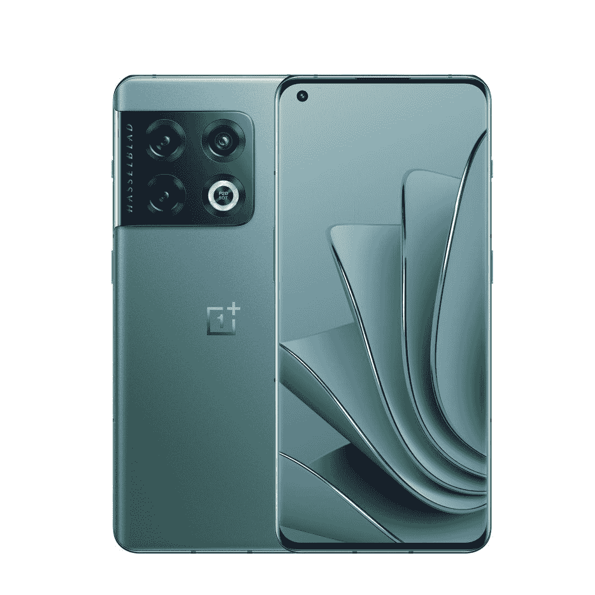

# 通过这 10 个推荐的调整来改善您的一加 10 专业版体验

> 原文：<https://www.xda-developers.com/oneplus-10-pro-recommended-settings/>

一加 10 Pro 是一款旗舰产品，今年将受到公司和用户的大量关注。尽管有人可能会说，在一笔[的好交易](https://www.xda-developers.com/best-oneplus-10-pro-deals/)后，它提供的价值与一加 9 Pro 相当，但一加 9 Pro 肯定会在之前缺货。因此，对于许多用户来说，一加 10 Pro 将是他们购买的旗舰产品。它本身就是一个很好的设备，所以它是有意义的。如果你已经购买了一加 10 Pro，并且已经完成了你的[第一次设置](https://www.xda-developers.com/how-to-set-up-oneplus-10-pro/)，我们推荐你应该改变一些设置以获得更好的体验。我们为这些设置提供了一些解释，所以如果你相信这些权衡，就做出决定吧！

**浏览这篇文章:**

1.  [编辑您的快速设置](#editquicksettings)
2.  [设置状态栏图标](#setupstatusbaricons)
3.  [设置显示屏和亮度以获得舒适的体验](#setupdisplaybrightnesssettings)
    1.  深色模式
    2.  眼睛舒适模式
    3.  屏幕刷新率
    4.  屏幕分辨率
4.  [查看您的电池设置](#reviewbatterysettings)
    1.  省电模式
    2.  优化电池使用
    3.  睡眠待机优化
    4.  优化夜间充电
    5.  无线充电设置
    6.  高性能模式
5.  [为您的即时消息应用程序启用自动启动功能](#enableautolaunch)
6.  [建立工作生活平衡](#setupworklifebalance)
7.  [启用/禁用一加货架](#enabledisableoneplusshelf)
8.  [更换铃声](#changeringtones)
9.  [设置请勿打扰](#setupdonotdisturb)
10.  [为 Adblock 设置专用 DNS](#setupprivatednsadblock)
11.  [经验丰富的用户额外的:根你的一加 10 专业版](#rootoneplus10pro)

## 编辑您的快速设置

设置好 smartphone 后，我们建议您设置快速设置磁贴，以显示您最常用的设置:

*   在主屏幕上向下滑动一次以访问通知中心。
*   再次向下滑动通知中心以展开快速设置磁贴。
*   点击齿轮“设置”图标旁边的铅笔图标，进入快速设置的编辑模式。
*   根据需要添加、移除和重新放置单幅图块。

前六个图块是为了从通知阴影中快速访问而出现的，因此请确保在此处保留您最常访问的设置。我个人不会关闭我的 WiFi、数据、蓝牙和定位功能，所以把这些磁贴放在这一排对我来说没什么意义。对我起作用的是在这些位置有手电筒、勿扰、热点、附近分享、截屏。您可以挑选对您更重要的设置以及设置顺序。这是一个很多人都会忘记的小设置，但在多年拥有和使用手机的过程中，这一点会有很大的不同。

## 设置状态栏图标

有一件事困扰了我一段时间:一些图标，如 VoLTE 和 VoWifi，在它们的持久格式中没有意义。你真正需要的只是那些你需要知道其状态变化的图标——所以如果你住在一个已经看到广泛 VoLTE 和 VoWifi 推出的地区，那些持续的图标只会占用空间。同样，在百分比指示器旁边有一个电池图标也是没有意义的。

*   前往设置>通知与状态栏>状态栏。
*   更改最适合的设置:
    *   您可以关闭电池图标，只使用百分比。
    *   您可以启用实时网络速度。
    *   您可以禁用 VoLTE 和 VoWiFi 的图标。
    *   您可以禁用高性能模式的图标(在本文后面的部分会有更多的介绍)。

## 设置显示器和亮度以获得舒适的体验

下面的设置来自个人偏好，但我发现它们对我长期大量使用智能手机来说是最舒适的。如果你打算每天长时间使用智能手机，你可以考虑选择下面的一些设置。

*   前往设置>显示器和亮度。
*   设置**黑暗模式**自动从日落切换到日出。
    *   这将使手机在夜间切换到黑暗模式，此时你很有可能处于黑暗的环境中。在这种情况下会降低对眼睛的压力。
    *   一加 10 Pro 将在白天切换到光线模式，这样当你在阳光下时更容易阅读内容。
    *   当您切换到黑暗模式时，会出现一个新的设置。在此设置中启用自适应对比度。你可以根据自己的喜好选择黑暗模式的风格。
*   设置**眼部舒适模式**进行调度，并根据夜间进行设置。
    *   眼部舒适模式减少了手机显示屏发出的蓝光。这反过来将有助于减少对你身体昼夜节律的干扰，让你更容易入睡，即使你在深夜一直使用手机。
    *   出于某种原因，一加删除了这个选项下的日落到日出设置。
    *   您可以将时间设置为您所在地区的近似夜间设置，与上面的黑暗模式设置相一致。
    *   该设置可独立于黑暗模式计划使用。
*   设置您的**屏幕刷新率**:
    *   高(最大 120 赫兹)-这将使你的手机功能看起来更流畅，但在这个过程中会消耗一些电池。这是我的首选设置，因为一加 10 Pro 的电池续航时间足够长，而且充电速度非常快。
    *   标准(最大 60Hz)-这将限制最大刷新率为 60Hz，就像过去的手机一样。这将为您节省一些电池，但您的电话体验将有点断断续续和不和谐。
*   设置您的**屏幕分辨率**:
    *   默认情况下，手机将设置为自动，根据需要在 FHD+和 QHD+之间切换。
    *   我建议在 QHD+上运行几天，然后在 FHD+上运行几天，然后评估您是否注意到显示质量的差异。就我个人而言，只有当我仔细查看手机显示屏时，我才能注意到这种差异——当我正常使用手机而不是主动寻找它时，FHD+与 QHD+仍然无法区分。
    *   如果你想优先考虑更长的电池寿命，坚持 FHD+。一加 10 Pro 的显示屏很好，你应该也可以使用 FHD+。

我发现 FHD+的 120Hz 是我的用例的最佳点，给我最好的流畅性，而不影响体验。其他设置让我可以在各种情况下舒适地使用手机，而不会感到疲劳。

## 查看您的电池设置

在 OxygenOS 的过去版本中，一加因其一些以电池为导向的措施而臭名昭著，这些激进的设置会影响你让应用程序在后台运行并向你的手机发送通知的能力。虽然这种情况随着与 ColorOS 的代码库集成而有所改善，但仍然值得检查一加 10 Pro 上的电池设置，特别是因为那里有一个高性能模式。

*   前往设置>电池。
*   设置**节电模式**自动触发开和关:
    *   打开省电模式一次，恢复“默认优化”设置。查看中的选项，然后您可以关闭节能模式。
    *   将省电模式设置为根据您的选择自动开启(我倾向于 10%)。
    *   将省电模式设置为在充电达到 90%时自动关闭。

*   转到高级设置:
    *   在**“优化电池使用”**下，将您的[最常用的 IM 应用](https://www.xda-developers.com/best-messaging-apps/)设置为“不优化”。如果你依赖一个应用程序在你不使用手机时及时通知你，也把它设置为“不优化”。您可以保留其他应用程序不变。这种优化设置主要是因为当手机不在使用时，应用程序会错过通知。
    *   如果你的应用程序仍然没有收到通知，你也可以将**“睡眠待机优化”**关闭。这个设置让手机知道你通常什么时候睡觉，并让它定期切换数据和 WiFi。因此，你可能会错过紧急通知，或者在醒来时收到大量通知。根据您的使用和要求切换此设置。
    *   **【优化夜间充电】**功能在晚上插上电源时，将电池快速充电至 80%，然后对手机进行涓流充电，使其在接近您通常醒来的时间达到 100%。这个设置是推荐给那些在晚上有规律的插上一加 10 Pro 的人使用的。手机会学习你的使用模式，并确保你在拿起手机时充满电，同时平衡最佳充电习惯，以实现更好的长期电池健康。我们建议您打开此设置，除非您的使用模式不规律，或者您发现自己经常醒来时手机电量不足。
    *   如果您使用无线充电器，尤其是如果您使用一加 Warp Charge 50 无线充电器，请查看**“无线充电设置”**。

*   **高性能模式:**
    *   正如我们在一加 10 Pro 评测中发现的那样，一加通常会在所有应用程序中抑制高通骁龙 8 Gen 1，这意味着即使你在玩游戏或使用基准应用程序时，该芯片也很难发挥其全部功能。这样做是为了防止过多的热量积累和随之而来的热节流，即使在这种低性能模式下，电话仍然完全可用。
    *   但是万一你真的需要额外的能量，你可以进入设置>电池>高级设置，打开高性能模式。这将呈现一个持久通知(以及它自己的通知图标；向右滑动并单击“垃圾桶”图标以删除通知)和另一个持久状态栏图标(您可以使用我们在本指南前面提到的设置禁用它)。
    *   对于普通用户来说，这种设置几乎不会对他们的日常使用产生积极的影响，但会使用更多的电池，所以我们建议关闭高性能模式。

## 为您的即时消息应用程序启用自动启动

类似于“优化电池使用”和“睡眠待机优化”设置，这一设置也来自你的应用程序的可靠通知。这是一把双刃剑，因为你应该限制不必要的应用程序自动启动，同时注意对重要的应用程序也要这样做。

*   前往设置>应用程序>自动启动
*   选择您想要在后台接收及时通知和其他内容的重要应用程序。这可以包括 IM 应用程序、电子邮件应用程序、天气应用程序和任何其他分配了时间安排任务或后台刷新的应用程序。为它们启用自动启动，以便应用程序可以在启动时和后台启动。
*   取消选择任何不需要在后台运行的额外应用程序。这些应用包括送餐应用、游戏等等。

## 建立工作与生活的平衡

如果你使用一加 10 专业版作为你的工作和个人需求的单一设备，那么这个功能对于保持良好的工作生活平衡是一个福音。我已经在过去的一加设备上广泛使用了这种方法，它确实有助于保持更健康的界限，尤其是在在家工作期间。

工作生活平衡的作用是让你设置工作模式和生活模式的触发器，选择每个部分中符合条件的应用程序，并仅在该模式下向你显示来自这些应用程序的通知。例如，我可以将工作模式设置为每个工作日的上午 9 点到下午 5 点，或者根据我的办公室位置，并且只允许像 Asana、Airtable 等与工作相关的应用程序向我发送通知。然后，我可以设置生活模式，比如说，当我连接到家里的 WiFi 时，允许我的社交媒体应用程序(如 Instagram 和 Twitter)和媒体应用程序(如网飞)向我发送通知。

一旦进入正确的模式，来自应用程序而非当前模式的通知将被“暂停”并交付(您可以覆盖和查看隐藏的通知)。如果你试图进入这个应用程序，会有一个提示劝阻你打开这个应用程序(如果你真的需要，你也可以忽略并进入)。如果不需要另一种模式，您也可以只设置一种模式。

要设置工作生活平衡，请执行以下操作:

*   进入设置>特殊功能>工作生活平衡。
*   设置工作模式:
    *   根据时间、WiFi 或位置选择您的触发器。
    *   选择您希望在工作模式下继续接收通知的 Gmail 帐户。
    *   选择您想要继续接收通知的其他工作应用。
*   设置生活模式，同上。

工作生活模式设置的“限制”非常宽松，很容易绕过。但这种想法只是给你必要的推动，让你集中精力工作，享受生活，同时仍然给你在使用手机时所需的灵活性和控制力。我非常成功地使用了这一功能:当我在办公桌上时，我可以限制我的 Asana、Airtable 和工作 Gmail 通知，而 Instagram 等应用程序可以保持静音。这是一个小功能，但当我跳到其他非一加设备时，我会怀念它。

## 启用/禁用一加工具架

一加货架开始它的生命作为一个功能，定制一个主屏幕面板上的启动。我从来没有变得太喜欢这个功能，不知何故，它在一加 10 Pro 上变得更加沉闷。你不能再把它设置成启动器主屏幕上的-1 屏幕上的 Google Feed 替换(很可能是因为 GMS 的要求，所以要怪 Google)。因此，作为一种手段，一加将其映射到右上角通知托盘的下拉动作。现在，一加货架是它自己的应用程序，通过这个触发动作启动。当你拉起窗帘时(因为你拉下窗帘是为了进入货架)，你回到了主屏幕，因为你技术上是从一加货架应用跳到主屏幕的——而不是回到你之前的应用。需要左右滑动才能回到之前的 app，一点都不直观。这是一种笨拙的体验，而且应用程序本身对我的效用有限，所以我把它关掉了。但是我知道有些用户可能会觉得它很有用，所以如果需要的话，你可以让它保持启用状态。

*   前往设置>特殊功能>搁板。
*   根据需要启用/禁用该功能。
*   根据需要设置其他参数。

## 更改铃声和提示音

这可能是一个有趣的建议，但人们真的需要改变他们的默认铃声。您可以使用铃声做很多事情，铃声可以提醒您有来电和通知，而无需拿起您的设备。

例如，我将我的默认信息提示音设置为非常短的曲调。这是第三方应用程序在发送我不同意或不期待的通知时默认采用的语气。这最大限度地减少了应用程序的干扰，尽管一个更干净的解决方案是禁用来自违规应用程序的通知。然后，我分别为我的一些即时通讯应用程序设置了通知声音，在不混淆的情况下，尽可能地将它们设置为清晰明确的声音。所以我的 Slack 通知听起来和我的电报通知不一样，电报通知听起来和我的 WhatsApp DMs 不一样，而我的 WhatsApp 群聊没有声音。

要更改提示音:

*   前往设置>声音和振动>通知声音。在此设定您的默认提示音。我建议选择轻薄短小的。
*   对于单个应用程序，您需要导航它们各自的应用程序内设置。下面是几个常见的:
    *   WhatsApp:应用右上角的 3 点菜单>设置>通知。
    *   Telegram:应用程序左上角的汉堡菜单>设置>通知和声音>聊天通知>声音。
    *   Slack:右下角的“你”标签>通知>系统选项>声音。

同样，我也为我亲密的家人单独设置铃声，为朋友设置不同的铃声。

*   若要设定默认铃声:前往“设置”>“声音和振动”>“铃声”。
*   要为单个联系人设置铃声:打开手机应用程序>打开要更改的联系人的联系人卡片>应用程序右上角的 3 点菜单>设置铃声。

当然，如果你让手机永远处于静音模式，这些都不适用。但以防万一，你没有，你打算使用手机一段时间，花一些时间设置铃声将增强您的手机体验。

## 设置请勿打扰

有了精心设计的提示音设置和精心设计的工作生活平衡设置，我仍然觉得有必要加强一些基本的勿扰设置，主要是在晚上我睡觉的时候。这对我来说很重要，因为我的工作是全球性的，否则我的手机会日夜响个不停。如果你发现自己在晚上被杂乱的通知打扰，我会建议你设置“请勿打扰”。

*   前往设置>声音和振动>勿扰模式。
*   制定一个时间表。你可以为不同的日子设定不同的时间表。
*   设置例外:
    *   允许的通知:您希望通知显示在哪里？您可以设置它，以便您不会通过边缘照明获得通知，并且当新通知到达时，您的锁定屏幕不会亮起。
    *   允许来自的消息:设置您希望允许来自谁的干扰。我把它设置为我的联系人，但你可以进一步限制到只有星级联系人。
    *   允许来电:设置您希望允许的来电者。我晚上接到的电话都是紧急情况，所以我把它设置为任何人。如果您正在为会议设置免打扰，您可以将其设置为仅星级联系人。
*   启用“给重复来电者打电话”。启用此功能后，如果有人试图快速连续多次呼叫您，手机会通知您。

## 为 Adblock 设置专用 DNS

有很多方法可以在你的 Android 设备上设置广告拦截。但是最快、最简单、也是最有效的方法之一是通过私有 DNS 设置。

*   前往设置>连接和共享>专用 DNS
*   从关闭切换到指定的专用 DNS。
*   在字段中输入“dns.adguard.com ”,然后单击复选标记。
*   您现在应该连接到专用 DNS。这将屏蔽你智能手机上的大部分广告，除了 YouTube 之类的应用。

这不是向普通用户推荐的步骤，并且大多数阅读本文的读者不需要这样做。但是[支持智能手机](https://www.xda-developers.com/root/)有它自己的好处。如果你想沉迷于其中，我们的论坛有[很好的资源来支持你的一加 10 Pro](https://forum.xda-developers.com/t/root-oneplus-10-pro-color-os-oxygen-os.4401243/) 。还有一个定制 rom 的世界，一加 10 Pro 才刚刚开始。

* * *

 <picture></picture> 

OnePlus 10 Pro

##### 一加 10 专业版

一加 10 Pro 是一加最新最棒的旗舰智能手机，将一些性能最好的硬件打包在一个包中。它有一个伟大的芯片组，良好的摄像头，和超级快速充电都在一个独特的设计。

我们希望本指南有助于设置您的一加 10 专业版，以获得最佳使用效果。你还可以做一些更小的调整，比如恢复电源按钮来关闭手机，以及调整屏幕截图和屏幕录制设置。你也可以为你的手机探索一些[推荐案例](https://www.xda-developers.com/best-oneplus-10-pro-cases/)和屏幕保护器。这将设置您的一加 10 专业版，以提供符合您需求的良好体验。享受你的手机！