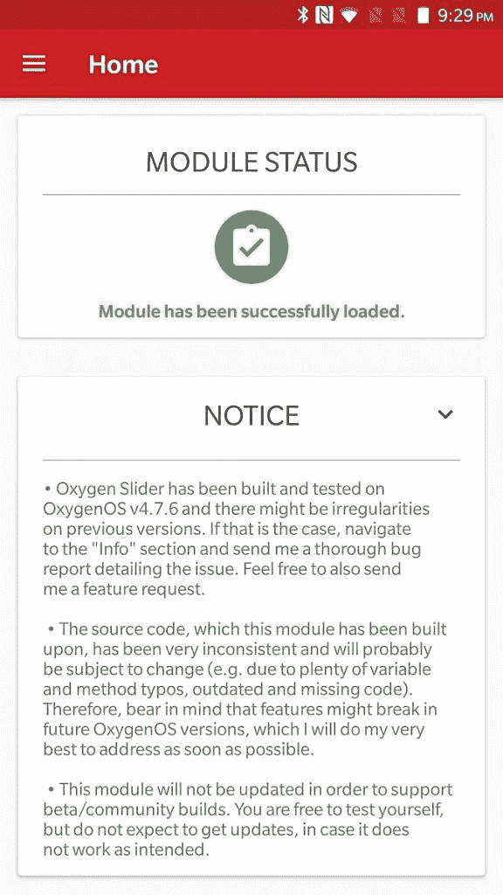

# 一加警报滑块自定义现在可以用一个曝光模块

> 原文：<https://www.xda-developers.com/oneplus-alert-slider-customization-xposed-module/>

一加的手机普遍抱怨提醒滑动条虽然能节省大量时间，但对大多数用户来说并不是很有用。如果不是因为在 Oxygen OS 中没有一种简单的方法来定制它，事情也不会那么糟糕——将手机置于静音模式(禁用振动)可能是一件令人讨厌的事情。内置选项相当黯淡，没有留下太多修补的空间，尽管第三方开发者想出了一些方法来修改旧版本[氧气操作系统](https://www.xda-developers.com/xda-external-link/flashable-zip-for-enabling-5-or-7-quick-settings-toggles-in-a-row-on-oneplus-3t-oxygen-os-4-1/)的警告滑块的行为，但由于一加在将氧气操作系统与中国专用的[氢气操作系统](https://www.xda-developers.com/xda-external-link/hydrogen-os-3-0-based-on-nougat-has-been-released-for-the-oneplus-33t/)合并时所做的改变，这些方法不再有效。但是由于 Xposed 框架和来自 XDA 成员[sevelith](https://forum.xda-developers.com/member.php?u=7237057)的新模块，再次定制一加设备的提醒滑块成为可能。

在 OnePlus 5 和 OnePlus 5T 上，配置提醒滑块的选项并不多。

进入 [Seveilith 的](https://forum.xda-developers.com/member.php?u=7237057)氧气滑块为 OnePlus 5 和 OnePlus 5T 运行 OxygenOS 4.7.6 牛轧糖稳定，这也是工作在最新的 [OxygenOS 公开测试版](https://www.xda-developers.com/oneplus-announces-oxygenos-open-beta-4-oneplus-5/)为 OnePlus 5 与新发布的 [Xposed 为 Android Oreo](https://www.xda-developers.com/xposed-framework-for-android-oreo-beta/) 。它有一个巨大的选项列表可供选择——你可以对提醒滑块进行编程，以启动一个应用程序或切换 Wi-Fi，甚至截图。

以下是您可以做的一些示例:

*   完全沉默(AOSP)
*   沉默的
*   请勿打扰
*   游戏请勿打扰
*   静音(振动)
*   戒指
*   阅读模式[开/关]
*   夜间模式[自动/自定义/开/关]
*   咖啡因[来自 LOS/CM]
*   启动应用程序
*   手电筒
*   照相机
*   截图
*   无线网络[开/关]
*   热点[开/关]
*   无线网络[开/关]
*   蓝牙[开/关]
*   节电器[开/关]
*   什么也不做

如果这还不够，它还包含一些额外的功能，可以修改 OxygenOS 的其他默认行为:

*   在滑块变化上显示禅宗吐司(来自棉花糖)。
*   禁止音量对话窥视滑块的变化。
*   隐藏音量对话中的禅页脚。
*   用氧气滑块覆盖 zen 页脚的设置快捷方式。

* * *

## 使用氧气滑块自定一加警报滑块

### 先决条件

**该曝光模块仅在 OxygenOS** 上工作。它与 OnePlus 5 和 5T 的任何定制 ROM 都不兼容。~~它可能也适用于 OnePlus 3 和 3T，但尚未经过测试。~~一些读者正在确认它也适用于 OnePlus 3 和 3T！

### 第 1 部分-安装 x 曝光

这一部分非常简单，我们建议参考 Android Oreo 发布的[公告帖子](https://www.xda-developers.com/systemless-xposed-android-oreo-available-pass-safetynet/)获取详细信息。你需要解锁你的引导程序(这将擦除你的设备)，然后刷新 Android Oreo 的 ZIP 文件。

### 第 2 部分——安装、启用和配置暴露的模块

这是容易的部分。首先，通过下面的链接访问 Xposed 模块的谷歌 Play 商店页面。

一旦你安装好了，导航到 Xposed 应用，启用新添加的**氧气滑块**模块和**重启你的设备**。当它再次启动时，该模块将被启用，您可以开始配置它了！

### 第 3 部分-使用氧气滑块自定义一加警报滑块

该应用程序为一加警报滑块添加了许多定制选项。如果模块加载正确，您应该会看到下面截图中的内容。

 <picture></picture> 

If you see this, you're on the right track.

看看下面截图中的所有选项。如你所见，你可以做很多事情。(请注意，您必须重新启动手机，以使您对提醒滑块所做的任何更改生效。)

* * *

## 为什么我需要一个暴露的模块来定制一加警告滑块？

以前，root 访问被用来拦截来自警告滑块的输入，但是由于 Oxygen OS 框架的变化，root 访问本身已经不够了。Xposed 在比 root 更低的级别上改变了应用和软件与设备硬件的接口方式，修改了应用和其他软件的编译和运行方式。氧气滑块模块利用这些功能来拦截系统框架中的警告滑块变化。