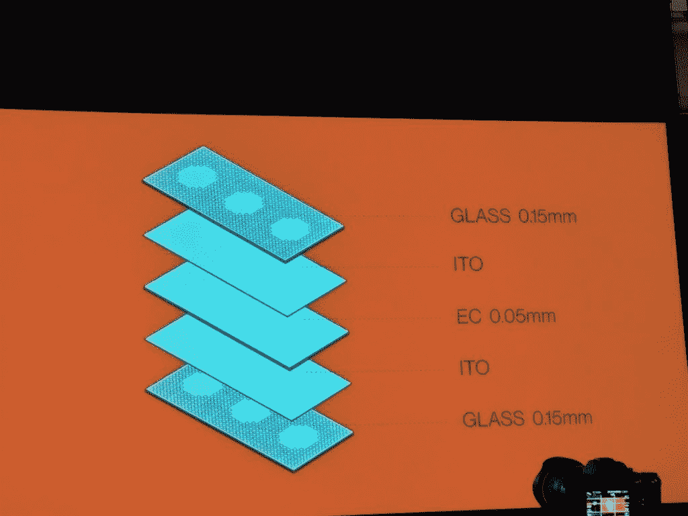

# 一加如何在其 Concept One 智能手机上制造隐形摄像头

> 原文：<https://www.xda-developers.com/oneplus-concept-one-invisible-camera/>

在我们报道 2019 年顶级智能手机[的帖子中，我认为 Mi Note 10 的五摄像头设置是今年最好的新硬件功能。推动多摄像头技术创新的是图像传感器变得更好，现代图像信号处理器更强大，摄像头软件变得更复杂。这就是为什么今年，三星和华为等智能手机巨头将推出背面矩形区域内包含四摄像头和五摄像头模块的设备。智能手机品牌将相机模块放在圆形或矩形外壳中，使多相机设备看起来美观。但是如果有其他方法呢？这就是一加用 Concept One 展示的东西——一款带有隐形摄像头的智能手机原型。](https://www.xda-developers.com/xda-top-smartphones-2019/)

在 CES 的新闻发布会上，一加解释说，Concept One 设备是该公司推动改善智能手机设计的颜色、材料和表面处理(CMF)的最新例子。一加说，有了这个新设备，他们现在进入了“ECMF”的领地，这里的 E 代表电子。他们的目标是创造一种不仅美观而且实用的材料饰面。为此，一加选择再次与英国跑车制造商迈凯轮合作。在 18 个月的时间里，一加用迈凯伦标志性的橙色皮革、铝合金框架和电致变色玻璃打造了一款概念智能手机。在内部，一加概念车与一加 7T 专业迈凯轮版有着相同的规格，但它有着完全不同的设计。

**迈凯轮木瓜橙**

一加 Concept One 后部的皮革与迈凯轮车型(尤其是迈凯轮 720S)的木瓜橙颜色相同。围绕相机镜头两侧的皮革甚至还有缝线，沿着机身延伸。该装置的框架由 PVD(物理气相沉积)涂覆的铝构成，而不是氧化铝层。一加还加了一层薄薄的 24k 金，让镜框闪闪发光。

一加表示，他们是第一个在智能手机设计中利用 PVD 的人，但尽管迈凯轮木瓜橙的外观确实很漂亮，但这不是概念车最有趣的地方。那个皇冠属于隐形相机。

**隐形摄像头**

为了隐藏摄像机，一加说他们需要一种新的地役权方法。一加的灵感来自迈凯轮 720S 和其他豪华车，天窗的透明度可以调节，以控制多少光线可以透过。基本上，通过改变电流和电压，玻璃可以从透明变为不透明。这项技术被称为电致变色玻璃，因此并不新鲜，但它现在首次应用于智能手机相机镜头。

一加认为，智能手机行业最终会发现屏幕下摄像头技术，消除设备正面的可见摄像头。事实上，OPPO 在上个月的创新日活动中展示了一款令人印象深刻的屏幕下相机原型。因此，一加在 Concept One 上所做的是对屏幕下摄像头技术的补充:这两种技术的最终目标都是隐藏摄像头。借助电致变色玻璃，一加能够在相机应用程序使用时显示后置摄像头，但在相机应用程序关闭时隐藏它们。此外，这种玻璃技术使一加能够将摄像头模块作为后部整体设计的一部分，而不是将摄像头隔离在圆形或矩形的凸起中。

将这种玻璃技术缩小到智能手机大小的过程花了 18 个月，因为一加需要降低功耗，加快透明度的切换，并在保持电致变色玻璃不透明的同时减小尺寸。一加表示，在目前阶段，电致变色玻璃技术消耗的能量可以忽略不计，开关时间为 0.7 秒，厚度仅为 0.05 毫米——大约相当于钢化玻璃屏幕保护器的厚度。

一加花了几个月的时间来提高玻璃和电致变色玻璃层的厚度。他们需要电致变色材料很薄，但又不能薄到影响其不透明度。同样，他们还需要玻璃薄而不易碎，所以他们添加了非极性玻璃颗粒，使整个玻璃更有结构和刚性。这些非极性玻璃颗粒直径为 0.05 毫米，不覆盖相机镜头，以免影响电致变色效果。总的来说，一加将玻璃面板的厚度削减到每个 0.15 毫米，总厚度为 0.35 毫米

 <picture></picture> 

An overview of the electrochromic glass solution on the OnePlus Concept One. There are two pieces of 0.15mm glass, one piece of 0.05mm electrochromic material, and two pieces of indium tin oxide (ITO) coating. The ITO coating makes the glass surface conductive.

进一步的改进包括降低 ITO 导电层的电阻，使其在相机镜头上方尽可能透明，并在玻璃面板的内侧和外侧添加抗反射涂层，以减少光反射。正如你所看到的，结果是 Concept One 设备上的摄像头肉眼几乎看不到；你必须把设备拿得离得很近，角度合适才能一瞥，或者用灯光直接照在相机上。

我录制了一个简短的视频，展示了玻璃从透明到不透明的变化。大约 7 秒钟后，我用左手的食指做了一个向后的手势来关闭相机应用程序。Concept One 的三后置摄像头很快从可见变为(几乎)不可见。

**中性密度滤镜效果**

除了简单地隐藏相机镜头，电致变色玻璃还可以用于在相机应用程序中实现中性密度(nd)效果。这是因为电致变色玻璃可以用于控制透明度，因此可以降低图像中所有波长的光的强度，而不影响色调。因此，如果你在一加相机应用程序中使用专业模式，你将能够降低 ISO 并提高快门速度，比没有 nd 滤镜时更快。

我们所在的场地不利于良好的摄影，而且我们不允许将智能手机带出场地。因此，我们无法亲自测试一加概念车的 ND 效应。

一加概念一——它会上市吗？

不幸的是，一加的第一部概念手机目前仍是一个概念。该公司尚未确定发布日期，尽管他们在 CES 上确实有可供媒体测试的功能单元。一加似乎对他们在电致变色玻璃技术方面的进展很有信心，但该公司表示，在准备生产之前，该设备需要更彻底的测试。