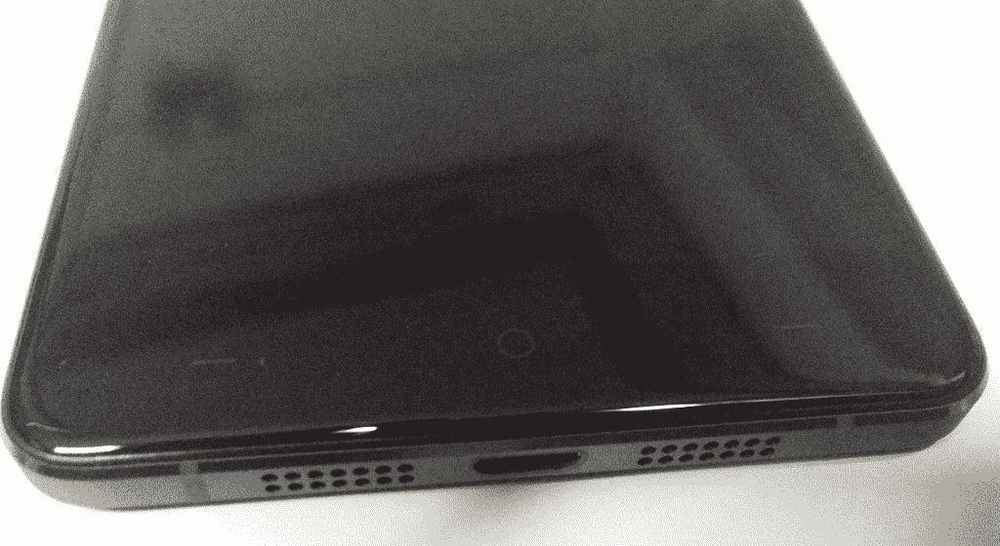
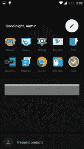
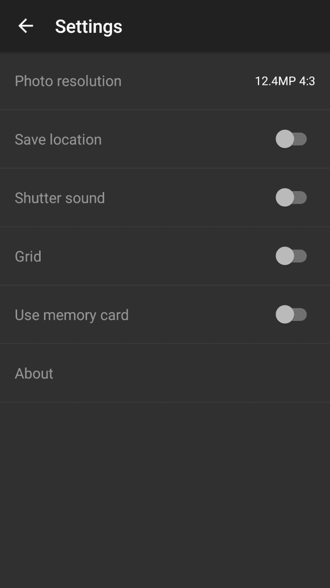

# OnePlus X 评论:美女，但不是野兽

> 原文：<https://www.xda-developers.com/oneplus-x-review-beauty-but-not-the-beast/>

OnePlus X 是一加的第三款智能手机，该公司凭借其第一款智能手机掀起了波澜。这款设备采用经典的玻璃和金属结构，内部结构与 OnePlus One 大致相同，其目标人群是那些喜欢更小、更易管理、功能集令人兴奋的手机的人。

X 会巩固一加在中端市场的地位吗？请跟随我们的回顾，从各个角度来看这款设备。

首先，快速浏览一下 OnePlus X 的规格表:

| **尺寸** | 140 毫米 x 69 毫米 x 6.9 毫米 | **屏幕尺寸** | 5″ |
| **重量** | 138 克 | **屏幕类型&分辨率** | AMOLED，1080 x 1920，441 ppi |
| **主摄像头** | 13 兆像素，f/2.2 | **辅助摄像头** | 8 兆像素，f/2.4 |
| **芯片组** | 高通骁龙 801 | **CPU & GPU** | 2.3 GHz krait 400.x4；肾上腺素 330 |
| **存储** | 16GB 内部；最高可扩展至 128GB | **RAM** | 3GB |
| **电池** | 2525 毫安时 | **NFC** | 不，再一次 |
| **安卓版本** | 安卓 5.1 棒棒糖 | **SIM 卡** | 双 Nano SIM 卡 |

波段变化:

| **中国 E1001:** | GSM: | 850/900/1800/1900 |
|  | WCDMA: | 频段 1/2/5/8 |
|  | TD-SCDMA: | 带 34/39 |
|  | FDD-LTE: | 波段 1/3/7 |
|  | TD-LTE: | 带 38/39/40/41 |
| **亚洲/欧洲 E1003:** | GSM: | 850/900/1800/1900 |
|  | WCDMA: | 频段 1/2/5/8 |
|  | FDD-LTE: | 频段 1/3/5/7/8/20 |
|  | TDD-LTE: | 带 38/40 |
| **北美 E1005:** | GSM: | 850/900/1800/1900 |
|  | WCDMA: | 频段 1/2/4/5/8 |
|  | FDD-LTE: | 频段 1/2/4/5/7/8 |

## 内容:

## 设计，制造质量

OnePlus X 是目前市场上可以买到的设备中最优质的产品之一，尤其是在目前的零售价格范围内，这一点非常重要。在美国 249 美元，在欧洲 269 美元，在₹16,999 269 美元，你很难找到另一个像样的玻璃和金属设备。我们的审查单元是常规的缟玛瑙型号，但也有限量生产的陶瓷型号，其背面由氧化锆陶瓷制成。这两者之间没有太大的区别，[马修在他的实践中发现](http://www.xda-developers.com/a-hands-on-with-the-oneplus-x-a-humble-leap-in-the-right-direction/)。

我们的复习单元是由[28mobile.com](http://28mobile.com/)提供给我们的。它的外部包装让人想起了 OnePlus One 的拆箱体验，但带有 28mobile 的品牌颜色。里面是 OnePlus X 盒子，密封着，塑料包装完好无损。

在 5.5 英寸成为新常态的时代，OnePlus X 是一款小型设备。这款手机的屏幕尺寸为 5 英寸，长度仅为 140 毫米，宽度为 69 毫米，厚度为 6.9 毫米，是握在手中最舒适的手机之一。手机的正面和背面由 2.5D 弧形大猩猩玻璃 3 制成。弯曲的玻璃给人一种设备比实际更薄的印象，因为它与框架无缝融合。X 的中间框架由金属制成，两侧刻有凹槽。除了美学价值之外，与光滑表面相比，蚀刻中框提高了抓握能力(例如，在 Elephone P8000 上)。

OnePlus X 的缟玛瑙/玻璃变体是一款漂亮的设备，你周围的每个人可能都会同意这一点。电话的低重量(138 克)、小的占地面积和构建材料的选择；所有这一切共同作用，给设备一个优质的光环。感觉很轻，感觉很薄，感觉很光滑，感觉很丰富。这确实有利于 X，因为这种溢价感是这款价格实惠的手机的主要“独特卖点”之一。

在设备的正面，您会发现 5 英寸显示屏，两侧是薄挡板。显示屏底部有三个电容按钮，你几乎不会注意到，因为它们没有任何背光。显示屏顶部的中央是听筒，前置摄像头在左侧，传感器在右侧。在设备的右边缘附近还有一个通知 LED。

 <picture></picture> 

The capacitive buttons are barely visible as they have no backlighting

 <picture></picture> 

The camera is very slightly recessed inside the main body

在设备的背面，你会发现相机朝向左侧边缘，在设备的主框架内有一根头发的宽度**。一个 LED 闪光灯伴随着它，与身体的其他部分齐平。背面最突出的部分是银色的闪亮的一加标志，它反射背光，让你的手机在明亮的环境中闪闪发光。在最底部是非常模糊的 FCC 认证标志以及设备型号。标记和一加标志都在玻璃下面，所以它们不会随着重复使用和触摸而逐渐褪色。**

设备的右侧中间有一个电源按钮，音量摇杆位于它的上方。这也是你可以找到 SIM 卡和 microSD 插槽的地方，因为我们看到越来越多的设备采用这种配置:双 SIM 卡，或者一个 SIM 卡和一个 microsd。如果这是一个更大的设备，电源按钮的位置将是完美的。

在当前的外形中，您的拇指将停留在音量增大键上，这意味着您必须弯曲拇指才能够到并按下电源按钮。这是一个在重复的基础上进行的不太舒服的动作，这使我们希望重新定位。

在手机的左侧，你会发现不同图案的提醒滑块，正如在 OnePlus 2 上看到的[。滑块的底部位置将其设置为所有提醒/常规模式，中间位置将其设置为仅优先中断，而最上面的位置将手机设置为静音模式。遗憾的是，这种行为是不可定制的。](http://www.xda-developers.com/oneplus-2-xda-review/)

设备顶部左侧有耳机插孔，一个辅助麦克风和一个塑料天线带。

OnePlus X 的底部在 micro USB 插槽的两侧对称地钻有孔，但只有左侧作为扬声器，而右侧则包含主麦克风。

OnePlus X 的标准包装盒中包括一本快速入门指南、一本用户指南、一个电源适配器、一加的扁平式 USB 电缆、用于移除 SIM 卡托盘的 pin 以及一个实用多于美观的透明硅壳。

 <picture></picture> 

Thankfully, not my phone

OnePlus X 让我们想起了 Nexus 4，或者 iPhone 4，如果你来自河对岸的话。虽然玻璃背面摸起来感觉很好，但它的实用性在美学价值之外非常有限。这款手机拍照简直是一场噩梦——污迹和指纹不断地点缀着它的两面，让它看起来非常“脏”。手机也倾向于在最轻微的移动中滑动。光滑的弯曲玻璃在平坦的表面上几乎没有摩擦，这意味着你的手机很有可能会从任何稍微倾斜的表面上滑落。你必须小心使用这个设备，并使用一个好的外壳，[以免你希望像这样结束](https://www.reddit.com/r/oneplus/comments/43z0dm/cracked_my_opx_screen_not_sure_whether_to_send_to/):

OnePlus X 标志着一加独特的建筑材料选择的转变——砂岩纹理背面。如果一加必须选择一种与砂岩感觉截然不同的质地，那就是玻璃。这正是他们所做的。

就手感而言，OnePlus X 似乎完全脱离了 OnePlus One。X 轻、平、小、滑；而另一个又厚又大又结实。玻璃的使用就像手机的双刃刀片。一方面，OnePlus X 对任何人来说都感觉很棒；另一方面，如果没有一个好的外壳，你根本没有信心使用这款手机或把它给别人，这在某种程度上挫败了一加花了这么多精力的溢价感。

在使用这两款手机相当长一段时间后，在包括尺寸在内的许多方面做出这样一个 180 度大转弯的决定是合理的。一加为 X 选择的设计语言与屏幕尺寸和设备的整体尺寸配合得很好。如果手机是 5.5 英寸或更大，手机将会很难操作。凭借 5 英寸的显示屏和均匀分布的重量，手机握在手中非常舒适。由于这款手机与 OnePlus One 的内部结构大致相同，因此采用相同的设计只会给你一个 OnePlus One Mini。稍微混合一下就给公司的产品组合增加了一个新产品，一个确实有自己特色的产品。

## 软件用户界面和功能

OnePlus X 自带安卓 5.1.1 棒棒糖，上面是一加自己的 OxygenOS 皮肤。一加承诺为该设备更新 Android 6.0 棉花糖，但就像 OEM 皮肤一样，更新将在棉花糖几个月大的时候进行。

OxygenOS 应该让过去用过 AOSP 的人有宾至如归的感觉。皮肤非常接近股票 Android，上面有一些有用的补充，其中大部分是真正有用的，而不是噱头。OxygenOS 最初是作为在中国以外销售的一加设备的 CyanogenOS 的替代品，并且正在成为普通用户 ROM 的有力竞争者。OnePlus X 自带 OxygenOS v2.1，但一些 OTA 更新已经将当前版本升级到 v2.2.0。

注意:我的设备必须是 rooted 的，并且必须安装 Xposed 才能完全适应我自己的使用场景(YouTube 后台播放、应用程序设置、Titanium 备份)。小心不要接触这些参数之外的任何东西。因此，评论应该代表股票设置的股票体验。

X 从标准的 Android 5.1 Lollipop 设置向导开始，然后通过 OxygenOS 的附加功能来指导用户，例如启用软件按钮而不是硬件按键，利用“货架”主屏幕功能和启用屏幕关闭手势。

### 启动器和用户界面

OnePlus X 上的默认启动器没有功能支持，选择了一种简单的方法。它在应用程序抽屉的网格大小中提供了一组有限的选择，并支持图标包。你也有一些内置的手势，在主屏幕上向下滑动会拉下通知阴影，从状态栏的右端向下滑动会直接拉下快速设置开关。这些手势没有明确提到，也不可定制，这意味着**你被快速下拉**卡住了。但是除了这些和架子部件之外，启动程序就没什么了。

启动器有一个 bug，我花了太长时间来缩小和复制，这是我不愿意承认的:禁用股票启动器上的谷歌搜索栏将使启动器无法使用。只要你一打开应用程序抽屉，启动器就会一直关闭。它的原因不会立即变得明显，因为我推测这是因为我在安装 Xposed/App Ops 时不知何故搞砸了。访问启动器的设置也可以更简单，因为设置图标只在主屏幕上长按时出现，与普通用户期望看到的实际电话设置图标没有区别。

下面是一个关于启动程序错误的快速演示，以及下面提到的坏掉的架子:

 <picture></picture> 

Google Now Widget on Shelf -- Broken, does not populate on OxygenOS v2.2.0

说到 Shelf，它只不过是你主屏幕上的一个美化了的小部件页面，从启动器向左滑动就可以进入。你可以在这里找到你常用的联系人和十个常用的应用程序，提供一个简单的方法来访问你的日常应用程序。你也可以添加其他部件到 Shelf，就像我用 Google Now 做的那样。但是从 OxygenOS v2.2.0 开始，Shelf 被破坏了，因为它没有更新任何外部小部件。这在以前的 OxygenOS 版本中并不存在，因此在未来的更新中应该会再次修复该功能。但是对于我的使用期来说，Shelf 只不过是一个噱头。

### UI 添加

除了启动器之外，OxygenOS 的体验没有任何问题。集成到操作系统中的其他功能并不是噱头，而是像预期的那样工作，并且在所有设置中都有大量微小的隐藏功能。

*   自定义快速设置切换:您可以启用和禁用某些快捷键，以及重新安排它们
*   SIM 卡管理器:允许您单独启用和禁用 SIM 卡，而无需将其从设备中移除。您还可以为通话、短信和数据单独设置首选 SIM 卡
*   按钮定制:选择使用屏幕按钮或电容按钮。你也可以在它们上面交换后退和最近的顺序，如果你喜欢右边的后退键，这非常方便。电容式按钮可以进一步定制长按和双击。
*   屏幕关闭手势:包括熟悉的双击唤醒手势，以及相机，手电筒和音乐控制手势。但是，没有添加您自己的手势的选项。
*   环境显示:当你得到通知时唤醒部分屏幕。适用于 AMOLED 显示屏。
*   邻近唤醒:当环境显示启用时，您也可以启用邻近唤醒，当您的手在邻近传感器上滑动时，即使没有通知，也会唤醒屏幕。这与其说是一个功能，不如说是一个噱头，因为这个功能的实用性是有限的。
*   电池指示器:隐藏在电池菜单中的选项可以从状态栏上的各种电池指示器图标中选择。
*   全系统暗主题:这是一个产生大量视觉冲击的功能，对于 AMOLED 显示器尤其有用。如果你不喜欢 Android 对白色背景的痴迷，你可以选择一个漆黑的 UI 背景。这适用于整个系统，包括快速设置切换。启用时，您还可以选择辅助强调颜色。
*   LED 通知:您可以为全局通知和一些电池状态设置通知 LED 颜色。我们希望对 LED 有更多的控制，像每个应用程序的配置，但一些定制总比没有好。
*   应用程序权限:这项功能在现有的 Android 6.0 上可用，但一加已经在 Android 5.1 上的 OxygenOS 中实现了类似的功能。你可以拒绝每个应用程序的权限，这是一个基本的隐私保护。如果禁用对应用程序运行至关重要的权限，应用程序可能会崩溃。

OxygenOS 并不是你能找到的最具特色的 ROM。事实上，它与其他中国制造商更喜欢的皮肤形成鲜明对比，因为它没有触及大多数库存 Android。他们添加的定制是很好的接触，提高了设备的整体 UX。除了那些在启动程序和架子上的错误之外，当前状态的 ROM 也有令人惊讶的缺陷。对此我们要说，干得好，一加。如果这个设备现在有棉花糖就好了...

## 性能和内存

OnePlus X 采用了久经考验的高通骁龙 801 处理器，该处理器在其黄金时期被认为是最好的处理器之一。但是过去的美好时光已经过去一年多了。在目前的形式下，骁龙 801 最适合用在中端设备上，预计不会与市场上的顶级产品竞争。

OnePlus X 上的骁龙 801 与 OnePlus One 上的不同。一个带有 MSM8974PRO-AC，而 X 带有 MSM8974PRO-AA。这里有一个 AnandTech 的快速[比较表，解释了 Snapdragon 800 和 801 的不同版本之间的差异](http://www.anandtech.com/show/7846/the-difference-between-snapdragon-800-and-801-clearing-up-confusion):

如表中所示，X 上的 AA 的最大时钟速度略低，上限为 2.3 GHz (2265 MHz)，而 One 上的 AC 最高可达 2.5 GHz (2457 MHz)。Anandtech 的表格也提到了较低的 GPU 最大频率。然而，X 上的应用程序报告了 578 MHz 的标准 801 最大 GPU 时钟速度(通过 [CPU-Z](https://play.google.com/store/apps/details?id=com.cpuid.cpu_z&hl=en) 和[内核 Adiutor](https://play.google.com/store/apps/details?id=com.grarak.kerneladiutor&hl=en) 进行了检查)，这意味着要么一加可能选择了超频 stock OxygenOS 上的 GPU，要么应用程序部分存在误读。

尽管如此，四个 32 位 Krait 400 内核、Adreno 330 GPU 和 3GB lpddr 3 RAM 相结合，它们在中端带来了流畅的整体体验。另一方面，基准...

基准测试成绩不言自明:OnePlus X 不是旗舰杀手。该设备在几个领域的得分仅次于 OnePlus One，这是两年前的旗舰杀手，而不是今天。你看到的理论性能位于中端，领先于 [honor 5X](http://forum.xda-developers.com/honor-5x) 和 Moto G 2015 等设备，但落后于其他设备，如[华硕 Zenfone 2](http://forum.xda-developers.com/zenfone-2) ZE551ML，小米 Mi 4C， [LG Nexus 5X](http://forum.xda-developers.com/nexus-5x) ，以及可以理解的旗舰兄弟 [OnePlus 2](http://forum.xda-developers.com/oneplus-2) 。

谈到实际性能，OnePlus X 将经受住所有你可能扔给它的应用程序。从 OxygenOS v2.2.0 开始，从冷启动启动应用程序没有任何问题，动画没有抖动，滑动或滚动时没有延迟。UX 是流动的，当实际使用电话时，没有异常行为可以报告。至少在这方面，OxygenOS 已经从早期的 jankiness 成熟到目前的形式，即使安装了 30 多个应用程序，手机也像全新的一样工作。处理器和内存工作得非常好，让你在应用程序方面的体验很流畅。

OnePlus X 上的 GPU 是 Adreno 330，它只是在突突前进。不太密集的游戏，如 Bloons Battles TD 5(在正常速度下直到 85 级)以 60fps 的速度运行，而入口在门户稀疏的地区一直以 30fps 的速度运行。就此而言，GPU 或 CPU 很少 100%运行，在这些情况下并不真正需要。

对于像《死亡触发 2》、《现代战斗 5》和《柏油路 8》这样的密集型游戏，OnePlus X 的上限是 30fps，正如我们在《荣誉 5X》评论中提到的[，这是大多数手机的常见上限。GPU 确实在 80%的负载下运行，但在实际游戏中仍然没有明显的延迟或丢失帧。](http://www.xda-developers.com/honor-5x-xda-review/#GPU)

OnePlus X*确实存在轻微发热问题。这款手机在日常使用中不会发热，但在玩游戏时就完全不同了。仅仅 10 分钟的坠落就足以让设备温度飙升。金属中框，以及靠近相机的背部顶部，不仅变得温暖，而且实际上很热。下面是一个截图，显示了 crash lands 20 分钟后的电池温度:*

 *正如 overlay widgets 指出的那样，设备并没有 100%利用其资源。CPU-Z 中记录的温度不太准确，但您可以大致了解设备的发热情况。是的，OnePlus X 在长时间的游戏过程中会变热，即使你没有连接充电器。然而，即使有热量，该设备也不会断断续续或滞后，这表明缺乏积极的热节流。

当谈到内存处理和多任务处理时，OnePlus X 的表现就像冠军一样，这要归功于 3GB 的 RAM，它足以在不关闭任何应用程序的情况下在内存中存储大量应用程序。这也得益于 OxygenOS 的轻量级，因为该操作系统没有任何异常的内存需求。你可以很容易地暂停一个游戏，一天后再回到游戏中，并且仍然处于之前的状态，这就是我在玩《Ingress》和《Crashlands》等较轻的游戏时经常遇到的情况。这里是一个快速演示，您可以看到 OnePlus X 在内存中容纳了大约 12 个应用程序，而没有表现出任何减速的迹象:

OnePlus X 只有 16GB (11.53GB 用户可用)的内部存储版本，但如果你愿意放弃双卡功能，你可以通过可选的 microsd 卡插槽来扩展存储。如果你想在手机上安装更多的应用程序，你最终会需要的，除非你希望在半夜醒来发现你的手机已经没有存储空间了(因此，无法接收信息)。

OnePlus X 一开始有很多与 SD 卡相关的问题，但这些问题以及游戏相关的问题在 OxygenOS 更新中得到了解决。从 OxygenOS v2.2.0 开始，您可以将大多数应用程序移动到 microSD 卡，并将 microSD 卡用作相机图像和视频的默认位置。Android 6.0 Marshmallow 将带来可采用的存储，其中该设备将 microSD 卡格式化为 128 位 AES 加密的 EXT4 分区，并将其作为系统本身的一部分安装。当然，使用 sdcard 作为可采用的存储也有缺点(例如增加 sdcard 故障的机会，以及修复该卡与一个设备的兼容性)，但当你几乎没有 12GB 来存储所有媒体和应用程序时，你最终会需要它。

## 显示

OnePlus X 配备了分辨率为 1080 x 1920 的 5 英寸 AMOLED 显示屏，像素密度为 441 ppi。小尺寸高分辨率显示器与一种更好的显示技术的整体组合，带来了令人惊叹的观看体验

X 上的显示器使用了菱形五边形矩阵，但你用肉眼不会注意到这一点。显示屏在最大亮度下变得非常亮，这意味着你在室外观看时通常不会有问题(这对于我的进入活动来说是一个非常好的补充)。至于最低亮度，这款设备也变得非常低，让我在这些方面没有抱怨的余地。

OnePlus X 是我迄今为止使用过的设备中最好的显示器，所有这些设备都使用 LCD 显示器。一加选择 AMOLED 显示屏，这也是一种高质量的面板，这让 X one 在中端市场上真正与众不同。就其价格而言，这款设备的色彩还原非常出色:精确度肯定还有提高的空间，但你很难在这个价格段找到另一款手机比 x 更好。视角非常大，大部分时间几乎没有任何色彩失真。在我使用了大约 3 个星期后，没有发现屏幕烧坏，新的 AMOLED 面板在这方面有了显著的改善。

 <picture></picture> 

One of the benefits of the AMOLED display. The three visible dots are the virtual navigation buttons.

stock OxygenOS 中没有显示校准功能，坦率地说，您很可能根本不需要它。OnePlus X 在这方面就那么好。作为具有天然优势的 AMOLED 显示器，X 击败了通常带有 LCD 面板的竞争对手。黑色是纯黑色，白色突出，所有叠加的颜色看起来都很有活力，这对于那些喜欢中性色调的人来说可能是个问题。尽管我个人的主观偏好是更大的显示屏，但在设备上看媒体消费是一种享受。如果你不介意 5 英寸显示屏，OnePlus X 不会让你对显示质量感到失望。

## 声音的

OnePlus X 的扬声器位于底部，这意味着当你将平板手机放在背面时，它们不会被淹没。但是，在媒体消费过程中，你很容易用手捂住它，因为只有左边的一组钻孔是扬声器护栅。

设备的尺寸和缺乏边框(特别是如果你使用电容按钮而不是虚拟按钮)意味着这种情况比人们希望的更经常发生。

音频是 OnePlus X 可以改进的地方。X 不是一个非常响亮的设备。音量输出对于个人消费是不错的，但是如果和一群人在稍微嘈杂的环境下，你会发现不够用。这款手机并没有在质量上妥协——这对于这个价位的其他手机来说很难说。但没有更高的产量，很难给它的信用。无论哪种方式，声音都是清脆清晰的，在最高设置下也不会破裂或抖动。

OnePlus X 不附带任何耳机，以保持低成本。通过耳机(使用我的[森海塞尔 CX 275s](http://www.amazon.in/Sennheiser-CX275-Universal-Mobile-Headset/dp/B008V6T1IW/) )的音频体验非常好，丰富度和音质堪比 OnePlus One。

说到麦克风，OnePlus X 底部的钻孔后面有一个麦克风孔，顶部还有一个麦克风孔。OnePlus X 的早期采用者提到了许多呼叫回声问题，但截至 OxygenOS 2.2.0，我在呼叫期间没有遇到回声问题。即使在像校园食堂这样的多嘴环境中，打电话也是一种舒适的折磨，没有什么可抱怨的响度或清晰度。前耳机也是如此。

## 照相机

OnePlus X 配备了一个 f/2.2 光圈的 1300 万像素后置摄像头和一个 f/2.4 光圈的 800 万像素前置摄像头。与 OnePlus One 不同，OnePlus X 的后部没有 IMX 214。一加在 X 使用的特定传感器上出奇地沉默，印度的主题演讲只提到了 PDAF 的 ISOCELL 相机。许多网站报道称，OnePlus X 使用三星 S5K3L2，这与 Elephone P8000(我碰巧拥有的一款设备)中使用的传感器相同，并且绝对不是 ISOCELL 的[。相反，根据我的使用和知情的猜测，它使用的是](https://shop-links.co/link/?exclusive=1&publisher_slug=xda&article_name=OnePlus+X+Review%3A+Beauty%2C+But+Not+the+Beast&article_url=https%3A%2F%2Fwww.xda-developers.com%2Foneplus-x-review-beauty-but-not-the-beast%2F&u1=UUxdaUeUpU15745&url=http%3A%2F%2Fwww.samsung.com%2Fsemiconductor%2Fproducts%2Fcmos-image-sensor%2Fmobile-cis%2F)[三星 ISOCELL S5K3M2](https://shop-links.co/link/?exclusive=1&publisher_slug=xda&article_name=OnePlus+X+Review%3A+Beauty%2C+But+Not+the+Beast&article_url=https%3A%2F%2Fwww.xda-developers.com%2Foneplus-x-review-beauty-but-not-the-beast%2F&u1=UUxdaUeUpU15745&url=http%3A%2F%2Fwww.samsung.com%2Fsemiconductor%2Fproducts%2Fcmos-image-sensor%2Fmobile-cis%2FS5K3M2%3Fia%3D217) ，这是三星目前量产的唯一一款 13MP ISOCELL 传感器[。](https://shop-links.co/link/?exclusive=1&publisher_slug=xda&article_name=OnePlus+X+Review%3A+Beauty%2C+But+Not+the+Beast&article_url=https%3A%2F%2Fwww.xda-developers.com%2Foneplus-x-review-beauty-but-not-the-beast%2F&u1=UUxdaUeUpU15745&url=http%3A%2F%2Fwww.samsung.com%2Fsemiconductor%2Fproducts%2Fcmos-image-sensor%2Fmobile-cis%2F)

和大多数三星传感器的一般情况一样，该相机在自然和人工照明下表现良好，但在稀疏的照明条件下却很难表现出来。手机上的动态范围最多还可以。每张照片都可以手动设置曝光，自动设置通常会做得很好。由于相位检测自动对焦系统，对焦物体只需不到一秒钟，但如果你离物体太近，或者光线不好，手机有时会很吃力(这两种情况对这个价格类别的手机来说都是正常的)。

当谈到视频捕捉时，该设备继续其平庸的性能。OnePlus X 被限制为 1080p 视频录制，没有去 4K 的选项。没有 OIS，甚至没有 e is，所以你需要一只稳定的手(或者三脚架)。一个可取的因素是，你可以在录制时专注于你的主题，也可以在飞行中调整曝光。

视频有一个明显的缺陷:夜间录制。OnePlus X 晚上挣扎的很厉害。在光线不足的情况下，手机会不断跳帧。再加上没有任何类型的稳定，你最终得到的是一个断断续续的，不稳定的，颗粒状的视频，看起来很滞后。您可以找到一个展示这一负面影响的视频示例:

当谈到 OnePlus X 的相机用户界面时，你会看到一个简单的用户界面，专注于以一种轻松的方式完成工作。在主屏幕上，你有主快门按钮和四个其他选项:定时器，闪光灯模式，相机交换和一个 3 点溢出菜单按钮(隐藏在三种拍摄模式中:美颜模式，HDR 模式和清晰图像模式)。对焦是通过点击屏幕上主体的位置来完成的，曝光改变可以通过拖动对焦时出现的设置齿轮图标来完成。

 在横向模式下，在 UI 上上下滑动可将拍摄模式切换到下一个可用的上下选项。从左向右滑动可以打开所有可用的拍摄模式，还有另一个小设置图标，可以隐藏保存到 SD 卡、保存 GPS 位置、禁用快门声音和启用网格等选项。这有点令人困惑，因为这些选项不能从任何其他设置菜单中访问。你必须从左到右滑动才能显示设置图标——它不会出现在从上到下的滑动中。从右向左滑动可打开图片预览。您也可以使用音量按钮来点击图片，在这一端没有定制的可能。

OxygenOS v2.2.0 自带了点击图片的手动模式。如果你知道你在做什么，这是一个非常方便的特性。手动模式允许您在点击图片之前设置各种参数，如焦距、快门速度、白平衡和 ISO。你仍然受到硬件提供的限制，但是手动模式的存在消除了软件的限制，允许你更多地控制你希望如何拍摄。

 <picture></picture> 

Manual mode can help you get some interesting shots, without needing any external editing software

以下是摄像机用户界面的屏幕截图:

作为相机的总结，OnePlus X 上的相机表现不错。如果你使用手动模式，你可以得到更多的控制，但在大多数情况下，你需要足够的照明来拍出好照片。

## 电池寿命和充电

OnePlus One 在设备发布时本身就是一个基准，包装在一个大小合适的电池中，这有助于它实现非常好的电池寿命。

另一方面，OnePlus X 达不到这些基准。X 配备了一块 2，525 mAh 的不可拆卸锂电池，在一般情况下使用一天也就差不多了。尽管 X 有一个更小、更节能的显示屏，但 SD-801 处理器没有节能配置来帮助节省电池。

如果您的日常使用包括使用 LTE 导航或玩游戏等耗费电池的活动；你会在一天的中途伸手去拿充电器。轻度到中度的使用，如在 WiFi 上浏览，保持社交媒体帐户或一些语音通话，可以持续到一天结束。

PCMark 让电池连续工作 7 小时 46 分钟，以最低亮度将电池电量从 100%降至 20%。在最大亮度下，手机的重复 CPU 和 GPU 任务寿命为 4 小时 52 分钟——对于 AMOLED 面板来说，这不是一个奇怪的变化。

尽管 OnePlus X 于 2015 年底发布，但它仍然没有任何形式的快速充电或无线充电功能。该设备仅限于随设备附带的 5V/2A 充电器，尽管[外部评论声称该手机仅支持最高 5V/1.5A](https://forums.oneplus.net/threads/oneplus-x-charging-analysis.401635/) 。因此，手机需要近 2 个半小时才能从没电状态充满电。

OnePlus X 在电池方面完全不好吗？不，不是真的。还是有希望的，无论何时，它都会以 Android 6.0 棉花糖的形式出现。当然，这只会在被动使用状态下产生影响。因此，如果你是一个经常使用不插电手机的人，OnePlus X 不应该成为你的首选。如果你是一个日常使用量适中的人，可以选择在一天结束时插入电源，那么 OnePlus X 应该可以满足你的需求，直到不可拆卸电池可用为止。

## 可扎根性和面向未来

一加设备在开发人员友好方面有着良好的记录，一加是极少数公开声明自己找到或解锁引导程序的行为不会使其设备的保修失效的 OEM 厂商之一。

> 找到或解锁引导程序的技术过程不会使一加设备的保修失效。但是，我们强烈建议您，如果您确信您了解所涉及的风险，请仅启动或解锁一加设备的引导加载程序。
> 
> 通过访问软件经常无法访问的资源，该过程可能会在过程中或过程后损坏您的硬件，这不在保修范围内。在保修处理中，我们需要首先验证任何故障行为与寻根/解锁无关。

保修是无效的，如果你采取行动的基础上寻根或解锁引导加载程序，然后损坏您的设备。这意味着，如果您的设备出现硬件故障，您可以带来一个根深蒂固且未锁定的设备，仍然可以在这些帐户上毫无争议地要求保修。当然，根据一加的了解，客户服务最终会带来麻烦。

但是实际上解锁引导加载程序和根设备有多容易呢？

非常简单，尤其是如果你习惯了 Nexus 的工作方式。即使对于初学者来说，我们的论坛上也有关于[的说明，简单的步骤使它成为一个舒适的练习。](http://forum.xda-developers.com/oneplus-x)

启动时，每当您连接一加 x 时，您的 Windows 计算机上会弹出一个窗口，要求您从虚拟驱动器安装必要的驱动程序。这样，如果您希望在新的 Windows 计算机上访问您的手机，就不需要准备驱动程序副本。

从那以后， *fastboot oem unlock* 就成了熟悉的领域，引导进入(或 fastboot flashing)像 TWRP 和 flashing SuperSU 这样的定制恢复。

一加也一直在努力为 OnePlus X 提供内核源代码，一直到 OxygenOS v2.2.0

总的来说，如果你正在寻找一款小巧的手机，OnePlus X 可能是你可以购买的最便宜的选择之一。我们自己的 [OnePlus X 论坛](http://forum.xda-developers.com/oneplus-x)充满了各种各样的定制内核、ROM、修改和修复，因此你的闪光器将有足够的时间来使用。

这个环节最后需要问和回答的问题是，X 会得到 Android 6.0 棉花糖吗？

答案是*是的*。[一加已经承诺](https://forums.oneplus.net/threads/marshmallow-upgrade-schedule-for-oneplus-devices.406778/)一加 X 将获得 Android 6.0 棉花糖。然而，这个更新何时发布并到达消费者手中是一个一加至今没有回答的问题。其他一加设备，如当前的旗舰产品 OnePlus 2 和之前的 OnePlus One 尚未安装 Android 6.0(均面向 2016 年 Q1)，OnePlus X 据称将紧随其后。距离 Android 6.0 正式发布已经 4 个多月了，所以这只是又一个经典的等待游戏希望更新早点登陆而不是晚点。在这一点上，一加并不比许多其他主流 OEM 做得更好(也可以说做得更差)。

## 最后的想法

OnePlus X 是一款漂亮的设备。我们在评论中已经说过了，在最后的想法中也值得一提。“哇”的因素将是购买这种设备的主要标准之一，以及它的价格。你将很难找到另一个玻璃和金属制成的设备，价格为**249 美元/269 欧元/16，999 印度卢比**；当你试图找到一个真正能工作的设备*时，情况更是如此。*

一加 x 有一些缺失的功能和缺点。首先，这款设备没有指纹传感器，这意味着当它拥有一个方便的伪安全层时，你会有点落后。再加上**(再次)没有 NFC 功能**，你将无法以其当前的默认形式使用该设备进行移动支付。

然后，还有美国的 **LTE 兼容性问题。一加宣称 X 兼容 AT & T 和 T-Mobile 上的 LTE 网络，但设备**缺乏对 AT & T 最广泛使用的 LTE 频率之一**频段 17** 和**频段 12** 的支持**，T-Mobile 正在将其网络迁移到该频段。从普通用户的角度来看，你可以在这两个网络上都获得 LTE，但在很多情况下你会被限制在 HSPA。OnePlus X 也根本无法与威瑞森和 Sprint 兼容。与其他设备如[摩托罗拉 Moto G 2015](http://forum.xda-developers.com/2015-moto-g) 或[阿尔卡特 OneTouch Idol 3](http://forum.xda-developers.com/idol-3) 相比，这一缺陷确实损害了 OnePlus X 成为美国即时推荐的机会。因此，如果美国读者确实计划获得他们付费的 LTE 速度，我们不推荐他们使用这款设备。**

不过，对于欧洲和印度，OnePlus X 应该与大多数主要运营商的 LTE 兼容。

该设备还有其他缺点和缺点。该设备的尺寸可能不适合那些习惯于 5.5 英寸显示器的人(比如我)。电容式按键上没有**背光**，这会让你在夜里摸索键位。**电池是不可拆卸的**，其**电池寿命最多也就是一般的**，另外还有**没有快速充电或者无线充电**。相机不是一个杀手，但这个主题在这个价格段产生了强烈的共鸣，所以我们不能因为一加选择解决相机硬件问题而反对它。一加仍在继续改善他们的**客户服务和质量控制**；它们远没有开始时那么糟糕，但仍有很大的改进空间。

另一方面，你也有它所有的优点。华丽的显示屏对那些只看到价格昂贵的液晶显示器的人来说是一种享受。**的袖珍尺寸**和**的建造质量**绝对会让你与众不同。轻量级 OxygenOS 与昔日旗舰处理器 T9 和 3GB 内存 T11 的组合意味着这款手机可以轻松完成日常任务，不会出现任何问题。一个好的 **[售后 ROM 社区](http://forum.xda-developers.com/oneplus-x)** 和一个**鼓励 OEM** 可以确保闪光迷继续得到他们的剂量。最重要的是，**的价格**确保了整个 OnePlus X 套装在高端中档车型中遥遥领先。

OnePlus X 肯定不是一款实惠的*旗舰*，甚至不会假装是一款旗舰。普通消费者可能不太关心手机中的处理器；对他们来说，重要的是设备看起来不错，符合他们的预算。X 代表这两个参数。随着几周前 OnePlus X 的[邀请系统不再存在，OnePlus X 对于预算紧张、希望获得一部漂亮手机的人来说是一个诱人的选择。当然，OnePlus One 也仍然存在，可以说它为其 299 美元(64GB)的价格提供了更多价值。我们之前评论过的](https://forums.oneplus.net/threads/get-ready-to-do-your-no-invites-dance.426424/)OnePlus 2、[和它新发现的 349 美元(64GB)的价格标签为任何愿意再支付 100 美元的人提供了一个更现代的套餐。199 美元的](http://www.xda-developers.com/oneplus-2-xda-review/) [honor 5X](http://www.xda-developers.com/honor-5x-xda-review/) 是另一个有趣的选择，因为它以中档处理器的价格提供了更多功能。

我个人很喜欢我与这款设备相处的所有时间，这款手机目前是我的第二设备，仅次于 OnePlus One 和我对更大显示屏的偏好。你是否会喜欢这款手机，取决于你的使用情况、预算以及你对手机的要求。

*再次感谢[28Mobile.com](http://28mobile.com/)为我们提供了一个复习单元！**