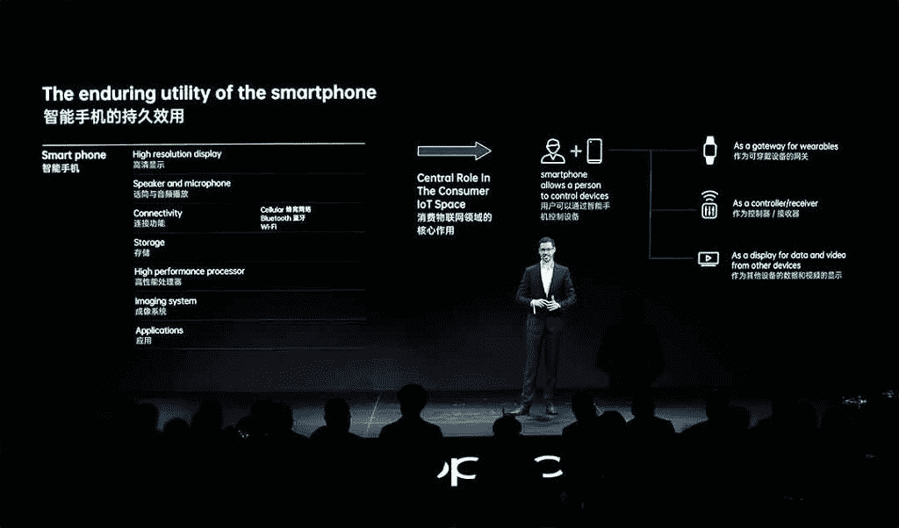

# OPPO 希望在 2020 年不仅仅是一个智能手机品牌

> 原文：<https://www.xda-developers.com/oppo-smartphone-brand-2020/>

OPPO 在智能手机行业已经存在了很长一段时间，早在 Android 时代甚至更早就存在了。长时间的人会想起像 OPPO N1 T1 这样的设备，六年前，早在 2013 年，它采用了旋转摄像头设计，并提供了 T2 的 CyanogenMod 版 T3。2014 年，OPPO N3 继承了这款手机的[电动旋转摄像头设计](https://www.oppo.com/in/smartphone-n3/)，当时手机仍然只有一个后置摄像头。OPPO Find 7 和 [Find 7a](https://www.xda-developers.com/oppos-next-find-is-a-7/) 等设备也被认为是 OnePlus One 等传奇设备的兄弟，因为它们在硬件上相似，并且软件定制[相对容易](https://www.xda-developers.com/how-to-root-the-oppo-find-7a-quickly-xda-developer-tv/)。

虽然这些例子可能是我们想起旧的 OPPO 智能手机时会想起的例子，但该公司实际上已经在智能手机业务领域存在了 11 年。OPPO 是步步高电子旗下最大的智能手机品牌，但该公司是从耳机和放大器开始其旅程的。现在，该公司已经扩展到几个不同的业务，其中超过一半与物联网、云计算和人工智能有关。与大多数科技公司一样，OPPO 认为自己的未来在于基于互联网的服务。形成这一愿景的中心点是智能手机和 ColorOS，它们的安卓 UX。

ColorOS 拥有超过 3 . 2 亿的月活跃用户。虽然考虑到 Android 的采用人数，这个数字可能不是一个巨大的数字，但从绝对数字来看，它仍然是一个令人生畏的数字。因此，OPPO 的手机及其软件成为他们努力实现智能连接的中心焦点——是技术和服务融合、组织融合、文化融合以及技术、艺术和人文融合的核心。当然，引领这些努力的将是 5G 的到来，它被用作不同技术相互集成的催化剂。

 <picture></picture> 

Tom Morrod, Executive Director of IHS Markit, Presenting the Intelligent Connectivity Whitepaper at OPPO Inno Day 2019

### 5G

OPPO 声称在 5G 专利所有权方面处于领先地位，在 20 多个国家申请了专利，分布在 2500 多个专利家族中，并有超过 3000 个 3GPP 标准文档。在更广泛的范围内，截至 2019 年 10 月 31 日，OPPO 申请了超过 40，000 项全球专利，其中超过 14，000 项已获授权。OPPO 还声称，在授予中国公司的专利方面，它在中国排名第三。除了 5G，OPPO 的专利也延伸到了 VOOC，核心专利超过 1000 项。所有这些专利都是多年来在 R&D 持续投资的结果，而且我们可以期待更多，因为 OPPO 最近宣布从去年开始在 CNY R&D 投资 100 亿美元。该公司目前拥有四个研究中心和六个研究所，其 R&D 部门的员工超过 10，000 人。在接下来的三年里，[它计划投资](https://www.oppo.com/en/about-us/press/oppo-plans-7bn-r-d-push-to-build-a-multiple-access-smart-device-ecosystem/)多达 500 亿 CNY/70 亿美元进行研发，主要集中在云计算、人工智能和其他重要的硬件和软件技术上。

对于 5G，该公司计划实施三个关键战略:继续致力于核心技术 R&D，开发世界领先的技术；以智能手机为主要门户，构建智能设备的多门户生态系统；以及对用户服务和内容优化的持续反思。因此，OPPO 的愿景是整合一个智能设备生态系统，形成多个切入点，并相互协调。这些入口点可以是平行的，没有串扰，或者是重叠的、互连的并且能够相互通信。

### “三圈”体验

OPPO 的愿景还采取了该公司所谓的“3 圈”多设备体验集成的形式。

第一个圈子是个人圈子——最接近用户的设备，即智能手机、智能手表、耳机和其他高频使用的技术。智能手机占据了个人圈子的中心舞台，成为通过设备和云获得最大计算能力的超级平台。其次是智能手表，它可以收集和理解用户的关键身体数据，并提供另一个交互点，以实现更高优先级的对话。耳机紧随其后，实现语音交互，并成为基于语音的人工智能实时翻译和导航的接入点。当这三种技术融合在一起时，它们提供的体验将大于其各部分的总和。

第二个圆圈被称为垂直圆圈，它采用 5G CPE(客户驻地设备)的形式。 [OPPO 计划在 2020 年第一季度发布 5G CPE Hub](https://www.xda-developers.com/oppo-confirms-launch-smartwatch-5g-hub-ar-glasses-q1-2020/) 。这款即将推出的 5G hub 将接受 SIM 卡，并支持蓝牙、ZigBee 和 Zwave 连接，用于智能家居集成，允许用户同时连接多达 1000 台设备。

OPPO 设想中的第三圈是虚实融合，采取 AR/AI 眼镜的形式。通过 OPPO 新推出的运行在 OPPO 's Glass OS 上的 AR 智能眼镜，我们已经可以窥见这一点。这些眼镜在 OPPO Inno Day 上亮相，眼镜配有两个用于宽视野的鱼眼镜头、一个高清摄像头和一个用于 3D 重建的飞行时间(TOF)摄像头。AR 眼镜还支持 3D 环绕声，为用户提供身临其境的 AR 体验。在 AR 智能眼镜的舞台演示中，该公司展示了一个人使用手势在行星之间导航来探索我们的太阳系。当人们通过眼镜导航时，眼镜也显示每个星球的信息。

对于 OPPO 作为一家提供智能手机以外体验的公司来说，未来一年将是重要的一年。越来越多的科技公司将寻求利用其在智能手机业务中的优势，提供更令人满意和互联互通的生活体验，OPPO 可以被视为发现自己处于成功实现这一愿景的有利位置的公司之一。随着规划的路线图涉及更多智能手机、更多配件、更多可穿戴设备和更多 5G 支持技术，2020 年将成为 OPPO 不仅仅是一个智能手机品牌的一年。

* * *

虽然 OPPO 目前是 XDA 的赞助商，但他们并没有指导或参与这篇文章的内容。OPPO 确实赞助了《XDA》编辑米莎尔·拉赫曼(Mishaal Rahman)上周参加创新日的旅行和住宿，在此期间，该公司发布了许多此类公告。