# 像素 2 XL XDA 显示分析:一个校准良好的软件包，有一些严重的错误

> 原文：<https://www.xda-developers.com/pixel-2-xl-xda-display-analysis/>

最近几个月， [Pixel 2 XL](http://xda-developers.com/tag/pixel-2-xl) 已经成为[许多争议的主题](https://www.xda-developers.com/google-pixel-2-xl-display-burn-issues/)，甚至在发布之前，关于这款手机显示屏的冲突就在酝酿之中。尘埃落定后，它变成了一种重复:Pixel 2 XL 的屏幕受到各种问题的困扰，包括过早老化、有棱角的颜色偏移、“*静音*”颜色、*黑色挤压*”和“*黑色涂抹*”。虽然这些问题中的一些可以归结为糟糕的显示器生产，但有些方面需要更彻底的研究。我们将尽可能深入地探讨 Pixel 2 XL 的显示性能。

 <picture>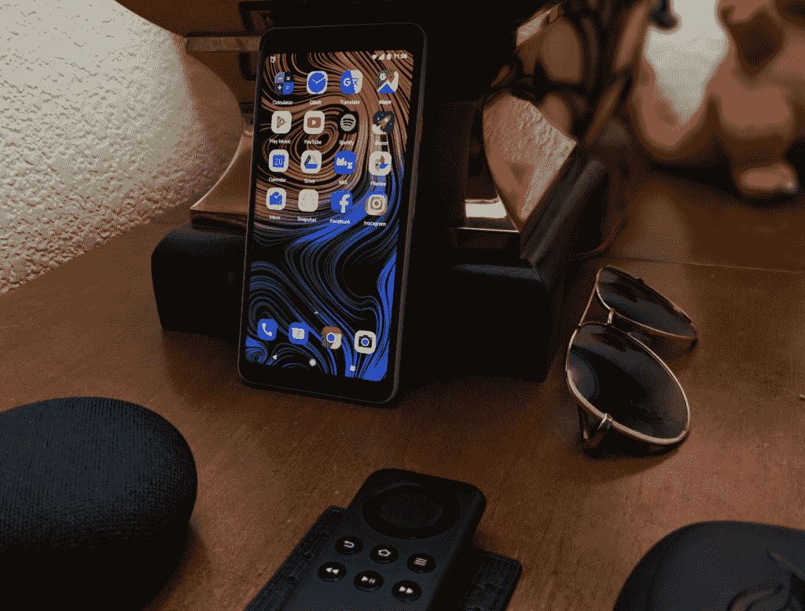</picture> 

Pixel 2 XL Home Screen, Natural Profile

Pixel 2 XL 是谷歌 2017 年旗舰手机阵容中的大兄弟，搭载由 **LG** 制造的 **5.99 英寸极化**显示屏。屏幕看起来非常清晰，这要归功于其 **2880×1440** 的分辨率，其像素位于一个*五边形菱形像素*排列中。

**五边形菱形像素**阵列通过使用更少的蓝色子像素(比红色和绿色子像素退化得更快)来提供固有的子像素抗锯齿并延长面板寿命。因此，五边形子像素排列的子像素总数比大多数 LCD 上的常规 RGB 条纹子像素图案少三分之一，但是五边形子像素排列利用了人类视觉皮层对绿色和亮度(与色度相比)的敏感性。屏幕保持 1:1 的绿色子像素与像素比率，使 PenTile 显示器具有与传统 RGB 条纹显示器相同的*亮度*分辨率，同时引入潜在的彩色边缘，但在 Pixel 2 XL 的像素密度下，看不到边缘，屏幕在大多数情况下看起来非常清晰。值得注意的例外是虚拟现实，但钻石像素形状确实有助于减轻可怕的[屏幕门效应](https://www.vrheads.com/what-screen-door-effect-and-why-does-it-happen)。

这不是谷歌第一次在其手机中使用这种显示技术；[谷歌 Pixel](http://xda-developers.com/tag/pixel) 、[谷歌 Pixel XL](http://xda-developers.com/tag/pixel-xl) 、 [Nexus 6P](http://xda-developers.com/tag/nexus-6p) 、 [Nexus 6](http://xda-developers.comt/tag/nexus-6) 和 [Galaxy Nexus](https://forum.xda-developers.com/galaxy-nexus) 都有五分之一像素排列的有机发光二极管面板。此外，所有手机的有机发光二极管显示器都能够输出 sRGB 色域之外的颜色。几乎所有内容颜色都是根据 sRGB 色域有意描述的，因此显示器能够正确呈现这些颜色非常重要。问题是，这些手机最初并没有在原生显示模式下对内容进行色彩管理，导致颜色的色度远远超过了原始内容创建者的预期。谷歌率先解决了这个问题，发布了 Pixel 2 和 Pixel 2 XL，以及 Android Oreo，后者为支持宽颜色的设备引入了[颜色管理](https://www.xda-developers.com/color-rendering-android-why-all-oems-must-offer-an-srgb-mode/)。

对于 Pixel 2 和 Pixel 2 XL，[谷歌表示](https://productforums.google.com/forum/#!topic/phone-by-google/FRyoLZZjXvo)“他们的设计意图之一是实现更自然和准确的色彩再现”。我们将评估 Pixel 2 XL 的显示性能，并总结谷歌在颜色准确性方面的努力是否值得。

* * *

# 色差度量

我们将使用色差测量 ***CIEDE2000*** (简称为*δ**E*)，对亮度进行补偿，作为色度准确度的度量。也存在其他色差度量，例如 CIE 1976*u’v’*色度图上的色差*δ**u’v’*，但是这些度量在感知均匀性方面较差，因为颜色之间的可察觉差异(JND)的阈值可能变化很大。例如，0.008*δ**u’v’*的色差对于蓝色来说在视觉上是不明显的，但是对于黄色来说相同的测量色差是非常明显的。CIEDE2000 是由[国际照明委员会(CIE)](http://www.cie.co.at/) 提出的行业标准色差度量，它最好地描述了颜色之间的感知均匀差异。这种度量通常在其计算中考虑亮度，因为亮度是完整描述颜色的必要组成部分，这在将显示器校准到特定亮度时很有帮助。然而，智能手机显示屏会不断改变亮度，在不同亮度水平下测量显示屏时，整体误差可能会有所波动。为此，亮度误差将在我们的*δ**E*值中得到补偿，因此仅测量色度。显示器颜色测量将在 200 *cd/m* 的显示器亮度下进行，以确保一致性，呈现的亮度误差将按照标准 sRGB 伽马幂函数 2.2 进行参考。

一般来说，当色差*δ**E*低于 3.0 时，色差仅在诊断条件下才明显，例如当被测颜色和目标颜色在被测显示器上紧挨着出现时。否则，色差在视觉上是不明显的，看起来是准确的。1.0 或更小的色差*δ**E*被认为是完全无法与完美区分的，并且即使当与目标颜色相邻时，看起来也与目标颜色相同。

* * *

# 聪明

 <picture></picture> 

100% APL Brightness Device Reference Chart

我们的 Pixel 2 XL 单元在 100% APL 时达到最大亮度 **474** ***cd/m*** ，或*平均画面级别*(每个子像素相对于设定显示亮度的平均有效亮度百分比)，这与 Pixel 1 的 412 *cd/m* 和 Pixel 2 的 432 *cd/m* 相比是一个可观的增长。注意，这个测量是在 2017 年 11 月 Android 8.0 更新后*进行的，谷歌称[将 Pixel 2 XL 的最大亮度降低了 50 尼特](https://productforums.google.com/forum/#!topic/phone-by-google/y1FWSMFcDgA) ( *cd/m* *)* 。这种降低仅在较低 APL 时才明显，此时像素 2 XL 应该足够亮。无论如何，Pixel 2 XL 在 100% APL 下的显示亮度与 Note 8 在 100% APL 下在自动亮度下测量的 480 *cd/m* 亮度具有竞争力，手机的亮度过驱动处于活动状态。*

数字媒体消费的平均 APL 徘徊在 40%左右，因此在该 APL 范围内进行亮度测量更加实际。在 50% APL 的情况下，我们的 Pixel 2 XL 的测量值为 **530** ***cd/m*** ，这对于户外使用来说已经足够亮了，但被 Note 8 之类的产品击败了，我们在 50% APL 的情况下测量值为 643 *cd/m* 。与 Note 8 不同，Pixel 2 XL 不提供亮度过驱动功能，并在自适应亮度*打开*或*关闭*时保持相同的最大亮度。

显示屏降至最低亮度的**4.1****CD/mT5【自适应亮度*关闭*。启用自适应亮度后，显示屏会降至**1.6*****CD/m****-**大约与大多数其他智能手机显示屏一样低。***

 ** * *

# 灰度精确度和强度

准确的灰度和白点是产生准确色彩的基础。灰度变化会将误差传播到显示器的整个色域(100%原色除外，即红色、蓝色和绿色)，因此在测量色彩准确度时，分析显示器的灰度以评估误差的主要来源绝对至关重要。[谷歌表示，他们将](https://productforums.google.com/forum/#!topic/phone-by-google/y1FWSMFcDgA)Pixel 2xl 的显示屏校准到了 **D67 白点**，这对任何追求精确色彩的人来说都不是一个好的开始。

 <picture>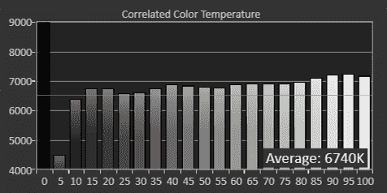</picture> 

Pixel 2 XL Correlated Color Temperature Chart, Natural Profile

平均相关色温确实在谷歌声称的 6700K 左右。较高强度的白点甚至变得更冷，在 95%白色时达到峰值 **7239K** ，这在大多数内容背景的范围内。从这个细分中，我们可以看到显示器在几乎所有强度下都发生了蓝移，这将影响颜色混合，尤其是二次色。请注意，自然和增强颜色配置文件的灰度完全相同。

 <picture>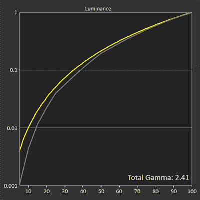</picture> 

Pixel 2 XL Luminance Chart

Pixel 2 XL 的显示伽玛有些令人担忧。sRGB/Rec.709 的标准目标伽马是一致的 **2.2** 的功率曲线。然而，Pixel 2 XL 的显示器伽马似乎遵循一条 **2.4** 的功率曲线，这在 BT.1886 推荐之前的高清电视中很流行。因此，混合色在手机显示屏上可能会显得更暗，黑色之间的亮度范围会增加。这是有帮助的，因为人眼对较暗颜色的变化比对较亮颜色的变化更敏感，尽管只有当观察者处于黑暗环境中时，这种变化才真正明显。

2.4 的功率曲线是正确的目标——许多高清电视仍然以这个功率曲线为目标——但是谷歌没有看到将这个变暗的功率曲线应用于智能手机的后果。更高的伽马功率意味着黑暗环境中的电影院和大型电视。智能手机是在各种照明条件下使用的较小的设备，因此产生的较低强度的颜色并不是在所有环境下都理想，比如晴天的室外。较低的 gamma 幂函数(如 2.0)可以更好地满足这些要求，以提供更好的低强度颜色可视性。

此外，Pixel 2 XL 的较高功率曲线进一步削减了接近 0%强度的黑色。“碎黑”是当前一代有机发光二极管显示器固有的硬件限制，因为它们具有绝对最小的非黑色级别，除非在非常高的亮度级别，否则通常不会暗到足以提供完整的 8 位深度强度。对于坚持使用 2.4 的显示器灰度系数的显示器校准器，BT.1886 建议通过建议较低强度的初始较低功率曲线斜升到 2.4 的功率曲线来部分地补救黑色削波问题。接近黑色级别的较低伽马将有助于照亮这些少数初始亮度级，这种伽马规格更适合那些希望将电影般的感觉应用到智能手机显示屏上，同时最大限度地减少破碎黑色的原始设备制造商。

 <picture>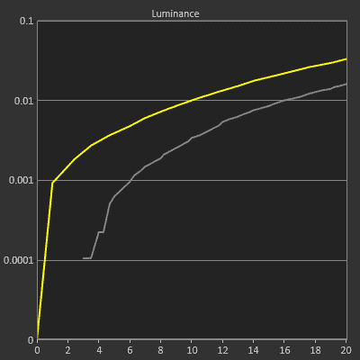</picture> 

Pixel 2 XL Lower Luminance Range, Natural Profile

在 Pixel 2 XL 的情况下，似乎**谷歌正在使用一个异常高的初始伽马功率函数——**，对于较低的亮度范围，它甚至高于 2.4 — 。这将比正常的有机发光二极管显示器更大程度地削减黑色，并将对观看较暗的电影和视频产生负面影响。在对较低的 20%亮度范围进行全阶测量的过程中，我们的 Pixel 2 XL 的强度标度看起来参差不齐，并且剪切了中间阶，正如在亮度范围的前 6%中看到的水平直线和突然、陡峭的变化。任何低于 3%的都将被粉碎。

请注意，当查看休闲媒体消费时，较浅的阴影可能会被压成黑色，因为剪裁为黑色的阈值会随着内容 APL 的增加而增加。此外，夸张的黑色破碎和锯齿状强度比例似乎是谷歌在将显示器校准到 sRGB 时不正确地转移了 Pixel 2 XL 的强度比例的结果。

 <picture>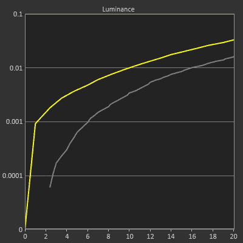</picture> 

Pixel 2 XL Lower Luminance Range, Saturated Profile

当像素 2 XL 设置为其原生显示色域时，强度比例变得更加平滑，剪裁到黑色的阈值从 3%降至 2.4%，使像素 2 XL 在黑色剪裁方面与 Note 8 保持一致。Pixel 2 XL 和 Note 8 都将从更高的初始伽马值中受益匪浅，以使黑色变亮并最大限度地减少黑色削波。

 <picture>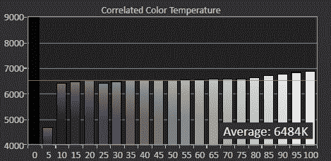</picture> 

Pixel 2 XL Correlated Color Temperature Chart, Saturated Profile

令人惊讶的是，Pixel 2 XL 在其原生显示色域中拥有任何智能手机显示器中最准确的灰度，甚至超过了我们的 Note 8 单元。

 <picture>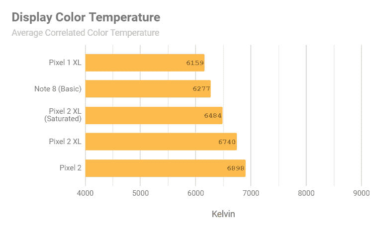</picture> 

Color Temperature Devices Reference Chart

 <picture>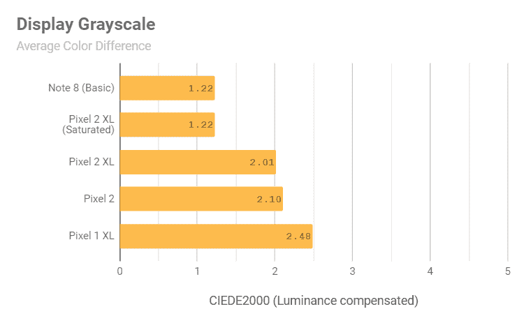</picture> 

Grayscale Devices Reference Chart

尽管有更高的伽玛和有意的白点变化，Pixel 2 XL 的灰度仍然精确到 sRGB/Rec.709 规范。自然和增强色彩配置文件上的灰度产生平均色温 **6740K** 和平均灰度色差*δ****E*****= 2.01**。在饱和色彩配置文件上，这是 Pixel 2 XL 的原生显示色域，Pixel 2 XL 有一个令人震惊的，感知上**近乎完美的** **平均灰度色差*δ******E*****= 1.22**。从这些测量结果来看，谷歌似乎有可能提供具有原生色域灰度精确度的 sRGB 色彩配置文件，或者更好的是，像三星和其他公司一直在做的*色温滑块*。这是对 Pixel XL 的 sRGB 灰度精确度的全面改进，尽管 Pixel XL *确实有一个更受欢迎的 2.2 的伽马幂函数。Pixel 2 XL 在自然和增强颜色配置文件上的灰度不如 Note 8 在基本屏幕模式下的灰度准确，但 Pixel 2 XL 的灰度准确性很好，在没有诊断参考的情况下，视觉上是准确的。*

* * *

# 饱和度和颜色准确度

开箱即用，Pixel 2 XL 默认采用谷歌的增强色彩配置文件，其目标是将 sRGB 色域[向各个方向扩展 10%](https://productforums.google.com/forum/#!topic/phone-by-google/y1FWSMFcDgA)以略微增加色彩活力。谷歌声称已经默认了这一模式，因为[“人类认为小屏幕上的颜色不那么鲜艳，比如智能手机”](https://productforums.google.com/forum/#!topic/phone-by-google/y1FWSMFcDgA)。虽然这似乎是一个好主意，但谷歌没有考虑人眼对光的非均匀敏感性:虽然红色似乎略有增强，但绿色和黄色得到了更显著的增强，使它们的高强度混合物变成了病态的霓虹灯，蓝色看起来几乎没有得到任何增强。

在分析 Pixel 2 XL 的默认配置文件之前，我们首先来看看手机的自然色彩配置文件，它以 D67 白点为目标，针对 sRGB 色域。

* * *

# *自然色彩配置文件*

 <picture></picture> 

Pixel 2 XL Saturation Sweep Measurements Plot, Natural Profile

 <picture>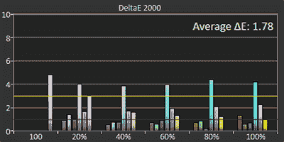</picture> 

Pixel 2 XL Saturation Sweep CIEDE2000 Chart, Natural Profile

 <picture></picture> 

Pixel 2 XL Saturation Sweep Luminance Error Chart, Natural Profile

 <picture>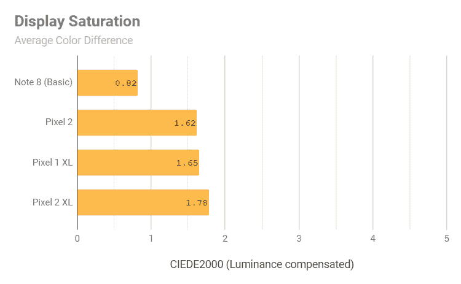</picture> 

Saturation Devices Reference Chart

在 CIE 1976*u‘v’*色度图上，像素 2 XL 覆盖了大约 92.3%的 sRGB 色域，在接近 100%强度的红色处明显不足。然而，需要注意的是，CIE 1976 *u'v'* 色度图在感知上并不均匀，红色的感知色差远没有图中显示的那么严重；100%红色的色差其实只有 1.34 的 a*δ**E*，视觉上是察觉不到的。灰度中的蓝移在二次色中变得明显，品红色和青色都向蓝色移动，黄色稍微向绿色倾斜。尽管二次色色相偏移，像素 2 XL 适当地饱和其大多数颜色的*、平均饱和色差***δ******E*****= 1.78**和最大饱和色差****E*****

 ****做* ***不做*** *把饱和度误认为亮度*；Pixel 2 XL 的显示器达到了除青色之外的所有饱和度目标，青色会过饱和，但其电影显示 gamma 产生的颜色可能看起来比通常更暗，因为 gamma 更适合弱光观看。然而，由于 Pixel 2 XL 在几乎所有亮度级别下的整体蓝移，红色伽玛始终较高，这意味着红色相对于其他颜色混合物必然会稍微暗一些，如上面的亮度差异图所示。

 <picture>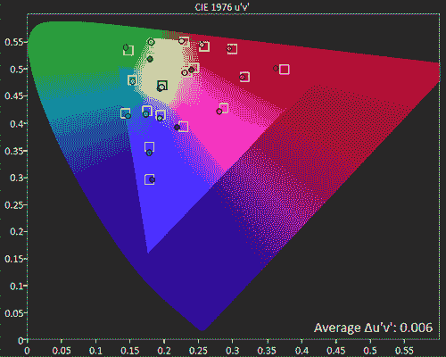</picture> 

Pixel 2 XL X-Rite ColorChecker Measurements Plot, Natural Profile

 <picture>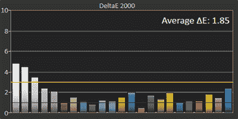</picture> 

Pixel 2 XL X-Rite ColorChecker CIEDE2000 Chart, Natural Profile

 <picture></picture> 

Pixel 2 XL X-Rite ColorChecker Luminance Error Chart, Natural Profile

 <picture>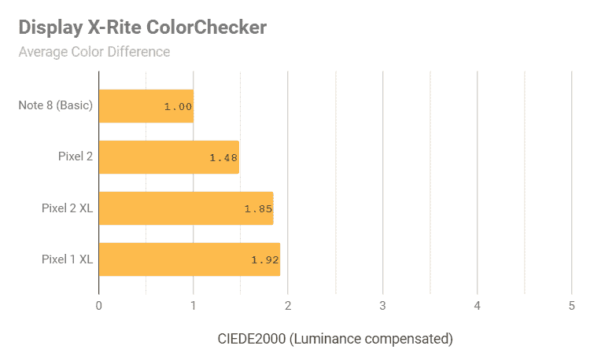</picture> 

X-Rite ColorChecker Devices Reference Chart

[X-Rite ColorChecker](http://xritephoto.com/colorchecker-passport-photo) ，以前称为 GretagMacbeth ColorChecker，是一组用于测试显示器颜色准确性的颜色。它不同于饱和度扫描，它使用照片和自然中经常出现的颜色混合，如肤色和树叶，这些颜色混合很难精确地以数字方式再现。查看显示器的 X-Rite ColorChecker 颜色准确性有助于推测显示器在照片和电影中的颜色表现，而饱和度扫描更适合更坚实、更生动的内容，如应用程序图标、徽标、彩色壁纸、动画和应用程序界面元素，如 Android 的 action bar。像素 2 XL 在色彩检查器中表现非常好，在青色坐标(0.1473，0.1473)处，平均 X-Rite 色彩检查器色差*δ****E*****为 1.85，最大非灰度 X-Rite 色彩检查器色差*δ***E*****= 2.41*****

 *** * *

# *增强的颜色配置文件*

 <picture>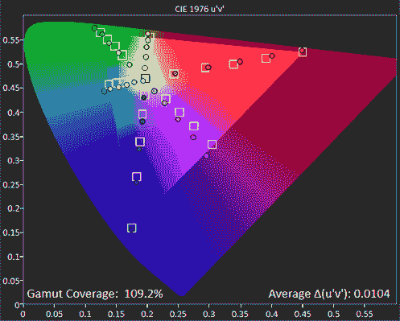</picture> 

Pixel 2 XL Saturation Sweep Measurements Plot, Boosted Profile

 <picture>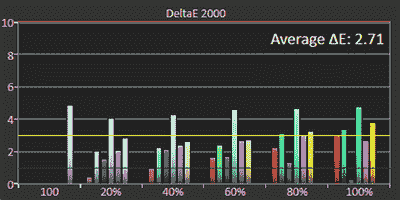</picture> 

Pixel 2 XL Saturation Sweep CIEDE2000 Chart, Boosted Profile

 <picture>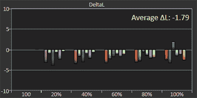</picture> 

Pixel 2 XL Saturation Sweep Luminance Error Chart, Boosted Profile

跳到 Pixel 2 XL 的默认增强色彩配置文件，我们可以看到它几乎覆盖了 CIE 1976 *u'v'* 色度图上 110%的 sRGB 色域。相对于增强的颜色轮廓，接近 100%强度的红色似乎仍然缺乏。也就是说，与自然颜色配置文件(*δ*E*= 1.34)相比，增强颜色配置文件上的 100%红色确实具有更大、更明显的色差*δ**E*= 3.01，尽管红色在增强配置文件中更亮的外观补偿了它在自然配置文件中太暗的外观。对照正常的 sRGB 色域进行测量，增强的色彩配置文件具有一个**平均饱和度色差*δ******E*****= 2.71**，高于自然色彩配置文件中的值(如预期)。*

 <picture></picture> 

Pixel 2 XL X-Rite ColorChecker Measurements Plot, Boosted Profile

 <picture>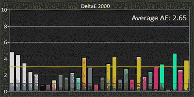</picture> 

Pixel 2 XL X-Rite ColorChecker CIEDE2000 Chart, Boosted Profile

 <picture>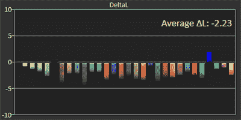</picture> 

Pixel 2 XL X-Rite ColorChecker Luminance Error Chart, Boosted Profile

总的来说，Pixel 2 XL 的增强色彩配置文件是一种在保持准确性的同时略微增加显示器活力的好方法。主要问题是饱和度的增加并不均匀，黄色和绿色显示出最明显的活力增加。

* * *

# *饱和色配置文件*

谷歌没有*明确*提到饱和色彩配置文件被校准到 DCI-P3 色域，但它已经声明它将 Pixel 2 XL 放在它的原生显示色域中，Pixel 2 XL 规格表暗示它覆盖了 100%的 DCI-P3 色彩空间。它的原生色域必须是 DCI-P3 或更大的色域，因此我们将根据 DCI-P3 色域来测量它。

 <picture></picture> 

Pixel 2 XL Saturation Sweep Measurements Plot, Saturated Profile

 <picture>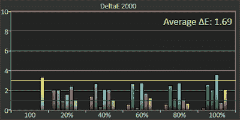</picture> 

Pixel 2 XL Saturation Sweep CIEDE2000 Chart, Saturated Profile

 <picture></picture> 

Pixel 2 XL Saturation Sweep Luminance Error Chart, Saturated Profile

我们可以看到，Pixel 2 XL 的原生显示色域以一个**平均饱和色差*δ******E*****=*****1.69***拟合 DCI-P3 色彩空间，比其自然色彩配置文件的平均饱和色差(*δ**E*= 1.78)更准确。这种模式经过精细校准，只有两个颜色目标值的色差*δ**E*大于 3:白点和 100%青色。其余测量的颜色几乎没有明显的差异，饱和颜色配置文件上的颜色没有变暗，而是变亮了。大多数颜色在 Pixel 2 XL 的显示屏上会显得稍微亮一些，但蓝色不会。

* * *

# 有机发光二极管的弱点

 <picture>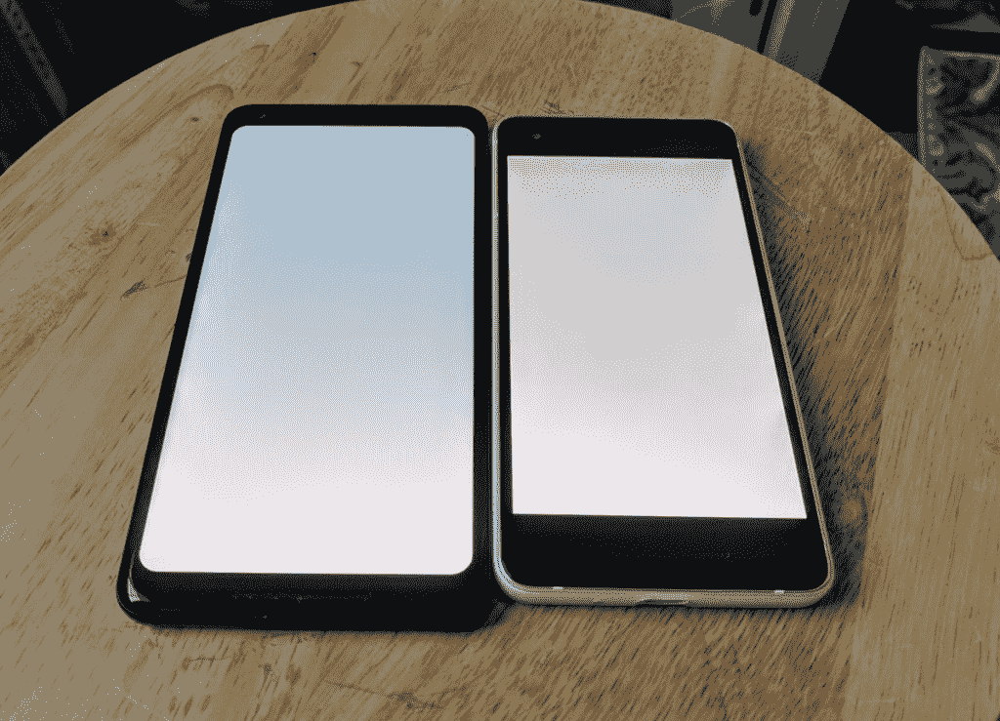</picture> 

Pixel 2 XL (left), Pixel 2 (right)

基于腔的有机发光二极管显示器的缺点之一是它们的白色角度依赖性，这导致显示器在不同的角度改变颜色和亮度。在我们的 Pixel 2 XL 单元上，当倾斜一个角度时，显示器损失很少的光，**但当从垂直方向观看时，出现了严重的角度颜色向蓝色偏移的情况**。

Pixel 2 XL 上的色彩偏移比 Pixel 2 上的要差得多，Pixel 2 有三星制造的有机发光二极管显示屏。这两款手机使用不同的有机发光二极管设计模式来解决角度色偏问题，Pixel 2 XL 的 LG 面板 LED 在远离垂直方向观看时逐渐转变为不同的颜色，Pixel 2 的三星面板在红色和蓝色之间交替变色，随着远离垂直方向观看，颜色变化的严重性增加，直到它完全“呈彩虹状”接近平行。

*像素 2 XL(左)，像素 2(右)*

有机发光二极管显示器的另一个弱点是，它们的单个二极管开启比关闭需要更长的时间，蓝色子像素点亮最快。当低亮度颜色在黑色背景周围移动时，这会导致重影、果冻或“黑色拖影”效果，反之亦然。我们的 Pixel 2 XL 单元表现出正常水平的重影，与 Note 8 相当。

[video width = " 360 " height = " 640 " MP4 = " https://static 1 . xdaimages . com/WordPress/WP-content/uploads/2017/12/VID _ 2017 11 26 _ 175636 _ 2 . MP4 "]

*注释 8(顶部)，像素 2 XL(底部)*

* * *

# 显示比较

 <picture></picture> 

Pixel 2 XL (left), Note 8 (right)

当并排比较 Pixel 2 XL 和 Note 8 显示屏的照片时，它们起初看起来非常相似。然而，温度差异立即变得明显。在上面的对比中，Pixel 2 XL 较冷的温度在蓝天碧水中非常突出；Note 8 的暖色调将它们向后拨了一点，并通过左上角的高光和底部的栏杆夸大了太阳的热量。两者都没有得到完全正确的照片—Pixel 2xl 太冷，Note 8 太暖 —b 但是 Note 8 不那么强烈的轮廓使这张照片更加准确。

 <picture></picture> 

Pixel 2 XL (left), Note 8 (right)

转到这张*完美的自拍照*，两个显示器的温度对肤色的影响是显而易见的。较冷的温度会使肤色显得苍白，而较暖的温度会使肤色显得更丰富。人眼对肤色非常敏感，同样，两种显示器都不能完全正确地拍摄照片—Pixel 2 XL 使皮肤显得太苍白，Note 8 对较低的肤色强度来说则显得太温暖。然而，Note 8 是两者中更精确的。

以下是更多并排的照片:

Pixel 2 XL 整体上非常准确地渲染了照片，尽管由于谷歌坚持让显示器感觉“新鲜”，所以略显寒冷。当与朋友分享媒体时，大多数显示器确实倾向于具有较冷的白点，因此您可以放心地知道灰度将看起来相似，并且在相同色彩空间(几乎所有计算机、笔记本电脑和 iPhones)内查看它的其他人将看到相同的照片。

* * *

# 结论

尽管谷歌在调整 Pixel 2 XL 的显示屏方面做出了一些有问题的决定，但它的自然色彩配置文件 — 确实校准良好、准确，比大多数高清电视、电脑显示器和许多智能手机显示屏都更准确。大多数颜色错误在非诊断条件下是不明显的，许多是完全察觉不到的。这种有意的冷色调有望成为谷歌在未来的更新中为那些不喜欢冷显示屏的人解决的问题。然而，谷歌的一些用户界面设计决策，以及更暗的伽马射线，可能很难说服人们 Pixel 2 XL 使用与苹果 iPhones 相同的颜色配置文件。其中一些设计决定包括应用于 Pixel 2 XL 原生启动器底部的白色渐变，以及它的小应用程序图标。苹果的 iPhone 主屏幕看起来更加丰富多彩，因为它们的应用程序图标和图标形状更大(圆形正方形比圆形填充率更高)，比安卓和谷歌的应用程序图标使用更少的空白空间和更鲜明的颜色。

Pixel 2 XL 在饱和色彩配置文件中的原生色域被精确地校准到 DCI-P3 色域，因此当更多的 Android 应用程序进行色彩管理时，我们可以预计该设备可以正确地呈现宽色彩(当然，当使用饱和色彩配置文件从表面上使色彩看起来更生动时，这并不重要)。有一个很大的角度向蓝色偏移，在我们的设备上比在竞争对手的显示器上更严重。然而，许多用户已经发布了他们的设备的照片，这些照片没有表现出太多的角度色彩偏移，所以最终可能会归结为一个质量控制问题，或许谷歌和 LG 可以在未来一代有机发光二极管显示器中加强这一点。LG 面板的好处是，它很少出现角度*亮度*偏移，而且它不会像三星的面板那样在极端角度出现彩虹——一旦显示器达到最大颜色偏移，它在平行之前看起来完全均匀，而三星的显示器在远非平行的情况下会难以辨认。最大限度地减少这种颜色偏移将是理想的，改进可以使其优于三星目前的颜色偏移解决方案，即改变颜色偏移的色调和严重程度。

我们的设备还展示了较小的显示器颗粒，只有在离显示器很近的距离观察时才能注意到。这也因单位而异，因此可以通过更严格的质量控制来补救。

我们的 Pixel 2 XL 单元显示器也感觉中空，当敲击或触摸顶部玻璃时，会产生比平常更大的声音。这是由于玻璃下截留了过多的空气，这可能是由于有机发光二极管屏幕层压到智能手机机箱时屏幕附着力差造成的。这个气囊充当声音和振动的容器，使扬声器发出的音频振动屏幕，比紧密贴合的屏幕有更大的反馈。Pixel 2 和大多数其他当代智能手机都没有这个问题，但大多数旧设备都有。我们推测他的设计缺陷可能是谷歌第一次使用 3D 大猩猩玻璃和塑造有机发光二极管显示器时的疏忽。

显示器伽玛可以说是 Pixel 2 XL 显示器校准中最矛盾的方面，因为它呈现的色调比大多数用户习惯的要暗。作为移动设备，显示器灰度系数应该更低或更动态。Pixel 2 XL 的伽马值更高，这使得在阳光下观看媒体更具挑战性，即使显示器变得足够亮。同样，显示器伽玛，以及它从显示器的原生色域到 sRGB 的不当转换(导致黑色挤压)，都可以在软件中改变——这只是取决于谷歌是否找到足够的理由来这样做。

对用户来说，最麻烦的显示问题是个人问题，其中一些问题对于这么贵的手机来说似乎是压倒性的，但购买谷歌手机的相同原因——他们的软件——也是这里的主要问题，所以一定要让他们知道！

* * *

[**查看 XDA 的 Pixel 2 XL 论坛！>>>**](https://forum.xda-developers.com/pixel-2-xl)******