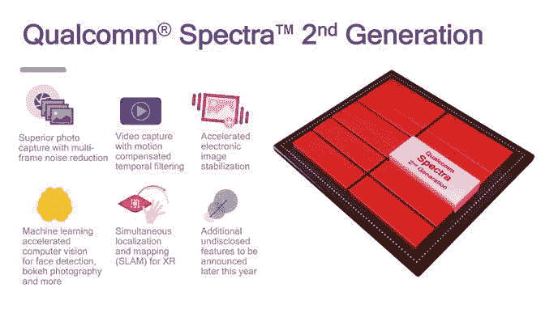
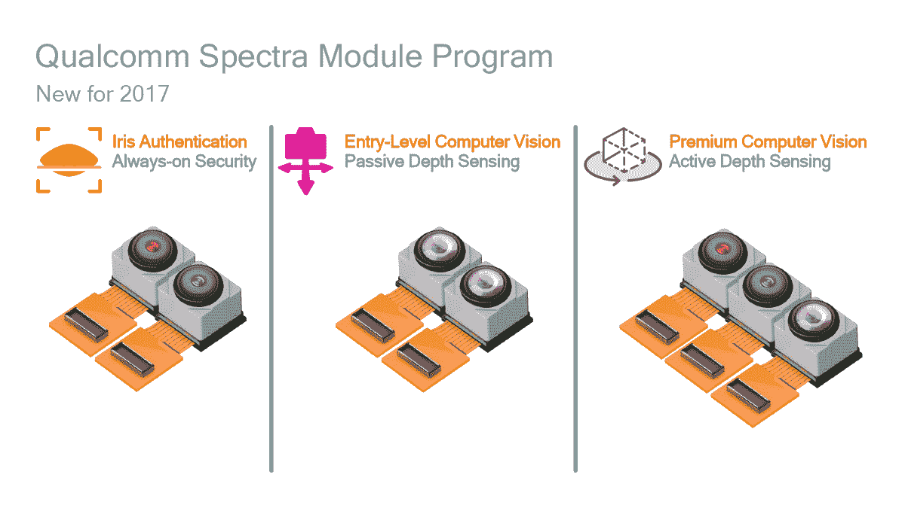

# 高通第二代 Spectra ISP 提高照片和视频质量

> 原文：<https://www.xda-developers.com/qualcomm-second-gen-spectra-isp-massive-improvements-smartphone-photography/>

在周三的高通骁龙技术峰会上，高通终于揭开了其最新的骁龙移动平台:骁龙 845。新的片上系统的一个重要组成部分是 Spectra 280 图像信号处理器(ISP)，这是一个加速片上处理的协处理器。它在骁龙 845 中进行了彻底的重新设计，有很多新的东西。

不出所料，第二代 Spectra ISP 尤其擅长处理图片和视频。**高通集成支持改进的多帧降噪，**很像在谷歌 Pixel 2 和 2 XL 的[+](https://www.xda-developers.com/google-camera-hdr-ported/)和小米 Mi Note 2 的[手持微光模式](https://www.xda-developers.com/xiaomi-mi-note-2-review-solid-first-step/)中看到的。它还实现了**运动补偿时间滤波(MCTF)和改进的电子图像稳定(EIS)** ，通过利用骁龙 845 的异构计算能力来提高整体图像质量。

其他主要功能包括慢动作视频、 [HDR 记录](https://www.xda-developers.com/qualcomm-snapdragon-845-spectra-uhd-premium-video/)和高速性能捕捉，以及 **InMotion、**一种使用计算摄影和视频捕捉在移动背景上叠加静止图像的功能。

 <picture></picture> 

Source: Qualcomm

但高通也希望凭借新的 Spectra ISP 进入扩展现实(XR)市场，建立在它在 [Snapdragon 835 头戴显示器](https://www.xda-developers.com/qualcomm-announces-the-snapdragon-835-virtual-reality-development-kit/) (HMD)平台上的成功基础上。

虽然像 [Project Tango](https://www.xda-developers.com/tag/google-project-tango/) 这样基于红外的深度传感技术在地图绘制环境中非常出色，但这些设备的额外红外传感器在中入门级价格点上并不特别划算。这就是为什么新的 Spectra 集成了一个基于**视差的深度传感系统**，它的工作方式很像人眼，从两个镜头的角度判断物体的相对距离。高通表示，它将**使许多双摄像头设备以低得多的成本实现有竞争力的深度传感性能**。

Spectra 280 ISP 的深度感测功能将通过实现头部和身体跟踪的亚 16 毫秒运动到光子延迟来实现身临其境的 VR/AR/XR 体验，具有 **6 个自由度和同步定位和绘图(SLAM)系统(非均匀加速),可模拟和跟踪佩戴者周围的环境**。低于 16 毫秒的延迟允许 60 Hz 的单帧响应，这对于在特别激烈的游戏和应用中的舒适性至关重要。

它还支持比其前身更高的 VR 头戴设备的每眼分辨率。Snapdragon 835 在每秒 60 帧的情况下最高可达 1.5k x 1.5k，但骁龙 845 和 Spectra 280 在每秒 120 帧的情况下可达 2k x 2k。高通表示，它正在与谷歌、Vive、Oculus 和其他公司合作开发即将推出的高分辨率耳机。

 <picture></picture> 

Source: Qualcomm

当然，第二代 Spectra 仍然支持高通的 Clear Sight 技术，以及骁龙芯片组目前支持的双摄像头双焦距配置。但它也增加了一些新的东西:**对虹膜扫描和深度感应的原生支持**。高通声称，在其首选配置中，低功耗虹膜扫描的认证时间已经低于 40 毫秒，即使你戴着太阳镜也能工作。

除了虹膜扫描之外，第二代 Spectra ISP 还允许设备利用其深度映射功能进行**面部扫描，作为另一种活体安全措施**，为利用这一优势的设备中改进的生物特征认证打开了大门。高通说，Spectra 280 的深度感应还将改善新设备上的散景效果和重新对焦/后期捕捉效果的质量。

不过，将由原始设备制造商在软件中实现它。

* * *

**你对第二代 Spectra ISP 的改进有什么看法？请在评论中发表意见！**