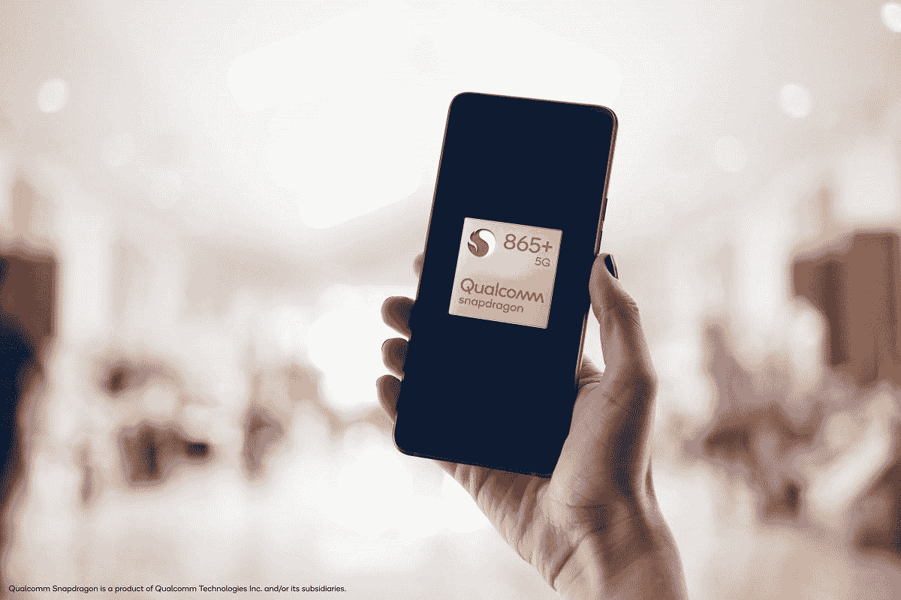

# 高通骁龙 865 Plus 带来了更快的 CPU 和 GPU、Wi-Fi 6E 和蓝牙 5.2 支持

> 原文：<https://www.xda-developers.com/qualcomm-snapdragon-865-plus-launch/>

在 2019 年骁龙科技峰会上，高通宣布推出骁龙 865，[其旗舰移动平台](https://www.xda-developers.com/qualcomm-snapdragon-865-processor-specifications-features/)用于 2020 年的旗舰 Android 移动设备。到 2020 年，片上系统已经成为迄今为止最好的智能手机 SoC，击败了 [Exynos 990](https://www.xda-developers.com/samsung-exynos-990-5g-modem-5123-7nm/) 、[麒麟 990](https://www.xda-developers.com/huawei-hisilicon-kirin-990-5g-integrated-modem/) 和[联发科天玑 1000L](https://www.xda-developers.com/mediatek-dimensity-1000-7nm-soc-integrated-5g/) 。它已经出现在广受好评的旗舰产品中，如一加 8 系列、小米 10、骁龙 Galaxy S20 变体等等。尽管骁龙 865 仍然是安卓智能手机市场的佼佼者，但高通已经以骁龙 865 Plus 的形式推出了中期更新。这遵循了之前骁龙中期更新的模板，如 2019 年的[高通骁龙 855 Plus](https://www.xda-developers.com/qualcomm-snapdragon-855-plus/) 和 2016 年的骁龙 821。

骁龙 865 加是骁龙 865 的后续。据高通称，骁龙 865 已经为 140 多种设备提供了动力(已经宣布或正在开发中)。这个数字是今年由单个移动平台支持的单个高端设计的最高数字(尽管我们还没有看到这些设计中的大多数进入市场)。

 <picture></picture> 

A reference design of the Qualcomm Snapdragon 865 Plus.

除了三点之外，新的骁龙 865 Plus 与常规的骁龙 865 基本相同。首先，Kryo 585 (ARM Cortex-A77) CPU 的主内核现在的时钟频率高达 3.1GHz，高于普通骁龙 865 的 2.84GHz 时钟速度。3.1GHz 的最高时钟速度最终符合 ARM 对 Cortex-A77 的理想预测。去年的骁龙 855 Plus 将其 Prime 内核(基于 ARM Cortex-A76)的时钟速度提高到了 2.96 GHz。Kryo 585 Prime 内核的 3.1GHz 时钟速度是迄今为止骁龙 SoC 中最高的。其余 CPU 内核的时钟速度保持不变。

其次，Adreno 650 GPU 的图形渲染速度提高了 10%。这表明高通已经提高了 GPU 的时钟速度，但新闻稿中没有提供具体细节。去年的骁龙 855 Plus 也比常规的骁龙 855 提高了 15%的图形性能，因此增量改进的水平是相似的。应该注意的是，10%的 GPU 性能提升不足以匹配苹果 A13 的 GPU，例如，峰值和持续 GPU 性能的增量仍然太大，Adreno 650 性能的 10%提升难以克服。即将推出的苹果 A14 也将扩大苹果在这里对高通的领先优势。另一方面，GPU 性能 10%的提升将扩大高通在 Android 市场上对其 SoC 竞争对手的领先优势，因为迄今为止，其他 SoC 供应商甚至没有一家能够匹敌常规 Adreno 650 的 GPU 性能。Exynos 990、麒麟 990 和 Dimensity 1000L 中分别采用的 Mali-G77MP11、Mali-G76MP16 和 Mali-G77MC9 在 GPU 性能基准测试中的表现都比高通差，表现出较低的性能功耗比。

最后，也是最重要的一点，骁龙 865 Plus 采用了高通新的 [FastConnect 6900](https://www.xda-developers.com/qualcomm-fastconnect-6900-fastconnect-6700-wifi-6e-bluetooth-5-2-high-end-android-devices/) 移动连接系统，支持 Wi-Fi 和蓝牙。这是在 2020 年 5 月宣布的，它带来的头条功能是支持 [Wi-Fi 6E](https://www.xda-developers.com/fcc-opens-1200mhz-spectrum-6ghz-band-wi-fi-6e/) (Wi-Fi 6 扩展到 6GHz)和蓝牙 5.2。根据高通的说法，FastConnect 6900 的最高 Wi-Fi 速度可达 3.6Gbps，是业界最快的速度。速度的提高是由于美国 FCC 为 Wi-Fi 释放了 1200MHz 的 6GHz 频谱。有关更多信息，请查看我们关于 FastConnect 6900 的[发布文章。](https://www.xda-developers.com/qualcomm-fastconnect-6900-fastconnect-6700-wifi-6e-bluetooth-5-2-high-end-android-devices/)

骁龙 865 Plus 还继承了常规骁龙 865 的功能，如高通骁龙精英游戏功能的完整军火库，全球 5G 和“超直观”的人工智能。据说，它可以提供桌面质量的游戏，具有第一移动功能，如可更新的 GPU 驱动程序和桌面正向渲染，高达 144fps 的 5G 游戏，以及真正的 10 位 HDR 游戏。与普通的骁龙 865 一样，骁龙 865 Plus 采用了高通的 Hexagon 698，带有 Hexagon 矢量扩展和 Hexagon 张量加速器，第五代人工智能引擎，双 14 位 Spectra 480 ISP，[骁龙 X55 5G 调制解调器-射频系统](https://www.xda-developers.com/qualcomm-snapdragon-x55-5g-modem-2019-android-smartphones/)，高通 Quick Charge 4+充电技术，等等。它采用 TSMC 的第二代 7 纳米 DUV (N7P)工艺生产。

高通骁龙 865 Plus 将出现在下一波旗舰手机中，包括华硕 ROG 手机 3 和联想军团 3。高通表示，基于骁龙 865 Plus 的商业设备预计将于 2020 年第三季度发布，我们知道第一批产品将于本月发布。