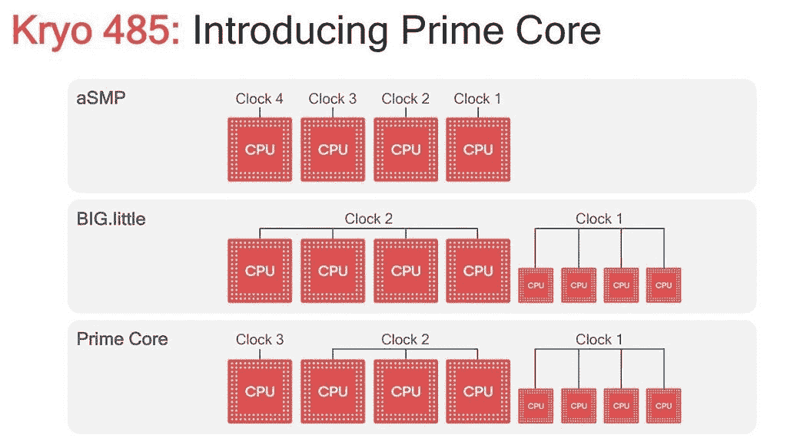
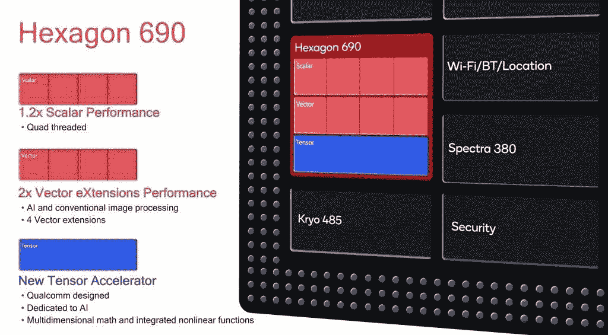

# 采访:骁龙 855 的 Kryo 485 和 Hexagon 690 上的高通

> 原文：<https://www.xda-developers.com/qualcomm-travis-lanier-snapdragon-855-kryo-485-cpu-hexagon-690-dsp/>

上个月，高通发布了骁龙 855 移动平台。骁龙 855 是一个移动平台，将在 2019 年为大多数 Android 旗舰智能手机提供动力。高通在他们的下一代移动平台上取得了实质性的逐年改进。骁龙 855 移动平台基于 7 纳米制造工艺，CPU 性能比骁龙 845 高出 45%，令人印象深刻。全面的计算改进使高通在新的骁龙 855 上拥有出色的人工智能性能。这里有很多信息要解开，我们已经尽最大努力向[展示高通如何提高骁龙 855 的性能和人工智能](https://www.xda-developers.com/qualcomm-snapdragon-855-performance-gaming-ai-improvements-explained/)。然而，在产品发布后，我们仍然有自己的问题，所以我们与高通产品管理高级总监 Travis Lanier 坐下来，谈论高通新移动平台上的 Kryo 485 CPU 和 AI。

* * *

***马里奥塞拉费罗***:**“45%【跳】，好像是有史以来最大的。让我们打开它。我们有 A76 基础，7 纳米，这些都是很大的贡献者。似乎自从你们离开了定制核心，一些出版物和观众还没有太多的线索，关于构建在 ARM 上的许可证需要什么，它可以允许你做什么。你对这意味着什么一直守口如瓶。现在是你们第一次站在舞台上，至少超越 Q & As，...但是你第一次展示了一些改进，这很酷。所以我们想知道你是否愿意详细介绍高通如何调整 Kryo 485，以从 [ARM 的底座](https://www.xda-developers.com/arm-cortex-a76-cpu-mali-g76-gpu-mali-v76-vpu-announcement/)中挤出更多东西，这是否是对你在那里展示的东西或你没有展示的东西的扩展。”**

> ***特拉维斯·拉尼尔*** :“所以我真的不能对我幻灯片里的其他内容说太多。也许在未来的某一天我们可以，这样我们就可以坐下来找一些真正做这项工作的专家；我知道高层的谈话要点。但如你所知，A76 已经是高水准的设计了——相当不错。这也是我们看到 ARM 路线图的原因之一。所以我想，好吧，也许我们应该和这些人更密切地合作，因为它看起来非常强大。回到你对定制和 ARM 的评论。好吧，你可以做所有这些事情。如果你在做某件事，它需要有差异化，所以你可以百分之百地做某件事，或者与他们合作。和前几年一样，我们更加关注整合。总线，我们如何连接到系统，我们放入 CPU 的安全特性，缓存配置。既然合约已经持续了很长时间，我们就能够对此进行更深入的定制。这就是我们如何能够将其中一些东西放入其中，例如更大的[无序]执行窗口，对，所以你有更多的指令在运行，数据预取实际上是微处理器行业目前最具创新性的领域之一。许多这些事情的许多技术都非常相似，现在每个人都使用 TAGE 分支预测器，只是你提供它有多大，人们知道如何进行无序和转发，以及更大的缓存的所有东西。但是预取，仍然有很多，这是那些黑暗艺术类型的东西之一。所以这个领域仍然有很多创新。所以这是我们觉得可以帮忙的事情。
> 
> 只是因为我们觉得我们通常做得更好...通常我们可以比其他人更快地实现一个设计来集成一个流程节点。所以当我们把这些东西放进去的时候，比如当你变得更加无序的时候，你的设计就会承受更多的压力，对吗？把所有这些执行的东西都加在里面不是自由的。所以，要做到这一点，并且不影响你的最大值。是的，这是我们与 ARM 合作的一部分，就像您如何实现它们一样？"

***马里奥·塞拉费罗*** : **“出于好奇，在演示中，您谈到了预取带来的效率提升，您是在谈论电源效率、性能提升，还是两者兼而有之？”**

> ***特拉维斯·拉尼尔*** :“以上皆是。因此，从本质上来说，我们正在进行预取——您已经在缓存中提取了内容。因此，当高速缓存没有进行太多内存访问时，预取也有另一面:如果预取太多，就会[使用]更多内存，因为[你]进行了太多的推测性预取，但就目前而言，如果你有数据，并且正在提取正确的数据，那么你就不会去内存中提取数据。因此，如果你有一个更高效的预取器，你就可以节省电力，提高性能。”

***马里奥·塞拉费罗*** : **“好的，酷，耶。是的，我没想到你们还能扩展更多，但是，有趣的是，如果你说现在你们正在定制更多，也许将来你们能分享更多，那么我会继续关注这一点。所以另一种令人着迷的东西，至少在我周围的人中，是主要的核心。因此，随着 DynamIQ 的加入，我们预计未来几年将会有更灵活的集群安排，我们预计其他公司将会放弃 4+4 安排。所以有两个问题:主核背后的动机是什么？主内核如何有利于用户体验，因为我们的读者想知道为什么那里只有一个单独的内核，以及为什么它不是一个单独的内核？如果您使用 DynamIQ 并独立使用它，与性能集群共享电源层会不会减少一些您可以获得的效用？”**

> ***特拉维斯·拉尼尔*** :“那么我们先来说说不同的时钟和不同的电压平面。所以每增加一个时钟，每增加一个电压，都要花钱。因此，封装上的引脚数量是有限的，不同的时钟需要更多的 PLL，复杂性也随之增加。所以做事是有代价的。我们在某一点上走了极端。我们在四个不同的时钟上有四个不同的域，所以我们有这方面的经验，而且成本很高。当你开始做大的时候。LITTLE 是指小型集群上的小型内核，它们不需要相同的粒度，也就是说，不需要小型内核之间的独立时钟。是的，你用这些做什么还不确定。所以当你有一个大的。小系统，反过来你有这些大核心。好吧，好吧，你把这些都放在一个大钟上吗？嗯，如果你实际上处于一个足够低的位置，一个空闲的时钟无论如何都会在一个小内核上运行，那么你就不会一直运行在这些内核上。所以真的，两个就够了。
> 
> 然后我们有了这个主内核，我们有一个独立的时钟内核，可以运行到更高的频率。但是，这些其他核心、其他性能集群无法达到同样高的频率。因此，如果您想要获得该内核的全部权利，您需要为该内核提供第三个时钟。那么这个核心是做什么的呢？我们稍微提到了这一点。大事情将是应用程序启动器和网络浏览。那么为什么只有一个内核呢？好吧，现在事情越来越多了。例如，游戏引擎——我一会儿会回到这个话题——正在非常积极地向更多线程发展。但如果你看看大多数应用，即使它们有多个线程，我也会使用帕累托法则，像大多数应用一样，80%的负载都在一个线程中。因此，您可以启动应用程序，它可能会在所有 8 个内核上启动并亮起。但更有可能的是，80%都在一个占主导地位的线程中——在那个核心中。我想说，网页浏览仍然主要是 JavaScript——网页浏览随着多线程技术的发展变得更好了，你可以有多个图像，你可以对它们进行解码。但是，举例来说，JavaScript——单线程将在一个内核上运行。因此，有大量的使用案例受益于这个非常高的内核。
> 
> 现在，我们有三个内核以较低的频率运行，但它们的能效也更高。因此，无论何时，我不知道你对内核的实现了解多少，但无论何时，当你开始达到频率的最高值，以及这些内核的实现时，都会有功耗的权衡，在最后几兆赫或千兆赫内，事情开始呈指数级增长。是的，所以我刚才谈到，所有的游戏都开始多线程化，就像突然之间，如果你回头看，不久前有几个游戏，它们只使用一个线程。但奇怪的是，这个行业的变化如此之快。就像在过去的一年，一年半，他们真的开始把所有这些游戏放入…我对这些高保真游戏感到兴奋。因此，尽管很多东西仅仅是半年到一年前，但实际上它已经席卷了整个中国。在中国，我听到“我真的不在乎大内核，给我一个 8，给我八个最小的内核，这样我就可以有八个内核。”他们改变了，因为他们想要这些游戏，这些游戏需要大内核。现在，我们从合作伙伴那里得到反馈，“不，我们实际上想要四个大内核，”因为所有高级游戏都即将推出。他们将使用所有这些核心。
> 
> 所以当你玩游戏时，你不会玩 30 秒或 5 分钟，你会玩得更久。因此，这是有意义的，我们在大多数多线程大内核用例中都有这三个内核，它们希望有更高的能效。这是一种平衡，当您在一些持续的情况下需要这种更高性能的内核时，他们也有大内核，您有更高能效的解决方案与之搭配。这是一种想法——有点不寻常的对称。但希望这能回答为什么有一个主核，为什么没有独立的时钟，为什么没有独立的电压？所以我想我触及了所有这些。"
> 
>  <picture></picture> 
> 
> Kryo 485 CPU core configuration. Source: Qualcomm.

**:**“现在，异构计算。这就是高通从旧品牌转移到移动平台以来一直强调的，那种描述符，以及描述某些性能指标(如人工智能)的聚合块。在转换到更加异构计算方法方面，进展如何？从设计到执行到营销，或者任何你能接触到的东西。”****

 **> ***特拉维斯·拉尼尔*** :“有点来回。但最终，你必须拥有这些引擎，因为移动领域的游戏名称是能效。现在你有时会看到它每隔一段时间就回归到一个概括。如果你回到最初，即使是智能手机，功能手机在某种程度上也有多媒体和相机功能，所以它们有所有这些专用的小东西，因为你做不到。如果你回到基于 ARM 9 或 ARM 7 的手机，它们都有硬件加速小工具。
> 
> 但给你一个例子，有些东西变得通用，然后现在他们又要求硬件，会是 JPEG。以前有 JPEG 加速器。CPU 最终变得足够好，它足够省电，JPEGs 的大小保持不变，嘿，你知道吗，我们只是继续在 CPU 上做，因为这样做更容易。现在，随着图片变得越来越大，突然间，人们会说，你知道，实际上，我希望这些非常巨大的照片文件的大小能够加快。CPU 不是不够快，就是消耗太多能量。这只是突然有兴趣在潜在的 JPEG 加速器了。所以事情的发展并不总是一条直线，然后你必须看看摩尔定律现在是怎么回事。每个人都不停地说，嘿，你可能没死，但它慢了一点，对不对？因此，如果你不能从每个下一个节点获得功率提升或性能提升，如果你没有这种开销，你如何继续在手机上添加更多功能？所以你可以把它放在中央处理器上。但是，如果您的 CPU 没有更多的空间，您如何加速这些事情呢？答案是，你把所有这些专门的核心和东西更有效。所以这是一种自然的张力。
> 
> 你会看到人们被迫为普通功能做这些事情，因为也许不是每个人都会处于风口浪尖。但我们肯定会尽可能长时间地留在那里，但如果晶圆厂不一定在下一个节点，我们就不能强迫它们转移到那里。因此，这就是为什么您必须关注持续创新和这些架构，以继续获得更好的性能和能效。这就是我们的优势和背景。"

*他们仍然专注于“我想看看 CPU 数量，因为我关心这个。“他们希望看到 GPU 数字，因为他们喜欢游戏，等等。他们不认为它们是一个完整产品的沟通部分。你如何看待高通已经、并且能够打破这种模式，因为竞争对手实际上一直专注于具体的逐块改进营销？具体来说，[我们将]转移到神经网络，神经引擎的东西。”*

> 特拉维斯·拉尼尔 :“我希望我今天谈到了一些。例如，我们专注于持续游戏，所以你可能在所有游戏基准测试中得分都很高。人们对此很着迷。但实际上，重要的是，如果你在玩游戏，你的每秒帧数会一直保持在你希望的最高点吗？我认为人们对这些街区中的一个数字给予了太多的重视。这太难了，我理解那种想要给我一个数字告诉我什么是最好的愿望。实在是太方便了，尤其是现在的人工智能，简直是疯了。即使有 CPU 基准测试，CPU 基准测试测量什么呢？他们都测量不同的东西。拿任何一个基准测试来说，比如 GeekBench 有一堆子组件。你见过有人拆开这些子组件，看看哪一个与我实际做的事情最相关吗？”

***马里奥·塞拉费罗*** : **“有时候，我们会。”**

> ***特拉维斯·拉尼尔*** :“也许你们这些家伙就是这样。你们就像一个局外人。但就像可能一个 CPU 在这方面更好，可能一个在另一个方面更好。SPEC 也是如此，人们会强调一个 SPEC，嗯，好吧，其中有许多不同的工作负载。它们是非常紧密的东西，但即使是 SPEC，我们实际上用于开发 CPU，如果你看实际的工作负载，它们实际上相关吗？它非常适合比较工作站工作负载，但我真的在手机上进行分子建模吗？不。但是，我的观点是，大多数基准在某种程度上是有用的，但是您必须了解它的用途以及如何实现它。所以很难把事情浓缩成一个数字。
> 
> 我特别看到这一点——我在这里旋转了一点——但我现在看到人工智能，这太疯狂了。我看到有几个不同的东西不会为 AI 得到一个数字。正如我所说的 CPU，您有所有这些不同的工作负载，您试图得到一个数字。天啊，艾。有这么多不同的神经网络，和这么多不同的工作负载。你是用浮点运算，还是用整数运算，还是用 8 或 16 位精度运算？现在的情况是，我看到人们试图创建这些东西，我们选择了这种工作负载，我们以浮点方式完成了它，我们将在这一个网络和两个其他测试上加权 50%的测试，我们将在这一点上加权它们。好吧，真的有人在网上使用那个特定的工作负载吗？有真正的应用吗？人工智能令人着迷，因为它移动得如此之快。我告诉你的任何事情在一两个月后都可能是不正确的。这也是它的酷之处，因为它变化太大了。
> 
> 但是 AI 里面最大的不是硬件，是软件。因为每个人都在使用它，就像我在使用这个神经网络。基本上，这里有所有这些乘数。你优化了那个特定的神经网络了吗？那么，你是否为基准优化了一个，或者你优化了一个，所以有些人会说，你知道我已经创建了一个测量超分辨率的基准，这是一个超分辨率人工智能的基准。嗯，他们使用这个网络，他们可能是用浮点运算完成的。但是，与我们合作的每一个合作伙伴，我们要么设法做到 16 位和/或 8 位，并使用不同的网络。这是不是意味着我们不擅长超分辨率，因为这项工作无法与之匹敌？所以我唯一的观点是，AI 基准测试真的很复杂。你觉得 CPU 和 GPU 很复杂？AI 就是疯了。"

***马里奥·塞拉费罗*** : **“是的，有太多类型的网络，太多的参数化——不同的参数化导致不同的影响，它是如何计算的。”**

> 特拉维斯·拉尼尔 :“这会让评论家们忙个不停。”

***马里奥·塞拉费罗*** : **“但是，如果你想测量所有的事物，那就困难多了。但是没错，没人这么做。”**

***米沙勒·拉赫曼*** : **“这就是为什么你们更关注用例的原因。”**

> ***特拉维斯·拉尼尔*** :“我认为最终，一旦你展示用例，那就是你的 AI 现在有多好。归根结底是软件的问题，我认为它会在几年后变得更加成熟。但现在有太多的软件工作要做，然后改变，好吧，这个网络很热，然后明年，“哦，不，我们发现了一个新的网络，在所有这些事情上都更有效，”所以你必须重做软件。这太疯狂了。”

***马里奥·塞拉费罗*** : **“说到 NN，你有点替我过渡了，少给我别扭的过渡思维。移动到六边形。我想说，这是消费者，甚至是大多数爱好者，当然还有我的同事，最不了解的部分之一。你知道，特别是考虑到它不是作为一个人工智能模块引入的，就像整个数字信号处理的想法一样，你知道，当你引入一些东西时，原始的想法有点粘在一起，所以如果你正在做一些事情，好吧，这是一个具有神经、神经、神经大脑智能的神经系统的事情，它有点粘在人身上。他们有人工智能机器学习神经，神经，其他解决方案的神经标签。因此，我们想给你一个机会来解释 Hexagon DSP 的发展，为什么你还没有摆脱 Hexagon DSP、vector extensions 等听起来像工程的名称，这些名称不太适合营销。但没错，就像是快速概述一下 DSP 的前沿，看看它是如何从成像工作负载开始发展到全新的张量加速器的。”**

> ***特拉维斯·拉尼尔*** :“这实际上是一个有趣的观点，因为我们的一些竞争对手实际上拥有他们称之为神经引擎或神经加速器的东西——它实际上是一个 DSP，这是一回事。所以我想这个名字很重要，但是你提到了一个重要的问题，老实说，当我们把它放在那里是为了成像，我们只是碰巧支持 8 位。我记得我们在 Hot Chips 演讲，谷歌的皮特·沃顿找到我们，说，“嘿，你好..所以你们支持 8 位，是吗？“是啊，我们确实如此。因此，从那里，我们立即走出去，就像，嘿，我们已经得到了所有[这些]项目正在进行中。那时，我们将 TensorFlow 移植到 Hexagon，因为它就像是，嘿，我们已经有了这种 8 位支持向量处理器来做这件事，它就在我们的 Hexagon DSP 上。如果让我重来一遍，我可能会称它为六边形神经信号处理器。我们还有另一款 DSP，我们有标量 DSP，这是一款真正意义上的 DSP。我们称之为矢量 DSP。也许我们应该给它重新命名，也许我们应该叫它神经信号处理器，因为我们可能没有给自己足够的信任，因为，就像我说的，有些人他们只是有矢量 DSP，他们管它叫什么，他们还没有透露它是什么。我回答你的问题了吗？”
> 
>  <picture></picture> 
> 
> Hexagon 690 Overview. Source: Qualcomm.

***马里奥·塞拉费罗*** : **“所以，是的，没错可能是大部分。”**

> ***特拉维斯·拉尼尔**:“第二个问题是什么？”*

***马里奥·塞拉费罗*** : **“你如何看待这种内部发展。它是什么样的:经历，困难，挑战，无论你想告诉我们什么？你如何看待从图像处理开始到张量加速器的演变？”**

> ***特拉维斯·拉尼尔*** :“这有点令人沮丧，因为让我畏缩的事情就像一些媒体会举手说，“高通，你怎么落后了！你为什么不——你什么时候才能拥有一个专用的神经信号处理器？“我只想敲敲我的头。我觉得我们是第一个拥有向量处理器的人！但话虽如此，我们编辑了它，随着我们对人工智能的了解越来越多，可能会有更多的东西出现。所以，我们确实添加了另一个东西，是的，这个东西是——它只做人工智能，不做图像处理，作为 hexagon complex 的一部分，所以你可以提供……我们仍然称它为 hexagon DSP，我们称整个 complex 为 Hexagon 处理器，现在尝试为整个 Hexagon 事物获取一个捕获的名称。我们确实增加了更直接计算的东西，我不应该说直接计算，就像它自动管理你如何做矩阵相乘的高阶映射。”

***马里奥·塞拉费罗*** : **“张量实际上对我来说很难理解。不管怎么说，就好像它们也包裹着自己一样。”**

> ***特拉维斯·拉尼尔*** :“是的，我想是的，我在大学里上过线性代数课。我像男人那样做了，“我希望我再也不用那样做了！“他们带着复仇回来了。我想我就像是，'哦，伙计，微分方程和线性代数又回来了！'"

***马里奥·塞拉费罗***:****我觉得我的很多同事都没有赶上这一点。他们仍然认为 NPU 有令人困惑的一面，因为它只是一堆矩阵乘法、点积、非线性函数、卷积等等。我个人并不认为这种神经处理引擎的名字有什么帮助，但这就是问题所在，对吗？有多少没有被扩展、混淆、被命名惯例铲掉了某种潜在的数学，也许能做些什么呢？不知道你有没有想过这个。可以做些什么来告诉人们这是如何工作的？例如，为什么 DSP 可以做其他新的神经处理引擎可以做的事情？我的意思是，这只是数学，但似乎没有用户，读者，一些记者，理解这一点。我不是说这是高通的责任，但是你认为有什么不同的方法可以做呢？大概是我的责任。”****

 **> ***特拉维斯·拉尼尔*** :“老实说，我开始投降了。也许我们只需要给事物命名为“神经”。“我们刚刚谈到当我们开始看这些东西时，线性代数和微分方程如何让我们头晕，所以当你开始试图向人们解释这一点时，就像当你开始做回归分析时，你看着方程和东西，人们的脑袋会爆炸。你可以教大多数人基本编程，但当你开始教他们反向传播方程如何工作时，他们会看着这个，他们的头会爆炸。所以是的，有趣的东西。他们不想看到偏导数……”

***马里奥·塞拉费罗*** : **“偏导数链，不是跨标量而是跨向量，包括非线性函数。”**

> ***特拉维斯·拉尼尔*** :“祝你好运！是的，所以这很难，而且我不知道大多数人想知道这个。但是我尝试了:我放了一个小东西，比如，“嘿，我们在这里做的只是向量数学。我们有一个向量处理器。我想人们看到这个会说，“好吧，但是我真的想要一个神经加速器。”"“张量”仍然是数学上的，但我认为人们可能会更多地将它与人工智能处理联系起来。"

***马里奥·塞拉费罗*** : **“可以像弥合鸿沟，语义鸿沟。”**

> 特拉维斯·拉尼尔 :“最终，我认为这可以归结为，我们可能只需要想出一个不同的名字。”

* * *

*本文中的所有图片均来自 Travis Lanier 在骁龙科技峰会上的演讲。你可以在这里观看演示幻灯片[。](https://www.qualcomm.com/media/documents/files/snapdragon-855-performance-deep-dive-travis-lanier.pdf)*****