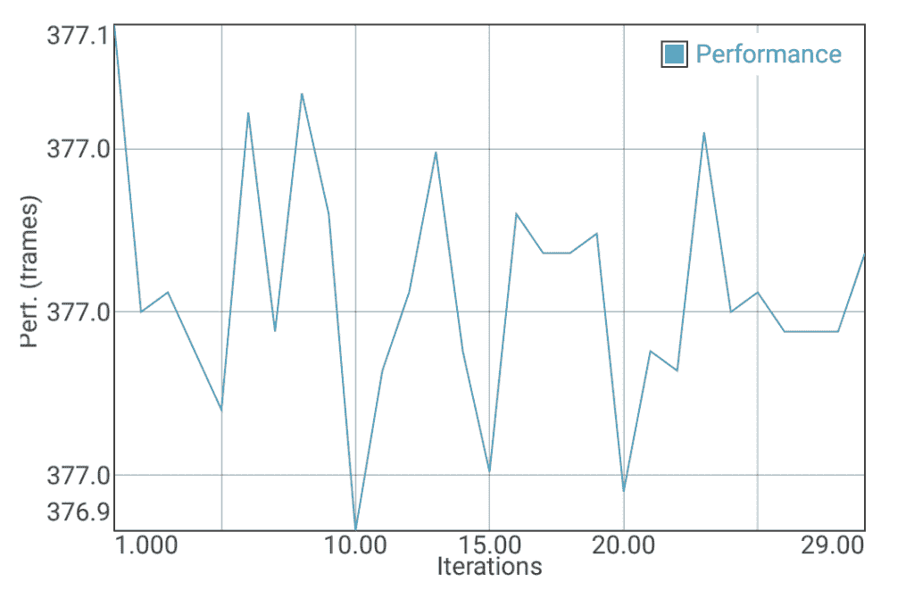

# 小米红米 Note 4 XDA 性能和续航评测(对比红米 Note 3)

> 原文：<https://www.xda-developers.com/redmi-note-4-xda-review/>

小米在印度开始了 2017 年，发布了他们在该国最成功的设备的下一代产品。[小米红米 Note 4](https://forum.xda-developers.com/redmi-note-4) 是去年[小米红米 Note 3](https://forum.xda-developers.com/redmi-note-3) 的继任者，后者因其性能和电池寿命而受到好评，[带来了其产品类别中最超值的套餐](https://www.xda-developers.com/xiaomi-redmi-note-3-xda-review/)。有了红米 Note 4，小米能在这两个方面有所提升吗？让我们来了解一下！

正如其前辈一样，小米红米 Note 4 有两种 SoC 版本:[一种采用联发科 Helio X20](https://www.xda-developers.com/xiaomi-announces-the-redmi-note-4-with-deca-core-helio-x20-soc/) ，另一种采用[高通骁龙 625](https://www.xda-developers.com/xiaomi-launches-the-redmi-note-4-snapdragon-625-variant-in-india/) 。除了这些芯片组，您还可以找到不同的 RAM +存储选项组合，如下所示:

| 

社会学

 | 

随机存取存储

 | 

内存储器

 |
| --- | --- | --- |
| 联发科 Helio X20 | 2GB | 16GB |
|  | 3GB | 64GB |
| 高通骁龙 625 | 2GB | 32GB |
|  | 3GB | 32GB |
|  | 4GB | 64GB |

我们的评估单元来自印度市场，因此它配备了高通骁龙 625 SoC，以及 4GB 的 RAM 和 64GB 的内部存储。

## 表演

我们评测的小米红米 Note 3(骁龙 650)在基准测试和现实世界中，SoC 在处理速度和能效方面的出色表现给我们留下了深刻的印象。在单独的性能集群中添加 2 个 Cortex-A72 内核，补充了效率集群中的 4 个 Cortex-A53 内核，使该设备能够轻松应对各种基准测试。Redmi Note 3 在平价细分市场的竞争中树立了绝对不可撼动的性能墙，这一事实在很大程度上促成了它成为小米在印度市场最成功的产品。

然而，从表面上看，小米红米 Note 4(骁龙 625)在纯粹的规格上落后于红米 Note 3(骁龙 650)。**高通骁龙 625** 搭载 **8x Cortex-A53** 内核，采用**14 纳米**制造工艺。据称，集群设置应该分为性能(4 个内核)和效率(4 个内核)组合(如预期的那样)，但在现实世界中，我们经常看到所有 8 个内核都能够达到 **2.0GHz 峰值时钟速度**并保持不变，因此我们倾向于认为集群的实施相当均匀。

Cortex-A72 内核的移除应该在性能密集型场景中感觉最好，而不是在 Cortex-A53 内核应该足够的日常使用情况下，尽管一些快速突发操作也可能会影响性能。缺少 A72 内核也会影响基准测试分数。需要改进的方面是电池寿命，因为 SD625 SoC 也将受益于 14 纳米制造工艺，而不是 SD650 的 28 纳米工艺。虽然这种优势也转化为在类似条件下更好的性能，但它在很大程度上被内核设置的差异所抵消。

那么小米红米 Note 4 到底怎么样呢？

### CPU 和系统

小米 Redmi Note 4 在基准性能方面处于中低端。它落后于其前身的几个基准，这与我们对规格表的初步评估一致。虽然 RN3 在其最佳性能时是一个强大的中端设备，但 RN4 充其量是一个高效的中端设备。

从帮助精确评估 CPU 性能的基准测试 GeekBench 开始，我们发现 Redmi Note 4 远远落后于 Redmi Note 3。RN4 的最高分是 841/2927，而 RN3 在我们上次评测中的最高分是 1492/3482。单个数字本身没有什么意义，但作为两代设备的比较，它表明了 2016 年产品和 2017 年产品之间纯粹的计算能力的下降。

其他通过抽象算法衡量性能的测试，如 BaseMark OS II 和 AnTuTu，也有类似的结果。与 Redmi Note 3 和 Mi Max(骁龙 650，3GB RAM)相比，BaseMark OS II 的总得分较低，尽管系统得分较高，内存得分较低，但还是出现了异常行为。红米 Note 4 上的 AnTuTu 得分也较低。差异的幅度可能不是很大，但它们始终存在。

我们确实发现的惊喜是在 PCMark 测试中，红米 Note 4 的得分高于小米红米 Note 3 和小米 Mi Max。事实上，在 PCMark 上的 Work 1.0 测试中，Redmi Note 4 的分数更接近于 OnePlus 3 的高通骁龙 820 SoC 和 6GB lpddr 4 RAM 分数(分别为 6692 和 6748)。这种行为令人惊讶，因为 PCMark 的测试并不完全是抽象的测试，而是采取一种整体的基准测试方法，将设备放在一个不太分散的测试环境中，该环境仍然使用系统资源。

PCMark 的结果反映了器件的总体性能。当我得知 Redmi Note 4 在纸面上比其前身降级时，我个人感到失望。**但是手机的实用性能给我留下了惊喜。**

MIUI 8 充满了动画，这可以给操作系统体验一种流畅的感觉，但最终感觉不那么爽快，也不那么即时。动作感觉刻意而缓慢，所以在使用手机的前几个小时，感觉好像该设备有意识地故意减慢动作，给底层 SoC 电源带来一种无能的空气。缓慢的反应时间非常明显，因为我从一个非常敏捷和反应迅速的 OnePlus 3 跳到了 Redmi Note 4。

在后期设置中浏览菜单时，我尝试了一些设置，以获得一种不会让人昏昏欲睡的体验。在开发者设置中，我将窗口动画、过渡动画和动画师持续时间的动画从默认的 1 倍加速到 0.5 倍，只是为了看看设备是否开始口吃。**我还关闭了内存优化和 MIUI 优化**，这两个设置在工作中是不透明的，并且在我过去的小米体验中被发现有损于真正的硬件潜力。我还关闭了电池设置中的“系统动画”,尽管我不确定这些动画指的是哪些动画仍然继续存在于所有预期的地方。

一旦动画加速，并关闭“*优化*”，红米 Note 4 的日常使用体验就可以与红米 Note 3 和该价格范围内的其他产品相媲美。这不是一种旗舰般的体验，因为应用程序仍然需要很长时间才能打开(当你完全关闭开发者设置中的所有动画时，这一点变得很明显)。但对于一个日常工作的普通用户来说，红米 Note 4 和理论上更好的红米 Note 3 之间不会有明显的区别。

> Redmi Note 4 凭借出色的散热性能让其前辈引以为豪

出色的性能带来了热节流。前身 Redmi Note 3 使用起来绝对是一种热快感，因为散热非常好，而且由于热量积累而产生的节流现象并不明显。Redmi Note 4 让其前辈感到自豪，因为它实现了相同的结果。在我们连续运行基准测试的节流测试中，Redmi Note 4 在温度上升时，基准测试分数仅略有下降。温度停滞不前，徘徊在 36°C 左右，性能只有微小的变化。请注意，由于我所在的城市处于热带气候，环境温度较高，因此这一特殊的节流测试从 30°C 的基准温度开始——在比较我们从 28°C 左右开始的其他设备评测的节流性能时，需要记住这一点。

另外要指出的是，骁龙 625 的最低频率是 652MHz，出于某种原因不能再低了。这款手机在电池方面仍然表现良好，我们将在本文后面提到这一点。

### GPU 和游戏

GPU 是红米 Note 4 显示出比红米 Note 3 降级幅度更大的一个领域。

RN4 利用了 **Adreno 506** ，而 RN3 利用了 Adreno 510。虽然 Adreno 506 基于**14 纳米**制造工艺，具有更高的时钟速度，但它的 ALU 数量更少(96 对 128)，GFLOPS 分数也更低(130 对 180)。Redmi Note 4 上的大多数游戏都以最低的图形设置作为推荐设置，但你可以在热门游戏上增加图形设置，同时仍保留可玩性。

GPU 的基准测试分数远低于 Redmi Note 3。红米 Note 4 在类似测试中的帧率大约为⅔。

另一方面，GPU 节流是绝对可以忽略的。诚然，GPU 不是最好的性能，但我们的节流分析表明，它是一个相当一致的性能。GFXBench 的曼哈顿 3.1 耐久性测试显示，该设备在连续 30 次基准测试中获得了相当一致的 377 帧的成绩。在测试中，分数的变化大约为 0.1 帧，因此虽然分数本身并不令人印象深刻，但一致性是令人印象深刻的。

 <picture></picture> 

GPU Throttling

说到游戏，大多数游戏在 Redmi Note 4 上的表现与在 Redmi Note 3 上的表现一样好。游戏开始时质量确实很低，但你可以毫无问题地将它们提升到最大细节，因为流行的游戏往往会人为地将大多数设备的帧率限制在 30。沥青 8 和战锤 40k Freeblade 在最高设置的游戏中没有产生 30FPS 上限的问题。另一方面，与 Redmi Note 3 在最高设置下达到的 55FPS 平均值相比，Dead Trigger 2 的性能更接近 45FPS。

从 CPU 和 GPU 性能部分可以看出，Redmi Note 4 确实是 Redmi Note 3 的实际降级。但是这种说法从其前景来看是相当短视的，因为实际场景中的性能几乎相等，差异不明显。在基准测试范围之外，红米 Note 4 不会被视为劣质设备，正常用户在处理日常任务时将无法区分红米 Note 3 和红米 Note 4。我甚至可以说，高级用户也无法区分骁龙 650 和骁龙 625 的性能，除非他们特意通过并排测试来寻找差异。

在我使用该设备后，我对小米决定采用没有性能集群设置的 SoC 更加放心，因为他们最终还是采用了令人印象深刻的封装。应用程序和操作系统的性能很快，流行的免费增值游戏通常以每秒每秒的速度达到最大，该设备在长时间使用的情况下表现令人钦佩，具有最小的节流和舒适的最高温度上限。

### RAM 管理和存储

Redmi Note 3 包装中最薄弱的环节之一是其有限的 RAM 和可居住的存储空间。基本版本配备了 2GB + 16GB 的 RAM 和存储组合，而更高版本将这些提高到 3GB + 32GB。我们回顾了 Redmi Note 3 的 2GB 版本，并注意到该设备令人失望的多任务处理能力。MIUI 在处理后台应用程序方面的笨拙以及它自身的臃肿最终给了我们一个非常糟糕的表现。我们对骁龙 650 SoC 的 3GB RAM 版本进行了 Mi Max 评测，注意到额外的 3GB RAM 为体验带来了改善。

通过 Redmi Note 4，小米试图解决这一问题。为了迎合更广泛的预算方案，该设备在印度有三种 RAM +存储组合: **2GB+32GB** 、 **3GB+32GB** 和 **4GB+64GB** 。我们的评测单元是最顶级的变体，我们的经验证实，在运行 MIUI 的设备上，更多的 RAM 实际上是好的，值得额外的成本。

> 在运行 MIUI 的设备上，更多的内存实际上是好的，值得付出额外的成本

然而，为了真正利用所有这些内存，人们需要关闭小米的 MIUI“***优化*** ”。这些设置试图无情地关闭后台应用程序和进程，旨在获得更长的“电池寿命”。因此，即使您可能有超过 2GB 的空闲内存，您也会发现您最后访问的后台应用程序会被关闭并在屏幕关闭时重置，或者您在意外呼叫到来之前正在玩的最后一个游戏已不在内存中，需要从头重新加载。

该设备的 **4GB LPDDR3** RAM 变体，没有 MIUI 的优化干扰，可以在内存中容纳超过 12 个应用程序。这足以满足大多数人的需求。当你有很多应用程序打开时，没有什么奇怪或异常的行为。你甚至可以从战锤 40K Freeblade 和沥青 8 这样的游戏切换回来，没有任何问题。至于在内存中保存应用程序，这种体验可以与现代旗舰产品相媲美。

格式化为 **EXT4 文件系统**的**64GB eMMC 存储** ( **用户可访问:56GB** )让 Redmi Note 4 在很大程度上可以与 Redmi Note 3 和 Mi Max 在读写速度上相媲美。唯一看到的改进是顺序写入速度，该设备更接近旗舰级性能。当将视频等大型文件写入内部存储时，高顺序写入速度会带来好处，因此，除非您计划在预算有限的设备上创建大量数据，否则这些改进的效果有限。

除了内部存储， **Redmi Note 4 还通过 microsd 卡插槽**(通过混合双 SIM 卡托盘)提供存储可扩展性。鉴于即使在基本版本上也没有 16GB 的存储选项，大多数用户自己会对 32GB 和 64GB 的选项感到满意。但是有选择总是好的，我们感谢这种选择。

小米红米 Note 4 上的 App 打开速度*还好*。看到这毕竟是一个预算设备，我们没有很高的期望。在大多数情况下，该设备提供的打开速度(冷启动)可与其他低端和廉价设备相媲美，并且正如自然预期的那样，与旗舰产品相比有灰尘的味道。即使与 Mi Max 相比，RN4 在 Play Store、Gmail、Hangouts 和 Chrome 的平均运行中打开应用程序(冷启动)的速度也要慢大约 1 秒。这个差别可能看起来很小，但如果你保持默认的 MIUI“*优化*”启用，它会在一天中累积起来。如果你不这样做，那么应用程序的热启动时间就会显著下降。

总体而言，在性能方面，小米 Redmi Note 4 是小米的另一个稳健的表现者。在某些领域，这是一种理论上的降级，但不会影响它在现实世界中的表现。重要的是要记住，小米这款手机的目标人群是预算受众，即喜欢联想 Moto G4 等设备的人。之前的 Redmi Note 3 在价格范围内绝对是一个庞然大物，甚至对小米来说也是一个过高的标准。因此，即使红米 Note 4 为明星拍摄并错过，它仍然以相当高的价格结束。

## 电池寿命和充电

Redmi Note 4 相对于 Redmi Note 3 的升级来自电池寿命部门，这本身就是一项成就。红米 Note 3 是我体验过的电池寿命最好的手机之一，仅次于小米 Max T1，并超过了 T2 OnePlus 3 T3。因此，超越这一点绝非易事。

为了向前和向后比较，我们在 PCMark 的两个电池寿命测试版本上测试了 Redmi Note 4。在 Work 2.0 上，该设备在最低亮度下的电池寿命为惊人的**16 小时 41 分钟**，而在最大亮度下的电池寿命为令人印象深刻的**8 小时 15 分钟**。在 Work 1.0 上，我们在评测 [OnePlus 3](https://www.xda-developers.com/oneplus-3-xda-review/) 、 [Mi Max](https://www.xda-developers.com/xiaomi-mi-max-xda-review/) 和 [Redmi Note 3](https://www.xda-developers.com/xiaomi-redmi-note-3-xda-review/) 时使用的是 Work 1.0，Redmi Note 4 在最小和最大亮度下的寿命分别为 19 小时 15 分钟和 9 小时 31 分钟。

> 小米红米 Note 4 是我迄今为止使用过的所有设备中电池寿命最好的

这里的大部分功劳，尤其是在电池性能指标评测期间，要归功于 4000/4100 mAh(最小值/典型值)的不可拆卸大电池和高通骁龙 625 SoC 及其基于 14 纳米 FinFET 制造工艺的 Cortex-A53 内核。高通声称与上一代产品(在这种情况下是骁龙 61x 系列)相比，功耗降低了 35%。小米声称电池寿命比红米 Note 3 增加了 25%。我们不同意这些数字，但与同类最佳产品相比，这无疑是一个显著的进步。

杀死这个设备是如此的困难，以至于为了测试充电时间，我们最终花了 1 小时 42 分钟试图让手机从 20%降到 0%！

就屏幕打开时间而言，大多数日子结束时，屏幕打开时间约为 6 个半小时，电池电量约为 25%。由于持续的 LTE 连接(由 Reliance Jio 提供)和双卡使用，我的使用在这些场景下被归类为重度使用。这 6 个小时将是 Chrome 浏览、Whatsapp、Telegram、Slack、Reddit Sync、YouTube 和大约 1 个半小时的 Ingress 和虚荣游戏的组合。当谈到电池时，Redmi Note 4 是纯粹的野兽模式，并且具有可接受的性能水平，在实现这些疯狂的数字方面根本没有权衡。

在中度到轻度使用的情况下，随着更多的设备待机和 wifi 切换，手机可以轻松维持两天的使用时间。普通用户绝对会对这款设备的电池续航时间感到满意，不管他们的使用强度如何。

这种疯狂的电池性能的最好部分是，这款手机在保持标准尺寸外形的同时，不需要庞大的电池和机身。正如我们将在我们的全面审查中展开的那样，Redmi Note 4 提供了令人愉快的人体工程学设计，并允许舒适的操作。

虽然电池寿命很疯狂，但小米 Redmi Note 4 的充电速度却完全相反。这款手机的包装盒里有一个 5V/2A 的充电器。小米没有提到该设备的任何快速充电功能，尽管骁龙 625 支持高通快速充电 3.0。

使用提供的箱式充电器充电持续需要**大约 3 个小时才能将**一台没电的小米红米 Note 4 充电至 100%。收费率朝着更高的百分比显著降低。

一小时的电量足以让电池从 0 到 50%。当手机处于空闲/睡眠状态时，充电时的外部温度保持在 36-38°C，尽管充电器本身在充电时可以达到 50°C 以上(这不是一个问题，因为没有人需要经常处理充电器，但这是值得一提的)。鉴于小米 Max 和红米 Note 3 的充电性能相似，我们原本希望小米在这方面做出改进，但可惜事实并非如此。

* * *

总而言之，Redmi Note 4 是一款电池怪兽，在大多数情况下都和它的前辈一样好。缓慢的充电速度被绝对疯狂的电池性能所抵消。这款手机不仅使用时间长，而且长时间使用也是一种享受。

对于一个廉价的设备，规格表没有公正的骁龙 625 在这个设备的性能。在日常使用中，你可能会感觉不到这款手机和它的前代产品在性能上有什么不同。游戏确实受到了一点影响，但这只是在你考虑到非常沉重和要求苛刻的游戏时。就峰值外部温度而言，该设备也很容易使用，CPU 和 GPU 的热节流可以忽略不计。RAM 性能是一个巨大的改进，我们很乐意推荐花费额外的现金，获得更高的 RAM 版本。存储也很丰富，因为小米已经取消了 16GB 的内部存储选项，基本版本的最低存储容量为 32GB，仍然支持 microsd 扩展。

小米 Redmi Note 4(骁龙 625)在印发售**₹9,999**(150 美元)2GB+32GB 选项；**₹10,999**(165 美元)用于 3GB+32GB 选项，而**₹12,999**(195 美元)用于 4GB+64GB 选项。这款设备通过 Flipkart 和 Mi.com 的闪购销售。

请继续关注我们对这款手机的全面评测，我们将看看这款手机的所有其他方面！

[**查看我们的小米红米 Note 4 论坛！**](https://forum.xda-developers.com/redmi-note-4)