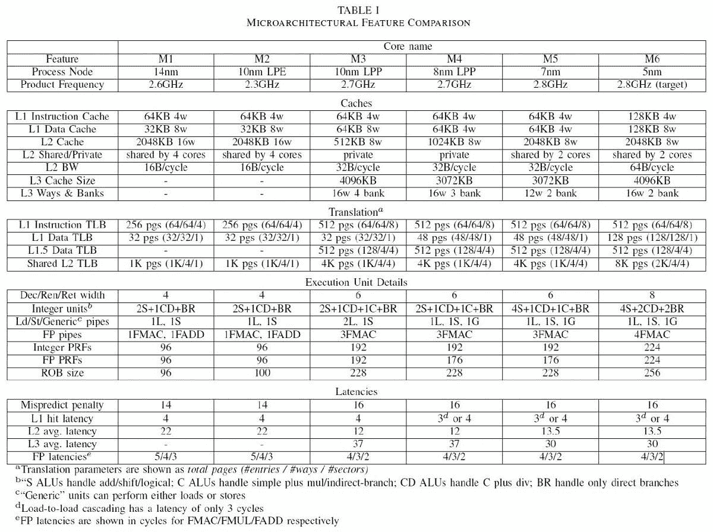

# 三星奥斯汀 R&D 中心披露了其尚未发布的 Exynos M6 CPU 微体系结构的细节

> 原文：<https://www.xda-developers.com/samsung-austin-details-unreleased-exynos-m6-cpu-microarchitecture/>

我们知道，三星奥斯汀研发中心(SARC) [的定制 CPU 核心项目于 2019 年 10 月](https://www.xda-developers.com/samsung-ending-custom-cpu-mongoose-design/)结束。对于一个在 2016 年推出 exy nos M1-采用 Exynos 8890 的项目来说，这是一个悲伤的结局。为什么 SARC 放弃了这个项目？在 [Exynos 990](https://www.xda-developers.com/samsung-exynos-990-5g-modem-5123-7nm/) SoC 中采用的 Exynos M5 定制内核是可预见的未来三星设计的最后一款完全定制的内核，事后看来，很容易理解三星为什么放弃定制内核，因为它们根本没有足够的竞争力。现在已知 Exynos M5 内核[相对于 ARM 的 Cortex-A77 有 100%的能效赤字](https://www.xda-developers.com/samsung-galaxy-s20-plus-review/)，这说明了很多问题。然而，事情并不一定会变成那样。Exynos M1 和 Exynos M2 的设计展示了一些前景，定制 CPU 核心项目在当时被视为对移动 CPU 领域的竞争非常重要。尽管 IPC 大幅增长，但 Exynos M3 仍然大幅下滑， [Exynos M4](https://www.xda-developers.com/samsung-galaxy-s10e-review-exynos/) 和 Exynos M5 未能跟上 ARM 的库存 CPU IP。下一款定制核心——取消的 Exynos M6 在微架构上有什么变化？

到目前为止，这个问题的答案还是未知的。然而现在，SARC CPU 开发团队在国际计算机架构研讨会(ISCA)上提交了一篇题为“三星 Exynos CPU 架构的演变”的论文(我们是通过 [*AnandTech*](https://www.anandtech.com/show/15826/isca-2020-evolution-of-the-samsung-exynos-cpu-microarchitecture) 了解到的)，这是一个 IEEE 会议。它揭示了以前 Exynos M 系列 CPU 的许多细节，以及被取消的 Exynos M6 的架构。

SARC CPU 开发团队提交的论文详细介绍了该团队在其存在的八年中所做的努力，还揭示了定制 ARM 内核的关键细节，从 exy nos M1(mongose)到当前一代 Exynos M5 (Lion)，甚至是尚未发布的 Exynos M6 CPU，在取消之前，预计将在 Exynos 990 的 2021 年 SoC 继任者中出现。

三星的 SARC CPU 团队成立于 2011 年，旨在开发定制 CPU 内核，这些内核后来被用于三星系统大规模集成电路的 Exynos SoCs。第一款使用定制内核的 Exynos SoC 是 Exynos 8890，它在 2016 年的三星 Galaxy S7 中有所体现。定制内核一直是 Exynos SoCs 的一部分，直到 Exynos 990 与 Exynos M5 内核一起出现，后者在 Exynos 驱动的三星 Galaxy S20 变体中有所体现。(即将到来的 [Exynos 992](https://www.xda-developers.com/samsung-exynos-992-5nm-chip-galaxy-note-20-arm-new-cpu-gpu/) ，可能会出现在 Galaxy Note 20 中，预计将采用 ARM 的 [Cortex-A78](https://www.xda-developers.com/arm-announces-cortex-a78-cpu-mali-g78-gpu-ethos-n78-npu/) ，而不是 Exynos M5。)然而，在 CPU 团队得到 2019 年 10 月解散的消息之前，SARC 已经完成了 Exynos M6 架构，解散于 12 月生效。

ISCA 的论文提供了三星定制 CPU 内核(从 Exynos M1 到 Exynos M6)之间微架构差异的概览表。该公司在 HotChips 2016 活动的初始 M1 CPU 架构深潜中披露了该设计的一些众所周知的特征。在 HotChips 2018 上，三星在 Exynos M3 上进行了深度展示。Exynos M4 和 Exynos M5 内核的架构也已详细说明，M6 也是如此。

 <picture></picture> 

Source: SARC

AnandTech 指出，多年来三星设计的一个关键特征是，它基于与 Exynos M1 猫鼬核心相同的 RTL 蓝图。多年来，三星继续对内核的功能模块进行改进。Exynos M3 代表了第一次迭代的变化，因为它在几个方面大大拓宽了内核，从 4 宽设计变为 6 宽中内核。(另一方面，Apple A11、A12 和 A13 的解码宽度为 7，而 Cortex-A76、A77 和 A78 的解码宽度为 4。Cortex-X1 将解码宽度增加到 5 倍。)

该报告还披露了一些之前没有公开的关于 Exynos M5 和 M6 的信息。对于 Exynos M5，三星对内核的高速缓存层次结构进行了更大的改变，用一个新的更大的共享高速缓存取代了专用 L2 高速缓存，并披露了 L3 结构从 3-bank 设计到 2-bank 设计的变化，延迟更少。

就微架构而言，取消 M6 内核将是一个更大的飞跃。SARC 已经做出了巨大的改进，例如将 L1 指令和数据缓存从 64KB 增加了一倍，达到 128KB - *AnandTech* 指出，这是一个迄今为止只有苹果 A 系列内核才实现的设计选择，从苹果 A12 开始。

L2 的带宽能力增加了一倍，达到 64B/周期，而 L3 的带宽将从 3MB 增加到 4MB。Exynos M6 应该是一个 8 宽的解码核心。正如 *AnandTech* 所指出的，这将是目前已知的解码方面最广泛的商业微架构。然而，即使内核更宽了，整数执行单元也没有太大变化。一个复杂的流水线增加了第二个整数除法功能，而加载/存储流水线保持与 M5 相同，具有一个加载单元、一个存储单元和一个加载/存储单元。浮点/SIMD 管道将增加第四个具有 FMAC 能力的单元。L1 DTLB 从 48 页增加到 128 页，主 TLB 从 4K 页增加到 8K 页(32MB 覆盖范围)。

Exynos M6 将是继 M3 以来第一次增加核心的无序窗口，从而代表了其前身的另一个重大变化。会有更大的整数和浮点物理寄存器文件，并且 ROB(重新排序缓冲区)会从 228 增加到 256。AnandTech 指出，定制 Exynos 内核的一个重要弱点仍然存在于 M5 上，也可能存在于 M6 上。它更深的流水线阶段将导致昂贵的 16 周期预测失误惩罚，这高于 ARM 的 CPU 内核的 11 周期预测失误惩罚。SARC 的论文对分支预测器的设计进行了更深入的研究，展示了基于 CPU 内核的缩放哈希感知器的设计。这种设计在过去几年和实施过程中会不断改进，不断提高分支准确性并减少每千指令(MPKI)的误预测。SARC 提供了一个表格，显示了分支预测器在前端占用的存储结构的数量。本文还详细介绍了内核的预取技术，包括在 M5 中引入 OP 缓存，以及该团队针对 Spectre 等安全漏洞加强内核的努力。

SARC 在论文中还详细介绍了在定制 Exynos 内核中改善内存延迟的努力。在 Exynos M4 中，SARC 团队包括了一个加载-加载级联机制，该机制将后续加载的有效 L1 周期延迟从四个周期减少到三个周期。M4 内核还引入了一个路径旁路，通过一个新的接口从 CPU 内核直接连接到内存控制器，从而避免了通过互连的流量。据 AnandTech 称，这解释了该出版物能够通过 Exynos 9820 测量的一些更大的延迟改进。Exynos M5 引入了推测性缓存查找旁路，它同时向互连和缓存标签发出请求。这可能会在高速缓存未命中的情况下节省等待时间，因为存储器请求正在进行中。平均加载延迟也在不断改善，从 m 1 的 14.9 个周期到 M6 的 8.3 个周期。

虽然上述微体系结构特征非常技术性，但 CPU 爱好者将会熟悉每时钟指令(IPC)这一术语，它指的是单线程 CPU 性能中的每 MHz 性能(它是决定单线程 CPU 性能的主要因素，另一个因素是内核的时钟速度)。整数 IPC 和浮点 IPC 都是 IPC 的决定因素。从 M1 到 M6，SARC 团队成功实现了平均每年 20%的改进。特别是 M3，它代表了 IPC 的一个很大的百分比改善，尽管它被其他因素所拖累。Exynos M5 的 IPC 提高了 15-17%，而未发布的 Exynos M6 的 IPC 平均提高了 2.71，而 M1 为 1.06，比 M5 提高了 20%。

论文主持人布莱恩·格雷森在问答环节回答了关于节目取消的问题。他说，该团队一直在按目标和时间表进行工作，每一代人的性能和效率都在提高。(这是否意味着这些目标在一开始就不够高？).另一方面，团队最大的困难是对未来的设计变化非常小心，因为团队没有资源从头开始或完全重写一个块。事后看来，这个团队在过去会对一些设计方向做出不同的选择。与此形成鲜明对比的是，ARM 有多个 CPU 团队在不同的地点工作，实际上相互竞争。这允许“彻底的重新设计”，如 [Cortex-A76](https://www.xda-developers.com/arm-cortex-a76-cpu-mali-g76-gpu-mali-v76-vpu-announcement/) 。 [Cortex-A77](https://www.xda-developers.com/arm-cortex-a77-cpu-announcement/) 和 Cortex-A78 是 A76 的直接继承者。

SARC 团队对未来的核心有改进的想法，例如假设的 Exynos M7。然而，据说是三星的一个高层决定取消定制核心程序。正如 AnandTech 指出的那样，与 ARM 的任何一代 CPU 相比，定制内核在能效、性能和面积使用(PPA)方面都没有竞争力。上个月，ARM 宣布了 Cortex-X 定制计划，该计划采用了新的 [Cortex-X1](https://www.xda-developers.com/arm-announces-cortex-x-custom-cpu-program/) ，这是一款面向 2021 年移动设备的下一代内核。它的设计理念是打破皮质 PPA 信封，追求绝对性能。因此，Exynos M6 将很难与之竞争。即便如此，三星似乎不会采用 Cortex-X1，只会在 Exynos 992 中采用 Cortex-A78 + Cortex-A55 组合——尽管它可能会在明年的 Galaxy S 旗舰中采用。

SARC 团队目前仍在为三星系统大规模集成电路设计定制的互连和内存控制器。它也在开发定制的 GPU 架构，但三星系统 LSI [与 AMD](https://www.xda-developers.com/samsung-amd-partnership-hatch-game-streaming-galaxy-s10-5g/) 签署了一项协议，从 2021 年开始，在未来的 Exynos GPUs 中使用 AMD 的下一代(下一代图形架构)RDNA GPU 架构。

总的来说，定制 CPU 核心项目对移动芯片供应商来说是一个启发性的教训，告诉他们什么会出错。SARC CPU 团队雄心勃勃，要与苹果竞争，苹果是移动 CPU 领域无可争议的领导者。不幸的是，它未能与 ARM 竞争，更不用说苹果了。这些问题本来是可以解决的，但年复一年，SARC 的努力落后了一两步，这在三星 Galaxy S9 的 Exynos 9810 变种等产品的发货中得到了不利的反映。现在，所有主要的 Android 移动芯片供应商将从 2021 年开始使用 ARM 的库存 CPU IP，这一名单包括高通、三星、联发科和海思。这场战斗将与采用 Cortex-X1 等内核的苹果展开，而不是从头开始设计的定制 ARM 内核。

* * *

**来源:[三星 Exynos CPU 架构的演变](https://www.iscaconf.org/isca2020/papers/466100a040.pdf) | Via: [AnandTech](https://www.anandtech.com/show/15826/isca-2020-evolution-of-the-samsung-exynos-cpu-microarchitecture)**