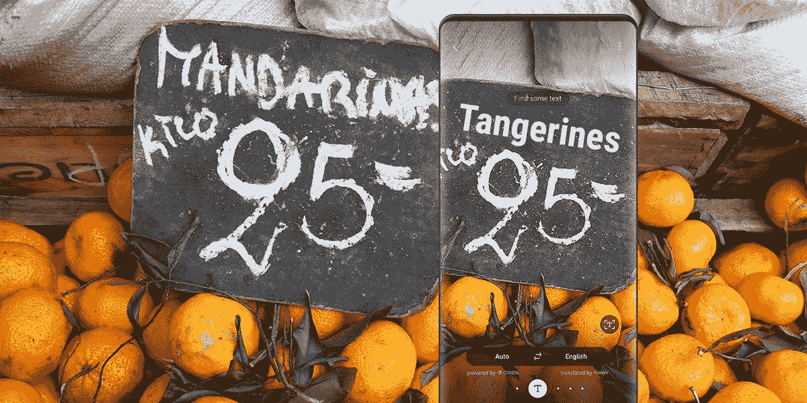

# Bixby Vision 增加了 3 个新的辅助功能:快速阅读器、场景描述器和颜色检测器

> 原文：<https://www.xda-developers.com/samsung-bixby-vision-adds-accessibility-features/>

# 三星的 Bixby Vision 增加了 3 个新的辅助功能:快速阅读器、场景描述器和颜色检测器

Bixby Vision 的最新更新带来了三个新的辅助功能，以帮助视力障碍者充分利用他们的三星设备。

 <picture></picture> 

LEAD Technologies Inc. V1.01

三星的虚拟助手 [Bixby](https://www.xda-developers.com/tag/bixby/) 也提供了一个类似于[谷歌镜头](https://www.xda-developers.com/tag/google-lens/)的功能，名为 Bixby Vision。该功能让您只需使用智能手机的摄像头，即可轻松翻译单词、在线查找产品、识别地标等。虽然该功能在当前的形式下已经非常有用，但三星现在增加了三个辅助功能，使其变得更好——快速阅读器、场景描述器和颜色检测器。

新的无障碍功能是在全球无障碍意识日宣布的，它们旨在帮助视障人士更多地了解他们的周围环境。顾名思义，快速阅读器功能可以实时读出书面文本(如标签或标志)。它可以识别超过 1，000 种常见的物体和项目，如食物、蔬菜、清洁产品等。它支持 57 种语言。

场景描述器功能使用机器学习来提供图像的描述，包括捕获的场景和下载的图片。当一个人在周围导航时，这可以用来识别障碍，或者描述使用手机摄像头拍摄的任何图像。

最后，颜色检测器功能旨在帮助有视觉障碍的人识别框架中物品的颜色。例如，在区分不同颜色的衣服时，这可以派上用场。该功能能够识别和区分 33 种颜色。

上述所有三个辅助功能已经向用户推出，并在 Bixby Vision 3.5 及以上版本中提供。然而，虽然快速阅读器和颜色检测器功能在所有地区都可用，但场景描述器功能目前仅限于少数地区。

* * *

来源:[三星编辑部](https://news.samsung.com/global/ai-for-everyone-accessibility-meets-bixby-vision)