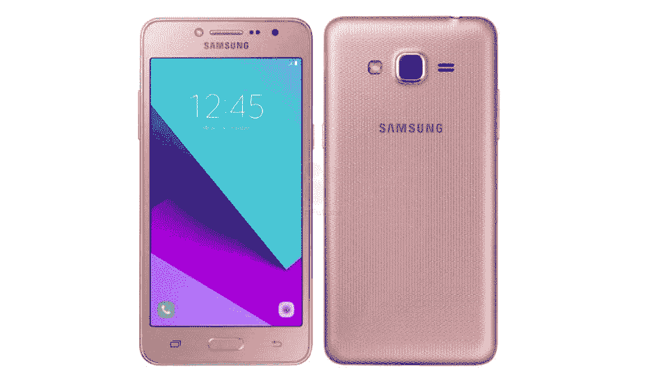

# 三星的预算 Galaxy Grand Prime Plus 2018 可能会有虹膜扫描仪

> 原文：<https://www.xda-developers.com/samsung-galaxy-grand-prime-plus-2018-budget-iris-scanner/>

由于成像和显示技术的进步，生物认证在现代智能手机中呈现出新的形式。我们现在有能够进行精确面部识别的智能手机，如[小米 Mi 8](https://www.xda-developers.com/xiaomi-mi-8-mi-8-explorer-edition-mi-8-se-china-launch/) 和苹果 iPhone X。我们也有带显示指纹传感器的智能手机，如 [Vivo NEX](https://www.xda-developers.com/vivo-nex-announced-in-display-fingerprint-sensor/) 和[保时捷设计华为 Mate RS](https://www.xda-developers.com/porsche-design-huawei-mate-rs-no-notch/) 。与此同时，据报道，三星[将放弃](https://www.xda-developers.com/samsung-galaxy-s10-iris-scanner-3d-sensor-fingerprint/)他们的虹膜识别技术，转而支持 Galaxy S10 上的 3D 面部识别传感器和显示指纹扫描仪。但是，即使三星 Galaxy S10 标志着该公司在其旗舰手机上放弃虹膜扫描仪，他们也有可能在今年的一款或多款预算 Galaxy 产品中包括该功能——可能是 2018 年三星 Galaxy Grand Prime Plus 的更新。

今年早些时候，我们根据三星 Galaxy Note 8 的 Android 8.0 Oreo 框架内的代码名称列表，公布了一份未公布的 2018 年三星 Galaxy 智能手机列表。该列表中的大多数设备已经公布，尽管一些如代号“lugelte”和“gta2xl”只是最近才重新出现。(这些设备可能分别是[三星 Galaxy X](https://www.xda-developers.com/samsung-foldable-phone-galaxy-note-4-panel-galaxy-note-8-soc/) ，三星的第一款可折叠智能手机，以及[三星 Galaxy Tab A2 XL](https://www.xda-developers.com/samsung-galaxy-tab-a2-xl-specifications-bixby-button-galaxy-s9-note-8-s8/) 。)我们发现的另一款设备代号为“j6plte”，很可能是[三星 Galaxy J6+/三星 Galaxy On6+](https://www.xda-developers.com/samsung-galaxy-j6-plus-galaxy-on-6-plus-specifications/) ，尽管有趣的是它没有出现在我们之前的列表中。

这份名单上有一款未公布的设备一直没有被我们发现，它的代号是“grandppirislte”。鉴于 2016 款三星 Galaxy Grand Prime Plus 的代号为“grandpplte”(你可以在[谷歌的 Play 认证设备列表](https://www.xda-developers.com/check-phone-tablet-certified-android-before-buying/)上亲自验证)，我们推测“grandppirislte”将是 2018 款三星 Galaxy Grand Prime Plus 的更新版，带有虹膜扫描仪。现在，由于 XDA 公认的贡献者 [deadman96385](https://forum.xda-developers.com/member.php?u=4222965) 首先发现的固件文件，我们可以证实这款设备的存在，以及它有虹膜识别传感器的事实。

## 2018 款三星 Galaxy Grand Prime Plus 可能会有虹膜扫描仪

 <picture></picture> 

2016 Samsung Galaxy Grand Prime Plus. Source: Samsung.

三星对 Android 智能手机虹膜识别的兴趣始于命运多舛的三星 Galaxy Note 7。(有趣的是，该公司此前一个月前在印度推出了[三星 Galaxy Tab Iris](https://www.xda-developers.com/xda-external-link/samsung-launches-the-galaxy-tab-iris-in-india/) ，但它是针对政府和企业用户的。)从那以后，只有该公司的旗舰智能手机，包括三星 Galaxy S8/S8+、三星 Galaxy Note 8 和三星 Galaxy S9/S9+提供虹膜扫描仪。去年底来自 [*《朝鲜先驱报》*](http://www.koreaherald.com/view.php?ud=20171211000695) 的一份报告称，三星“有望在明年年底或 2019 年初将虹膜扫描仪扩展到预算机型中，最终目标是用移动银行取代实体银行。”虽然我们无法确认他们采用虹膜识别技术的预算模型的确切发布日期，但我们现在有证据表明至少有一种预算模型存在。

根据我们获得的固件文件，2018 款三星 Galaxy Grand Prime Plus 有一个名为 ktd2692_iris 的虹膜扫描仪驱动程序。网上快速搜索没有显示这种特殊的红外 LED 驱动器的存在，尽管标准的 [ktd2692](http://www.kinet-ic.com/ktd2692/) 闪光灯 LED 驱动器确实存在。三星可能会将这种闪光 LED 驱动器用于红外，以降低成本。我不能说这是否会使面部识别成为可能，但[这篇论文](http://www.ti.com/lit/an/snva773/snva773.pdf)表明使用闪光 LED 进行红外是可能的。

至于其余的规格，很明显，2018 年刷新的 Galaxy Grand Prime Plus 将是一款预算智能手机。由于固件文件不完整，我们没有该设备的完整规格，但从我们可以拼凑的内容来看，该设备似乎在显示屏和芯片组上有所节省，以专注于其主要卖点:摄像头和虹膜扫描仪。以下是规格:

| 

规范

 | 

三星银河 Grand Prime Plus 2018

 |
| --- | --- |
| 显示 | 5.5 英寸 540x960 (s6d78a0) |
| 芯片集 | Exynos 7870 |
| 后置摄像头 | 16 MP 三星 S5K4H5YC 传感器，支持 4k 和慢动作@ 240fps) |
| 前置摄像头 | 5MP 三星 S5K5E3 传感器 |
| 港口 | 支持 OTG 的 USB Type-C (USB 3.0) |
| 小跟班 | 硬件按钮:Home 键、电容式按钮和 back 按钮 |
| 生物扫描仪 | 虹膜扫描仪(ktd2692_iris) |
| 电池 | 3630 毫安时 |