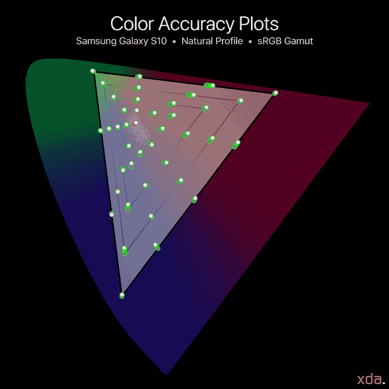

# 三星 Galaxy S10 显示器评论:安卓需要的大使

> 原文：<https://www.xda-developers.com/samsung-galaxy-s10-display-review/>

好的

每个人都说:“三星为智能手机制造最好的显示屏。”这被广泛认为是真理，没有多少人试图去质疑它。更少有人尝试(或甚至知道如何)单独评估显示器。这方面的问题是缺乏对出版物(包括我们自己的出版物)和现实的验证，有效观点的数量有限，缺乏这方面的专业知识。许多人不知道的是，上一代三星 Galaxy 显示器确实存在问题，甚至在某些类别中落后于竞争对手，如颜色/白点校准、伽玛和黑色剪裁。它们并不是完美的显示器——实际上，就校准而言，它们远非最佳——大多数显示器评论给了它们太多的赞美。许多人还被误导，声称他们的显示器在默认的过饱和状态下颜色准确。然而，新一代手机给人们带来了新的希望和期待。Galaxy S10 是三星为现在的手机引入未来技术的最新努力，但除了尖端的 Infinity-O 显示屏，它的基本面板特性是否真的有所改善，或者只是改头换面？

| 

### 坏

*   *优秀* 色彩在自然轮廓中的准确性
*   *卓越的* 亮度——我们测量过的最好的亮度
*   *非常好* 伽玛和动态亮度
*   *非常* *小*黑色剪裁
*   巨大的色域和非常鲜明的“生动”形象

 | 

### 坏

 |
|  |

我们收到的信息表明，Exynos 和骁龙 S10 变种有不同的面板校准。本次审查将涵盖 **Exynos** 变体。我将研究与骁龙版本的不同之处，并希望创建一个修订版。

## **绩效总结**

Galaxy S10 的正面贴满了三星所谓的“ [Infinity-O](https://www.xda-developers.com/samsung-notch-infinity-display/) ”显示屏:屏幕几乎覆盖了手机的整个正面，边缘弯曲，上面打了一个“O”以容纳前置摄像头。摄像头旁边是环境光传感器和接近传感器，它们被巧妙地隐藏在玻璃下面。

该面板的原生分辨率为 3040×1440 像素，但在默认情况下，三星 Galaxy S10 以 2280×1080 渲染以节省电力。这带来了一个明显的妥协，因为这个默认的渲染分辨率没有完全划分到它的原生分辨率中，导致在它的放大中增加了模糊性。因此，三星 Galaxy S10 显示器在其默认渲染分辨率下不会像相同大小的原生 2280×1080 分辨率面板那样清晰。例如，三星 Galaxy S10e 在其默认的 1080p 渲染分辨率下似乎比 Galaxy S10 更清晰，即使 Galaxy S10e 被放大到 Galaxy S10 的大小。

显示屏是我们在所有 APL 上测量过的最亮的有机发光二极管，50% APL 达到近 900 尼特，考虑到平均显示屏亮度(你可以在下面的“亮度”部分阅读 APL 的定义)，当手机在自动亮度模式下检测到强光时，这是一个不错的 APL。这比我们测量的三星 Galaxy Note 9 和 [LG V40 ThinQ](https://www.xda-developers.com/lg-v40-thinq-display-review/) 的亮度高出约 100 尼特(看起来亮了约 5%)，比 iPhone XS 的亮度高出约 200 尼特(看起来亮了约 10%)。三星 Galaxy S10 的显示器在检测到阳光时还会淡化所有颜色，降低屏幕对比度，从而提高显示器在阳光下的清晰度和颜色准确性。

根据地理位置的不同，Galaxy S10 的默认颜色模式可能会设置为美国和欧洲一些国家的“自然”配置文件，而主要是亚洲将默认为“鲜艳”配置文件(我们的 Exynos 设备为“鲜艳”)。“自然”选项是具有较暖色调的颜色精确配置文件，而“生动”配置文件增加了屏幕的饱和度和对比度，并具有较冷的白点。“生动”的配置文件与以前 Galaxy 手机上的“自适应”配置文件相同，它将颜色显著扩展，达到 Galaxy S10 面板的原生色域。它还增加了对比度，比“自然”轮廓略亮。在分享和编辑内容时，应始终使用“自然”配置文件来确保照片和视频在其他显示器上看起来相似，如 iPhones，它与 Galaxy S10 的“自然”配置文件共享相同的目标颜色配置文件， ***而不是*** 【生动】配置文件像许多人一样被误导相信。

默认情况下,“自然”配置文件以 sRGB 色彩空间为目标，当应用程序支持的色彩管理可用于适当的媒体时，也可以校准为以 P3 和 Adobe RGB 等宽色彩空间为目标。和往常一样，三星在标准参考配置文件的色彩准确度方面做得不错，但 Galaxy S10 延续了三星之前困扰他们的更温暖的校准趋势，在色彩准确度方面仍落后于 iPhone X(S)和 Pixel 3 (XL)等其他显示器。尽管如此,“自然”配置文件的颜色准确度非常好，看起来非常完美，尽管白色和浅色调看起来会明显偏暖。该配置文件的灰度系数约为 2.15，阴影较浅，中间色调略暗，但总体上具有出色的图像再现和对比度。视频播放增加了屏幕对比度，使阴影变暗，画面更清晰。然而，即使这是颜色准确的配置文件，三星仍然在其默认启动器中延伸和过度饱和颜色，这是设计师在 Galaxy S10 上查看他们的图标时应该考虑和警惕的。

三星 Galaxy S10 的视角为 30 度，是我们迄今为止测量到的最低视角。然而，这些数字并不能说明全部情况。这种移动仍然是不均匀的，并且在锐角处是突然的，并且仍然在向红色移动和向青色移动之间显著变化(从技术上来说，它从互补位置移开)。此外，超过 30 度后，色偏进一步向青色方向增加，对此我们没有测量。在较亮/白色内容的屏幕弯曲边缘，它也总是可见的。由于这些难以完全解释的复杂性，我们最佳视角的桂冠仍然属于 LG V40 ThinQ 上的 LGD 面板，即使是 [Pixel 3 的视角](https://www.xda-developers.com/google-pixel-3-display-analysis-a-real-tangible-improvement-yet-still-behind-the-curve/)也击败了 Galaxy S10 的视角。

黑色拖尾与上一代面板相同，而三星 Galaxy S10 的黑色削波(黑色挤压)有所改善(减轻)。然而，Galaxy S10 在黑色剪裁方面仍然不如一加的最新手机，并且在这两个类别上都远远落后于 iPhone X 系列面板。Galaxy S10 在其“自然”轮廓中提升的阴影确实有助于减少黑色挤压的感觉，但对于精确的阴影再现来说，它仍然不是最佳的。

## **方法论 ▼**

为了从显示器中获得定量的颜色数据，我们将特定设备的输入测试模式放入手机，并使用 i1Pro 2 分光光度计测量显示器产生的发射。我们使用的测试模式和设备设置针对各种显示特性和可能改变我们所需测量的潜在软件实现进行了修正。许多其他站点的显示分析没有正确考虑它们，因此它们的数据可能不准确。我们首先测量显示器的全灰度，并报告白色的感知色彩误差及其相关色温。从读数中，我们还通过对每一步的理论伽马值进行最小二乘法拟合，得出显示伽马值。这个 gamma 值比那些从 CalMan 等显示校准软件报告 gamma 读数的值更有意义，也更真实，CalMan 等显示校准软件是对每一步的理论 gamma 进行平均。我们测试图案的目标颜色灵感来自于

[DisplayMate’s absolute color accuracy plots](http://www.displaymate.com/Colors_43s.html)

。在整个 CIE 1976 色度标度中，颜色目标的间隔大致均匀，这使得它们成为评估显示器的完整颜色再现能力的极好目标。灰度和色彩准确度读数以显示器读数的 20%为增量

*perceptual*

(非线性)亮度范围并进行平均以获得精确到显示器整体外观的单个读数。另一个单独的读数取自我们的参考 200

*cd/m²*

这对于典型的办公室条件和室内照明来说是很好的白色水平。我们主要使用色差测量

*CIEDE2000*

(简称为

*ΔE*

)作为色度准确度的度量。

*ΔE*

是由提出的行业标准色差度量

[International Commission on Illumination (CIE)](http://www.cie.co.at/)

最好地描述了颜色之间的均匀差异。也存在其他色差度量，例如色差

*Δu′v′*

在 CIE 1976 色度标度上，但是已经发现当评估视觉显著性时，这种度量在感知均匀性方面较差，因为在色差度量之间，测量的颜色和目标颜色之间的视觉显著性的阈值可能变化很大。例如，颜色差异

*Δu′v′*

0.010 的色差对于蓝色来说在视觉上是不明显的，但是对于黄色来说，相同的测量色差一眼就可以看出。注意到

*ΔE*

本身并不完美，但它已经成为目前存在的最具经验准确性的色差度量标准。

*ΔE*

通常在其计算中考虑亮度误差，因为亮度是完整描述颜色的必要组成部分。然而，由于人类视觉系统分别解释色度和亮度，我们将测试模式保持在恒定亮度，并补偿我们的亮度误差

*ΔE*

价值观。此外，在评估显示器的性能时，将这两种错误分开是有帮助的，因为就像我们的视觉系统一样，它与显示器的不同问题有关。这样我们可以更彻底地分析和理解显示器的性能。当测得的色差

*ΔE*

都在 3.0 以上，色差一眼就能从视觉上看出来。当测得的色差

*ΔE*

介于 1.0 和 2.3 之间时，色差只能在诊断条件下被注意到(例如，当测量的颜色和目标颜色在被测量的显示器上紧挨着彼此出现时)，否则，色差在视觉上是不可察觉的，并且看起来是准确的。测得的色差

*ΔE*

1.0 或更小的颜色被认为是完全感觉不到的，并且即使在与目标颜色相邻时，所测量的颜色看起来也无法与目标颜色区分开来。显示器功耗通过手机电池消耗和显示器亮度之间的线性回归的斜率来测量。以 20%的亮度步长观察并平均三分钟的电池消耗，并在尽量减少外部电池消耗源的同时进行多次试验。

## **颜色配置文件**

三星对 Galaxy S10 的屏幕模式选项进行了彻底改革，不再有以前的“自适应”、“照片”、“电影”和“基本”屏幕模式，而是简化为两个选项，“生动”和“基本”，默认选项取决于 Galaxy S10 的运营商/供应商。 [三星称](https://news.samsung.com/global/interview-infinity-viewing-experience-behind-the-galaxy-s10-display) 在欧洲和美国默认为“自然”，而在亚洲默认为“生动”。这是三星首次推动将色彩准确的配置文件作为默认设置，这具有重要意义，因为大多数用户可能已经习惯了三星的过饱和配置文件，这是他们之前所有 OLEDs 的默认设置。

“**”配置文件与之前 Galaxy 设备上的“自适应”配置文件完全相同，只是为了更加合适而进行了重命名，并保留了调整色温和单独的红/绿/蓝色彩平衡滑块的选项。此配置文件中没有任何形式的主动色彩管理，但在某些情况下，它会接收三星的 mDNIe(移动数字自然图像引擎)所做的对比度和色彩修改。**

 **“**”配置文件取代了之前 Galaxy 设备上的三种参考颜色配置文件(“基本”、“影院”和“照片”)。他们这样做是因为三星最终在 Galaxy S10 上实现了对 Android 8.0 自动色彩管理的支持，这是朝着在 Android 上推广其采用的正确方向迈出的一大步。支持的应用程序，包括三星自己的 Gallery 应用程序，现在可以正确显示嵌入 ICC 配置文件的内容，这是谷歌自己的照片应用程序尚未完全推出的功能。这种支持是其他 Android 设备正确播放三星 Galaxy S10 的 HDR10+视频所需要的。如果没有适当的色彩管理支持，视频将在标准动态范围内播放。**

 **## **亮度**

我们的显示器亮度对比图表比较了三星 Galaxy S10 相对于我们测量的其他显示器的最大显示器亮度。图表底部水平轴上的标签代表相对于三星 Galaxy S10 显示器的感知亮度差异的乘数，该乘数固定为“1×”。显示器亮度的大小以每平方米坎德拉或尼特为单位，根据史蒂文幂定律使用点光源感知亮度的模态指数进行对数缩放，与三星 Galaxy S10 显示器的亮度成比例缩放。这是因为人眼对感知亮度有对数反应。在线性标度上呈现亮度值的其他图表不能恰当地表示显示器的感知亮度的差异。

在测量 OLED 面板的显示性能时，了解其技术与传统液晶面板有何不同非常重要。液晶显示器需要一个背光来让光通过滤色器，滤色器会阻挡光的波长，从而产生我们看到的颜色。OLED 面板能够使它的每个单独的子像素发出它们自己的光。这意味着 OLED 面板必须从其最大分配中为每个点亮的像素分配一定量的功率。因此，需要点亮的子像素越多，需要在点亮的子像素上分配的面板功率就越多，每个子像素接收的功率就越少。

图像的 APL(平均像素级别)是整个图像中每个像素的单个 RGB 分量的平均比例。例如，一个完全红色、绿色或蓝色的图像具有 33%的 APL，因为每个图像只包括完全照亮三个子像素中的一个。完整的颜色混合青色(绿色和蓝色)、品红色(红色和蓝色)或黄色(红色和绿色)具有 67%的 APL，而完全照亮所有三个子像素的全白图像具有 100%的 APL。此外，一半黑一半白的图像具有 50%的 APL。最后，对于有机发光二极管面板，总的屏幕内容 APL 越高，每个点亮像素的相对亮度越低。LCD 面板没有这种特性(除了局部变暗)，因此，在较高的 APL 下，它们比有机发光二极管面板更亮。

这里没有惊喜——三星 Galaxy S10 在自动亮度模式下拥有业界最亮的有机发光二极管。

但首先，对于那些不完全熟悉平均像素水平(简称 APL)的人，请确保阅读我们上面的描述，以便能够正确解释有机发光二极管显示器的亮度输出数字。

当屏幕完全被白色像素填满时，显示器在最大系统亮度下的亮度最低，即 APL 为 100%。我们在这种条件下进行测量，以记录屏幕上白色亮度的下限或最坏情况值。我们记录了三星 Galaxy S10 在 100% APL 下发射 723 尼特。这是我们在 APL 上测量到的最亮的有机发光二极管显示器。在更适宜的 50% APL 下，显示器亮度可以达到 893 尼特，这足够亮，当没有阳光直射时，在户外可以舒适地清晰可见。仍然需要更高的亮度来充分承受阳光直射产生的对比度。

[*DisplayMate* 对三星 Galaxy S10](http://www.displaymate.com/Galaxy_S10_ShootOut_1S.htm) 的评测吹嘘“创纪录的 1215 尼特峰值亮度”，这令人印象深刻，但不是代表显示器典型峰值亮度的恰当数字。这个数字代表 1% APL 时的峰值亮度，屏幕上几乎没有任何发光像素，我们在自己的 Galaxy S10 上测得的峰值亮度为 1，180 尼特。低 APL 的亮度数据主要是用来衡量 HDR 内容中镜面高光的强度水平，即使这样，大多数电影的 APL 也在 15-20%左右，而不是 1%。然而，在 10% APL 时，这是 HDR 含量的一个非常暗的下限，我们在 1，068 尼特测量了亮度，与 1% APL 相比，这是一个非常好的亮度下降。

三星 Galaxy S10 在 50% APL 下与 iPhone XS 并列最暗，能够降至 1.8 尼特。这比谷歌 Pixel 3、谷歌 Pixel 3 XL 和 LG V40 ThinQ 最低时的 2.4 尼特、2.2 尼特和 2.3 尼特低了约 20%。

## **对比度和伽玛**

显示器的伽玛决定了屏幕上整体图像的对比度和颜色的亮度。大多数显示器上使用的行业标准伽马遵循 2.20 的幂函数。更高的显示器伽马功率将导致更高的图像对比度和更暗的颜色混合，这是电影业正在朝着的方向发展，但智能手机在许多不同的照明条件下观看，更高的伽马功率是不合适的。我们的 *伽玛曲线* 下面是三星 Galaxy S10 显示屏上看到的颜色亮度与其相关输入驱动级别的对数对数表示。高于 2.20 线的测量点表示色调比标准色调更亮，而低于 2.20 线的测量点表示色调比标准色调更暗。由于人眼对感知的亮度有对数反应，所以轴是对数标度的。

**现在，大多数现代旗舰智能手机显示屏都配有经过校准的色彩配置文件，色彩精确** 。然而，由于有机发光二极管随着内容 APL 的增加而降低屏幕上颜色的平均亮度的特性，现代旗舰有机发光二极管显示器的总色彩准确度的主要差异现在在于显示器的最终伽马。伽马射线构成了非彩色(灰度分量)图像，或图像的结构，人类在感知时更敏感。因此，显示器的灰度系数与内容的灰度系数相匹配非常重要，通常遵循行业标准 2.20 幂函数。

从 Galaxy S9 开始，三星在 DDIC 方面取得了长足的进步，改善了面板的显示伽玛。他们设法严格控制对 APL 的亮度差异响应，使其电光传递函数受到的影响最小，并保持接近其目标。在三星 Galaxy Note 8 上，我们在它的“基本”屏幕模式下测量了 2.3 到 2.6 的伽马范围，这导致了颜色太暗和对比度太大。在 Galaxy S10 中，三星设法在色彩精确的“自然”模式下达到了 2.15 的适配显示器伽马值，在色彩拉伸的“生动”模式下达到了 2.27，这更接近于 2.2 的行业标准目标。

然而，三星 Galaxy S10 的传递函数似乎并不是恒定的，而是分段的。S10 面板提升了比 2.2 标准更亮的阴影和略暗的中间色调，而不是 2.2 的直接幂。总传递函数非常类似于 sRGB 规格。然而，sRGB 传递函数描述的是编码伽玛，而不是解码伽玛，这意味着反映在 CRT 显示器上看到的外观，甚至没有一个遵循 sRGB 传递函数规范进行解码。

目前，三星 Galaxy S10 的“自然”模式的传递函数对于高保真 SDR 播放或流媒体来说并不理想，特别是在黑暗的观看环境中，伽马功率接近 2.4 是可取的。然而，这是在 Galaxy S10 上播放视频时考虑的问题，三星的 mDNIe 增加了显示器的对比度，消除了阴影。通过这种调整，产生的显示灰度系数现在增加到大约 2.25 的直线灰度系数，这对于视频来说更加合适。

在操作系统的其余部分，默认的较亮伽玛为 2.15，这可能是在光线充足的环境中查看媒体的设计选择，例如在办公室中，需要较低(较亮)的伽玛来应对环境照明，从而在这些环境中获得更高的感知色彩准确度。此外，在高亮度模式下，当环境光线传感器检测到阳光等明亮的强光时会触发高亮度模式，三星的 mDNIe 会显著降低屏幕对比度，并淡化所有颜色混合，以提高阳光清晰度和感知颜色的准确性。

三星还提供了一个“视频增强器”选项，该选项可以在所有方向上略微增加色彩饱和度(不会拉伸到特定的色域)，显著增加显示器的亮度(这可以让视频达到高亮度模式亮度水平)，并重新提升未提升的阴影。

三星 Galaxy S10 面板的一个令人失望的地方是在“自然”轮廓中存在色带和色差，这在旗舰显示器上不应该是一个问题，特别是在其“颜色精确”模式下。诚然，在没有条带的情况下，很难将宽色域面板正确校准到 sRGB，但其他人已经成功地做到了这一点(iPhone XS，LG V40 ThinQ)，像三星这样的行业领导者没有理由存在这个问题。谷歌 Pixel 3 XL 在其“自然”配置文件中也有少量色带，但程度明显低于三星 Galaxy S10。尽管这不是第一次发生，因为上一代 Galaxy 设备也在其校准的参考剖面中观察到条带。

最后，三星 Galaxy S10 提高了显示近黑色的能力，这可能得益于其改进的伽马控制和提升的阴影。我们测量了 Galaxy S10 显示屏，在 10 尼特的驱动水平下将黑色修剪到 1.0%以下，比前几代的 2.7%有所改善，但仍落后于一加和苹果等公司，其最新的有机发光二极管面板在 10 尼特的驱动水平下将黑色分别修剪到 0.4%和 0%以下(零测量黑色修剪)。

## **色温**

白光源的色温描述了光的“暖”或“冷”程度。颜色通常需要至少两个点来描述，而相关色温是一维描述符，为了简单起见，省略了基本的色度信息。

sRGB 色彩空间以 D65 (6504 K)色温的白点为目标。以 D65 色温的白点为目标对于颜色准确性至关重要，因为白点会影响每种颜色混合的外观。然而，请注意，具有接近 6504 K 的相关色温的白点不一定看起来准确！有许多颜色混合可以具有相同的相关色温(称为 iso-CCT 线)，有些甚至看起来不是白色。因此，色温不应作为白点色彩准确度的衡量标准。相反，我们使用它作为一种工具来表现显示器白点的粗略外观，以及它如何在其亮度和灰度上变化。不管显示器的目标色温是多少，理想情况下，白色的相关色温在所有驱动电平下都应该保持一致，这在我们的下图中显示为一条直线。通过观察最低亮度下的色温图表，我们可以了解三星 Galaxy S10 的面板如何在剪裁黑色之前处理低驱动水平。

延续了过去几代人的趋势，三星 Galaxy S10 显示器的色温在其“自然”配置文件(以前的“基本”配置文件，白点为 6172 K)中一直过于温暖。不过，现在这是一个更大的问题，因为“自然”配置文件是美国和欧洲部分地区 Galaxy S10 用户的默认颜色配置文件，许多人可能会对黄色调感到厌恶，这通常与一些老化或变脏的东西有关。自从 Galaxy S8 以来，这种暖色调已经出现在我遇到的每一部三星手机中，这是三星需要改善的一个主要校准问题，特别是现在他们正在推动“自然”作为默认配置。

关于驱动差异，三星 Galaxy S10 在其“生动”的外形中几乎没有驱动差异，这可以从其平滑笔直的平均色温曲线中看出。然而，在“自然”配置文件中有轻微的变化，在低于 20%的驱动电平下有一个明显的向暖色调的尖峰，这在“生动”配置文件中不存在。当在最小亮度下观察色温图表时，随着驱动电平降低，两个曲线的色温都呈上升趋势，红色发射器逐渐丢失，绿色过度补偿，在最终削波黑色之前向青色移动。

## **色彩准确度**

我们的 *色彩准确度图* 为读者提供了显示器色彩性能和校准趋势的粗略评估。下面显示的是颜色准确度目标的基础，绘制在 CIE 1976 色度标度上，圆圈代表目标颜色。

 <picture></picture> 

Base Color Accuracy Plots chart

在下面的色彩准确度图中，白点代表三星 Galaxy S10 测得的色彩位置。相关的拖尾颜色代表颜色错误的严重程度。绿色轨迹表示测得的色差非常小，颜色在显示器上显示准确，而黄色轨迹表示明显的色差，橙色和红色轨迹的色差更大。

 <picture></picture> 

Samsung Galaxy S10 sRGB color accuracy, "Natural" profile

 <picture></picture> 

Samsung Galaxy S10 P3 color accuracy, "Natural" profile

三星 Galaxy S10 的色彩准确度图显示，其校准主要偏向红色，尽管除了白色、低饱和黄色和高饱和红黄色之外，几乎所有的色彩差异都不明显。

现在支持 Android 色彩管理的“自然”配置文件出色地再现了标准 RGB 色彩空间和宽 P3 色彩空间，sRGB 的平均δE 为 1.2，P3 的平均*δE*为 1.1。该简档的最大误差也非常低，并且看起来非常准确，对于 sRGB 25%的黄色，最大*δE*为 2.6，对于 P3 25%的黄色，最大*δE*为 2.8。

该配置文件的颜色准确性与其标准伽玛和 Gallery 应用程序中的自动颜色管理支持相结合，使三星 Galaxy S10 能够以专业的高保真度再现大多数非白点敏感的照片和 SDR 视频。然而，三星 Galaxy S10 和任何其他安卓系统都不应该用于专业编辑对颜色敏感的照片或视频，因为安卓系统上仍然不存在支持工作颜色管理的照片编辑器应用程序。这仍然最好留给苹果设备，包括 iPhones 和 iPads，或者具有适当 ICC 颜色配置文件的桌面工作站。

“生动”配置文件，以前称为“自适应”配置文件，是以前 Galaxy 设备的默认颜色配置文件，在亚洲和欧洲部分地区的三星 Galaxy S10 上仍然是默认的。以任何标准来看，该配置文件都不是颜色精确的，并且在包含较冷的白点的同时，将颜色拉伸以显得更饱和。色域可以在色域图中看到。

在此配置文件中，白点默认为 6624 K，略冷，颜色饱和度大幅增加，平均*【δC*(色度/饱和度变化)为 13.6。与“自然”轮廓相比，屏幕的对比度也有所增加，从分段较低的伽马值 2.15 跃升至更强有力的直线伽马值 2.27。

*   “鲜艳”轮廓中的红色获得与 sRGB 红相同色调的饱和度直线增加，红色原色的δC 为 17.9。
*   在此配置文件中，绿色提升最多，色度提升*δC*为 26.2，绿色向 sRGB 青色偏移*δH*= 8.1。
*   蓝色是最少被修饰的，但仍然很明显。蓝色原色在 sRGB 青色的方向上具有 6.8 的增加的色度*【δC】*【δH】= 1.2。

“生动”配置文件根本不应用于任何颜色精确的编辑或查看，或者用于编辑要与其他人共享的照片。

## **显示概述**

| 规格 | 三星 Galaxy S10 | 注释 |
| --- | --- | --- |
| 类型 | 动态 AMOLEDpenti le 钻石像素 |  |
| 制造商 | 三星显示公司 |  |
| 大小 | 5.5 英寸乘 2.6 英寸6.1 英寸对角线 14.4 平方英寸 |  |
| 解决 | 2280×1080 像素(默认) 3040×1440 像素(原生) 19:9 像素纵横比 | 由于圆角和显示剪切，实际像素数量会稍少 |
| 像素密度 | 每英寸 389 个红色子像素每英寸 550 个绿色子像素每英寸 389 个蓝色子像素 | 与绿色子像素相比，PenTile 菱形像素显示器的红色和蓝色子像素较少 |
| 像素灵敏度的距离 | < 8.8 英寸为全彩色图像 < 6.3 英寸为非彩色图像 | 视力为 20/20 的可分辨像素的距离。典型的智能手机观看距离约为 12 英寸 |
| **亮度** | 341 尼特/ 723 尼特自动@ 100% APL 451 尼特/ 893 尼特自动@ 50% APL *优秀*

* * *

15%动态亮度在“自然” 31%动态亮度在“生动” | 动态亮度是屏幕亮度响应显示内容 APL 的变化 |
| **最大显示功率** | 100% APL 时 341 尼特的 1.21 瓦100% APL 时 723 尼特的 3.66 瓦，HBM(比基本型号高 42%)超过 14.4 平方英寸 | 100% APL 峰值手动亮度发射显示功率 |
| **显示电源功效** | 100%杀伤人员地雷时每瓦 2.62 坎德拉50%杀伤人员地雷时每瓦 5.76 坎德拉 超过 14.4 平方英寸 *非常好* | 归一化亮度和屏幕面积 Nit =每平方米烛光烛光=发光强度的国际单位 |
| **角度偏移** | -24%为亮度偏移*δE*= 5.6 为色彩偏移*δE*= 8.2 为总偏移 *优秀* *急性偏移* *在红色和青色之间偏移* | 在倾斜 30 度时测量 |
| **黑色阈值** | < 1.0% *优秀* | 被削波为黑色的最小驱动电平，在 10 *cd/m* 处测量 |

| 规格 | 生动的 | 自然 | 注意事项 |
| --- | --- | --- | --- |
| 微克 | 2.27 *好的* | 2.15 *不直* *良好* | 行业标准是直线伽玛为 2.2 |
| **白点** | 6624K*δE*= 3.2*微寒* | 6172K*δE*= 3.4*太热* | 标准是 6504 K |
| **色差** | 平均值*δC*= 13.6**δC*= 17.9 为红色/*δH*= 0.5 为黄色*δC** | sRGBMaximum 的平均值*δE*= 1.2±0.6*δE*= 2.2 25%黄色的*显得非常准确*

* * *

P3 maximum 的平均值*δE*= 1.1±0.7*δE*= 2.8 25%黄色的 *显得非常准确* | *δE*低于 2.3 的值显得准确*δE*低于 1.0 的值显得与完美无区别*δC*度量的差异只是在饱和度上相对于 sRGB 颜色*δH* |

## **关于三星 Galaxy S10 和色彩管理的结束语**

在这一点上，三星已经做得很好了。三星 Galaxy S10 的显示器几乎实现了所有关键的显示面板特性，剩下最重要的事情是在整个 Android 中采用色彩管理。当一台显示器如此出色时，吹毛求疵的缺陷就会受到更多关注。正如我在开头提到的，三星的面板并不完美，在我对 Galaxy S10 的审查中，它也被发现存在缺陷。然而，从纯粹的显示器极客和专业校准驱动的角度来看，iPhone XS 仍然是卓越的显示器包，其 [教科书 ISF 校准](https://i.imgur.com/w2wrLzm.png) 在任何白色水平下具有最小的驱动方差，卓越的阴影渲染/黑色剪裁和子像素响应时间控制，以及公司在色彩管理支持和色度学理解方面的领先地位，获得了更高的 A+级。

关于 Galaxy S10 的显示分辨率，从“最小/最大”的角度来看，三星选择了面板分辨率和默认渲染分辨率的非理想(实际上很糟糕)组合，以最大化清晰度和最小化功耗。谈论这一点很重要，因为默认选项构成了公司向公众展示手机的方式，许多人会不理会这个选项。通过故意选择这个渲染分辨率作为默认，它代表了三星 *认为* 对其清晰度和功耗的平衡是最好的用户体验。这是一种牺牲更理想的默认体验(不会按非整数因子放大)来选择更高分辨率的方法，这是为那些需要额外像素密度的人提供的，可能是为了 VR 或适应他们更高的视觉敏锐度。最终，最好通过硬件解决这个问题，就像苹果公司对其分辨率专用面板所做的那样(默认 PPIs 比三星的高)，但这排除了三星提供的更高分辨率的选择。有些人可能会觉得默认选项没什么意思，同时觉得更高的分辨率有些过分，但没有中间选项，有些人可能会觉得苹果的面板分辨率更好。

说到默认选项，三星决定将默认色彩配置文件更改为准确的色彩配置文件，即使只是在某些地区，这也是一个重要的决定，尤其是当知道他们的许多消费者喜欢他们的“自适应”(现在是“生动”)配置文件中更强烈的色彩时。然而，这是将 Android 中的色彩管理推向开发者和消费者手中所需的步骤，允许色度和色彩质量方面的更大范围的工具，并允许工业大步前进，以向所有人提供 HDR10+内容等尖端技术。

自从 Android 的市场领导者三星实施了 Android 8.0 Oreo 中引入的 Android 自动色彩管理后，这一切现在开始成为可能。然而，在撰写本文时，几乎没有应用程序支持 Android 的颜色管理，只有三星在 Galaxy S10 上的 Galaxy 应用程序可以随时显示嵌入 ICC 颜色配置文件的照片和视频，谷歌的照片应用程序最近才开始推出对它的支持。它缺乏支持很大程度上是因为 Android 的碎片化本质和缺乏对颜色准确性和颜色管理的推动，但也有谷歌的原因，与苹果相比，他们相对较差的实现和缺乏文档，资源和对主题的关注，苹果在其界面指南中提倡使用宽颜色和颜色管理。我之前在我之前的[Pixel 3 display review](https://www.xda-developers.com/google-pixel-3-display-analysis-a-real-tangible-improvement-yet-still-behind-the-curve/#google-adaptive-profile-segment)中对此写了一篇痛骂，所以我将省略这一篇剩下的细节。

【Android 需要的是三星进一步推动色彩，在他们的创新驱动下，允许 HDR10+内容在所有设备上正确显示，或许以后会采用宽彩色图像捕捉和共享。未来不仅仅是打孔，而是 Android 应用和用户可以享受所有充满活力的颜色，释放我们已经具备的相机传感器和显示面板的全部功能。它可能只是从 Galaxy S10 开始，但希望三星可以与谷歌合作，正如其代号所表明的那样，甚至走得更远。

[**三星 Galaxy S10 论坛**](https://forum.xda-developers.com/galaxy-s10) [**三星 Galaxy S10e 论坛**](https://forum.xda-developers.com/galaxy-s10e)[三星 Galaxy S10+论坛](https://forum.xda-developers.com/s10-plus)****