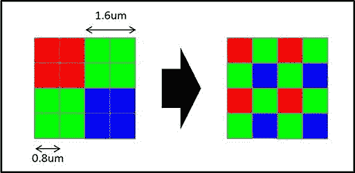

# 三星 Galaxy S20 Ultra 如何与诺娜宁滨一起拍摄精彩照片

> 原文：<https://www.xda-developers.com/samsung-galaxy-s20-ultra-108mp-nona-binning-camera/>

智能手机相机百万像素大战放缓并停止了几年，但在 2019 年再次升温。2018 年，华为 P20 Pro ( [评测](https://www.xda-developers.com/huawei-p20-pro-review/))和华为 Mate 20 Pro ( [评测](https://www.xda-developers.com/huawei-mate-20-pro-review/))配备了巨大的 4000 万像素四拜耳传感器，这证明了高像素传感器不一定对弱光摄影有害。得益于漂亮的 4 合 1 像素宁滨和强大的夜间模式，华为 2018 年的旗舰智能手机能够在弱光摄影中轻松跻身顶级，匹配甚至在某些情况下击败了谷歌的 HDR+和夜视功能。2019 年，受华为的启发，高像素 Quad Bayer 传感器成为主流，大多数主要智能手机供应商都使用某种形式的 [48MP 索尼 IMX586](https://www.xda-developers.com/sonys-imx586-48mp-smartphone-camera/) ， [48MP 三星 GM1](https://www.xda-developers.com/samsung-32mp-48mp-isocell-camera-sensors/) 和 GM2， [64MP 三星 ISOCELL GW1](https://www.xda-developers.com/samsung-64mp-isocell-sensor-smartphones/) ，最后是最新的 64MP 索尼 IMX686。小米推出了[小米 Note 10](https://www.xda-developers.com/xiaomi-mi-note-10-first-impressions-108mp-of-greatness/) ，它采用了 [108MP 三星 ISOCELL HMX](https://www.xda-developers.com/samsung-isocell-bright-hmx-108mp-camera-sensor-xiaomi/) 主传感器。[新推出的三星 Galaxy S20 Ultra](https://www.xda-developers.com/samsung-galaxy-s20-specs-features-pricing-availability/) 是市场上第二款使用 108MP 主摄像头的手机(不算 [Mi Mix Alpha](https://www.xda-developers.com/xiaomi-mi-mix-alpha-hands-on/) 概念手机)，但其工作流程不同。让我们进入细节。

Galaxy S20 Ultra 是三星 Galaxy S20 系列中的旗舰手机，它有与之匹配的规格和定价。普通的 Galaxy S20 和 Galaxy S20+使用新的 12MP 主传感器，像素大小为 1.8 微米，而 Galaxy S20 Ultra 则升级到 108MP 主传感器。不过，这与小米 Note 10 的传感器不同。Galaxy S20 Ultra 使用的是 ISOCELL HM1 传感器，比 Mi Note 10 中使用的 ISOCELL HMX 略有改进。首先，它能够录制 8K@24fps 的视频。更有趣的是，它从小米 Note 10 中使用的 4 合 1 像素宁滨转向了新的 9 合 1 像素宁滨，可生成 1200 万张照片。三星称这款手机为诺娜宁滨，它是第一款使用 3×3 像素宁滨而不是 2×2 像素宁滨的手机。Galaxy S20 Ultra 可以在高分辨率 108MP 模式和九像素像素仓 12MP 模式之间动态切换。

为了理解为什么这是有益的，让我们看看像素宁滨是如何工作的。

## 高百万像素四拜耳传感器上的像素宁滨

 <picture></picture> 

Via: AnandTech

在 2018 年之前，基本上每个智能手机摄像头都有一个拜耳彩色滤光片阵列。华为 P20 Pro 和华为 Mate 20 Pro 是首批使用 Quad Bayer 传感器的手机。简而言之，四拜耳传感器的颜色分辨率低于标准拜耳布局的传感器。例如，在 IMX586 上，摄像头传感器上的物理彩色滤光片只有 12MP 的有效分辨率。这种传感器的 ISP 能够通过在逻辑像素中重新排列子像素来实现传感器的虚拟 48MP Bayer 结果。很明显，这种方法不如使用标准的拜耳过滤器。具体区别是什么？*Anand tech*[表示，48MP IMX586 的空间分辨率更接近 27MP，因为它只能中途提高空间分辨率](https://www.anandtech.com/show/13886/honor-launches-the-view20-a-48mp-camera-handson)。

那为什么要使用四拜耳传感器呢？它们是有意义的，因为到目前为止，如果设备制造商想要集成高百万像素传感器，它们是市场上的唯一选择。它们的负面影响通过使用 4 合 1 像素宁滨得到缓解，该技术在传感器级别将四个像素合并为一个像素，以降低噪声，提高动态范围，并改善每像素细节。将多个像素合并成一个像素并不是一个新想法；早在 2012 年和 2013 年，诺基亚 808 PureView 和诺基亚 Lumia 1020 就是这样做的。以前的想法是将多个有噪声的像素合并成一个干净的“超级”像素。Quad Bayer 传感器的出现导致了像素宁滨的普及。

像素宁滨背后的理论是这样的。华为在其旗舰产品上定制的 40MP 传感器具有 1.0 微米的像素大小。主流的 48MP 和 64MP 传感器具有更小的像素尺寸，为 0.8 微米。即使是 108MP ISOCELL 传感器也具有相同的 0.8 微米像素尺寸，因为当分辨率随着传感器尺寸同时增加时，像素尺寸保持不变。当像素尺寸降低时，低光图像质量受到不利影响。低光照片受像素对光的敏感度的影响很大，因此，经验法则是使用更大的像素尺寸，旗舰 12MP 传感器的像素尺寸约为 1.4 微米。

四拜耳传感器理论上通过像素宁滨来规避这一限制。华为的 4 合 1 像素宁滨在默认情况下以 2.0 微米的“有效像素大小”拍摄 1000 万张照片。默认情况下，48MP 和 64MP 传感器使用 4 合 1 像素宁滨拍摄 12MP 和 16MP 照片，有效像素尺寸为 1.6 微米。小米 Note 10 默认使用 4 合 1 像素宁滨拍摄 2700 万张照片，有效像素尺寸为 1.6 微米。这让他们在昏暗的光线下也能取得有竞争力的成绩。当然，智能手机摄影是一个复杂的领域，图像处理也是一个同样重要的因素，但在所有其他因素不变的情况下，1.6 微米的有效像素尺寸应该比 1.4 微米的像素尺寸更好。一些设备制造商在实现这种高百万像素四拜耳传感器方面比其他制造商更成功。三星、华为和苹果选择继续使用他们的定制传感器，而谷歌继续在谷歌 Pixel 4 中使用相对较旧的索尼 IMX363，通过改进 HDR+和夜视的计算摄影来弥补这一点。

因此，我们现在有一个市场，即使是较低的中档手机也有 48MP 和 64MP 四拜耳传感器，因为它们与传统的 12MP 或 16MP 传感器相比基本上没有什么真正的缺点。使用 4 合 1 像素宁滨，最终的照片在大多数光线条件下都会达到 12MP 的分辨率，尤其是在光线较暗的情况下。高分辨率的好处是在白天，一些手机提供 48MP 模式，以利用增加的空间分辨率。

## 银河 S20 Ultra 的“诺娜宁滨”

Galaxy S20 Ultra 是像素宁滨方法的逻辑发展。迄今为止，使用高百万像素传感器的手机一直使用 2x2 宁滨将四个像素合并为一个像素。这使得有效像素尺寸加倍，例如从 0.8 微米增加到 1.6 微米。然而，使用 108MP 传感器，宁滨有可能一次处理更多像素。4 合 1 像素宁滨将产生 2700 万像素的像素合并模式，这对于一般照片来说仍然太大了。此外，有效像素尺寸为 1.6 微米的 2700 万张照片很好，但如果有效像素尺寸为 2.4 微米的 1200 万张照片会怎么样呢？

三星通过使用 3×3 像素宁滨，在传感器级别将 9 个像素合并为一个像素，实现了 2.4 微米的有效像素大小。“诺娜·宁滨”不过是该公司对 3x3 宁滨的营销术语。这将把 9 个相对嘈杂的像素合并成一个大而干净的超像素，理论上可以进一步增强低感光度。2.4 微米的有效像素尺寸在智能手机相机中闻所未闻。唯一可以比较的是在 CES 上推出的 [OmniVison 的 48MP OV48C 图像传感器](https://www.xda-developers.com/omnivision-ov48c-new-48mp-image-sensor/)。它输出标准的拜耳照片，具有 1.2 微米的像素大小，使用近像素宁滨来实现 2.4 微米像素大小的 1200 万照片。虽然它有很好的规格，但它还没有成为任何航运电话。

因此，三星的方法理论上是两全其美的。据该公司称，这款手机将在高分辨率 108 兆像素模式和 12 兆像素像素模式之间动态转换。在白天，如果图像处理达到标准，它应该能够拍摄超高分辨率的 108MP 照片，以捕捉远处的细节，并进行更有效的裁剪。在弱光下，它将使用 9 合 1 像素宁滨，动态切换到 12MP 模式。弱光摄影受像素大小的影响远远大于分辨率。从理论上讲，弱光下的 3×3 像素宁滨比 2×2 宁滨更有意义，即使分辨率从 2700 万像素(2×2 宁滨)下降到 1200 万像素(3×3 宁滨)。

因此，Galaxy S20 Ultra 的 108MP 传感器在理论上没有任何弱点。事实上，它应该是一个新的图像质量冠军，无论是在日光下还是在弱光下。虽然我们保留判断，直到我们自己测试了手机，三星在理论上已经做出了正确的决定。我个人毫不怀疑，如果执行得好，更多使用 108MP 传感器的供应商将从 4 合 1 宁滨迁移到 9 合 1 像素宁滨，以实现低光下更好的照片。Galaxy S20 Ultra 绝对是一款有趣的手机，它让我们对智能手机相机性能和图像质量在今年再上一个台阶充满希望。

**[三星 Galaxy S20 论坛](https://forum.xda-developers.com/galaxy-s20) ||| [三星 Galaxy S20+论坛](https://forum.xda-developers.com/galaxy-s20-plus) ||| [三星 Galaxy S20 超论坛](https://forum.xda-developers.com/galaxy-s20-ultra)**