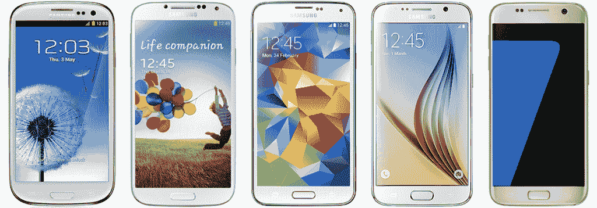
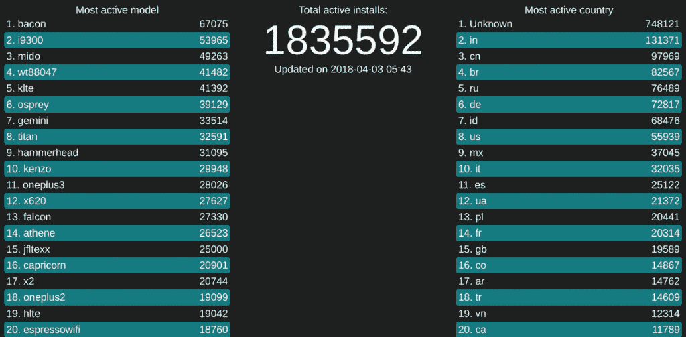
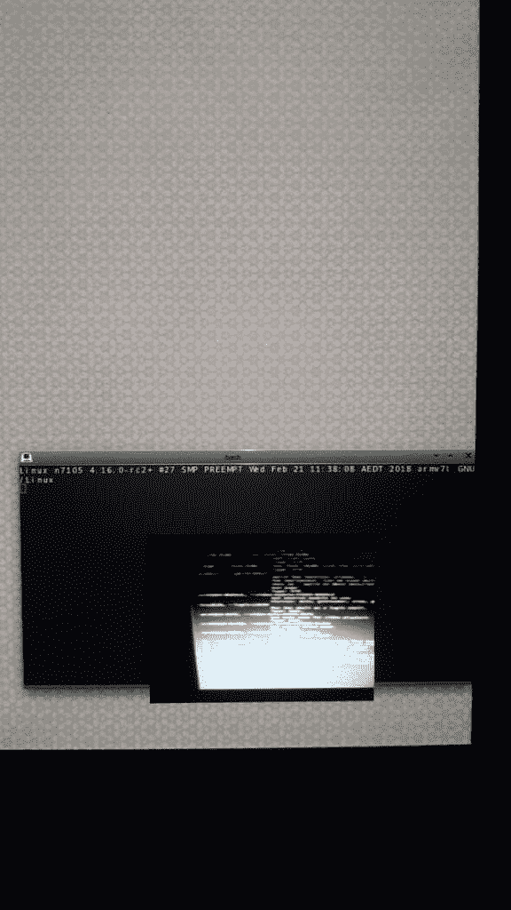

# 三星 Galaxy S III 和 Galaxy Note II 可能会接替传说中的 HTC HD2

> 原文：<https://www.xda-developers.com/samsung-galaxy-siii-samsung-galaxy-note-ii-htc-hd2/>

以技术为导向的网站往往只关注最新的智能手机(这也包括我们)，但大量用户出于这样或那样的原因选择不升级他们的设备。也许是出于财务原因，有数十万用户坚持使用旧设备。定制 rom，如现已不存在的 CyanogenMod，已经让老式智能手机存活了很长时间，但总有一天，甚至非官方的支持也必须结束——至少对大多数设备而言。传说中的 HTC HD2 于 2009 年推出 Windows Mobile 6.5，当时安卓 2.1 艾克蕾尔是最新的安卓版本，但该设备已经接收了从[安卓](https://www.xda-developers.com/kitkat-more-or-less-working-on-legendary-hd2/) [到](https://www.xda-developers.com/and-it-goes-on-htc-hd2-receives-lollipop-port/) [再到](https://www.xda-developers.com/htcs-legendary-hd2-receives/) [安卓 7.0 牛轧糖](https://www.xda-developers.com/xda-external-link/cyanogenmod-14-based-on-android-7-0-booting-on-the-htc-hd2/)的每个版本的端口(更不用说多个[其他](https://www.xda-developers.com/firefox-os-makes-an-appearance-on-the-htc-hd2/) [操作系统](https://www.xda-developers.com/htc-hd2-refuses-to-die-now-runs-windows-rt/))。)现在，HD2 的火炬似乎将传递给三星 Galaxy S III 和三星 Galaxy Note II。

* * *

## 传奇永不消逝:三星 Galaxy S III 和 Galaxy Note II 如何延续

三星 Galaxy S II 和三星 Galaxy Note 是三星 Galaxy 采用矩形设计的最后两款旗舰产品。从 2012 年年中的[三星 Galaxy S III](https://forum.xda-developers.com/galaxy-s3) 开始，到 2012 年末的[三星 Galaxy Note II](https://forum.xda-developers.com/galaxy-note-2) ，三星修改了他们的智能手机设计语言，以融入他们现在标志性的弯曲边缘。自 2013 年以来发布的每一款三星 Galaxy S 设备中都有最初三星 Galaxy S III 设计的痕迹，直到三星 Galaxy S8 才彻底改变了设计语言。

 <picture></picture> 

Left to right: Samsung Galaxy S III, Galaxy S4, Galaxy S5, Galaxy S6, and Galaxy S7\. Devices are not to scale.

这两款设备都推出了 Android 4.0 冰淇淋三明治，官方更新一直延伸到国际 Galaxy S III 的 Android 4.3 Jellybean 和 LTE Galaxy S III 和 Galaxy Note II 的 Android 4.4 KitKat。多亏了 CyanogenMod(现在是 LineageOS)，这些设备有了一个非官方的升级到 Android 7.1 牛轧糖的路径。与一些现代 Android 智能手机的荒谬规格相比(OnePlus 5T 和 Razer 手机上的 8gb 内存与国际 Galaxy S III 和 Galaxy Note II 上的 1/2gb 内存相比)，这两款设备似乎不应该能够运行更现代版本的 Android。

然而，他们做到了。他们不仅能够启动 Android 7.1 牛轧糖，而且运行得非常好，根据 ROM 的[官方统计页面](https://stats.lineageos.org/)，国际三星 Galaxy S III 是运行 LineageOS 的**第二受欢迎的设备。**

 <picture></picture> 

LineageOS active installation statistics as of April 3rd. The international Samsung Galaxy S III is surpassed in usage only by the equally legendary OnePlus One.

虽然 Android 软件版本和片上系统的最新迭代降低了定制 rom 在旗舰智能手机上的受欢迎程度，但这些旧设备(以及小米 Redmi Note 4 等一些较新的廉价设备)却因定制 rom 而保持活力。除非硬件出现故障，否则这些设备中的许多可能还会使用数年，因为对它们的所有者来说，它们仍然工作得很好。(可拆卸电池无疑也有助于延长电池寿命。)有一件事可能会说服成千上万的用户最终放弃他们的旧设备，那就是如果非官方的软件支持在可预见的未来结束——随着设备维护者转向更绿色的牧场，这几乎是肯定会发生的事情。

然而，最近的一项发展引起了我们的注意，这将有助于为这些旧的三星 Galaxy 旗舰设备的延长寿命铺平道路。据三星 Galaxy S III、谷歌 Nexus 7 (2013)和三星 Galaxy A7 (2017)的官方 LineageOS 维护者 XDA 高级成员 [forkbomb444](https://forum.xda-developers.com/member.php?u=5405215) 称，【4.17 版本的 Linux 内核将增加对三星 Galaxy S III 和三星 Galaxy Note II 的支持。

## 三星 Galaxy S III 和 Galaxy Note II:重生的设备

开发人员面临的最大挑战之一是维护内核，他们希望旧设备保持更新。随着新的 Android 操作系统的发布，开发人员可能需要进行许多更改，以确保现有的 HALs 与最新的 Android 框架兼容。问题是，如果没有官方制造商的支持，让收音机和显卡驱动程序保持最新可能是一场噩梦。( [Project Treble](https://www.xda-developers.com/tag/project-treble/) 本应通过允许在不需要改变现有 HALs 的情况下更新 Android 框架来帮助这一过程，但这一重大的重新架构直到 Android 8.0 Oreo 的发布才到来——在 Galaxy S III 发布 5 年后。)

然而，如果你有专业知识，并且愿意为此付出心血、汗水和眼泪，那么仍然移植最新版本的 Android 也不是不可能的。如果其他人开始努力，也会有所帮助。在这种情况下，三星在 Galaxy S III 上测试 Tizen 3.0 有助于 Exynos 4 Quad 更好地适应 Linux 内核。forkbomb444 表示，他在音频和一些 [Galaxy Note II 特定硬件](https://git.kernel.org/pub/scm/linux/kernel/git/next/linux-next.git/log/arch/arm/boot/dts?h=1e46eb3cbacde81ceb93f140f69834c9893235de)(触摸屏、显示屏和其他组件)方面的工作正在向主流 Linux 内核进行上游转移，这意味着这两款设备“将能够启动谷歌/[【kernel.org】](https://www.kernel.org/)**发布的内核，而无需进行任何更改**，这使得跟上新的 AOSP 版本变得容易得多”。(forkbomb444 还认为 [Replicant](https://www.xda-developers.com/tag/replicant/) 对 RIL 进行了逆向工程，使得支持新版 Linux 内核变得更加容易，而无需进行大量的黑客攻击。)

Galaxy S III/Galaxy Note II 的所有 4 个 Exynos 版本(i9300、i9305、n7100、t0lte)都能够使用 [kexec](https://wiki.archlinux.org/index.php/kexec) 启动一套软件。稍加修改，forkbomb444 声明**任何常规的 GNU/Linux 发行版都可以安装在设备上。**现在，在你的设备上安装 GNU/Linux 发行版并没有什么特别的好处。然而，本着 HTC HD2 的精神，这不是关于实际运行软件，而是关于证明它是可能的。

 <picture></picture> 

Demonstration of a working camera on the Galaxy S III with the upstreamed changes to the Linux kernel

forkbomb444 表示，他仍在努力让通知 LED 驱动程序提交到上游，Linux 内核版本 4.18 应该会支持它以及硬件备份和菜单键。他估计他已经提交的修改应该会在下周到达主线 Linux 内核源代码树。至于让 Android Oreo 在设备上运行，那是**仍在进行中的工作**。得益于 [Android Go](https://www.xda-developers.com/android-go-old-android-8-1-oreo/) 的优化，Android 奥利奥甚至可能比 Android 牛轧糖在设备上运行得更好。

总之，官方对 Linux 内核中几乎所有关键硬件组件的支持将为未来版本的 Android 和其他基于 Linux 内核的操作系统移植到设备上铺平道路。HTC HD2 因其不朽而成为社区中的传奇。或许国际三星 Galaxy S III 和三星 Galaxy Note II 可能会加入 Android 智能手机大神的万神殿。