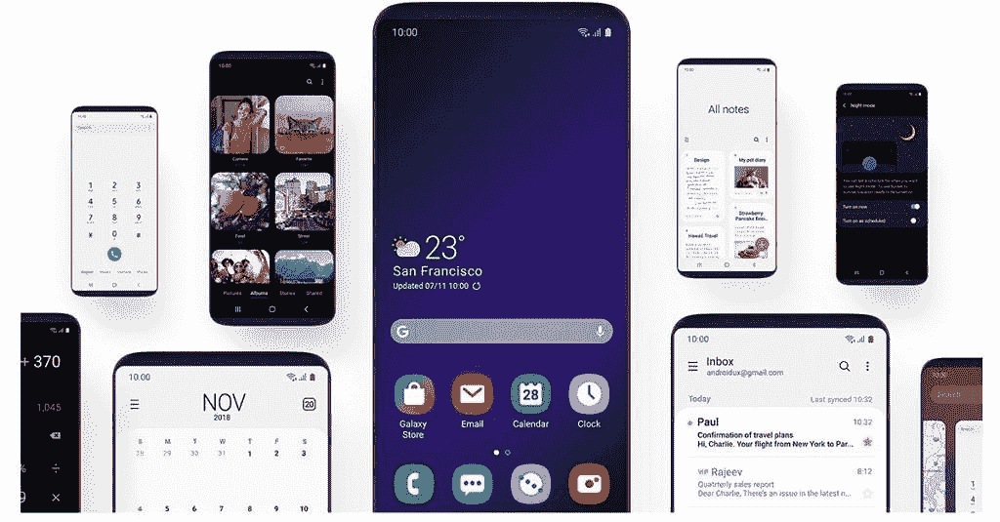
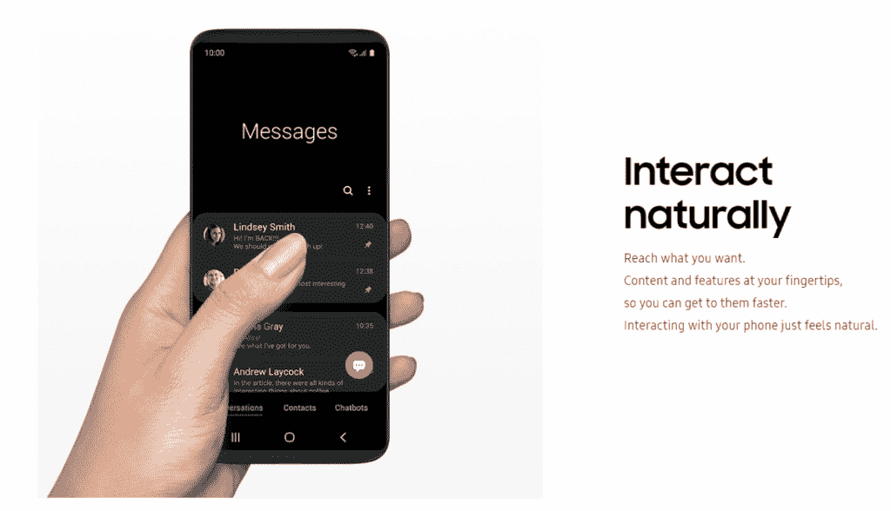
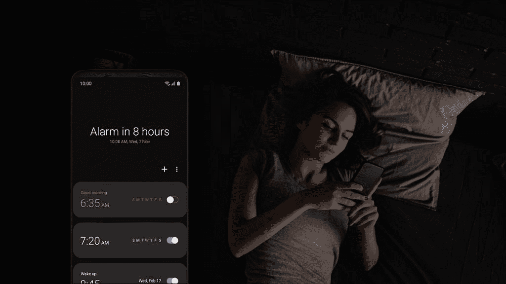

# 三星为 Galaxy S9 和 Galaxy Note 9 推出的 One UI

> 原文：<https://www.xda-developers.com/samsung-one-ui-android-pie-galaxy-s9-galaxy-note-9/>

在今年的三星开发者大会上，我们终于[瞥见了期待已久的可折叠显示屏智能手机](https://www.xda-developers.com/samsung-foldable-phone-infinity-flex/)。该设备采用 4.6 英寸 Super AMOLED“盖”显示屏，当打开时，会显示 7.6 英寸 Super amo led“Infinity Flex”主显示屏。三星与谷歌合作，将“[可折叠物](https://www.xda-developers.com/smartphone-foldable-display-android/)的概念引入 Android 生态系统。但是 Infinity Flex 显示屏并不是开发者大会的主要焦点。三星还在舞台上推出了“One UI”，这是他们基于 Android Pie 的软件，也是他们“三星体验”设计语言和用户体验的继承者。

一月份，三星 Galaxy S9、三星 Galaxy S9+和三星 Galaxy Note 9 将提供一个 UI [。从这个月开始，Galaxy S9 和 Galaxy S9+也将有一个](https://www.xda-developers.com/galaxy-s9-galaxy-note-9-android-pie-january/)[测试程序](https://www.xda-developers.com/samsung-android-pie-beta-november/)。One UI 是三星设计语言的一次重大革新。在所有人都关注即将到来的三星 Galaxy S10 的情况下，我们来谈谈三星对 Android Pie 所做的改变，以使 One UI 成为可以击败的软件体验。

* * *

## 一个用户界面——三星的设计语言，重新构思

当[我们第一次发现](https://www.xda-developers.com/exclusive-this-is-android-pie-with-samsung-experience-10-on-the-samsung-galaxy-s9/)和[公开披露](https://www.xda-developers.com/install-android-pie-samsung-experience-10-samsung-galaxy-s9/)Galaxy S9、Galaxy S9+和 Galaxy Note 9 的早期 Android Pie 版本时，引起我们注意的主要事情之一是完全改进的设计。虽然当时还不完整，但我们的早期研究表明，三星一直在努力从安卓牛轧糖和基于奥利奥的三星体验(前身为 TouchWiz)中进行彻底的设计偏离。在三星开发者大会之前，我们称新的 UX 三星体验 10，但现在我们知道三星已经选择了“一个用户界面”品牌。那么，为什么他们称之为一个用户界面呢？

 <picture></picture> 

An overview of Samsung's One UI. Source: Samsung

一个用户界面从三星的经验中获得了一些设计线索，并以其新的材料主题设计来储备 Android Pie。但是三星的新 UX 不仅仅是简单的重新设计。一个 UI 重新想象了你与软件交互的方式，使它更容易使用。这里有两个要点。

### 改进的单手使用

三星一直是销售更大显示屏智能手机的先锋。毕竟，是最初的三星 Galaxy Note 引发了如今已成为常态的“平板手机”潮流。三星的 Infinity 显示设备使三星的手机具有较小的边框，但在较小的尺寸上安装较大显示器的竞争是以单手使用为代价的。达到任何现代大屏幕智能手机的顶部都需要一些认真的手体操，智能手机设备制造商试图通过软件技巧来解决这一问题，比如用“单手模式”类型的功能缩小屏幕。三星也有自己的缩小屏幕的功能，但一个 UI 通过完全重新安排你与显示器交互的区域来解决这个问题。

系统应用程序分为两个部分:“查看区域”，占据屏幕的上半部分，显示与应用程序相关的各种上下文(有点像一个巨大的操作栏)，以及“交互区域”，将应用程序的关键交互区域放在下半部分。这样，你可以用单手更容易地与系统交互，因为一切都应该在你的拇指范围内。底部导航栏、按钮，应有尽有——你需要触摸的一切都不再需要伸出手指来触摸显示屏的顶部。

这种查看区域/交互区域设置涵盖了三星的整个新 UI:从消息应用程序，到拨号器，到时钟，到设置菜单，到通知阴影和快速设置面板。操作系统的许多部分都经过了重新设计，以方便使用，所以那些在设备上接收 Android Pie 更新的人应该会期待这些变化。

 <picture></picture> 

One UI One-Handed Usability. Source: Samsung

### 全系统黑暗模式

你们中的许多人肯定会喜欢的一个变化是一个系统范围的黑暗模式被内置到一个用户界面中。通过启用一个简单的设置，整个用户界面(默认情况下通常是全白的)切换到 AMOLED 深色主题，该主题适用于通知、通知阴影、设置菜单和三星所有预装的应用程序。

这有很多好处。黑暗模式在一定程度上提高了夜间的可用性，在这种特殊的情况下，它的开发正是为了这个目的:默认为白天，黑暗模式为夜间。然而，由于美观，许多用户更喜欢黑暗模式。黑暗模式也更有利于电池，因为它主要是黑色的。由于大多数三星手机都有 Super AMOLED 显示屏，真正的黑色内容将导致底层像素被关闭，从而有效地节省电池。

 <picture></picture> 

Dark Theme in Samsung's clock app. Source: Samsung

说到主题，三星还提到，用户界面可以根据设备的颜色呈现不同的颜色。我们不确定这将如何工作，但这似乎是一个使你的软件个性化的好方法。

* * *

## 它什么时候来？

一个 UI 将于 2019 年 1 月为三星 Galaxy S9、Galaxy S9+和 Galaxy Note 9 推出稳定的 Android 9 Pie 更新。它也可能会在明年进入之前的手机，如三星 Galaxy S8、三星 Galaxy S8+和三星 Galaxy Note 8 以及三星 Galaxy A9 (2018)和三星 Galaxy A7 (2018)，尽管这尚未得到证实。[官方测试版即将开始](https://www.xda-developers.com/samsung-android-pie-beta-november/)，所以如果你有符合条件的设备，下载 Samsung Members 应用程序(如果你在美国，则下载 Samsung+)并提交申请。

One UI 似乎是对当前三星设计的一个相当大的改进，我们迫不及待地想了解更多。你可以在三星官方网站的[上了解更多信息。](https://shop-links.co/link/?exclusive=1&publisher_slug=xda&article_name=One+UI%2C+Samsung%27s+new+Android+Pie+software%2C+improves+One-Handed+use+and+adds+a+system-wide+Dark+Theme&article_url=https%3A%2F%2Fwww.xda-developers.com%2Fsamsung-one-ui-android-pie-galaxy-s9-galaxy-note-9%2F&u1=UUxdaUeUpU22799&url=https%3A%2F%2Fwww.samsung.com%2Fus%2Fapps%2Fone-ui%2F&ourl=https%3A%2F%2Fwww.samsung.com%2Fglobal%2Fgalaxy%2Fapps%2Fone-ui)