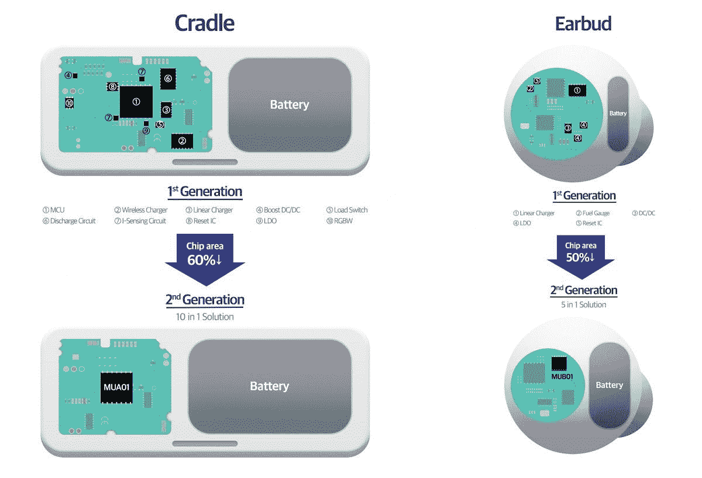

# 三星和高通推出新芯片，让真正的无线耳塞变得更好

> 原文：<https://www.xda-developers.com/samsung-qualcomm-unveil-new-chips-make-true-wireless-earbuds-better/>

# 三星和高通推出新芯片，让真正的无线耳塞变得更好

随着真正的无线耳塞越来越受欢迎，三星和高通正在推出新的硬件来提高电池寿命和音频质量。

真正的无线耳塞已经成为最受欢迎的电子产品之一，因为许多原始设备制造商已经从他们的旗舰智能手机上移除了耳机插孔。对真正的无线耳塞的两个最大的持续关注是音频质量和电池寿命。令人欣慰的是，制造商们很快改进了真正无线耳塞的技术，因此与几年前相比，他们已经提供了更好的音频质量和更持久的电池寿命。三星和高通是生产 TWS 耳塞组件的两家最大的公司，两家公司都刚刚宣布了提高寿命和音频质量的新芯片。

**三星的 MUA01 和 mub 01 pmic**

第[条公告](https://news.samsung.com/global/samsung-introduces-industrys-first-all-in-one-power-ics-optimized-for-wireless-earbuds)来自韩国制造商。三星正在详细介绍一种新的电源管理集成电路(PMIC)，该电路已经存在于[三星 Galaxy Buds+](https://www.xda-developers.com/samsung-galaxy-buds-plus-wireless-earbuds-launch/) 无线耳塞中。MUA01 和 MUB01 PMICs 分别用于充电盒和耳塞本身，旨在使真正的无线立体声(TWS)设备使用时间更长。新闻稿提到，三星能够将多达 10 个不同的组件放在一个 PMIC 中，与早期的替代产品相比，尺寸缩小了一半。更小的单元尺寸为电池留出了更多空间，这意味着更长的电池寿命。这两个单元都带有微控制器单元和嵌入式闪存，这使得更新和/或修改固件更容易。MUA01 是充电外壳的 PMIC，支持有线和无线充电(根据无线电力联盟的 Qi 1.2.4 标准)。

 <picture></picture> 

Source: Samsung

**高通的 QCC514X 和 QCC304X 蓝牙 SOC**

至于高通，[他们正在发布](https://www.qualcomm.com/news/releases/2020/03/25/new-ultra-low-power-bluetooth-audio-socs-qualcomm-improve-truly-wireless)新的蓝牙片上系统，用于真正的无线耳塞。QCC514X 和 QCC304X 是该公司最新推出的 SOC，分别用于高端和入门级 TWS 设备。它们都在硬件层面上提供了语音助手支持和高通的混合主动噪声消除(混合 ANC)。后者允许低延迟泄漏，这意味着你将能够利用飞机上的噪音消除，以及当你只是走在街上。高通还承诺“优质的无线声音和语音质量”此外，这两个 SOC 支持高通新的 TrueWireless 镜像技术。根据新闻稿，通过这项技术，“一个耳塞通过蓝牙无线连接到手机，而另一个耳塞镜像连接的耳塞，并设计为在几种情况下提供快速交换。”高级 QCC514X 支持始终在线语音激活来触发数字助理，而入门级 QCC304X 仅支持一键通。