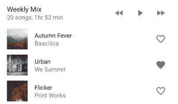
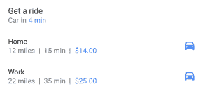
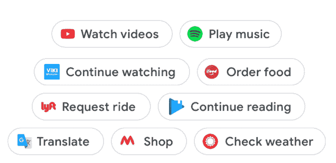

# 切片和应用程序动作是 Android P APIs，将应用程序的内容带到谷歌助手

> 原文：<https://www.xda-developers.com/slices-app-actions-android-p-google-assistant/>

对于独立的应用程序开发人员来说，实际应用程序开发之后的工作通常是工作中最困难的部分。你如何让人们了解你的应用？一旦你开始获得一些用户，你如何留住他们？吸引用户，让他们不断回到你的应用程序(而不是卸载它)，是建立一个稳定的专用用户群的关键。这就是为什么谷歌在 Android P 中引入了新的 API，称为切片和应用程序操作。

由于用户设备上安装了几十个，甚至几百个应用程序，你的应用程序很难吸引用户的注意力。你希望用户经常打开你的应用程序，这样你就可以为他们提供更多的内容，从而保持他们的参与，并有可能产生更多的收入。随着用户将注意力从单个应用转移到内容聚合器，如 [Google Feed](https://www.xda-developers.com/google-improves-the-feed-experience-of-the-google-app/) ，你需要找到一种方法，在人们花费大部分时间的地方展示你的应用内容。新的[Android P](https://www.xda-developers.com/tag/android-p/)API 帮助开发者做到了这一点，它允许你显示应用程序 UI 的片段(片段)或基于应用程序功能的上下文动作(应用程序动作)。)

## 使用新的切片 API

你们当中一些更精明的观察者可能已经注意到了新的[切片 API](https://developer.android.com/guide/slices/) 出现在与第一个 [Android P 开发者预览版](https://www.xda-developers.com/android-p-developer-preview-1-google-pixel-xl-pixel-2-xl/)一起发布的 [API 文档](https://developer.android.com/reference/android/app/slice/package-summary)中。文档是相当模糊的，但是今天我们对 Google 对这个新 API 的愿景有了更清晰的了解。这是第三方应用程序将其内容呈现到类似于[谷歌应用程序](https://www.xda-developers.com/tag/google-app/)的应用程序中的一种方式，但这是一种动态、互动和无缝的方式。切片可以包括实时数据、滚动内容、内嵌动作和应用程序的深度链接，因此您可以选择向用户展示哪些内容。

比方说，你正在为一家连锁酒店开发一个旅行规划应用程序，它能够办理入住/退房手续。如果酒店向用户发送电子邮件确认，并且用户启用了 Google Feed，那么 Google 可以跟踪预订。但是这并没有把用户带到你的应用上，不是吗？使用 Slices API，当用户搜索与预订相关的术语时，您可以以更自然的方式显示预订。

 <picture></picture> 

Slices in the Google App. Source: Google

如果你是一名开发人员，用[材质设计](https://www.xda-developers.com/tag/material-design/)界面制作了一个漂亮的新音乐播放器，会怎么样？如果用户在应用程序中建立了一个播放列表，而你想提醒他们那些甜美的音乐，你可以在他们打开谷歌应用程序并搜索相关歌曲、艺术家、专辑等时通知他们。

 <picture></picture> 

Music playlist Slices example. Source: Google

最后，假设你正在为一家拼车公司或其他相关企业开发一款应用。如果用户在谷歌应用中搜索预订相关服务的方式，你可以提供应用的互动部分，让他们快速完成预订。

 <picture></picture> 

Slices from the Lyft app. Source: Google

上面显示的每个切片设计看起来都很独特，但它们都遵循您可能熟悉的一般设计原则。API 允许你对提供给 Google 应用的切片进行样式化，尽管基本样式是基于 Android 通知的，所以你的切片的外观不应该与其他切片有太大的不同。

### 和睦相处

很明显你可以用切片做很多事情。如果你对用这个 API 构建你的应用感兴趣，你可以[在这里](https://developer.android.com/guide/slices/getting-started)了解更多。我们被告知，CNN、HBO、USAA 和阿里巴巴等大公司已经在致力于增加对 API 的支持。由于兼容性包的最低 SDK 版本，Slices 与市场上 95%的 Android 设备兼容，因此一旦它们在谷歌应用程序中上线，你的 Slices 将获得大量受众。

最后，有些人可能想知道其他应用程序是否可以接收切片。答案是否定的:只有系统应用程序可以。这是因为一个应用程序作为 [SliceManager](https://developer.android.com/reference/android/app/slice/SliceManager) 从 [SliceProvider](https://developer.android.com/reference/android/app/slice/SliceProvider) 接收切片所需的权限不能授予第三方应用程序([Android . permission . bind _ Slices](https://developer.android.com/reference/android/Manifest.permission#bind_slice))。)

## 应用程序操作

Android P 中新的[应用动作 API](https://developer.android.com/guide/actions/) 旨在根据上下文为用户提供各种预测动作供选择。你可以把它想象成智能回复的[回复](https://www.xda-developers.com/reply-google-smart-replies-twitter-hangouts-android-messages-facebook-messenger/)应用(或者 Android P 的智能回复 API)，而不是动作。应用程序动作的出现基于多个应用程序的使用和相关性，如谷歌应用程序、 [Play Store](https://www.xda-developers.com/tag/play-store/) 、[谷歌助手](https://www.xda-developers.com/tag/google-assistant/)和 [Pixel Launcher](https://www.xda-developers.com/tag/pixel-launcher/) 。App Actions API 使用与 Google Assistant 上的[动作相同的一组](https://developers.google.com/actions/)[意图](https://developers.google.com/actions/reference/built-in-intents)。

 <picture></picture> 

App Actions in Android P. Source: Google

如果你有兴趣了解更多关于应用程序操作的信息，那么你可以[注册，以便在应用程序可用时得到通知](https://docs.google.com/forms/d/e/1FAIpQLSfzg7DrFtD8S_tHrYYoWpmsfFzLuduukoQQY6A2AtHsxTHgKg/viewform)。