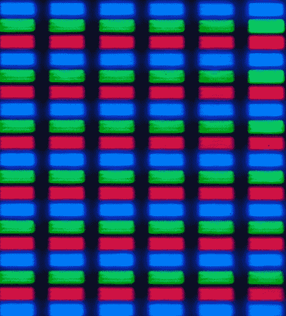

# 周日辩论:AMOLED 与 IPS 液晶显示器

> 原文：<https://www.xda-developers.com/sunday-debate-amoled-vs-ips-lcd-displays/>

我们的屏幕变得越来越亮，越来越丰富，每英寸玻璃的像素越来越多——这一切都是为了我们的视觉享受。分辨率战争远未结束，因为我们现在已经在 Xperia Z5 智能手机上拥有了第一个 4K 面板。但是我们都知道分辨率并不是屏幕的全部:

到目前为止，我们可能都体验过两种最受欢迎的面板，AMOLED 和 LCD(尤其是 IPS)。两者各有利弊，两者都出现在 Android 有史以来提供的一些最好的设备中，每一种都受到不同类型的消费者的青睐。

在这场辩论中，我们希望你不仅陈述你的观点，还陈述你认为哪种屏幕技术对平台的未来更好。多样化和选择当然很好，但目前有明确的赢家吗？这种情况将来会改变吗？这两种解决方案都随着修订和新的规避技术不断改进，但只有一种可以占用你下一部手机的面板。所以我们问:

*   你更喜欢 AMOLED 还是 IPS LCD？
*   **你觉得哪个更好看(色彩、亮度、灰度、对比度)？**
*   哪项技术进步最大？
*   **您认为每项技术的哪些单独因素有价值？**
*   **未来任一方能否完全压倒对方？**

## AMOLED

 <picture></picture> 

Typical AMOLED sub-pixel layouts are not liked by everyone.

众所周知，三星是这项技术背后的大玩家，其旗舰设备拥有同类产品中最新最棒的。三星面板在过去两年中取得了巨大的进步，现在它们提供了一些最佳的色彩精度，同时仍然非常明亮，非常节能。一些用户称 AMOLED 屏幕“过饱和”，但最近的面板在非默认的“基本”模式下看起来清晰，颜色准确。AMOLED 面板可能会遭受臭名昭著的老化，而且许多面板上仍有一些紫色重影的小问题。这些屏幕还可以为你节省一些电池，因为它们能够在不打开像素的情况下显示黑色，这导致许多用户选择全黑主题。最后，对比度和视角是惊人的。

## 液晶

 较新的 IPS 液晶显示器可能是手机上最漂亮的面板。包括亮度和色彩准确度在内的各种指标中，许多顶级屏幕都是 IPS 液晶面板——这是可以理解的。众所周知，这种面板从一开始就具有更高的色彩准确度，直到最近，它们还比 AMOLED 面板更亮。他们并不总是有惊人的对比，但最好的包有惊人的好比率。IPS LCD 显示器的视角非常好，尽管通常不如 AMOLED 屏幕好。大多数 LCD 面板(与 Xperia Z5 不同)采用典型的 RGB 像素排列，这可以带来一致的图像质量，LG 等公司及其“Quantum”面板也在这一领域做出了改进。总的来说，LCD 传统上是全面的，当调整得当时，带有这些面板的手机会占据排行榜的首位，并丰富视觉。

## 辩论

关于这些显示器，人们可以提出的许多观点可能来自主观领域，但这两种技术及其所走的道路也有一些显著的差异。虽然有人可能会说，近年来 AMOLED 显示器的进步超过了 LCD，但也可以说，它们还有很多工作要做。高端旗舰产品的显示屏通常没有什么问题，但这两种屏幕解决方案都证明了自己对得起其领先智能手机的高价。话虽如此，

*   你更喜欢 AMOLED 还是 IPS LCD？
*   **你觉得哪个更好看(色彩、亮度、灰度、对比度)？**
*   哪项技术进步最大？
*   **您认为每项技术的哪些单独因素有价值？**
*   **未来任一方能否完全压倒对方？**