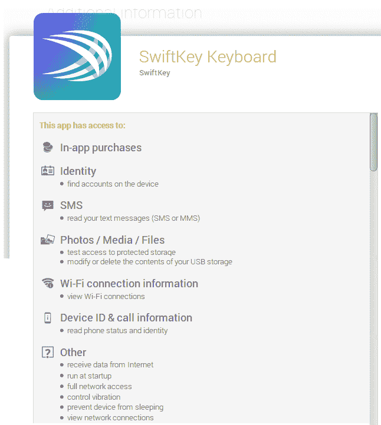

# SwiftKey 和谷歌键盘:听说过用户隐私吗？

> 原文：<https://www.xda-developers.com/swiftkey-and-google-keyboard-ever-heard-of-user-privacy/>

几天前，我[在这里写了一篇文章](http://www.xda-developers.com/android/play-store-permissions-change-opens-door-to-rogue-apps/)讨论谷歌 Play 商店权限处理中的一些变化，以及这些变化如何可能对用户产生不利的隐私风险。那篇文章的评论表明，读者对应用程序使用的权限有着极大的担忧，许多人希望使用 App Ops 或 XPrivacy 来保护自己。

今天，我将稍微绕一下，看看两个流行的应用程序所需的权限:谷歌的第一党键盘，和 SwiftKey。这两个都是键盘应用程序，都可以在 Play Store 上免费下载(后者现在是“免费增值”，提供付费主题)。

尽管这些应用程序可以直接访问你按下的每个键，输入你访问的每个 URL，你发送的短信或电子邮件，以及你输入的密码，但似乎很少有人真正考虑过键盘使用的权限，以及这一点的含义。

## 谷歌键盘

我们来看看谷歌的键盘。请注意，我不得不编辑下图，因为 Play Store web 界面尽最大努力防止您在一个视图中看到完整的权限列表，即使是在垂直方向的 20 英寸显示器上，它仍然选择在这个滚动视图中隐藏大多数权限。不过，为了让你看得开心，我把列表放在了一个视图中。

让我们来看看这是怎么回事。首先，Google Keyboard 可以访问你自己的联系人卡片，以及你设备上的账户。这意味着它有能力知道你是谁，以及你设备上所有可用的电子邮件(和其他)帐户。这意味着他们有可能看到你手机上的谷歌/Dropbox/Twitter/微软 Exchange/脸书账户。我完全不知道为什么需要这个，也不知道为什么人们愿意提供这些信息。

接下来，应用程序可以读取你的联系人。这很公平——谷歌显然想把你的联系人姓名添加到拼写检查和自动完成数据库中。这是有意义的，对于键盘来说也是合理的。修改或删除 USB 存储内容的能力有点奇怪，但尽管它允许访问存储在“SD 卡”上的所有数据，但不幸的是，没有任何更细粒度的方法来实现这一点。理想情况下，谷歌只会使用安全的 */data/data* 存储，因此不需要这个。或者，他们可以使用 ASEC 容器透明地在您的 SD 卡上获得更多的存储空间，而不需要访问您的 SD 卡上的个人文件。

没有通知就下载文件的能力是它开始得到适当关注的地方——注意，这些权限藏在列表的底部，所以你必须滚动才能找到它们。为什么键盘不仅需要下载文件的能力，还需要在不告诉用户的情况下下载，这确实令人担忧。在不告诉你的情况下，它到底需要下载多少数据？

启动时运行的能力没问题。这是你对键盘应用程序的合理期望。另一方面，紧接在也许是最无害的许可之后的隐藏，是最具侵入性的:**完全互联网接入**。

是的，没错，谷歌键盘可以完全自由地访问互联网，以及你的按键、联系人、SD 卡内容和身份。而我们的权限列表马上跳转到说谷歌键盘可以无害地使用你的键盘。有人认为这里有一点点“隐藏”了令人讨厌的权限吗？

接下来的两个权限是无害的，允许访问用户的自定义词典——同样，这完全是键盘应用程序所期望的。最后，请求查看网络连接的权限。我再一次不能提供任何关于为什么需要这样做的见解，除了在你不知情的情况下促进其他现有的访问互联网的许可。

具有讽刺意味的是，作为一个键盘，谷歌的产品相当具有权限。事实上，在这一点上，我认为很难找到一个在选择权限时更少考虑用户隐私的键盘。不幸的是，我错了。

## 快速键

最近成为免费应用程序的 SwiftKey 是一个非常受欢迎的第三方键盘，经常因其预测算法能够预测你将使用的下一个单词而受到称赞。然而，这是以使用权限为代价的吗？我又一次扩展了这个列表，它被 Play Store web 界面卷成了一个滚动列表，所以您可以一次看到所有的权限。

乍看之下，SwiftKey 的权限选择似乎与 Google Keyboard 非常相似。增加应用内购买是因为它最近重新推出了一款免费应用(而不是预付费应用)，对隐私不是很关注。

我们的第一个区别是 SwiftKey 可以读取 SMS 和 MMS 消息。这是有意义的，因为 SwiftKey 具有从消息中学习语言模式的功能。不幸的是，鉴于 SwiftKey 是一个闭源应用程序(就像 Google Keyboard 一样)，很难确切地说出这些数据的用途——市场上肯定需要更多开源、高质量的键盘选择！

另一个区别是 SwiftKey 声明了臭名昭著的“READ_PHONE_STATE”权限。**这样可以访问你的 IMEI、IMSI 和 SIMID 标识符，以及电话号码**，以及任何通话中对方的详细信息(包括他们的电话号码)。在这一点上，我真的想不出还有什么要补充的，为什么 SwiftKey 可能需要这些数据。当然，所有与 Android 1.5 兼容的应用程序都显示为使用该权限，因为当时没有专门的权限。然而，Android 1.5 是 2009 年的遗物，所以今天没有理由出现。我只能猜测，SwiftKey 以其无限的智慧，已经决定他们希望能够跟踪他们的用户，并需要有一个独特的硬件标识符，如 IMEI 这样做。不幸的是，虽然谷歌禁止使用 IMEI 进行广告跟踪(他们希望使用用户可重置的广告 ID)，但他们并没有全面禁止使用设备标识符，这些标识符可以用来跟踪你在应用程序之间的使用，并在未来提供一种识别你的持久方法。

再一次，SwiftKey 提供了完全的互联网接入，一个隐藏在“其他”部分的许可。我是唯一一个有点担心 SwiftKey 可以完全访问互联网以及它访问的所有其他数据(如 SMS 消息、您的身份信息和帐户以及 IMEI)的人吗？

## 结论

简单看一下两个流行键盘的权限就很清楚了——一个是谷歌自己的，一个是 swift key——在“安全敏感”的 Android 应用程序中使用权限有一些主要问题要问。苹果的 iOS 8 打算在即将到来的版本中引入第三方键盘，默认情况下这些应用程序无法访问互联网，如果用户请求，用户可以拒绝键盘访问互联网。

在 Android 上，股票用户没有这个选项。幸运的是，如果您是运行 Xposed 框架的根用户，XPrivacy 在这里确实有所帮助。我已经屏蔽了 SwiftKey 的每一个权限，除了访问我的用户字典和 SD 卡(它存储数据的地方)，它绝对运行良好。我可能得不到联网键盘的“优势”(为什么，看在 Android 的份上，我的键盘要我登录 G+才能获得“云”功能？是键盘！！)

很明显，Play Store 肯定试图让人们很难看到应用程序正在使用哪些权限，对分类权限的新变化带来了完全不同的重大风险，正如我最近强调的那样。也许是时候让技术娴熟的用户停下来，盘点一下他们在手机上安装了什么，以及他们所有的按键都信任哪些应用程序。你对你的键盘在你不知情的情况下访问互联网感到高兴吗？你安装的时候知道它能做到吗？很多问题，是时候让用户要求开发者给出答案，并控制自己的隐私了，因为很明显谷歌和应用开发者对此不感兴趣。