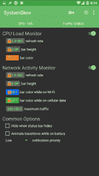

# SystemGlow 在你的状态栏顶部增加了 CPU 负载和网络活动信息

> 原文：<https://www.xda-developers.com/systemglow-adds-cpu-load-and-network-activity-info-on-top-of-your-status-bar/>

大多数现代智能手机装备精良，足以完成普通用户的普通日常任务。打电话、发短信或电子邮件、查看图库中的图片——所有这些任务对任何智能手机来说都不是难事。

但是即使是精英中的精英也有稍微动摇的时候。出于未知的原因，你的智能手机在日常任务中开始变得有点热，并且工作超过了它应该工作的时间。开始担心偶尔的动摇是不够的，但是也许你只是想对这种反常的行为保持谨慎的态度。

这就是像 [SystemGlow](http://forum.xda-developers.com/android/apps-games/app-systemglow-cpu-network-monitor-t3464898) 这样的应用程序的用武之地。由 XDA 资深会员 [Flyview](http://forum.xda-developers.com/member.php?u=2584205) 开发，目前处于测试阶段，SystemGlow 在你的状态栏顶部添加了一个小栏作为覆盖。该应用程序更简单，并没有过度承诺它能做什么:它在你的状态栏顶部添加了两个极简的实时覆盖图——红色栏表示 CPU 负载，蓝色栏表示网络活动。当状态栏隐藏时，你可以设置隐藏栏(就像在游戏中一样，如果你想的话)，当你给手机充电时，你可以选择动画显示这些栏。您还可以设置应用程序的通知优先级。

与我们在定制 rom 中看到的电池条不同，这些条根据活动而变亮或变暗，而不是用条的长度来表示百分比。结果是，当你不需要这些信息时(或者没有真正的理由去看它)，这些条更容易被忽略，因为它们更加微妙和统一。

这个应用程序没有真正的缺点，因为它做了它承诺的很好。该应用程序需要有一个激活的通知来保持自己在内存中并继续工作，但开发人员承诺该应用程序的功耗很低，电池影响可以忽略不计。应用程序的描述确实提到了刷新率、条形颜色和粗细的配置，但这些选项对免费用户是锁定的。您需要购买高级升级来解锁这些选项。

 <picture></picture> 

Lock denotes locked features

当你需要看到你的手机在不应该的任务中长时间进入全性能负载的情况时，SystemGlow 会很有帮助，比如打电话，或者它可能有助于发现在后台运行的行为不端的媒体服务器。或者你可以在游戏中使用它，在游戏中你需要留意你脆弱的网络是否如预期的那样工作。如果你需要一个全面的资源监视器，拥有丰富的历史数据库创建和大量的功能，你需要去别的地方看看，因为这是一个简单的工作的简单应用程序，它确实做了它承诺要做的事情。也就是说，它实现得很好，而且不引人注目，你可能想让它开着。

你可以从[它的 XDA 线程](http://forum.xda-developers.com/android/apps-games/app-systemglow-cpu-network-monitor-t3464898)中得到 SystemGlow。一旦你选择进入测试程序，你也可以[从 Play Store](https://play.google.com/store/apps/details?id=com.teqtic.systemglow) 获得它，或者[也可以从 XDA 实验室](https://labs.xda-developers.com/store/app/com.teqtic.systemglow)获得它。

你对 SystemGlow 有什么想法？请在下面的评论中告诉我们！