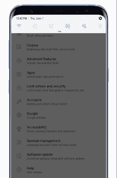

# Galaxy S8:开发者社区如何从根本上改善我的体验(无 Root)

> 原文：<https://www.xda-developers.com/the-galaxy-s8-how-the-developer-community-radically-improved-my-experience/>

### 有时需要一点帮助才能让它真正属于你...再次

上周我写了为什么我觉得 [Galaxy S8 的](http://forum.xda-developers.com/galaxy-s8)软件与其硬件相比是一个重大的失望，但尽管它有缺点，目前它仍然是我的首选手机。那么，我该如何处理我不可否认地讨厌的软件，以及与其他主流旗舰相比表现不佳的软件呢？[沿着去年](https://www.xda-developers.com/the-htc-10-how-the-developer-community-changed-my-experience/)(具有讽刺意味的是将近一年前)的思路，这里是开发者社区如何帮助我从根本上改善我的 S8+体验，这一次是用 **no root！**

*本文包含零付费或以其他方式报销的代言，这些只是我日常使用的应用程序。*

* * *

### 去模糊

正如我之前提到的，S8 的软件需要大量的工作。我要解决的第一件事是膨胀。现在，这个话题引起了很多争论，因为正如一句老话所说，“一个人的垃圾是另一个人的财富”，这适用于三星的软件以及任何东西。 ***不要一字不差地遵循指南的这一部分，相反，你可以用它来帮助你决定什么可以安全地去包裹。***

 <picture></picture> 

Eric's stock Galaxy S8+ RAM usage

首先要看的是运行服务。现在，我首选的去模糊应用是 BK Disabler。这绝不是对他们的认可，用你最喜欢的。在 BK 中，你可以通过运行的进程和包进行排序，这很有帮助。一旦你开始按这些参数排序，要非常小心，因为**你很容易因为禁用 SystemUI (duh)或其他重要的包而陷入麻烦**。我花了整整 5 到 7 个小时禁用了所有我不想要的东西，并且我已经在我的列表的 Google Drive 上[链接了一个截图](https://drive.google.com/open?id=0B0GoXVu0a3OhZXBFblB0Zi14ZVk)。在这个列表中，你会看到很多“三星特色”的东西，就像上面提到的老话所说，我觉得它们是垃圾，我很少使用它们。我禁用的一些主要功能是与整个 edge 面板相关的——我实际上从未使用过它，它确实会导致一些 UI 延迟。出于显而易见的原因，我还完全禁用了 Bixby。我还禁用了剪贴板 UI 服务。一个问题是，当我从我的密码管理器 Keepass 中复制和粘贴密码时，它们被存储在剪贴板中，并且没有办法将一个应用程序重大安全问题列入黑名单，所以我杀了它。设备维护是一个恼人的问题，这是预装在一些型号(不是威瑞森)上的，并且很繁重，它试图监控应用程序的电源，内存使用和存储，然后建议修复。它使用了大量的系统资源，但实际上并不需要。然而问题是**你也失去了设置中的整个区域，**所以要访问库存电池图表和存储管理器，我只需使用 Nova actions 并将其设置到我桌面上的一个文件夹中...节省了超过 100mb 的固定 RAM 使用量。

 <picture></picture> 

My "de-bloated" Galaxy S8+ Ram Usage

我禁用的其他一些东西是整个游戏服务套件、GearVR 服务和主题服务。这些都很容易在必要时启用，而且它们的一部分总是在运行，完全没有任何理由。下一个是诺克斯。现在要知道，如果你禁用了 Knox，Samsung Pay 和安全文件夹以及其他任何可以由它管理的东西都将停止工作，并可能破坏 Exchange 支持，特别是 MDM，所以要谨慎行事。也就是说，我注意到最大的性能变化是禁用 Knox 服务套件。

那么，在所有这些都被禁用的情况下，什么东西实际上仍然有效呢？好吧，一切需要工作。电话与股票拨号器、短信、彩信、Wifi 通话、VoLTE、摄像头、将应用程序扩展到 18.5:9 和多窗口的能力、滚动捕捉和裁剪等屏幕截图增强功能、指纹传感器(尽管我禁用了虹膜和面部解锁)以及更多功能配合使用。基本上，你看到的是一个基本的 Android 版本，只添加了很少的东西，以及手机仍然工作的基本要素。我也没有得到 *任何* 因我禁用应用而强制关闭。唯一的副作用是在打开设置时，因为许多主要的东西都被禁用了，这导致菜单在加载主设置和安全菜单时犹豫不决。除此之外，由于这些很少使用，我的设置对于 *me* 来说是 100%稳定的，但是你的里程数绝对会有所不同。花点时间，可能要花几天时间才能让你的身材变得完美，但这绝对值得。

***关于使用 Bixby 重新映射器的注意事项-** 如果你想使用这些应用程序中的一个，你可以禁用所有 Bixby 相关的包，除了“你好 Bixby”和“Bixby”。我不知道其他禁用器允许这一点，但 BK disabler 允许您禁用服务。你可以进入 Bixby 应用，点击服务，禁用除了最后一个“眨眼服务”之外的所有服务。然后进入“Hello Bixby”，禁用除 SpageService 之外的所有服务。至于禁用单个服务是否真的会影响性能，谁知道呢，但是为了禁用除了需要的以外的所有服务，这些是这样做的步骤，并且仍然保留重新映射特性。*

* * *

### 获得您想要的外观

 <picture></picture> 

...it, uh, makes iOS switching easier

第二件事是接口。虽然我对三星的软件赞不绝口，但主题引擎和用户界面出奇的好。我真的希望主题管理器能给我更精细的控制，但是你不可能拥有一切。去找一个你喜欢的好主题并设置它——我建议在去模糊之前这样做，因为主题引擎是我移除的东西，它需要在安装新主题之前设置。**三星客户经理也需要能够下载一个主题，但不能安装一个**。所以下载任何你想要的主题，然后你只需要在去模糊后启用主题应用就可以在它们之间切换。像我们大多数人一样，我也使用 Nova Launcher 和一个图标包。我今天的图标包是 [Urmun](https://play.google.com/store/apps/details?id=com.vertumus.urmun) ，我传统上使用[背景](https://play.google.com/store/apps/details?id=com.backdrops.wallpapers)作为我的壁纸，Gracerial 作为系统主题，尽管那是一个付费主题。

我想改变的系统主题的第二部分是导航图标，它们实在太丑了，需要改变。值得庆幸的是，开发者社区找到了一种安装覆盖层的方法，可以完美地改变图标，[查看这个线程的说明和图标列表](https://forum.xda-developers.com/galaxy-s8+/themes/substratum-inversion-ui-overlay-overlays-t3604341)。我还把导航条缩小了 30 磅，把 dpi 设置为 470，这是我发现的最小的分辨率，不会让某些应用程序出现奇怪的缩放。最后，我使用下面提到的 SystemUI Tuner 应用程序来禁用许多我不想看到的系统托盘图标。在我所有的改变后，我只剩下一部超级干净和非常个性化的手机，这是非常我的，很少三星，只是我喜欢的方式。

* * *

### 修复通知

 <picture></picture> 

The Galaxy S8s UI is surprisingly clean

最后，我们有可能是我最大的抱怨，也可能是困扰你却没有意识到的事情:通知。你有没有注意到大多数应用程序没有像在牛轧糖的 S7 和 S8 上那样通知你？嗯，三星几乎看到了谷歌提供的牛轧糖，并决定通过完全打破他们自己的垃圾通知控制来摧毁它。我们中的许多人可能会在 Android 的股票构建中使用 SystemUI Tuner 选项来实现通知的细粒度控制，允许用户准确设置应用程序如何通过平视控制、免打扰绕过等方式通知您。同样的调谐器和随后的选项在三星的牛轧糖上被完全删除了，直到今天我也找不到启用它的方法。zachare 1 的系统用户界面调谐器是一个仍在开发中的优秀应用程序，可以实现三星和其他公司禁用的大部分功能。有了这个应用程序，你可以切换状态栏图标和使用演示模式，这两个都是三星放弃的功能。不过，现在更重要的是能够重新获得微调通知控制，尽管这需要一些工作。这是我发现的将任何应用的重要性(除了那些三星锁定的)设置为我需要的任何东西的方法，可能有其他方法，但这种方法 100%有效，没有任何异常。

1.  进入“设置”,禁用您想要调整的任何应用程序的通知。在禁用通知之前，设置您想要的锁屏通知和优先级选项。我不知道这是否进行，但它不会伤害，一旦你打开增强设置，这些是不可切换的。对我来说，这些应用程序是 Inbox、IFTTT、Facebook Messenger 和 Google Hangouts，它们都没有提醒通知。
2.  进入系统界面调谐器，设置 ADB 权限(这需要一台运行 ADB 的电脑)
3.  进入杂项菜单，打开平视通知滑块，然后向下滚动到电源通知控件并启用它。
4.  回到你正在修复的应用程序的设置，点击返回按钮返回菜单，然后重新进入通知控件-你会看到新的滑块。你只能点击这个一次，虽然人们说垃圾邮件它的作品，但它不是为我，所以要确保你知道你想设置它。如果你错过了，或者想改变它，只需再次做第 3 步和第 4 步。
5.  ????
6.  ~~盈利~~更好的通知！

现在你的通知可以被精确地控制，就像它在 Android 上一样，这是应该的。

* * *

Galaxy S8 并不是一款糟糕的手机，事实上，就整体体验而言，它很可能是市场上最好的手机之一——它只是需要一些微调和关注，而三星不愿给它这些。

本文并不是一本应严格遵守的包罗万象的规则手册，而是一份指南，帮助你打造真正属于你的 S8，并希望能帮助它表现得更好。**请在下面分享更多关于你如何让手机成为你的以及我可能错过的事情的想法。如果你有任何问题，欢迎在评论区留言，或者在[推特](https://twitter.com/altimax98)上联系我！**