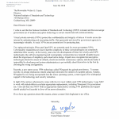

# 美国参议员推动政府停止使用旧的虚拟专用网技术，使用 WireGuard

> 原文：<https://www.xda-developers.com/us-senator-pushes-government-use-wireguard-vpn/>

VPN 在当今时代发挥了举足轻重的作用，允许用户绕过地理限制，保持他们的数据相对安全，免受窥探。虽然在处理重要信息时，建议不要使用 VPN，但一些最流行的 VPN 也有自己的问题，尽管它们很流行，但却是一个有缺陷的选择。

Android 上流行的 VPN 解决方案如 OpenVPN 和 IPsec 极其复杂，使得审计这些开源解决方案非常困难。OpenVPN 也存在于用户空间中，这使得它非常慢，因为每个包都必须被复制几次，并导致几次上下文切换。下面是流行的 VPN 解决方案在代码行数方面的复杂性的快速比较:

[然而，WireGuard VPN](https://www.wireguard.com/) 正在成为 VPN 技术的[更实用的选择，它提供了易用性、更新的加密技术和更容易的审计。它也运行在 Linux 内核中，并且](https://www.xda-developers.com/wireguard-vpn-project-support-android-roms/)[得到了 Linux 内核稳定维护者 Greg KH](https://plus.google.com/+gregkroahhartman/posts/jD6N4BzToa3) 的支持。WireGuard 的首席开发人员 Jason Donenfeld，也被称为 XDA 认可的开发人员 [zx2c4](https://forum.xda-developers.com/member.php?u=5434776) ，也希望在下一个可用的合并窗口将 WireGuard 集成到主线 Linux 内核中。用于 Android 的 [WireGuard 端口也可以在所有 Android 设备上工作，用于 macOS、FreeBSD 和 OpenBSD 的端口也处于良好状态。Windows 端口也取得了良好的进展。](https://forum.xda-developers.com/android/development/wireguard-rom-integration-t3711635)

WireGuard 现在可以在其列表中添加另一个认可。来自俄勒冈州的民主党参议员罗恩·怀登[给国家标准与技术研究所(NIST)写了一封公开信](https://www.wyden.senate.gov/imo/media/doc/Wyden%20Letter%20to%20NIST%20Re%20Gov%20Use%20of%20Secure%20VPNs.pdf),劝阻政府使用 OpenVPN 和 IPsec 等老化技术。

*“鉴于使用最广泛的两种 VPN 技术存在严重的网络安全问题，我敦促 NIST 与利益相关方合作，评估合适的替代品，包括 Wireguard，供政府使用。我还要求，一旦 NIST 找到合适的替代品，现有的 VPN 指南和支持应该迅速被抛弃，以支持更新的替代方案。”*

 <picture></picture> 

U.S. Senator Wyden's Letter to NIST Regarding Government Use of Secure VPNs

如果 WireGuard 得到政府的认可和推荐，它将巩固 WireGuard 作为现有流行解决方案的迫切需要的替代方案的地位。

如果你渴望在你的设备上测试 WireGuard，你也可以访问[官方线程](https://forum.xda-developers.com/android/development/wireguard-rom-integration-t3711635)获取更多信息，或者查看其 Google Play 商店列表(如果你有 Android 5.0+设备)。或者，你也可以跟随社区提交的指南，学习如何在你的 Android、macOS 和 Ubuntu 设备上使用[wire guard](https://forum.xda-developers.com/android/general/guide-how-to-wireguard-android-ubuntu-t3723544)。