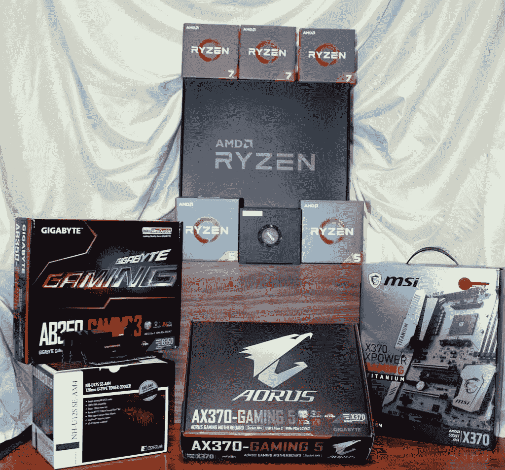

# XDA 挑战锐龙:深入了解 AMD 在 Linux 上的 AM4 处理器

> 原文：<https://www.xda-developers.com/xda-takes-on-ryzen-in-depth-look-of-amds-new-processors-on-the-linux-side/>

2016 年，读者想知道 AMD 的 FX 处理器在构建 Linux 和 Android 时表现如何——感谢 AMD 的人员[，我们很高兴找到并与你们分享结果](https://www.xda-developers.com/you-asked-we-answer-aosp-build-times-on-amd-processors/)。我们从那篇文章中学到的经验帮助我们了解如何更好地配置我们的系统，并更好地实现构建时间——由于您的提示，我们的 FX-8350 构建时间减少了 50%以上！但即便如此，我们还是碰到了一堵墙。AMD 的表现虽然好于预期，但与英特尔的竞争对手相比，它仍有提升的空间。

一段时间以来，AMD 一直告诉我们，一些新的东西即将出现:与当前的产品线相比，处理器的性能提高了 40%或更多。现在，随着锐龙系列产品走向大众，我们也开始接触这些处理器。他们的表现是否像 AMD 宣称的那样好？是时候找出答案了。

# 索引

## 背景

在 x86 领域，Advanced Micro Devices 是英特尔为数不多的竞争对手之一，这在很大程度上是由于专利授权。我仍然记得在 90 年代后期，AMD、Intel 甚至一些同学都使用 Cyrix CPUs。不幸的是，到 21 世纪初，Cyrix 作为一个品牌已经从舞台上消失了。在新千年的最初几年，AMD 和英特尔之间的竞争有助于健康的竞争和创新。AMD 在 2004 年通过将 x86-64 架构引入主流 CPU 扰乱了市场。这需要几年的时间才能成熟，并让竞争保持强劲。两者都在同一时间框架内创新了多核架构，突破了频率障碍。

随着英特尔在多核同步多线程(品牌为超线程)方面的表现越来越出色，AMD 开始努力追赶其竞争对手。2011 年，推土机架构被认为有助于缩小这一差距，并使 AMD 对英特尔更具竞争力。虽然推土机和它的相关打桩机确实提供了改进，但它未能让 AMD 到他们想去的地方。这开始了对他们的处理器进行“自下而上”的重新设计的漫长过程，他们实现了同步多线程，这成为了 Zen 架构和锐龙 CPU 系列。鉴于他们几年来没有对他们的 AM3+阵容进行太多更新，锐龙提供了巨大回报的机会。

在过去的一年中，他们一直在慢慢地详细说明技术细节，Anandtech 在解释 AMD 自己的技术幻灯片和演示文稿之外的内容时非常有帮助。正如北极星架构在图形技术领域证明了与英伟达的竞争能力一样，锐龙的目标很简单:确保他们完成他们派出推土机的任务，并再次成为英特尔的真正竞争者。许多分析师和合作伙伴甚至提前对锐龙采取了看跌立场。在体验了挖掘机和打桩机之后，他们希望它能和它的前辈做得一样好。现在是时候让猜测靠边站了，基准测试继续这个故事的剩余部分。

 <picture></picture> 

Everything AMD sent to put Ryzen to the Test

## 拆箱

如果看起来这是一大堆东西，那就是。AMD 实际上分多个批次发送了所有这些内容。背后的原因是为了在锐龙 7 和锐龙 5 上市前及时提供测试样品。不过，这些审查大多是在 Windows 环境下进行的。但是如果我们想测试从源代码中构建 Android，我们仍然会关注 Linux，所以这是我们评论的重点。这也是一次有趣的旅程，最终给我们上了非常宝贵的一课。

## 千兆字节 AM4 主板和 Linux

不幸的是，这导致了图中的两个千兆字节主板的问题。两者都拒绝在不使用 noacpi 标志的情况下启动任何版本的 Ubuntu。因为这剥夺了锐龙的许多增强功能——包括同步多线程——我们开始寻找答案。通过其他评论者、Phoronix 创始人 Michael Larabel 和一些在第一天就跑出去购买锐龙的 XDA 读者的合作，我们能够确认这是一个针对 Gigabyte 的问题。已经发布的微星主板和华硕主板似乎没有这些问题。因此，在联系 AMD 之后，我们收到了 MSI X370 XPower Gaming Titanium，并最终使用它来测试收到的一切。

因为我们没有在 Linux 上测试千兆字节的主板，所以我们在 Windows 上简单使用了一下。如果你不担心 Linux，似乎提供了三种主板中最稳定的超频，Geil RAM 达到了 3.9 GHz，达到了 3200 MHz 的全时钟速度，并且由于幽灵 Spire cooler 而保持凉爽，这是 AMD 与锐龙发布的两种新的 LED 风扇冷却解决方案之一。技嘉的 X370 主板还提供声霸 MB5 支持，以获得更好的环绕体验。两者都具有一些很棒的 LED 照明功能，并带有额外的接头来连接外围设备，以匹配主板的照明模式。

我们感谢许多人的共同努力，帮助我们快速解决了这个问题。AMD 也应该感谢它在问题被确认后的快速反应。如果说有什么不同的话，那就是这强化了一个事实:对于 Linux 用户来说，从第一天开始就非常需要对 PC 硬件进行更多的审查。我们还计划评估并通知用户，如果使用 Gigabyte 和 Linux 的情况有所改善。

**CDT 时间 4 月 25 日上午 12:30 更新:** Redditors 迅速发布消息称[问题已经作为 bug](https://bugs.launchpad.net/ubuntu/+source/linux/+bug/1671360) 出现在 Ubuntu 的 Launchpad 中。该问题似乎是由于配置 _ <wbr>造成的

PINCTRL_ <wbr>

AMD 启用了一个正式的解决方案，同时，[一个工作区内核(根据用户反馈声明工作)被构建并发布在线程](http://www.nextized.net/repo/linux/ubuntu-linux-4.10.3_ryzen01_amd64_generic.tar.gz)中。Ubuntu 和 OpenSuSE 已被确认存在此问题，其他在其内核中不支持此功能的发行版可能不会出现问题。我们感谢 Linux 社区中努力解决这些问题的人们。随着更多信息的发布，我们将继续关注和更新。

## 照片

## 测试规格

虽然测试平台在穿越半个世界的危险旅程中幸存下来，但 AMD 镭龙 HD6450 不是我们想要测试的显卡。于是，镭龙问世了，而现有的最好的显卡——NVIDIA GeForce GTX 1080 也随之问世。原因很简单:虽然 AMD 知道它有自己的显卡粉丝群，但它也知道许多其他人会选择 NVIDIA。

由于最低的锐龙处理器是一个 4 核 8 线程的 CPU，我还使用我的个人电脑进行了基准测试。我在下面列出了规格和测试方法。

#### FX-8350 测试平台

#### AMD 锐龙(AM4)测试平台

#### 英特尔酷睿 i7-6700K 测试平台

**注:**未提及由第三方提供的物品是自己购买的。此外，在每个平台上实际安装了额外的驱动器，但没有用于测试目的。

#### 软件

*   包含所有最新更新的 Ubuntu 17.04 。
    *   锐龙注:锐龙用更新的 4.10 内核和 4.11 内核进行了测试，因为它有锐龙同步多线程的代码实现。AMD 和 NVIDIA GPUs 的用户将希望暂时避开 4.11 内核，因为这两个专有软件包目前都没有合并代码来轻松安装和运行专有软件包。
*   [Phoronix 测试套件 v7.0](http://phoronix-test-suite.com/)
*   [宇宙天空 v4.0](https://unigine.com/products/benchmarks/heaven/)
*   [Unigine Valley v1.0](https://unigine.com/en/products/benchmarks/valley)

#### 测试方法

为了尽量减少测试变量的数量，所有 RAM 都保持在 2133 MHz 进行测试。例外情况是 FX-8350 和 AM3+平台，因为其最大频率为 1600 MHz。CPU 速度被超频为 1800X、1700X 至 3.9 GHz 和 1600X 至 4.025 GHz，以尽可能接近(或者，在 1600X 的情况下，额外 25 MHz 以测试可行性)FX-8350 和 i7-6700K 的 4.0 GHz 的库存速度。1700 和 1500X 曾试图超频到这些速度，但无法保持稳定。因此，它们以最高稳定速度进行了测试:锐龙 7 1700 的速度为 3.7 GHz，锐龙 5 1500X 的速度为 3.8 GHz。对于英特尔来说，i-6700K 在 4.0 GHz 下的简短测试和基于构建时间轻松实现的 4.2 GHz 超频为英特尔带来了略好的数字，但不足以改变本次审查的结果(一个构建更快，另一个则不是。)基于这些发现，我决定在 4.2 版上运行 Phoronix 测试套件。所有提到的超频调整仅通过时钟倍增器。

**Android 构建时间是 Nexus 6P (angler)** 的 Lineage OS branch cm-14.1 的平均 3 次构建。所有构建都是使用 ccache 和 make 3.82 基于以前的发现完成的。应该注意的是，我们也用 make 4.1 做了一些测试，并没有注意到我们在 FX 处理器测试期间所做的当前构建过程的性能问题。由于我们的样本测试的时间与 3.82 的时间相匹配，所以没有包括在测试中。

## 基准

##### **基准测试注释:** Phoronix 测试套件的 CPU 套件提供了大量的测试，并不是所有的测试都包括在本文中。Phoronix 测试套件的完整测试结果可在 Openbenchmarking.org 网站上获得。[我在这里添加了一个链接，用于所有结果的比较。](http://openbenchmarking.org/result/1704211-GARW-FX8350647,1704202-GARW-1700XST61,1704209-GARW-1700X0135,1704206-GARW-1700OC348,1704207-GARW-1700STO37,1704186-GARW-R51600X02,1704188-GARW-R51500X80,1704181-GARW-6700KV299,1704181-GARW-2C6788452)

#### **FFTW 3 . 3 . 4 版**

FFTW 是快速傅立叶变换的单线程基准。就像我们在 Windows 性能指标评测中看到的一样，锐龙的单线程性能在所有变体中似乎都是相似的，主要区别在于频率。与上一代 FX-8350 相比，这是一个重大改进，性能提高了一倍以上，但即使与 Skylake i7 相比，仍显不足。

在新闻发布会上，AMD 承认锐龙“赢得了一些，也失去了一些”，在这里我们可以看到为什么。虽然在 Windows 中，许多测试都停留在英特尔的 15%以内，但 AMD 的锐龙处理器的性能似乎比 Skylake i7-6700K 低 20%以上。

#### **GMP 基准 v0.2**

[GMP 的基准测试](https://gmplib.org/)是算术运算的组合，虽然是多线程的，但 CPU 频率在这里有很大的不同。我们再次看到，即使是锐龙 5 1500X 与 FX-8350 相比也有明显的差异。令人惊讶的是，在我们的基准测试中，我们最高的两个 CPU 是最高时钟的 CPU，这表明内核和线程数量似乎对测试中的原始速度没有太大影响。

**SciMark 2 (Java) v1.1.1 复合版**

[SciMark 2 性能指标评测](http://math.nist.gov/scimark2/)利用 Java 进行算术运算，然后根据各种运算的组合进行评分。AMD 的锐龙 CPU 在这里大放异彩。即使 1500X 的速度比英特尔的同类产品慢，但也比它高出大约 12%。

#### **博克文件加密器 v1.4**

Bork 用 Java 测试加密文件，测量加密一个样本文件需要多长时间。在这里，我们看到 AMD 的锐龙确实比它自己以前的架构有所改进，但英特尔显然赢得了这一轮。

#### **CacheBench**

[Cachebench](http://icl.cs.utk.edu/llcbench/cachebench.html) 是一款帮助测量给定架构的底层缓存性能的工具。值得注意的是，从表面上看，额外的 L1 高速缓存似乎有助于 AMD 在这方面取得优势，即使是在较旧的 FX-8350 上。但仅此并不能说明全部情况；我们在其他基准测试中看到，这并不总是转化为现实世界中的全面胜利。

#### **开膛手约翰**

对于想了解密码学性能的读者来说，[开膛手约翰](http://www.openwall.com/john/)有一些好消息要告诉你。该性能指标评测的多线程特性使其能够充分利用额外的内核和线程来实现最高性能。锐龙的额外内核无疑使它在这里看起来很有吸引力——与英特尔相比，如果将成本作为一个额外因素考虑，就更是如此。

#### **GraphicsMagick v1.3.19 锐化**

GraphicsMagick 是市场上最强大的开源图像工具之一；作为一名 IBM i RPG 程序员，我甚至发现了它的用处。这里的锐化结果似乎有点偏向英特尔 CPU，我不得不相信这部分是由于 GPU 的差异。我将它包含在此，因为将 1600X、1700、1700X 和 1800X 的结果放在一起比较是值得的。这 4 款处理器的定价不同，表明在某些情况下，额外的马力可能不会带来太多好处。

#### **C 射线 1.1 版**

C-Ray 是同一主题的另一个例子:从 8 个线程到 12 个线程的跳跃带来了巨大的改进，并且很好地证明了 1600X 的地位。但这些回报在 6 核锐龙 5 1600X 和锐龙 7 之间逐渐减少。

#### **7-Zip v9.20.1**

7-Zip 测试是为了压缩一个文件，但更清楚地定义了四、六和八个锐龙核心变量之间的区别。有点令人失望的是，它的性能比它的前辈 FX-8350 低 1500 倍。谢天谢地，这可以用它们之间 200 MHz 的时钟差异来解释。PBZip 基准遵循类似的趋势。

#### **GZip 1.1.0**

并不是所有的压缩程序在锐龙都能做得更好。以 [GZip](http://www.gzip.org/) 为例，它见证了英特尔 i7-6700K 超越所有处理器。在 LZMA 基准测试中也发现了类似的结果。在这两种情况下，所有锐龙模型之间的差异是微不足道的。当我们意识到这些都是典型的单线程操作时，我们就可以理解这一点，因为它符合其他基准中单线程性能的趋势。

## 基准:构建性能

基准测试的最后一页关注的是构建——包括一些(但不是全部)案例中的 Android 构建。我们还提供了 2 个显卡性能指标评测，帮助您了解锐龙对整体显卡性能的影响。

#### **构建测试:ImageMagick**

虽然 i7-6700K 比整个锐龙做得更好，但差距很容易就落在 200 到 500 MHz 时钟速度差异之内。在这里，1500X 的编译时间比 FX-8350 减少了 25%,但是当我们跨越到 6 和 8 个内核阈值时，我们看到了收益递减。

#### **构建测试:Linux 内核 4.9**

当我们进入 Linux 内核时，上述情况不再适用，这里的额外内核有机会展示它们的肌肉。我们还看到四核、六核和八核型号之间的性能有了更明确的定义。CPU 时钟速度在这个构建测试中也很重要。

#### **构建时间:linegeos cm-14.1 ccache**

正如我们在基准测试中注意到的那样，当以相同的时钟速度工作时，锐龙 7 处理器似乎表现相似。因此，我们把最好的每一个测试我们的 LineageOS 建设。FX-8350 构建时间随着 cm-14.1 分支而增加，并且是每个较新版本的 Android 的典型特征。我们看到 1500X 在这方面有了巨大的改进，但是当我们跨越到 6 核阈值时，CPU 瓶颈就消除了。8 核的时间有所改善，但回报很快减少，可能会更好地投资于 I/O 性能，就像我们在 RAID5 阵列和 i7-6700K 的至强处理器中观察到的一样。

#### **图形基准测试:Unigine Heaven 4.0**

Unigine 的图形基准是评测中经常使用的一个众所周知的基准。我们希望限制构建配置中的变量，以便更好地了解锐龙在 FX-8350 上的改进程度。然后，通过只改变 CPU，我们可以了解内核是否提供了额外的提升。在天堂的例子中，我们看到从 FX-8350 到 1500X 的显著改进，然后随着我们添加更多的核心和线程，略有提升。

#### **图形基准测试:Unigine Valley 1.0**

Valley 是较新的基准，我们再次看到从 FX-8350 到锐龙 5 1500X 的改进。但是一旦我们跨过这个门槛，似乎就不再是关于额外的内核和线程，而是关于原始速度。我们的 1800X 比 1500X 提高了 100 MHz，但被运行在 4.025 GHz 的 1600X 击败。

## 锐龙和 Coreboot

锐龙发布后不久，AMD 在 AMA 上 Reddit 回答了关于其新产品 T1 的问题。在那次讨论中，一些 Linux 和开源用户提出了请求，要求 AMD 向开源社区发布其平台安全处理器(PSP)代码。这样做的原因是为了支持 Coreboot 和 Libreboot 等选项。就连爱德华·斯诺登也通过推特对此事发表了看法:

AMD 的产品经理 James Prior 在 AMA 上回答说，他们正在对此进行调查，[在本月早些时候提供了关于调查状态的进一步更新。在 AMD](https://www.reddit.com/r/Amd/comments/636831/dear_amd_dont_think_weve_forgotten_about_this/) [向社区](https://www.xda-developers.com/robert-hallock-gpuopen-is-amds-long-term-open-source-strategy/)发布 GPUOpen 时，我们曾向他们提供支持，并希望他们通过支持这一请求向前迈出一大步。我们将继续关注此事，并在有其他更新时提供。

## 最后的想法

有几种方式来思考锐龙以及它如何融入新的生态系统。首先，也是许多人讨论过的，它在核心/线程比赛中与英特尔的竞争情况如何。从 FX-8350 到锐龙 5 1500X 有明显的改进。**如果单看性能，我们认为它并不总能跟上英特尔酷睿 i7-6700K。但是 AMD 的策略从来不仅仅是原始性能。相反，AMD 的商业策略在很大程度上是以其产品的价格提供最佳价值。**他们在处理器和图形技术方面一直遵循这一总体战略。当考虑到个人电脑的整体成本时，这一点变得更加重要。

当想要对英特尔主板进行超频时，目前的选择通常仅限于 Z 系列，尽管有些人已经找到了绕过这一障碍的方法。AMD 采取了另一种方法，提供 3 个支持超频的主板芯片组，然后在每个 AM4 处理器上启用乘数超频。 **这里以较低的价格提供了大量的选择。**我发现提供所有处理器的挑战是，一旦 XFR 不再是一个因素，所有处理器型号的行为都类似。

接下来就是你能超频多好的那个处理器了。你可能会不时听说这是“硅彩票”,因为不是每个处理器都会像其他处理器一样超频。例如，我可以增加乘数，或者在所有 3 块主板上以 XMP 配置文件的速度运行 RAM。最近的 BIOS 更新有助于改善这个问题，但它并没有解决这个问题。以锐龙 7 1700 为例。更高的时钟速度可以启动，例如 3.9 GHz，但最终会因为过热以外的原因而失败。

当我们看库存速度时，选择是非常清楚的。AMD 现在以其竞争对手一半的成本提供了英特尔极端消费者阵容的替代产品。随着我们进入超频阶段，只要处理器允许，即使是锐龙 7 1700 也可以实现同样的目标。比英特尔的 i7-5960X 或 i7-6900X 低 66%的成本节约甚至足以购买一个非常高端的显卡或额外的 SSD 存储。锐龙 1600 也是如此。与酷睿 i5 相比，它的定价极具竞争力，并且它提供了超越酷睿 i7 的许多消费者使用体验。希望从锐龙获得最大价值的消费者不应立即放弃这些“非 X”选项。**如果他们打算给自己的电脑超频，这一点怎么强调都不为过。**

不过，在目前的一些情况下，英特尔仍然可以证明其价格是合理的。其中一个例子是 PCI Express 通道，Broadwell-E 和即将推出的 Skylake-E 提供了 AMD 没有的额外 PCI-E 通道。这意味着在一些高端应用中还没有替代品。AMD 公司预计将宣布 X390 主板和那不勒斯，锐龙的企业阵容。我完全期待在这里看到对 X99 的挑战，不仅是额外的 PCI Express 通道，还有内存容量。

AMD 自己在这个市场的挑战意味着通过牺牲许多短期销售来赌上一把。有时这种回报甚至更大——芝加哥小熊队和克利夫兰骑士队就是体育界的见证。如果 AMD 的目标是实现这种竞争姿态，我相信他们已经实现了他们的目标。但这并不是故事的结尾；变革和创新需要继续。英特尔已经通过在 2019 年退役核心品牌暗示了这样的变化。这会损害 AMD 在 2020 年之前继续使用 AM4 平台的承诺吗？只有时间能证明一切。与此同时，把爆米花递过来；一个有竞争力的 AMD 回到了他们的旧形式，这意味着一个令人兴奋的竞争你辛苦赚来的美元。在这种情况下谁赢了？我们，消费者，需要。是时候了。

* * *

***重要提示:我们想知道:你喜欢这篇评论吗？您希望看到更多关于 XDA 的报道吗？或者你认为这与我们的网站无关？请在下面的评论中，脸书、推特或谷歌+上发表评论。我们期待您的反馈！***

*本文已从其原始内容更新如下:*

*   4/25/2017 上午 12:30 CDT-添加了有关 Gigabyte/Ubuntu 问题和解决方法的更新信息。