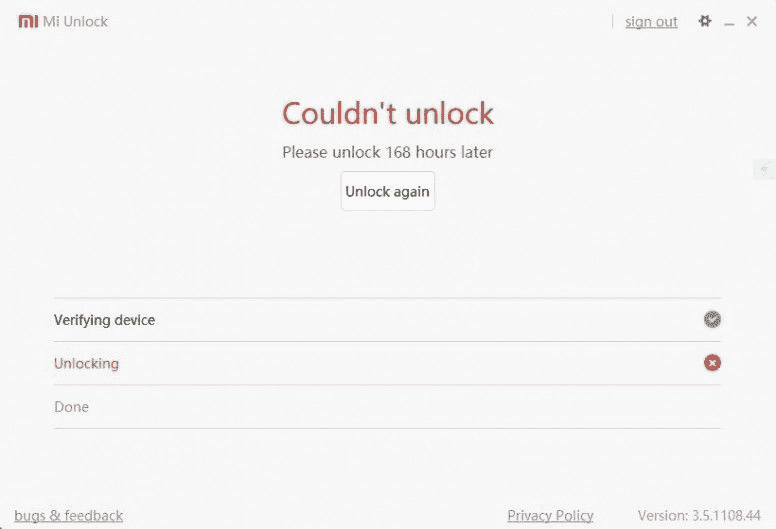
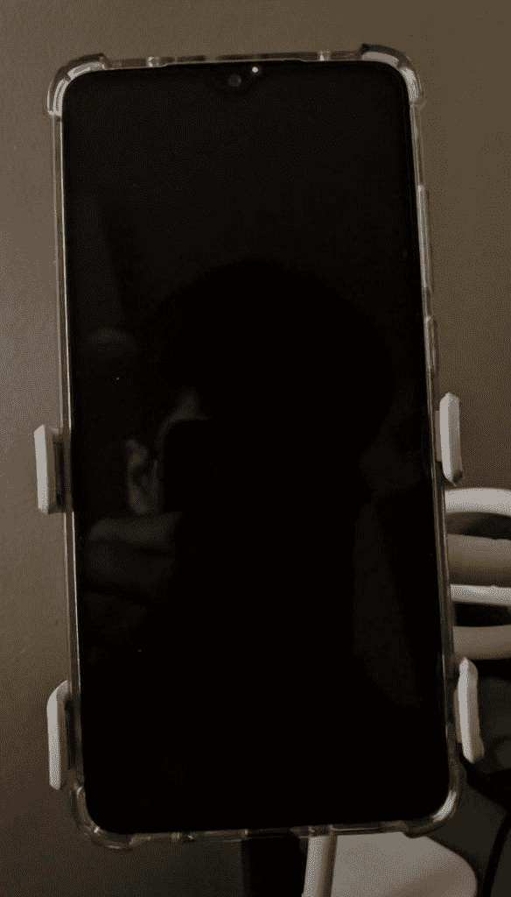

# 小米需要一种更好的方式来解除其设备，而不是授权小米账户

> 原文：<https://www.xda-developers.com/xiaomi-edl-unbrick-authorized-mi-accounts/>

多年来，小米已经成为印度智能手机市场的金童。从 2014 年仅仅是一个起步实体，到 2019 年连续几个季度成为市场上领先的智能手机原始设备制造商，这对小米来说无疑是一次狂野之旅。我们在 XDA——开发商见证了公司从中国的城市地区发展起来，走向征服东南亚市场，最近还进军欧洲部分地区。小米作为一家智能手机 OEM 厂商也已经成熟——随着该公司找到自己的出路，以前粗制滥造、令人质疑的做法已经成熟，并演变成更好的做法。尽管即使是最好的实体也肯定有改进的空间，但小米目前作为智能手机 OEM 厂商处于有利地位，他们可以同时感到自豪和谦虚。

在这篇文章中，我们想强调我们认为小米在 2020 年可以改善的一个领域:**使其设备更容易解绑**。为了给你一个完整的画面，有必要后退几步，看看当前的情况是什么，是什么问题导致我们落到现在的位置，以及当时为小米服务的相同解决方案是否仍然是 2020 年为公司服务的最佳解决方案。

## 经销商——2016 年的垃圾软件威胁

早在小米更年轻的时候，在 2011-2015 年，它的几款设备都装有锁定的 bootloaders，非常容易解锁。对于当时人口稀少的开发社区来说，这通常是一件好事，它有助于抵消小米在那个时代频繁违反 GPL 带来的声誉。改装这些小米设备的容易性，以及其中一些设备以前所未见的方式提供了物有所值的事实，帮助该公司建立了自己的知名度，并为自己建立了自己的 mi 社区，不仅将 MIUI 作为软件，还将小米作为硬件和软件。

随着小米设备越来越受欢迎，在小米尚未准备好进入的地区，其需求成倍增长。经销商借此机会从中国购买小米设备，并在中国境外非正式转售。来自中国的手机过去没有(现在也没有)搭载谷歌移动服务，因此这些经销商不得不在向海外销售手机之前在手机上闪现谷歌应用。MIUI 中国也只捆绑了英文和中文作为可用语言，因此一些经销商开始求助于具有更广泛语言支持的 flash 定制 ROM，以欺骗客户认为他们购买的手机上有真正的“MIUI Global”ROM。正如我们所知，定制的 rom 也不是完美的，所以客户经常被那些不会再更新的错误版本所困扰。

随着时间的推移，这些非官方经销商中的一些也采取了将广告软件和垃圾软件注入固件的方式，以在设备销售之外赚取一些钱。因此，2016 年有一段时间，人们开始抱怨小米设备预装了恶意软件——这是这些经销商而不是小米做的。改装这些设备的容易性被这些经销商所利用，小米被迫放弃，因为在消费者眼中，它的声誉正在受到严重损害。

2016 年初，小米对其 bootloader 解锁流程做了一个[关键性的改变。从小米 Redmi Note 3 开始，解锁 bootloader 需要小米的手动批准。新的解锁方式严重依赖于小米 mi 解锁工具和 Mi 账户，解锁请求据称需要人工批准。对引导加载器解锁请求的响应可能需要 3-21 天，在某些情况下](https://www.xda-developers.com/xiaomi-locks-bootloaders-unlock-approval-takes-up-to-21-days-bricked-devices-must-wait/)[甚至需要 60 天的等待时间](https://www.xda-developers.com/xiaomi-2-month-wait-unlock-bootloader/)。在引导加载程序解锁过程中添加等待时间对于减慢第三方零售商的操作是有效的，但对于想要解锁引导加载程序以根化他们的设备、闪存定制 rom 和闪存定制内核的爱好者来说，这也是可以理解的恼人之事。

 <picture></picture> 

Current wait time for bootloader unlock is 168 hours / 7 days

尽管有这些限制，仍然有办法让坚定的经销商可以在小米设备上闪存非官方软件，甚至不需要首先解锁引导加载程序。这是通过高通设备上的 EDL 模式和联发科设备上的下载模式实现的。

## 问题是:EDL 锁定了

EDL 代表紧急下载模式，它是所有高通设备的另一种引导模式，甚至比标准引导程序还要低。这种引导模式，以及联发科设备上的下载模式，通常在服务中心用于解锁设备。而这恰恰是 2020 年小米的问题所在。

当时，经销商发现利用基于 EDL 的闪存技术将允许他们绕过与 Mi 解锁工具相关的等待时间。这迫使小米在其设备上锁定了 EDL 模式和下载模式。一旦锁定，该模式只能由小米授权的“程序员”访问，本质上意味着 EDL 模式不能使用，除非你有一个“授权的小米帐户”为了进一步确保经销商少一个可利用的渠道，小米使非全球版本设备的[设备无法从](https://www.xda-developers.com/flash-miui-global-locked-bootloader-xiaomi-brick/)启动全球 MIUI(带有警告消息“*此 MIUI 不能安装在此设备上*”)。同样的故事也延伸到基于联发科的设备——联发科利用一种特殊的 SP 闪存工具来闪存图像，但在小米-联发科设备上，你不能使用 SP 闪存工具来闪存图像，因为你仍然需要授权的 mi 帐户。

这种锁定服务于小米的目的:它确实减少了从经销商那里购买的设备上的恶意软件报告，因为他们没有盈利的方式来加载不同的 rom。然而，作为附带损害，这也消除了发烧友可以用来解锁小米设备的方法，而不管 SoC 如何。就目前的情况而言，如果你组装了一台小米设备，而让这款手机复活的唯一方法是在 EDL 模式下闪现图像，那么你需要获得外部帮助——没有其他办法。当你达到这一阶段时，你必须将你的设备带到小米服务中心进行解锁。这里还有一些更进一步的细微差别，我们稍后会谈到。

## 小米红米 Note 8 Pro 的案例

我们上面阐述的 EDL 封锁问题只影响了小米的一小部分客户。毕竟，如果你的设备功能正常，你永远不会遇到这个问题。只有当你把你的设备做成砖块的时候，你才发现存在这样的限制。大多数普通客户不太可能采取会阻止他们设备的行动，除非小米推出了一个有问题的软件更新，在这种情况下，他们别无选择，只能去服务中心。

对于我们所代表的定制开发社区来说，这个问题更加严重。定制 ROM 爱好者在选择解锁小米设备上的引导加载程序时必须记住几件事，包括但不限于[小米奇怪的防回滚保护](https://www.xda-developers.com/xiaomi-anti-rollback-protection-brick-phone/)，它会将你的手机硬砖成锁定 EDL 状态。通过反复试验，社区基本上弄清楚了他们需要远离的行为，以避免小米-高通设备上的硬砖。

但他们不能为小米-联发科设备这样做，因为小米几年来没有在中国以外的地方为这种组合发布任何引人注目的产品。因此，上述问题使得[小米红米 Note 8 Pro](https://www.xda-developers.com/xiaomi-redmi-note-8-pro-redmibook-tv-china-launch/) 和[联发科 Helio G90T](https://www.xda-developers.com/mediatek-helio-g90-series-hyperengine-game-technology-launched/) 的开发变得复杂。

如果你还记得的话，小米给了我们 [5 个单元给定制 ROM 和内核开发者](https://www.xda-developers.com/xiaomi-redmi-note-8-pro-custom-rom-kernel-developers/)以培养围绕设备的开发社区。小米终于采用了联发科的 SoC，这也是其最畅销的设备系列之一。这是基于联发科的定制开发工作最终聚集动力的绝佳机会，因此我们和社区都很兴奋地期待着这将引领我们走向何方。在售后市场发展的背景下，联发科或许可以成为高通骁龙 SOC 的可行替代者？潜力肯定是存在的。

在这方面，小米承诺将为该设备发布内核源代码，[它做到了](https://www.xda-developers.com/xiaomi-redmi-note-8-pro-mediatek-helio-g90t-kernel-sources-released/)，尽管这些在当时是不恰当的发布，但值得小米称赞的是，源代码的问题已经得到了解决。最初向我们承诺的 10 个开发商单位中，有 5 个被印度的开发商收到。不幸的是，由于物流困难，为印度以外的开发商标记的 5 个单元无法交付。尽管遇到了挫折，Redmi Note 8 Pro 仍然处于一个体面的位置，因为它具有潜力。该设备很快就得到了[非官方的 TWRP](https://forum.xda-developers.com/redmi-note-8-pro/development/recovery-unofficial-twrp-recovery-redmi-t4002397) 版本，它甚至获得了小米. eu(定制 ROM)版本，以获得去模糊的 [MIUI](https://www.xda-developers.com/tag/miui/) 体验。

但后来事情开始走下坡路。一直在为 Redmi Note 8 Pro 开发的开发人员发现，由于一些原因，该设备往往会被阻塞。有些人的手机在从恢复区刷新到恢复分区时被屏蔽了，而其他人发现通过[快速启动](https://www.xda-developers.com/google-releases-separate-adb-and-fastboot-binary-downloads/)在解锁的引导程序上安装一个备用 rom 也会屏蔽设备。我们想在这个阶段指出**新设备上的这种砖块是开发过程**的预期部分，因为不同设备之间的事情往往是不同的，并且在确定某个手机上做什么和不做什么时涉及到大量的试验和错误。

 <picture></picture> 

A bricked Xiaomi Redmi Note 8 Pro. Only the notification LED shines brightly when plugged in, while the rest of the device remains unresponsive all the time.

砖块是正常的，在具有新 SoC 的设备的初始开发过程中更是如此。不正常的是小米的 EDL 模式封锁。

正常情况下，被砖化的联发科设备可以使用联发科的 SP Flash 工具复活。然而，在 Redmi Note 8 Pro 上，联发科的 SP 闪存工具无法对设备进行闪存。小米在其 miFlashPro 软件套件中提供了 SP Flash 工具的修改版本，尝试使用小米的这款修改后的 SP Flash 工具进行 Flash 会打开一个窗口，要求提供 Mi 帐户凭据。如果您输入您的标准/常规 Mi 帐户凭证，闪存将失败，并显示错误“*未授权执行此操作。*“您现在已经碰到了“授权 Mi 帐户”这堵墙，这是我们在本文前面部分强调的。

这意味着每次你把你的 Redmi Note 8 Pro 分成砖块，你都必须去服务中心把你的设备拆下来。烦恼程度会成倍增加，因为即使你试图闪存“快速启动 ROM”，也可能会出现砖块——这在其他小米设备上是非常常见的做法。对于某些较旧的小米-联发科设备，有一个[替代方案，其中用户可以使用修改后的下载代理文件和修改后的认证文件来绕过帐户权限要求——但这种方法在红米 Note 8 Pro 上尚不存在。](https://forum.xda-developers.com/redmi-6/help/trouble-finding-auth-file-to-flash-t3874869)

这一“砖块门”的后果是，开发者不再为红米 Note 8 Pro(海棠)开发。小米. eu 的开发者们早就不再支持这款设备了，因为这款手机的易组装性和难拆卸性是一个可怕的组合。其他开发工作也慢了下来，因为开发人员经常使用砖砌设备，迫使他们访问服务中心。对于一些人来说，参观是不可能的，所以开发者只剩下一个非常漂亮的镇纸。还值得指出的是，有一个蓬勃发展的授权 Mi 帐户灰色市场——你支付不同金额的₹300-₹600，让一个拥有授权 Mi 帐户的人远程闪存你的设备；小米当然在这笔交易中一无所获。更糟糕的是，那些最终拥有砖头手机的用户[并不总是对他们的解决方案进行适当的评估](https://twitter.com/Agent_Fabulous/status/1207259681506222080)，因此该公司的服务中心最终在保修期内更换了主板，即使手机本来可以用更简单、更便宜的解决方案来修复。

## 我们还需要 EDL 封锁吗？

至少对于 Redmi Note 8 Pro 来说，开发人员建议，仅仅通过发布更新的 SP Flash Tools 修改版可能不容易修复[的情况。相反，这些开发者建议小米通过他们现有的 SP Flash 工具删除对授权帐户的需求。Redmi Note 8 Pro 发现自己处于一个不可持续的组合中，即容易制造又难以复兴，这真的限制了一个伟大设备的潜力。这也意味着未来小米-联发科设备的厄运，因为在这个传奇之后，说服顶级社区人才为这个 OEM-SoC 组合开发将变得更加困难。红米 Note 8 Pro 事件及其似是而非的解决方案给我们带来了这样一个问题:**2020 年小米还需要锁定 EDL 或者下载模式吗？**](https://twitter.com/Agent_Fabulous/status/1207253660591251457)

自封锁以来，小米已经扩展到更多地区，尤其是欧洲和东南亚。这使得转售小米手机成为一个利润丰厚的商机，因为更多地区的消费者现在可以正式购买小米智能手机，并享受更低的价格和保修。小米自己将是这个指标的最佳评估者，但很明显，与 2016 年相比，2020 年的情况发生了巨大变化。

整个智能手机市场也发生了变化。我们现在在市场上有了更多的价值竞争对手，尤其是在印度等重要地区。随着设备的发展超越了规格表之战，原始设备制造商现在必须专注于使用智能手机的整体“体验”，以从竞争中脱颖而出。我们已经看到了更多来自原始设备制造商(如华硕和 Realme)的基于社区的努力，我们希望在 2020 年看到更多这样的努力。小米有可能失去自己在这一领域的优势——缺乏对红米 Note 8 Pro 的开发努力，这使得小米和联发科在这方面的进一步组合手机信心不足，这将推动开发者和他们周围的追随者社区迁移到下一个最佳选择。Realme 在这个狭窄的背景下还没有出现，但没有什么能阻止他们调整策略来充分利用这种情况。小米还希望通过重新推出其 mi 系列产品来提高在印度等地区的定价，但由于缺乏健康的开发者社区(这需要一种简单的方法来解除他们的设备)，小米与一直在这一领域开拓努力的一加产生了摩擦。

最后，它也归结为成本。正如我们在 Redmi Note 8 Pro 中看到的那样，并不是所有的服务中心都具备区分烧毁的主板和软件砖设备所需的技能。解除 EDL 锁定将使几个精通技术的客户在接近服务中心之前给 EDL 闪存一个机会。如果小米不得不在新手机保修期内更换这些主板(当这些手机可以简单地闪存和复活时)，这肯定会影响他们的资产负债表。诚然，这种影响在更大的运营计划中是微不足道的，但当你的利润微薄时，每一分钱都很重要，对吗？

我们希望小米为了开发社区的更大利益探索其他替代方案。在那之前，我们希望你不要把你的设备变成砖块。

## 红米 Note 8 Pro 的一线希望

由于我们上面提到的原因，Redmi Note 8 Pro 的开发一直很慢。但是在撰写这篇文章和发表它之间的时间差中，Redmi Note 8 Pro 出现了一丝希望:这表明该设备刚刚非常幸运地获得了**。该设备的工厂固件最近被泄露，开发者发现该固件禁用了许多安全检查。固件仍然有我们谈到的 EDL 锁定，但它暴露了允许计算机与砖状设备通信的其他表面。这意味着，如果你安装了这个工厂固件，你基本上成为了“反砖块”(到目前为止):如果你最终砖块化了你的设备，这个安装的工厂固件将不会要求授权的 Mi 帐户，因此，允许你自己解除砖块化。**

 **这里有更多的细微差别，[所以我们建议在论坛上阅读这个](https://forum.xda-developers.com/redmi-note-8-pro/how-to/guide-redmi-note-8-pro-megathread-t4056527)的帖子。其中一个细微的差别是，你不能把一部已经被屏蔽的手机拆开；你应该在砌砖之前安装这个“防砖”固件。不幸的是，这不是一个人可以预先做出的预测，所以砖手机用户的情况将继续保持不变。也不能保证其他小米设备会有这种运气。**