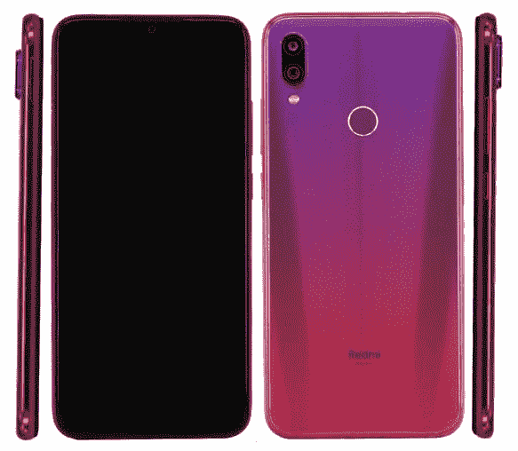

# 新的小米 MIUI 相机功能:自定义水印和运动照片

> 原文：<https://www.xda-developers.com/xiaomi-miui-camera-ultra-wide-angle-custom-watermark-motion-photos/>

小米在 2018 年发布了 20 款 Google Play 认证的 Android 设备(包括电视)[，我们预计它们在 2019 年完全不会减速。小米 2019 年的第一款智能手机将是其新的](https://www.xda-developers.com/3100-android-devices-google-play-support-2018/) [Redmi 子品牌](https://www.xda-developers.com/xiaomi-spins-redmi-sub-brand/)下的第一款设备，这款智能手机甚至可能是小米第一款配有 [48MP 摄像头](https://www.xda-developers.com/xiaomi-teases-48mp-camera-smartphone/)的智能手机。我们很高兴了解小米为即将到来的智能手机发布和 MIUI 软件迭代准备的新相机功能，所以我们决定在发布之前寻找即将到来的 MIUI 相机功能的线索。事实证明，MIUI 相机应用程序充满了小米正在开发哪些功能的提示。作为参考，我们比较了最新 MIUI 10 中国开发者版本中的 MIUI 相机应用程序和小米 Mix 3 的第一个 MIUI 10 中国稳定版本。

APK 拆卸通常可以预测应用程序未来更新中可能出现的功能，但我们在这里提到的任何功能都可能不会出现在未来的版本中。这是因为这些功能目前在 live build 中没有实现，可能会在未来的 build 中随时被小米拉出来。代码是用 PNF 软件公司的 [JEB 反编译器](https://www.pnfsoftware.com/?aid=xdadev)反编译的。

*特别感谢 XDA 青年成员[弗兰茨特斯卡](https://forum.xda-developers.com/member.php?u=8229896)，小米工具的开发者，他想出了如何激活其中一些功能，这样我们就可以看到它们如何出现在相机应用的用户界面上。*

### 自定义水印

显然，有很多人真的喜欢在他们拍的照片上加水印。水印通常只是告诉我们照片是在什么手机上拍摄的，这对原始设备制造商来说很好，因为这是免费的广告。所有运行 MIUI 的小米智能手机都让你在左下角加一个“Shot on X”水印，但是没有办法自定义水印。很明显，小米正在研究这样一个功能，因为我们发现了多个字符串暗示它，franztesca 自己激活了这个功能。

```
 <string name="pref_userdefine_watermark_title">User define camera watermark</string>
<string name="custom_watermark_words">User define watermark words</string>
<string name="custom_watermark_tips">The above text will be the second line of the photo watermark. Please limit it to 15 Chinese characters or 15 English letters.</string>
<string name="custom_watermark_words_input_hint">Enter words</string>
<string name="custom_watermark_words_save_success">Save sucess</string>
<string name="custom_watermark_contains_senstive_words">Please modify sensitive text %1$s</string>
<string name="custom_watermark_too_many_words">You went over the character limit</string> 
```

字符串表示您可以用多达 15 个中文字符或 15 个英文字母自定义照片水印的第二行。这并不是一个突破性的新功能，但水印在小米智能手机用户中相当受欢迎，所以我相信会有很多人喜欢这个功能。

 <picture></picture> 

Credits: XDA Junior Member franztesca

### 小米 48MP 智能手机会有双摄像头？

除了其主要卖点之外，小米即将推出的 48MP 相机镜头智能手机没有得到太多证实。我们发现的一个字符串表明，该设备将有一个辅助后置摄像头，考虑到小米最近的阵容以及新智能手机将与哪些设备竞争，这并不令人惊讶。

```
 <string name="device_watermark_default_text">AI DUAL CAMERA</string>
<string name="device_48m_watermark_default_text">48M DUAL CAMERA</string> 
```

小米显然将他们的 48MP 功能称为“超像素摄影”，至少在内部是这样的。

```
 <string name="ultra_pixel_photography_open_tip">4800 万超清</string>
<string name="ultra_pixel_photography_close_tip">4800 万超清已关闭</string>
<string name="accessibility_ultra_pixel_photography_on">4800 万超清,开启状态</string>
<string name="accessibility_ultra_pixel_photography_off">4800 万超清,关闭状态</string>
<string name="pref_menu_ultra_pixel_photography_48mp">4800 万超清</string> 
```

据称是 Redmi 新设备的渲染图已经出现在[TENAA](http://www.tenaa.com.cn/WSFW/LicenceShow.aspx?code=1NjOkBIbuqnuLIRnUiQEYy2jJ5EV8DAmVrsPigztYTqY%2bQudp0ll6WpD2xZPezxF)(via[*FoneArena*](https://www.fonearena.com/blog/272160/xiaomi-redmi-7-tenaa-certification.html))上，它们确实显示了一个带有双后置摄像头的设备。我们将不得不等待这个设备的更多细节。

 <picture></picture> 

Source: TENAA. Via: FoneArena.

另外，franztesca 发现，小米至少有两款 48MP 摄像头传感器的智能手机正在研发中:代号为“仙王座”和“达芬奇”。“仙王座”有一个显示指纹扫描仪，并支持始终显示功能，所以它不太可能是即将推出的红米智能手机。可能还有其他配备 48MP 摄像头的小米智能手机，但我们不知道他们即将推出的 2019 年设备中的哪一款会有这样的传感器。

### 超广角

小米对广角相机镜头并不陌生，因为他们的 Mi A1 智能手机就有一个。我们发现有迹象表明小米将推出“超广角”模式，但我们不知道这种模式将在哪款小米智能手机上启用，也没有关于这种模式的任何真实细节。

```
 <string name="ultra_wide_mode">超广角</string>
<string name="ultra_wide_open_tip">超广角模式</string>
<string name="ultra_wide_close_tip">超广角模式已关闭</string>
<string name="pref_camera_zoom_mode_entry_ultra">ULTRA</string>
<string name="ultra_wide_recommend_tip_hint">建议开启超广角模式</string>
<string name="pref_camera_ultra_wide_mode_title">超广角模式</string>
<string name="ultra_widem_mode_use_hint_text">开启超广角模式，为您记录更广阔的视野
探索更多精彩的美</string> 
```

其他字符串显示，在超广角模式下，将有一个选项来纠正“图像失真”。

```
 <string name="pref_camera_ultra_wide_ldc_title">超广角畸变矫正</string>
<string name="pref_camera_ultra_wide_ldc_description">在超广角模式下对画面畸变进行矫正</string> 
```

最后，小米将使用新模式进行人像拍摄。

```
 <string name="ultra_wide_bokeh_open_tip">全身模式</string>
<string name="ultra_wide_bokeh_close_tip">全身模式已关闭</string>
<string name="accessibility_camera_ultra_wide_bokeh_on">全身模式,开启状态</string>
<string name="accessibility_camera_ultra_wide_bokeh_off">全身模式,关闭状态</string> 
```

### 实时拍摄/动态照片

有一个新功能叫做“liveshot”，虽然描述直接翻译成“动态照片”。不幸的是，无论是字符串还是代码都没有告诉我们这个特性。从名称来看，Live Shot/Dynamic Photos 可能看起来类似于谷歌的 motionphotos，但实际上在代码中有对“Motion Photos”的单独引用，所以我们不确定小米将在这个功能上走向何方。

```
 <string name="camera_liveshot_on_tip">动态照片</string>
<string name="camera_liveshot_off_tip">动态照片已关闭</string>
<string name="accessibility_camera_liveshot_on">动态照片,开启状态</string>
<string name="accessibility_camera_liveshot_off">动态照片,关闭状态</string> 
```

### 实况音乐

听说过抖音吗？这款广受欢迎的应用程序可以让你创建和分享短视频，并从中挑选各种音乐。小米似乎正在研究类似的东西，叫做“现场音乐”。该功能似乎取代了 MIUI 相机应用程序中的“短视频”模式，并允许您从网上下载音乐或从本地存储的曲目中选择。

```
 <string name="live_music_change_bgm">Replace Music</string>
<string name="live_music_hot_title">Hot Music</string>
<string name="live_music_local_title">Local Music</string>
<string name="live_music_downloading_tips">Downloading...</string>
<string name="live_music_network_exception">Network anomaly</string>
<string name="live_music_network_exception_tips">Network anomalies, please try again click</string>
<string name="live_music_close_message">Whether to close the current music?</string>
<string name="live_music_close_sure_message">Close</string>
<string name="live_music_close_cancel_message">Cancel</string> 
```

### 新的肖像模式效果

除了增加了 4 个新的人像模式效果，这里就不多说了。他们是茶，轻快，深褐色，和黄昏。

```
 <string name="portait_effect_entry_tea">Tea</string>
<string name="portait_effect_entry_lilt">Lilt</string>
<string name="portait_effect_entry_sepia">Sepia</string>
<string name="portait_effect_entry_dusk">Dusk</string> 
```

### 可调散景电平

一项新功能将允许您调整 f-stop 数值，以改变人像模式模糊效果的级别和深度。

```
 <string name="accessibility_bokeh_level">F%1$s 级虚化</string>
<string name="accessibility_bokeh_adjust">虚化程度调节</string> 
```

### 视频的新颜色效果

以下是录制视频时出现的新颜色滤镜。新的效果包括兰花，Xpro，黑白，苍白，紫荆花，慕斯，天蓝色，和深褐色。

```
 <string name="color_effect_live_blue">Orchid</string>
<string name="color_effect_live_contrast">Xpro</string>
<string name="color_effect_live_deepblack">B&amp;W</string>
<string name="color_effect_live_fair">Pale</string>
<string name="color_effect_live_hongkong">Bauhinia</string>
<string name="color_effect_live_mousse">Mousse</string>
<string name="color_effect_live_solar">Sky blue</string>
<string name="color_effect_live_years">Sepia</string> 
```

### 身体的美容模式

目前，相机应用程序中的美颜模式只能让你美化面部。小米可能是在延伸这个功能，从头部、身体、肩膀、腿部来美化一个人的全身。

```
 <string name="beauty_body">塑型</string>
<string name="beauty_body_head">头部</string>
<string name="beauty_body_body">瘦身</string>
<string name="beauty_body_shoulder">肩部</string>
<string name="beauty_body_legged">长腿</string>
<string name="beauty_body_reset_tip">塑型效果已清除</string> 
```

我个人认为使用美颜模式会产生一种诡异的外观。不过，它在中国和其他亚洲国家非常受欢迎，所以我相信这个特性在发布后会被广泛使用。

### 动态照片

谷歌的动态照片可以让你拍照，但也会自动保存拍摄前几秒钟的视频。三星还能让你拍动态照片。现在，有一些小迹象表明，小米正在开发这样一个功能。然而，该功能还远未完成。没有实现该功能的字符串或代码。相反，有一些标题中带有“motionphoto”的新图像资产让我们相信小米将推出这一功能。

* * *

拆除 MIUI 相机应用程序是我们在发布前[发现](https://www.xda-developers.com/xiaomi-mi-mix-3-960-fps-galaxy-note-9/)小米 960FPS 和夜间模式功能的原因。虽然我们不能保证所有这些功能都将在未来的小米设备或未来的 MIUI 版本中提供，但现在我们知道了该公司正在做什么，我们可以跟踪他们的进展，因为这些功能越来越接近完成。如果我们在 MIUI 相机应用程序中发现更多功能，我们会及时通知您。