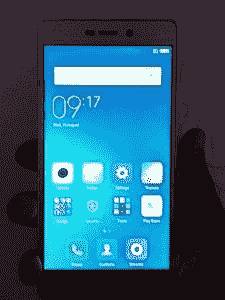

# 小米红米 3S 和红米 3S Prime:快速第一印象

> 原文：<https://www.xda-developers.com/xiaomi-redmi-3s-and-redmi-3s-prime-quick-first-impressions/>

小米在印度的发布会伴随着大量的宣传:有很大的场地，邀请了很多小米粉丝，广泛的演讲和演示...他们走了整整九码。但是有了[红米 3S](http://forum.xda-developers.com/redmi-3s) ，小米选择了进来，没有太多的仪式。

这款手机实际上是在 8 月 9 日举行媒体或公共活动之前进行首次销售的，但这并不意味着这款手机有任何下降。

8 月 10 日在孟买举行的媒体见面会上，我有机会与 Redmi 3S 和 Redmi 3S Prime 一起玩。Redmi 3S 和 3S Prime 是非常相似的设备，所以我将只注意它们存在的差异。在很大程度上，这些经历是可以互换的。这是我对这些设备的第一印象:

首先，手机的设计没有给你任何定价的线索。它与 Redmi Note 3 具有相同的金属结构，顶部和底部有类似颜色的塑料盖(这意味着它不是金属*单体*，因为其他博客经常引用这些设备)。握在手中有一种令人印象深刻的结实感。由于这两款设备都有 5 英寸的屏幕，它们的整体尺寸也更小，与其他 5 英寸的手机如 [OnePlus X](http://forum.xda-developers.com/oneplus-x) 不相上下。在过去几周使用了巨大的 Mi Max 后，终于有一部手机在手，可以无忧无虑地握在手中，感觉真的很好。Redmi 3S 非常便于携带，考虑到它在机身中封装了多少电池容量，该设备的厚度实际上令人印象深刻。在活动期间，小米印度产品负责人 Jai Mani 提到了 Redmi 3S 和 3S Prime 内部的很大一部分基本上被电池占据，做出这一决定而不是通过大幅削减来使手机变得更薄。尽管如此，Redmi 3S 实际上比其前身更薄，所以他们设法平衡了两者。

 <picture></picture> 

OnePlus One next to the Redmi 3S Prime. Pardon my poor choice of wallpaper.

Redmi 3S 和 3S Prime sport 采用 5 英寸高清液晶显示屏。这些基本上是预算设备，所以坚持 720p 分辨率的决定不会有很多目标观众抱怨。该设备的像素密度为 294 ppi，就其价格范围而言，这是不错的，但仅此而已。如果你愿意扩大预算，你会发现竞争轴承 FHD 显示器(其中一个来自小米自己的稳定)。我与这些设备的互动是有限的，但我可以看到显示器的尺寸和分辨率与产品规格及其预算的其他部分配合得很好。

 <picture></picture> 

Thin Black Bezel Borders can be seen around the device.

Redmi 3S 和 3S Prime 让我恼火的一点是，设备周围有(薄的)黑色边框，而营销材料却将其删除。这在印度销售的许多中国智能手机中很常见，以至于大多数消费者现在已经习惯了。我希望[这种趋势能够改变](http://www.xda-developers.com/deceitful-black-borders-around-screens-need-to-go/)，要么整个正面的边框颜色均匀，要么营销材料不再试图误导，但这是我一厢情愿的想法。因为该设备不是作为媒体消费设备销售的，所以该设备的这一方面是可以忽略的。

小米 Redmi 3S 和 3S Prime 的内部是小米比较引以为豪的。如果你只看规格和数字，这些设备从高通骁龙 430 SoC 开始，它包含双集群、八核配置的 Cortex-A53，时钟为 4 倍@1.4GHz 和 4 倍@1.2GHz，基于 28 纳米制造工艺。Adreno 505 在 GPU 端与之相伴。相比之下，与 SD-430 最接近的竞争对手是 SD-616，它在性能集群的峰值时钟速度(4x @1.7GHz)上击败了它，但看到两个集群都仍然基于基于功率效率的 Cortex-A53，差异并不太大。

SD-616 上的 GPU 比 Adreno 405 上的更老，所以 SD-430 总体上仍然具有竞争力。同样，SD-430 不是一款顶级 SoC，但看到设备上的定价(尤其是基本版本)和其他功能，它实际上令人印象深刻。

Redmi 3S 配备 2GB 内存和 16GB 内部存储，而 Redmi 3S Prime 配备 3GB 内存和 32GB 存储。两者都可以使用混合双卡插槽进行扩展，额外增加 256GB。

在我有限的使用中，这款手机的表现和演示中的手机一样好。应用程序迅速打开，手机没有就其性能给出任何定价提示。在这个价格范围内，这是需要注意的事情，因为手机通常会停在 SoC 上，这是许多首次客户不了解的领域。是的，Cortex-A53 不是为注重性能的任务设计的，这两款设备都不能声称是游戏友好型的。但如果你带着与 Redmi 3S 的低价相匹配的期望，你会留下愉快的印象。较低的分辨率屏幕也将有助于 GPU 的性能，但同样，游戏仍然没有被认为是最强的套件，这是正常的。

Redmi 3S 和 Redmi 3S Prime 上的相机设置遵循 1300 万像素的后置摄像头，具有 f/2.0 光圈和 PDAF。还有 LED 闪光灯，以及以 30fps 录制 1080p 视频的能力(这对于这个价格范围来说已经足够好了)。前置是一个 500 万像素的摄像头，f/2.2 光圈，同样是 1080p 视频录制。廉价设备并不以其强大的拍照能力而闻名，这也不例外。会不会领先于它的价格竞争？可能吧。再次，降低对降低预算的期望。

Redmi 3S 和 Redmi 3S Prime 有一些有趣的部分在这个价格范围内是看不到的(老实说，甚至在这个价格范围之外)。这两款设备都配有红外发射器，这是一个连旗舰机都没有的功能。如果你设置正确，你可以用它来控制你所有的家用电器，在这个领域，像这样的功能是你可以炫耀的。小米的 Mi Remote 应用程序支持相当多的设备，如果您的设备在支持的型号范围内，设置程序也非常简单。

你还可以炫耀疯狂的电池容量和(可能)荒谬的电池寿命。对于一篇第一印象的文章来说，评论电池寿命有点牵强，但小米再次击败它的成分是存在的。第一，电池密密麻麻，容量 4,100 mAh。显示器是一个 5 英寸高清面板，SoC 由 Cortex-A53 组成，主要是高能效内核。除此之外，MIUI 还针对运行它的设备进行了大量优化，并对后台应用程序保持着严格的控制。最终结果是，对于大多数中度使用的消费者来说，这款手机可能会获得 2 天的电池寿命——我在 Redmi Note 3 上轻松获得了 1 天的重度使用电池寿命，在 Mi Max 上中度使用电池寿命可以达到 2 天。因此，我可以自信地说，Redmi 3S 将沿着同样的足迹前进，除非出现可怕的错误。如果过去作为评论者的经验可以作为断言的基础，那么在适度使用的情况下正常使用两天，或者在大量使用的情况下使用一整天应该是可以实现的。

红米 3S 和红米 3S Prime 上的软件是开箱即用的 MIUI 7.5，运行在 Android 6.0.1 上。审查单位正在炫耀 6 月的安全补丁。请记住，这些是启动设备，这实际上是很好的。我们可以期待有安全补丁的定期 MIUI 更新，但小米的 MIUI 更新并不完全符合 Android 版本更新。因此，即使你得到了 MIUI 8 或它之后的任何版本，你可能仍然会使用 Android 6.0。小米没有对这方面的设备做出任何官方声明，所以还是有希望的。

即将在红米 3S 和 3S Prime 上以 MIUI 8 的形式进行的 MIUI 更新将允许两个应用程序实例并存(称为[克隆应用程序](http://en.miui.com/thread-294136-1-1.html))，这可以打开使用两个帐户使用几个应用程序和游戏的大门，而无需从一个帐户登录和注销。这可以让你使用两个 WhatsApp 账户(因为这是一部双卡手机)，让你有单独的工作和个人社交媒体账户登录实例，两个游戏实例(部落冲突，有人吗？)等等。该功能还没有上线，所以我不能演示它。但当它真的上线时，它将增加设备的价值。

Redmi 3S Prime 与 Redmi 3S 相比，除了存储和 RAM 方面的差异之外，还有一个显著的特点。Redmi 3S Prime 在背面配备了指纹传感器，该传感器与小米 Redmi Note 3 上的传感器相同。Note 3 的传感器在大多数情况下都工作得很好，所以这款机型应该不会有太多抱怨。指纹传感器在背面有点凹陷，加上设备的整体尺寸，用你的食指和中指非常容易够到。

* * *

为了总结小米 Redmi 3S 和小米 Redmi 3S Prime 的第一印象，我想提请注意这些设备的价格。Redmi 3S 的价格仅为₹6,999(t0)(105 美元)(T1)，而 Redmi 3S Prime 的价格为₹8,999(T2)(135 美元)(T3)。Redmi 3S 的定价是我觉得真正令人印象深刻的，就 Redmi 3S Prime 的性价比而言。30 美元的差异可以让你获得额外的 1gb 内存(这是一个明显的差异，我会在我的 Mi Max 评论中注意到)，更多的内部存储空间(可以通过 microsd 扩展)和指纹传感器。根据您的需求，这些可能非常有助于证明价格上涨的合理性。但从入门设备的角度来看，Redmi 3S 提供了更好的交易。

Redmi 3S Prime 虽然仍是一款不错的设备，但其价值却不如 base 兄弟产品。小米自己的设备在另一个细分市场给了它一些非常激烈的竞争。如果你在 3S Prime 的价格(总计 150 美元)上再加一个₹1,000，你就可以抢到一台小米红米 Note 3 16GB。诚然，内存量和存储是逐步下降，但由于更好的骁龙 650，屏幕尺寸的增加和分辨率的提高，处理能力的增加使它物有所值。除非你有一个非常硬的₹8,999 预算限制(135 美元)，否则使用功能更强大的红米 Note 3 更有意义。我个人不建议人们购买红米 Note 3 的 2GB 内存版本(骁龙 650)，但如果你打算购买红米 3S，你不妨升级到这一版本。当然，如果你能拿出更多的钱，最划算而且仍然是中低端市场无可争议的王者是₹11,999 的 3GB 内存红米 note 3(180 美元)。

至于红米 3S，我觉得非常划算。我一直在寻找一款替代价格较低的 Moto E T1 的手机，Redmi 3S 是一款非常好的入门手机。它不是旗舰，也不是中端设备。这是一款经济型手机，推荐给那些没有很高需求也没有很高预算的人，那些想要摆脱超大屏幕的人，以及那些寻找廉价一次性手机的人。由于小米在 Redmi 3S 上的激进定价，它非常适合作为 2016 年的象征性 Moto E。你只需要习惯 MIUI，这可能比听起来要难。

**你认为最好的低端设备是什么？请在评论中告诉我们！**