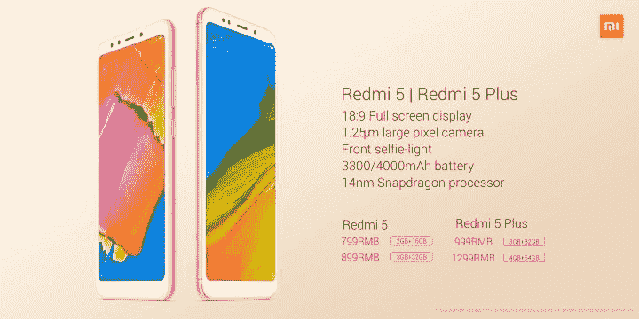
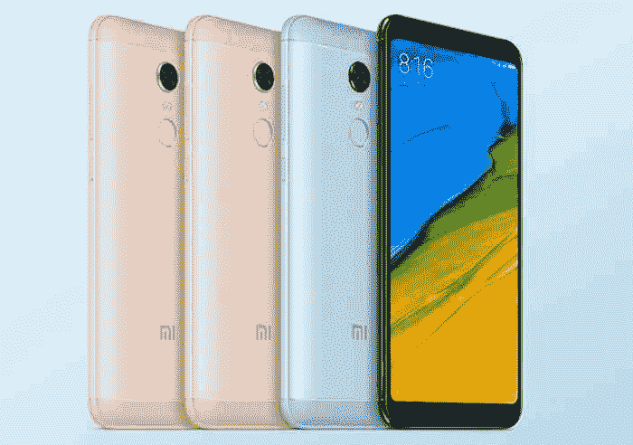

# 小米 Redmi 5 和 Redmi 5 Plus Sport 18:9 显示屏，在印度上市

> 原文：<https://www.xda-developers.com/xiaomi-redmi-5-plus-china/>

经过数周的泄露和预展，小米周三终于在中国揭开了其最新廉价智能手机的面纱:T2 红米 5 和 T4 红米 5 Plus T5。它们是去年 [Redmi 4](http://xda-developers.com/tag/4) 和 [Redmi 4X](http://xda-developers.com/tag/redmi-4x) 的继任者，在保留其预算友好的吸引力的同时，它们对前任进行了一些重大改进。

这两款手机在设计上完全相同，都运行小米的基于 [Android 7.1.2 牛轧糖](http://xda-developers.com/tag/android-nougat)的 [MIUI 9](http://xda-developers.com/tag/miui-9) 皮肤，但它们在底层硬件方面有所不同——即芯片组、电池和内存。这是你需要知道的一切。

**小米 Redmi 5**

Redmi 5 和它的老大哥 5 Plus 都有高于平均水平的长宽比，这在小米的预算阵容中是第一次，这让它们拥有优质的现代美学，与 OnePlus 5T 和 T2 LG v 30 T3 没有什么不同。

Redmi 5 则配备了 5.7 英寸的高清液晶显示屏，分辨率为 1440 x 720，纵横比为 18:9。在内部，它由高通 450 八核片上系统(SoC)提供支持，该系统具有两个 4 个 Cortex-A53 内核集群，主频为 1.8GHz，配有 Adreno 506 GPU。

在相机部门，Redmi 5 有一个 12MP f/2.2 拍摄器，像素大小为 1.25 微米，相位检测自动对焦，以及 LED 闪光灯模块。同时，前置摄像头是一个 500 万像素的传感器，带有前置闪光灯，可以帮助用户在弱光条件下自拍。

 <picture></picture> 

Source: Xiaomi

为了给所有这些组件供电，这款手机配备了 3300 毫安时容量的电池，比 Redmi 4 的 4100 毫安时电池略有下降。但由于高能效的骁龙 450 芯片组(基于三星的 14 纳米 FinFET 工艺)和软件优化，小米表示，这款手机一次充电可持续两天。

红米 5 有三种颜色可供选择，玫瑰金、黑色和蓝色，将于 12 月 12 日开始在中国销售。2GB 内存和 16GB 存储空间的起价为 799 美元(120 美元)，起价为 899 美元(135 美元)。3GB 内存和 32GB 存储空间。

**小米 Redmi 5 Plus**

 <picture></picture> 

Source: Xiaomi

对于那些愿意支付额外费用的人来说，还有好处。除了更大的 5.99 英寸全高清+显示屏、更强大的骁龙 625 八核芯片组和更密集的 4000mAh 电池之外，Redmi 5 Plus 与 Redmi 5 Plus 完全相同。否则，你看到的是更大的红米 5。

Plus 有两种型号:3GB 内存和 32GB 存储的基本型号，售价为 999 英镑(150 美元)，4GB 内存和 64GB 存储的价格为 1299 英镑(196 美元)。它将于 12 月 12 日与 Redmi 5 一起在中国销售。

这两款智能手机都运行开箱即用的安卓牛轧糖，顶部是小米最新的 MIUI 9 皮肤。其他亮点包括后置指纹传感器、蓝牙 4.2、混合双 SIM/microSD 插槽、Wi-Fi 802.11 b/g/n、3.5 毫米音频插孔和 micro USB 端口。

* * *

[**来源:MIUI 论坛**](http://en.miui.com/thread-1205596-1-1.html)