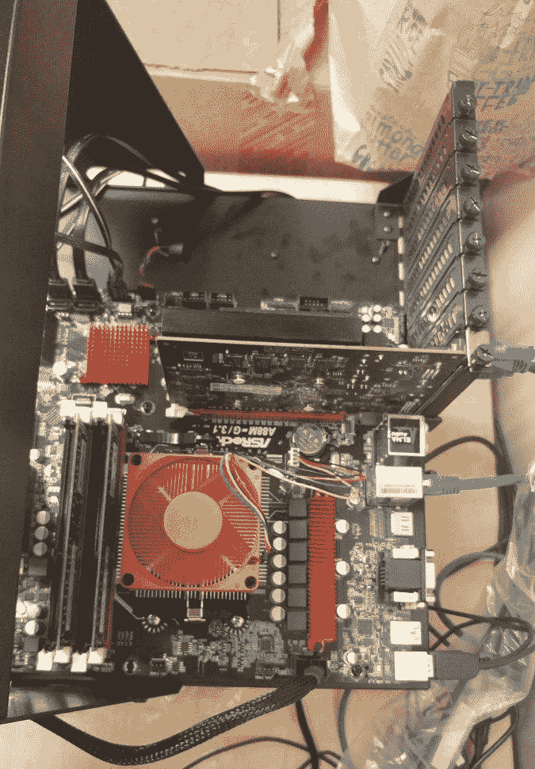

# 你问，我们答 AMD 处理器上的 AOSP 构建时间

> 原文：<https://www.xda-developers.com/you-asked-we-answer-aosp-build-times-on-amd-processors/>

几个月前[我发表了一系列文章，旨在研究当从开源选项如 CyanogenMod 或 OMNIRom 构建 Android ROM 时，什么会影响构建时间](http://www.xda-developers.com/biggest-bottlenecks-building-android-from-source/)。

你向我们展示了你非常感兴趣，然后做了别的事情——开始问问题。是英特尔还是 AMD 有所作为？移动处理器与台式机相比如何？当时，我有许多同样的问题，但几乎没有证据支持它们。今天的文章将有助于回答一些问题，至于 AMD 处理器去看看他们如何在 AOSP 建设时代的进展。

现在，在我们开始之前，这是一个很好的机会来解释一些事情-你可以期待在 XDA 这里看到关于 PC 硬件覆盖面。我们将继续关注影响构建时间的事情，因为这似乎是在其他地方找不到的最大兴趣。但是，当我们从这一重点转移到其他方面时，例如虚拟/增强现实或提供推荐的构建配置，如果我们不考虑包括图形解决方案在内的完整系统，我们就不会做得很好。如果您有任何发展或其他方面的想法，请随时联系我们！

## 测试配置 

在上一篇文章之后，我们联系了 AMD，他们很乐意在他们当前的产品线中提供 3 款处理器进行测试:Athlon X4 845FX-6350 和 FX-8350，都有新的幽灵冷却器。不幸的是，这需要两个单独的主板来测试，但所有其他组件将保持不变。

**试验台:**联力进站 T60B

**CPU:** AMD 速龙 X4 845FX-6350；FX-8350(全部使用提供的空气冷却解决方案)

**主板:**华硕 A88M-G/3.1(X4 845)；华硕 A5R97 R2.0 (FX-6350，FX-8350)

**RAM:** 微米 DDR3-1600 2x4GB

**SSD:** 2 个 OCZ Trion 150 240GB 配置在 RAID 0 中(除了/boot 和 swap)

**动力:**海盗船 CX750M

**操作系统:**6 月 2 日安装了最新更新的 LTS Ubuntu 16.04。

**采购:**所有 CPU 和 ASRock 主板由 AMD 提供。所有其他部分要么是购买的，要么是现成的。

## **测试计划**

CyanogenMod (cm-13.0 分支)和 OmniROM (android-6.0 分支)都将同步，并为 Nexus 6P (angler)提供必要的附加设备/内核/供应商。在每个配置中总共将执行 12 次构建:3 次清除 ccache，3 次使用预填充的 ccache。将从 3 个构建中取一个平均值，用作配置的“非 ccache”和“ccache”构建时间。我确信在 AMD 硬件上使用其他选项可以获得更好的结果，我们将在单独的测试中探索这些结果。但是对于这一个，它是关于一致性的-最小化变量和最大化控制组。

## 幽灵冷却器

在得出结果之前，我想对 AMD 公司的幽灵冷却器喊一声。我打开了 FX-6350 附带的那一个，然后在清洁和重新涂上导热膏后重新用于 FX-8350。甚至在整个建造过程中，在一个服务器机房里，我都能听到很多粉丝的声音，但是没有幽灵。冷却器还配有一个 LED，在我打开的那个上似乎没有点亮，但这可能是主板的一个问题，因为它是二手的。

## 结果和解释

好了，聊够了，你来这里是为了建造时间。我们开始吧，每种情况下 3 个版本的平均值:

时间以小时和分钟为单位。第一个处理器 X4-845 基于 Carizzo，因此是最新的架构。另外两款，FX-6350 和 FX-8350，基于 Vishera 设计，分别上市 3 年和 4 年。我们不能从 Carizzo 与 Vishera 的性能对比中获益太多，因为 CPU 瓶颈实在是太高了，导致构建在没有 ccache 的完整构建中受到严重影响。这种情况开始出现，我们看到 Vishera 的性能有所改善，但即使在 FX-8350 的情况下，所有 CPU 在非 ccache 和 ccache 构建的很大一部分中都以 100%的速度运行。不幸的是，这意味着这里存在一个瓶颈。

当我们从一个不同的角度看这个问题时，价格，我们可以看到大约 500 美元的价格可以构建我这里的测试配置。相比之下，英特尔 i7-4790K 将[为更快的构建性能多花费大约 150 美元](http://pcpartpicker.com/user/garwynn/saved/#view=dfr2FT)，并且构建时间可能只有 FX-8350 的一半。对于大多数人来说，这可能只是超过了限制——我甚至建议任何人考虑 FX-6350，因为它的构建时间稍长，但少了 30 美元。内核构建人员或应用程序开发人员在这种情况下测试 FX 处理器时可能仍然会遇到很少的问题。添加一个显卡，如 AMD 即将推出的镭龙 RX 480，预计售价约为 199 美元，你可以拥有一台不到 700 美元的构建机，可以轻松地兼作 VR 系统。

然后是 Zen，AMD 已经研究了多年的处理器，以更好地对抗英特尔在其核心台式机阵容中提供的性能。去年出现的幻灯片显示，Zen 的每时钟指令数(IPC)将比挖掘机增加 40%，比测试的 Vishera 处理器高出两个版本。虽然没有提供确切的数字，但估计从 Vishera 到 Zen 的 IPC 增加了 60%到 90%。我们期待着在这些处理器推出时对它们进行测试，并将它们与这些构建时间进行比较，看看它们能在多大程度上改善这种情况

## 结论

如果你是那些必须在很短的时间内完成构建的用户之一，AMD FX 系列似乎很难与英特尔酷睿系列的高端产品相媲美。但在建造时间不足的地方，它会在价格上得到弥补，这使得在预算内建造这些系统的能力更有可能——特别是如果重用一些现有的部件，如电源或外壳。那些只关注源代码中完整的 AOSP ROM 的人可能会有问题——内核和应用程序开发人员应该能够在 AMD 处理器上进行开发，而不用担心性能问题。随着新处理器最早于今年秋天在 Zen 的路上，这是一个很好的机会来审查 AMD 目前的阵容，并为 Zen 发布时正确评估其性能做好准备。

对于 30 美元以下和几乎类似的建设时间，FX-6350 似乎是这三个走的路。如果他们是在玩游戏，那些能够负担额外 30 美元的人可能会更好地将它放在更快的 RAM 或改进的 GPU 中。尽管这些处理器的使用年限较长，但它们也证明了它们可以满足大多数普通应用程序的需求，尤其是在搭配合适的游戏 GPU 时，对于希望在预算有限的情况下进行升级的人来说，这是一个巨大的价值。但是，如果您正在考虑从目前的任何产品系列中升级，该怎么办呢？

我的建议是再等一会儿，让 Zen 出现。在你等待的时候，现在就升级 GPU，因为你可以把它转移到新的主板上。Zen 有潜力极大地改变游戏，在做出决定之前，等待看看它的表现肯定是值得的。

再次感谢 AMD 为这些测试提供 CPU！你觉得这个信息有价值吗？你希望接下来测试什么？请在下面的评论中告诉我们，或者在我们的论坛、Twitter、脸书或 Google+上自由讨论！